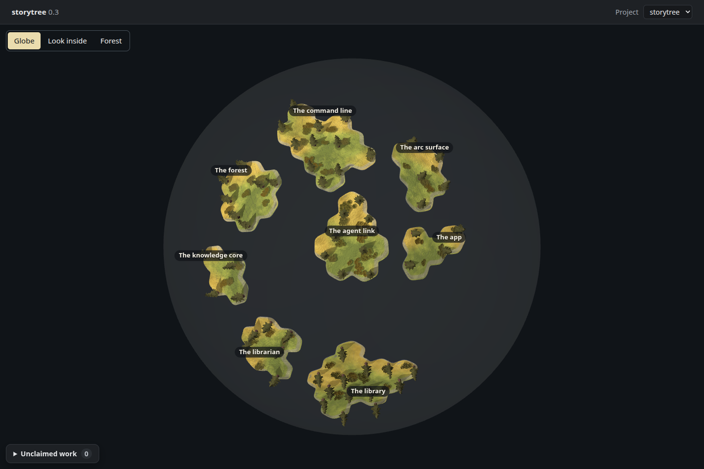
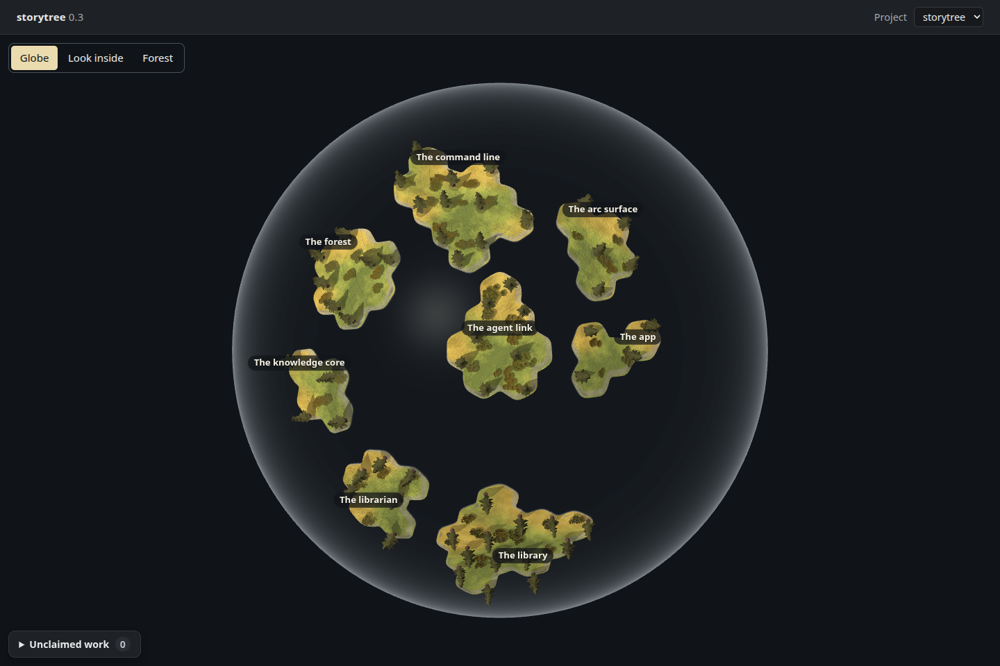
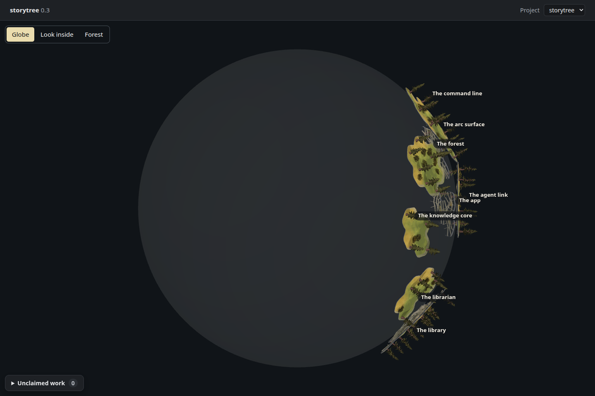
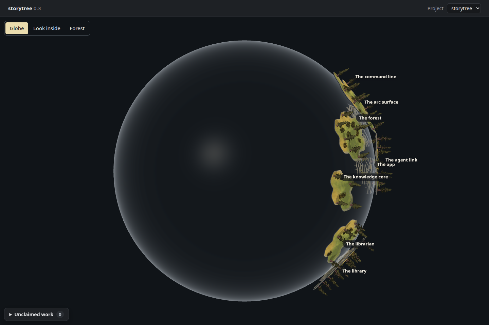

# A glass shell for the planet

Increment `0-3-planet-glass-shell`, 2026-09-27. The owner after #93: “doesnt look
seethrough, maybe try making it look like a glass ball, if thats hard dw about it
its not something we need to worry about right now”. This is a small tuning of
ADR-0648 D2 on the existing shell mesh.

Renderer: **headless Chromium 148.0.7778.96, ANGLE / Vulkan SwiftShader Device
(Subzero)**. Untouched 1440 × 960 PNGs, dark theme, device scale 1. These show the
actual desktop HTML, CSS, renderer and forest engine, reading a fresh isolated
`pnpm seed:library` through `pageReads` in place of Electron's bridge. All **eight
stories and 58 capability trees** appear. The empty activity log and reported
health are unchanged, so the trees retain their planned yellow form.

| View | Before: #93's uniform 0.08 shell | After: glass shell |
| --- | --- | --- |
| Front |  |  |
| Quarter turn |  |  |

The before bundle is red commit `39f637e`, retaining #93's product shell. The
after is green `1ef70bb`. Both use the **same fresh seed**: reseeding would change
story IDs and coast shapes. The later merge of main at `fc6160d` changes only
documentation and guidance; the rendered product is identical.

The clear middle exposes the empty space and far-side trees. A light grey
Fresnel rim makes the whole ball visible, and one soft highlight follows the
existing L1 lamp over the viewer's shoulder. The shell's outward normal is
transformed into view space each frame; the highlight appears on its near face
only. There is no extra mesh, transmission buffer, refraction or post-processing.
The existing back-face/front-face draws, depth test, disabled depth writing and
ray hits remain. Only the shell's material changes; islands, kit trees, places,
labels, claims, clicks and the L1 light retain their code.

## Transparency and cost

The existing shell test retains its **80% minimum** through two faces and now
requires a **95% clear-centre base**. Red `39f637e` was committed, pushed and seen
failing at 84.64%; green `1ef70bb` passes. The shader's base opacity is 0.012,
giving 97.61% before its local reflection. A bounded soft highlight adds at most
0.16 opacity. The rim's opacity rises toward the silhouette; it is deliberately
more visible than the middle. The look is judged by eye, without a shader-source
golden or a duplicate CPU formula pretending to test GPU output.

A separate **actual shader pixel readback** temporarily hides other meshes and
renders the shell against black and white. Their pixel difference measures the
background contribution through both faces. This diagnostic is not one of the
page pictures and adds no product render pass. In the final shader:

- Centre: **97.25%**, versus **84.71%** before (8-bit readback).
- Four points halfway from centre to rim: **97.65%** each.
- At the highlight peak: **81.57%**, still above the middle's 80% minimum.
- At 95% of the radius: **76.47–77.65%**; over black, the red channel is 41–43,
  versus 5 at the centre, showing the brighter rim.

[Capture measurements](capture.json) retain the readback and the before/after
comparison. Camera, globe rotation, zoom, labels, smoke readout, plate geometry
and transforms match exactly for each pair. All four page frames submit **50
draws and 541,462 triangles**, unchanged; these are counts, not frame timings.
The quarter turn has five near-side centres and three at or beyond the horizon.
There are no page, shader or asset errors. Existing Three.Clock, drei nested-root
cleanup and SwiftShader readback warnings are recorded.

Opaque land and the existing one-sided ground still limit views through islands.
This change draws no interior or placeholder; the separate “Look inside” view
remains the knowledge core's work.

## Capture path

The scratch instrument was copied from `spike/globe-land` into this directory's
ignored `dist/`, then reduced to its read bridge and observation hooks. It exposes
Three/R3F state and the page's rotation setter, without replacing product drawing,
placement or light. `build.mjs before` saved the old bundle before implementation;
`build.mjs after` saved the final shader. `export.mjs` reads the isolated database;
`capture.mjs` saves the seeded page front-on and after an exact screen-up quarter
turn. `probe.mjs` performs the shader readback separately. The bundles, seed, raw
measurements and scripts remain in `dist/`. No spike branch was merged and no new
test framework ships. Every seed, Chromium render and test held
`/tmp/storytree-heavy.lock`. The laptop session supplies `pnpm desktop:smoke`.
