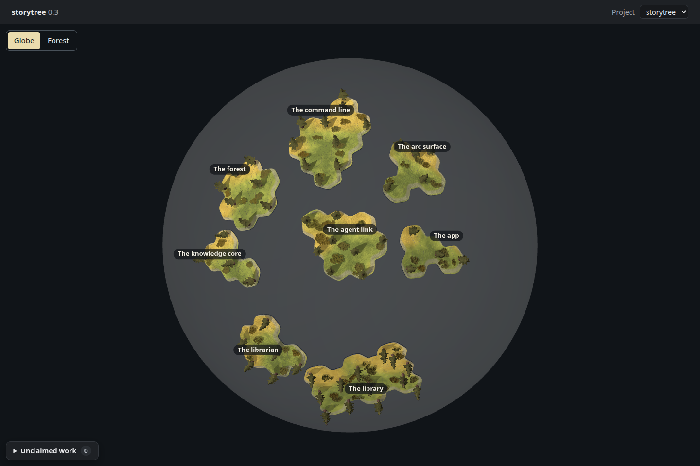
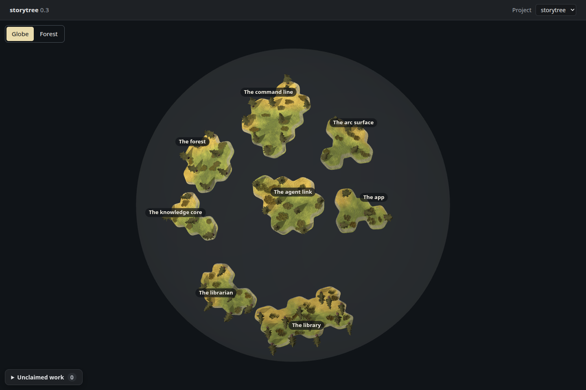
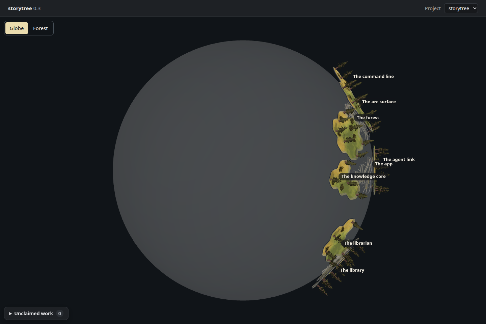
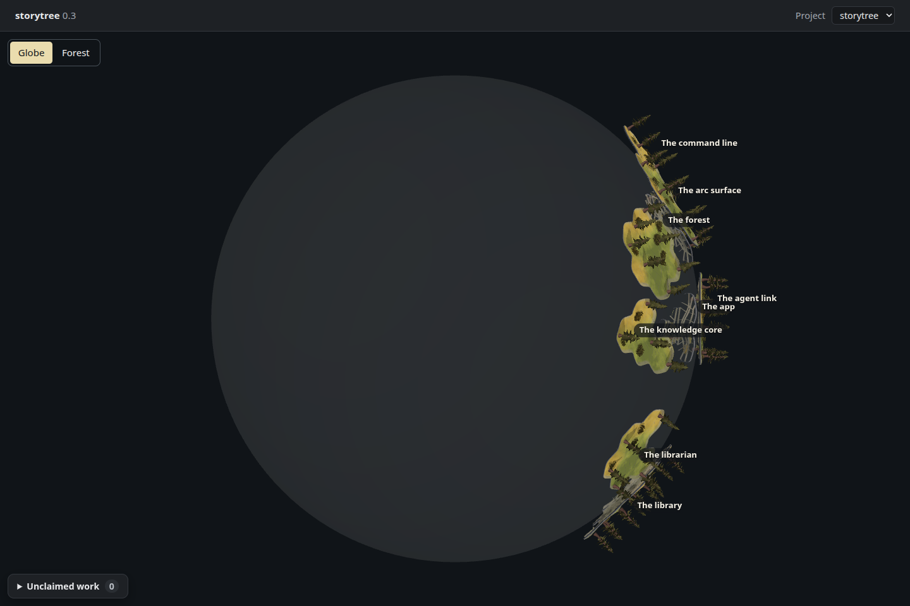

# A more transparent planet shell

Increment `0-3-planet-shell-more-transparent`, 2026-09-27. After seeing #90 in the real
app, the owner said “needs to be more transparent”. This tunes ADR-0648 D2 from
0.18 to **0.08 opacity**. Both faces remain drawn, with depth writing off and the
same ray hits for near-side names, claims and selection. No extra rim is needed.

Renderer: **headless Chromium 148.0.7778.96, ANGLE / Vulkan SwiftShader Device (Subzero)**.
Untouched 1440 × 960 PNGs, dark theme, device scale 1. The actual desktop HTML,
styles, renderer and forest engine read a fresh isolated `pnpm seed:library`
through `pageReads` in place of Electron's bridge. All **eight stories and 57
capability trees** are present. The work-state log is empty, so all trees are
planned yellow; no reported health or activity was invented.

| View | Before: #90's 0.18 shell | After: 0.08 shell |
| --- | --- | --- |
| Front |  |  |
| Quarter turn |  |  |

The before bundle is the product at red commit `1c13912`, which retains #90's shell
code. The after bundle changes only its opacity. Both use the **same seed**, camera,
zoom, light and frozen placements; new seed IDs can change coast shapes, so these
matched captures isolate the opacity change. #90's original
[front](../packed/seeded-packed.png) and [quarter turn](../packed/seeded-quarter-turn.png)
remain available with their [capture notes](../packed/README.md).

At 0.08 the outline still shows the ball and the land's limited coverage. The
empty area is substantially less grey, and far-side trees have less shell blended
over them. Opaque near land and the existing one-sided ground still limit what is
visible behind it. The knowledge core's interior drawing is unbuilt: these are
real seeded islands, including the knowledge-core story's island, with no core
placeholder or filled land added.

The two shell faces retain `(1 - 0.08)² = 84.64%` of the far-side blend contribution,
compared with `67.24%` at 0.18. This is alpha compositing, not a perceptual contrast
measurement. The existing shell test now protects at least 80% and a nonzero,
transparent shell, without pinning the chosen colour or exact opacity. Red
`1c13912` was committed, pushed and observed failing at 67.24%; the 0.08 material
passes it and the existing planet navigation tests. The look is for the owner's eye.

[Capture measurements](capture.json) record both views before and after. Geometry,
plate transforms, camera, rotation, zoom, names and smoke readout match exactly
between the paired captures. Each submits 50 draws and 520,550 triangles; these
are counts, not frame timings. The quarter turn has five near-side centres and
three at or beyond the horizon. Every island has ground and pine geometry.
There were no page, asset or shader errors. The existing Three.Clock deprecation,
drei nested-root cleanup and SwiftShader readback warnings are recorded.

The scratch capture path was copied from `spike/globe-land` into this directory's
ignored `dist/`, then reduced to its observation hooks and bridge input. It does
not substitute placements, geometry, materials or lights, and the spike was not
merged. `build.mjs before` saved the 0.18 bundle before the source edit;
`build.mjs after` saved the 0.08 bundle. `export.mjs` reads the isolated database;
`capture.mjs` captures both bundles, using the existing rotation setter for an
exact screen-up quarter turn. Raw measurements and seed input remain in `dist/`.
Every seed, test and Chromium run held `/tmp/storytree-heavy.lock`. No new test
framework ships. The laptop session supplies the Electron `pnpm desktop:smoke` view.
