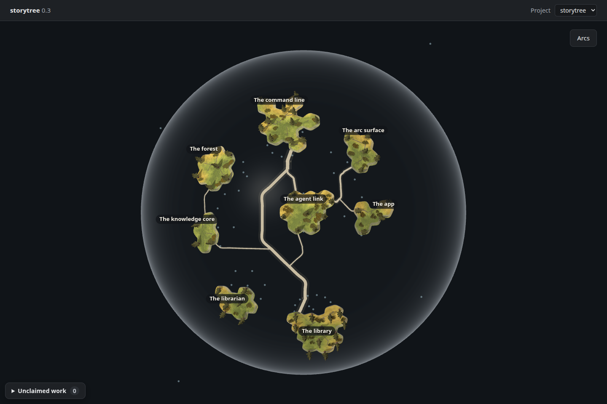
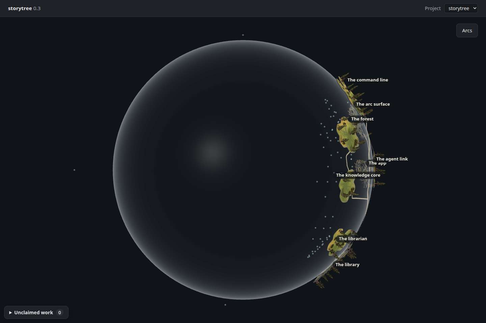

# Knowledge beneath the islands — throwaway look test

Increment `0-3-planet-knowledge-look`, branch `spike/globe-knowledge`.
No pull request; never merge this spike. The owner selected **Notes under each island**
by clicking an option. This is a selection, not a quotation of his words.

K1 draws faint points at the existing knowledge core's placements. K2 adds faint
threads to their home story or capability shelves. The real desktop globe, islands,
trees, labels, glass and V2 pathways stay mounted. The Look-inside view stays unmounted.
No ghosts or recorded-read visuals are included.

## Pictures

Raw 1440 × 960 browser screenshots, no image retouching. Open a picture at full size
to compare the faint points and threads. The left column is the actual #114 pathways
capture; the other columns use a fresh seed from `991310e` (main after #116).

| View | Today's globe (#114) | K1: points | K2: points and shelf threads |
| --- | --- | --- | --- |
| Front |  |  |  |
| Quarter turn |  |  |  |

The fresh seed generates new record IDs, which affect island silhouettes. For a
controlled comparison using **identical data, camera and geometry**, these unchanged
baseline captures use exactly the same fresh seed as K1 and K2:
[front](baseline-front.png), [quarter turn](baseline-quarter-turn.png).
The #114 pictures above are byte-for-byte copies of
[`forest`'s pathway evidence](../../../packages/forest/src/view/evidence/planet-pathways/README.md).

Renderer: **headless Chromium 148.0.7778.96, ANGLE / Vulkan 1.3.0,
SwiftShader Device (Subzero)**. Software rendering is deliberately selected for
continuity with #114, despite the available hardware GPU. No X display or Electron
window was used. Dark theme, device scale 1. Appearance acceptance belongs to the owner.

## What is drawn

The committed [fresh seed](seed.json) was exported through the same `pageReads`
API as the real desktop page, after `pnpm seed:library` in an isolated app home.
It has **eight stories, 58 capabilities and 103 native pathways** (75 within
stories, 28 across stories). Nothing was added for a more interesting picture.
All story/capability history and artifact history are retained, along with actual
shelf reads. The knowledge component consumes the real page's core snapshot.

| Artifact depth | K1 points | K2 points | K2 threads |
| --- | ---: | ---: | ---: |
| 1 (front covers) | 73 | 73 | 73 |
| 2 and deeper | 0 | 0 | 0 |
| No depth, outside | 5 | 5 | 0 |
| **Total** | **78** | **78** | **73** |

There are 66 shelves, none empty; no artifact-to-artifact links, loops, ghosts or
proposals. These are all submitted artifact meshes, counted once each, not a claim
that every point is visible at once. Opaque land can obscure points and threads.

| Island | Artifacts beneath it (all depth 1) |
| --- | ---: |
| Agent link | 10 |
| App | 5 |
| Arc surface | 6 |
| Command line | 12 |
| Forest | 12 |
| Knowledge core | 5 |
| Librarian | 7 |
| Library | 16 |

The five outside artifacts are **The 0.3 MVP one-page spec**, **The forest becomes a
planet, and each read names its agent**, **Verified health is dropped from the MVP**,
**Minimal viable TDD**, and **The license: PolyForm Shield**. Outside means “no
recorded route from a shelf”, never “unimportant”. They receive no shelf threads.

[`measurements.json`](measurements.json) lists every artifact's ID, title, home shelf,
entrances, depth and coordinates. The instrument calls the existing `knowledge`,
`underShelves` and `coreScene` functions. It does not reimplement depth or placement.
At globe radius 218, these depth-1 points sit at radius **183.12** (34.88 inside the
shell); outside points sit at **283.4**. The existing longest-chain rule would place
deeper artifacts further inward, but this real seed cannot demonstrate that visually.

K2 threads end at `coreScene`'s existing shelf entrances: the story centre or a
capability's place in its abstract ring around that centre. They do **not** assert
that a shelf entrance coincides with its capability's actual tree. A thread indicates
home-shelf attachment, not an artifact-to-artifact reference or a recorded read.

## Treatment and observations

Both variants retain identical placements and point sizes. Points are muted blue-grey
(`#a5c5d1`), opacity 0.52, radius 1.308 ground units. K2 adds 0.7-pixel threads at
opacity 0.18. Depth testing stays on, depth writing stays off, and both point and
thread raycasts are disabled. They cannot occlude HTML names by raycast or intercept
island clicks. No entrance labels, note selection, ghosts, reads, replay or Look-inside
panel are mounted. The shell, land, pines, lighting, navigation and pathways are unchanged.

K1 is quieter; its dots read as small clusters in the gaps. K2 makes their attachment
to an island clearer at the quarter turn, where the inner layer separates from the
land. Front-facing land hides some of its own knowledge in both variants. The empty
middle reflects this seed's depth-1 corpus; it is not missing deeper artifacts.
These are observations, not an owner selection or an acceptance verdict.

All eight story names are readable in both views and retain precisely the baseline's
screen bounds and visibility. At the quarter turn the existing agent-link and app
labels sit close together, as in the baseline. **This seed contains no claims and no
failing islands**, so its screenshots cannot establish the readability of those
marker states. The spike does not change the page's failure navigation or marker
layer; existing product tests exercise them. The eventual production build still
needs its own failure/claim journey evidence.

## Capture checks

Each view has adjacent JSON: [K1 front](k1-front.json), [K1 turned](k1-quarter-turn.json),
[K2 front](k2-front.json), [K2 turned](k2-quarter-turn.json),
[baseline front](baseline-front.json), [baseline turned](baseline-quarter-turn.json).
All six captures completed with zero page, asset or shader errors. The instrument
asserts all eight islands and 58 trees, every native pathway link, drawable ribbons,
exact artifact IDs/coordinates/home/depth, thread count, and a 90-degree quarter turn.
It compares names, markers, island geometry/transforms and pathway geometry/data to
the fresh baseline. It records the existing Three.Clock deprecation, drei root-cleanup
and SwiftShader readback warnings separately.

| Variant | Draw calls per captured frame | Triangles |
| --- | ---: | ---: |
| Fresh baseline | 83 | 554,536 |
| K1 | 161 | 567,640 |
| K2 | 234 | 568,078 |

These are draw counts, not performance timings. Each point/thread is a separate object
in this disposable instrument; no production rendering strategy is approved here.

`pnpm typecheck` passed. `flock /tmp/storytree-heavy.lock pnpm test` selected the full
scope (research documentation is outside workspace packages): **all 12 units PASS,
1,933 tests passed, zero failed, two expected skips**. The spike TSX lives outside
the production tsconfig; its executable checks are the successful three bundles and
six browser captures above. No product behaviour or new product test was added for
this reversible look test. The existing core's depth, failure-navigation and selection
tests passed with the rest of the suite. `pnpm test-ratio` reported 1.36 overall
(38,828 test / 28,649 implementation lines), read as a report, not a gate.

## Reproduce

Capture instrument: [`apps/desktop/globe-knowledge/`](../../../apps/desktop/globe-knowledge),
borrowed from `spike/globe-pathways` through its #114 adaptation. Every substitution
happens at bundle time; production source files remain untouched. The old pathway
spike's supplementary links and pathway/radius substitutions are absent.

The bundle mounts `KnowledgePoints` through `PlanetWorldCanvas`'s existing `inside`
slot, keeping its surface visible. This local adapter reads the core's internal
snapshot/subscription exactly as the unmounted view does; it is not a proposed public
API. Browser capture replaces only Electron's read bridge with the committed snapshot.
The build includes the actual desktop HTML, renderer and both stylesheets.

From this worktree's root, to reproduce the committed seed's pictures:

```sh
node apps/desktop/globe-knowledge/build.mjs
node --import tsx apps/desktop/globe-knowledge/measure.mjs
flock /tmp/storytree-heavy.lock node apps/desktop/globe-knowledge/capture.mjs
```

To deliberately replace the snapshot with another fresh isolated seed:

```sh
export STORYTREE_HOME="$PWD/apps/desktop/globe-knowledge/dist/home"
flock /tmp/storytree-heavy.lock pnpm seed:library
node --import tsx apps/desktop/globe-knowledge/export.mjs
```

Use a new empty `STORYTREE_HOME` to generate fresh IDs, or reuse the existing directory
to reseed in place. Export requires that environment variable. The owner’s live app
library is never opened. `dist/` holds ignored bundles, logs and the isolated database.
`PLANET_PLAYWRIGHT` and `PLANET_CHROMIUM` override the Mint paths in `capture.mjs`.
Append case names such as `k2-front` to recapture individual views; the corresponding
baseline JSON must already exist. Browser, HTTP server and export Postgres close in
`finally` blocks. Every render and every `pnpm test` uses the shared heavy lock.

## For the owner

Choose K1 or K2, or direct a different treatment. The existing seed demonstrates the
first layer only, and opaque land still hides knowledge directly behind it. K2 exposes
the attachment most clearly in the quarter-turn picture. No build is started by this
spike. Its measurements and this choice pass back to the supervisor for
`0-3-planet-knowledge-under-islands`; no owner question is edited here.
