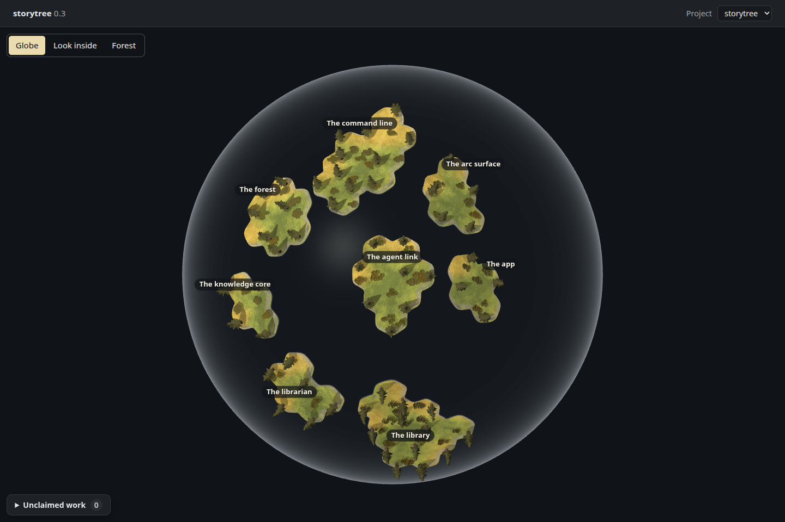
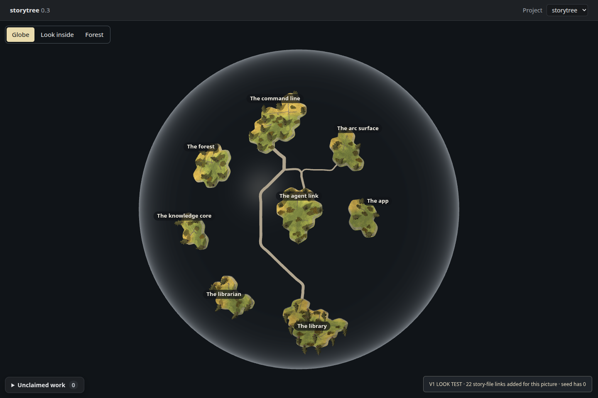
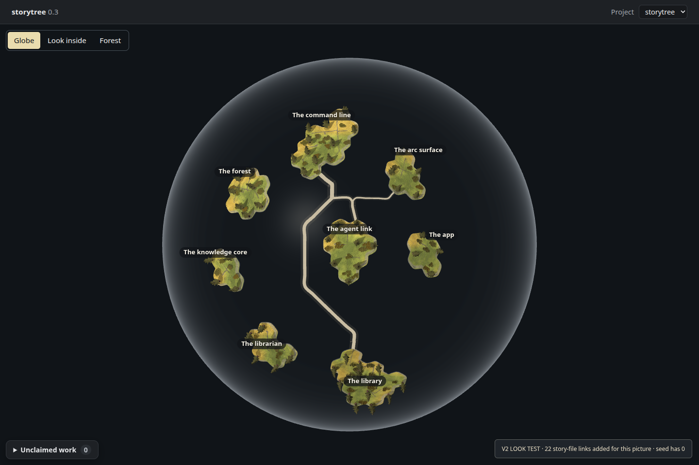
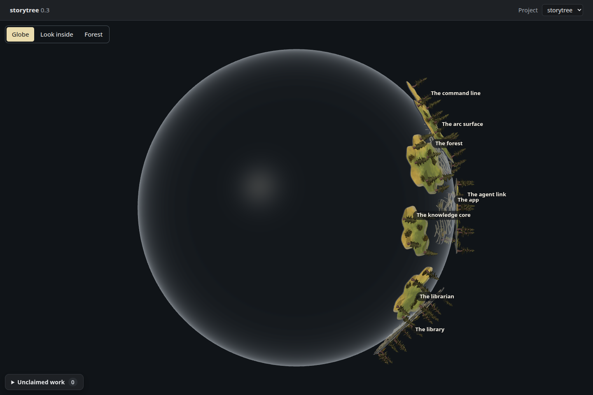
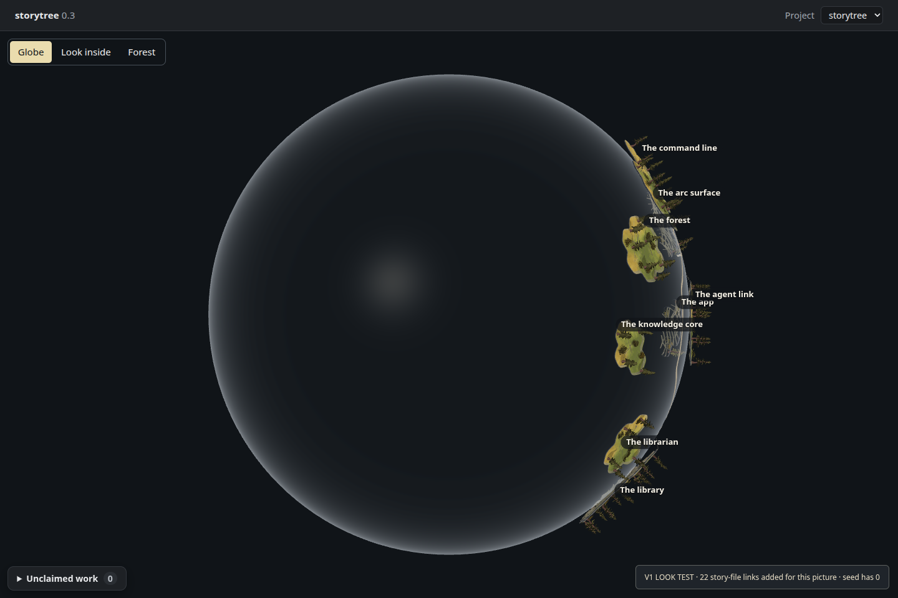
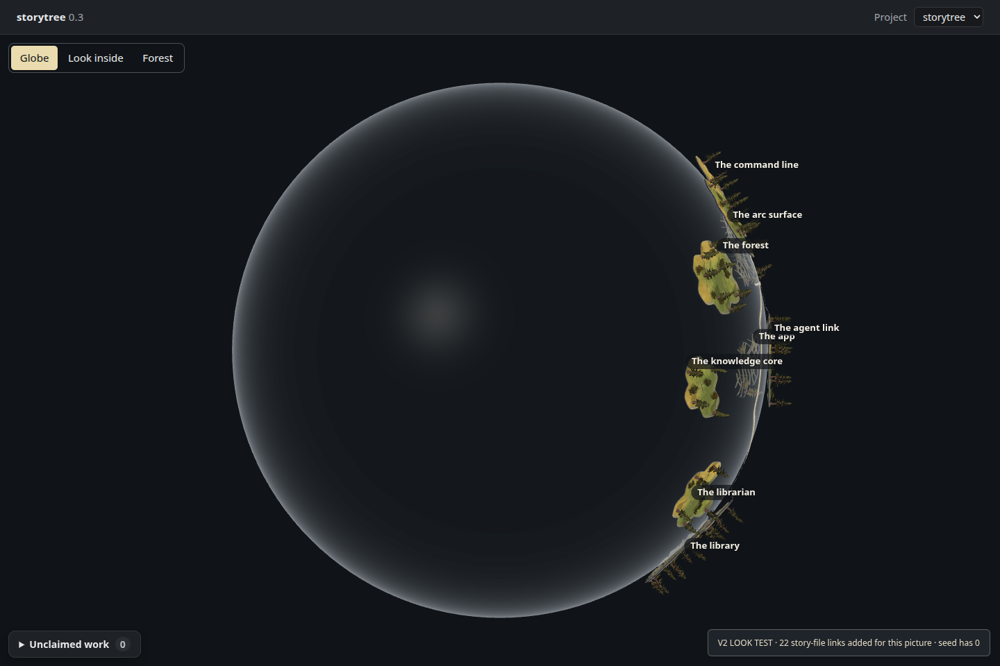
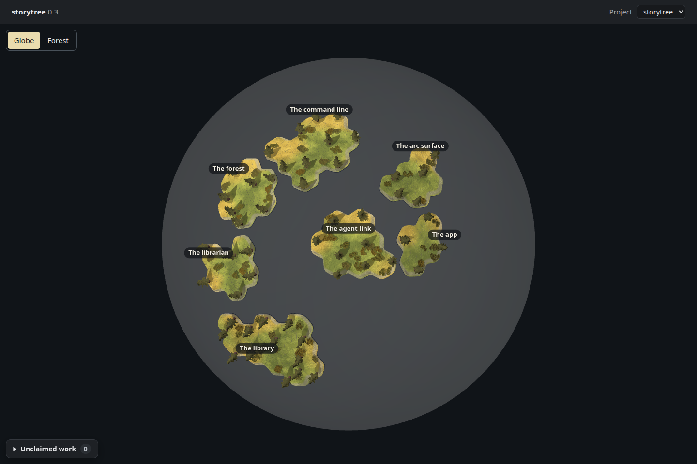
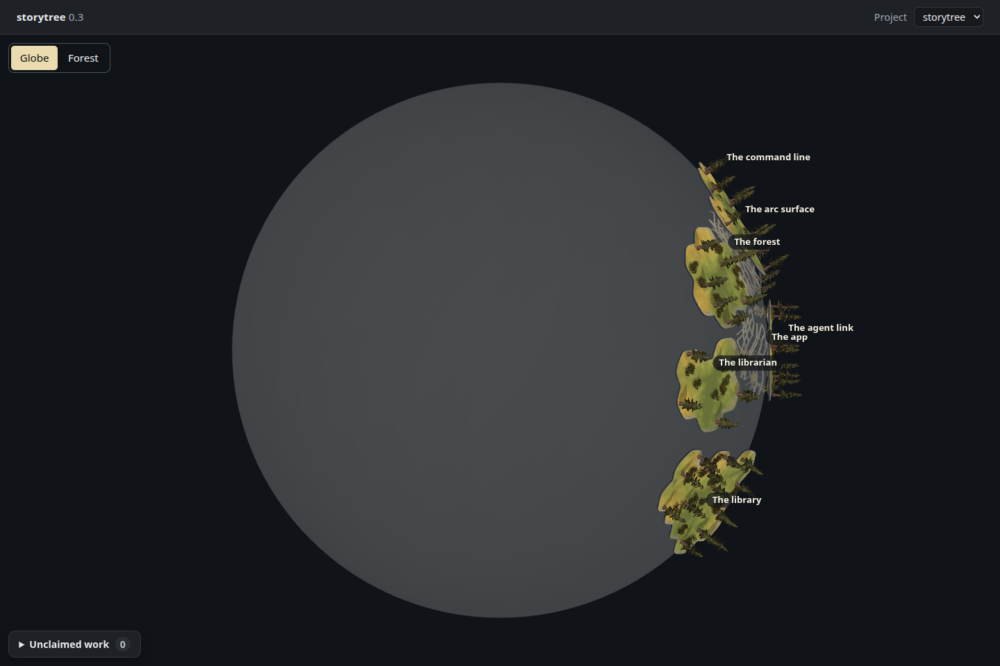

# Pathways on a wider globe — throwaway look

**Pictures for the owner, not a product change.** `0-3-planet-pathways-look`,
ADR-0655 D3 / ADR-0169, 2026-09-27. Branch `spike/globe-pathways`; no pull request.
Based on `main` at `0a34053` (#102), including the glass treatment after #93.

**The fresh seed contains 75 within-island links and zero cross-island links.**
Its eight stories and 58 capability trees are real; all retain their planned
yellow state. The seed parser deliberately reads only dependencies within each
story (`scripts/library-seed.mjs:72–80`). Although the library supports cross-story
links, the seed does not import them. A strictly seeded V1 and V2 would therefore
show the same picture, without any crossings.

To make the requested comparison useful, **V1 and V2 supplement the browser
experiment with 22 dependencies explicitly numbered in the existing story
files**, between the command line, library, agent link and arc surface. The
[source manifest](../../../apps/desktop/globe-pathways/declared-links.json) names
each capability and its file/line. No inferred dependencies, health, stories or
capabilities are added. Nothing is written back to the seed or a user's library.
The research badge makes this qualification visible in each V1/V2 picture.

## Side-by-side pictures

All are raw 1440 × 960 desktop-page screenshots, dark theme, scale 1, headless
Chromium 148 / ANGLE Vulkan SwiftShader Device (Subzero). The adapter mounts the
existing page, ground, kit pines, glass shell, labels and L1 light; it substitutes
Electron's reads with the isolated seed's `pageReads` result. These are not
Electron smoke captures. The retired-view buttons still appear because this
branch preserves the page at its launch base; removing them belongs to the
separate globe-only increment.

| View | Current globe, same seed | V1: surface trail, 22 documented links | V2: raised and faintly lit, same 22 links |
| --- | --- | --- | --- |
| Front |  |  |  |
| Quarter turn |  |  |  |

**The unmodified seed's own links on the wider globe:**
[front](within-front.png) · [quarter turn](within-quarter-turn.png).
These show all 75 actual links as ground wear, with no cross-island ribbons and
no supplementary dependencies.

For the requested historical comparison, main retains the original evidence:

| View | #90, packed / opacity 0.18 | #93, opacity 0.08 |
| --- | --- | --- |
| Front |  |  |
| Quarter turn |  |  |

The historical captures have different fresh-seed IDs, hence different coasts.
The first table is the controlled comparison: one seed and the same frozen
directions, opening rotation, quarter-turn angle, page and light throughout.
Increasing the radius reduces the islands' screen size at the page's normal
whole-globe framing; land and trees are never rescaled in ground units.

## Spacing, radius and capacity

| Measurement | Result |
| --- | ---: |
| One-link ribbon width | 1.50 ground units |
| Widest actual trunk (20 of the supplementary links) | 4.62 units |
| Widest possible trunk for all 22 links | 4.82 units |
| Target coast gap: four times that possible width | 19.29 units |
| Fresh seed's nearest coast gaps: min / median / max | 31.68 / 37.23 / 42.83 units |
| Same seed at today's radius 160: min / median / max | 4.50 / 11.00 / 16.64 units |
| Existing fictional 36-story sample: min / median / max | 19.46 / 26.96 / 39.39 units |
| New globe radius | **218 ground units**, previously 160 |
| Physical spiral pitch | 98.1 units, previously 72 |
| Fixed historical-place capacity | **36**, unchanged; place 37 still refused |

The ribbon width is the engine's own `(1.2 + 1.8√usage) × 0.5`. Four widths means
one ribbon with 1.5 ribbon widths of free space to either side. This is a stated
look-test clearance rule, not an owner-approved future spacing policy.

The instrument keeps all 36 existing directions and enlarges the sphere; it
never repacks or refits the positions to live counts. It chooses the first integer
radius reaching the target for this seed and #90's existing 36-story sample.
It measures complete clipped coast edges (beaches included), radially projected
before vertical relief, using shortest distances on the sphere. It also checks
edge crossings and containment; no coast overlaps occur in either input.
[Full measurements](measurements.json) retain every pair and nearest neighbour.

This is a bounded measurement of these inputs. It does not prove clearance for
arbitrary future IDs or island growth, and it grants no additional capacity.
The fictional 36-story input is measured only; it is not used for any picture.

## What the adapter draws

Within islands, the ported cost-grid router connects the real capability parcel
positions. Its sampled curves feed the existing ground wear atlas: the same worn
path material and ground-cover response the engine already has. Shore connectors
in V1/V2 join the relevant capability to its actual dock. A few local curve
samples that escape a concave coast are clamped to that shore; their counts are
reported per island. This is a look adapter, not a finished coastline-aware
capability router.

Between islands, the engine routes the three distinct story pairs in a
front-pole azimuthal chart of the seed's occupied patch. Its normal shared-trunk
rule produces five segments. Every segment retains the original capability
link IDs, and its width counts those links, including all links aggregated onto
a story pair. There are no dropped links or forced caves in this example.
The router's own cubic curves are evaluated, not rendered as their control
polygons. Samples return radially to the sphere, with physical-width ribbons;
none of their open-water centreline samples crosses an island interior.
The eight-unit shore transitions are excluded from that sampling check; their
endpoints are snapped to the actual endpoint shore.

V1 lies 0.12 units above the glass to avoid coincident surfaces. V2 follows
exactly the same route, rising an additional **0.90 units** away from the shore,
with a slightly brighter unlit fill and a **10% opacity halo**, 2.4 times the
ribbon width. It adds no light, bloom, support, bridge, land fill or core.
Both ribbons ease up over the last eight units to meet the actual shores of the
unchanged tangent plates. That small radial transition is necessary because
these islands sit above the curved glass rather than bending onto it.

The chart is adequate for this seed's front patch. It is not a routing solution
for paths crossing the back-pole chart seam, arbitrary large projects, island
growth, or future cave situations. Those remain product work after the owner
chooses a look. Readability through far-side islands and near/far trail ambiguity
remain visible in the quarter-turn pictures.

## Reproduce and verify

The [capture instrument](../../../apps/desktop/globe-pathways/README.md) is copied
from `spike/globe-land`, then adapted explicitly in `build.mjs`. Product source,
placement tables, shell materials and lights are unchanged on disk. Committed
seed and route snapshots reproduce these exact pictures without reseeding.
Each picture has a sibling JSON with renderer, geometry, camera, rotation,
labels, smoke readout, draws, triangles and browser warnings.

`pnpm typecheck` passed. `pnpm test` selected **full** scope and all 12 units
passed: **1,898 passed, 2 skipped, 0 failed**. `pnpm test-ratio` reported 1.41;
this spike adds no product tests. The scratch TypeScript is bundled/executed
separately and is outside the product typecheck. Every seed, geometry render,
Playwright run and test held `/tmp/storytree-heavy.lock`.

All eight frames contain eight islands and 58 trees, with the existing shell,
no sea or core, and no page/shader errors. The quarter turns measure exactly
90 degrees. V1/V2 camera, rotation, zoom, plate geometry/transforms and smoke
readouts match. All eight PNGs were inspected. The existing Three.Clock,
React/drei cleanup and SwiftShader readback warnings remain recorded.

| Treatment | Draw calls | Submitted triangles |
| --- | ---: | ---: |
| Current baseline | 50 | 540,158 |
| Native seed, local wear only | 50 | 540,158 |
| V1 | 55 | 541,114 |
| V2 | 65 | 543,026 |

These are draw counts, not frame timings. V2's transparent, double-sided halo
adds two submissions per shared segment. [Verification record](verification.json).
An independent read-only audit checked the source manifest, edge identities,
width/radius arithmetic and caveats. It did not attest the appearance.

V2 reads brighter and heavier front-on. At the quarter turn, both trails become
edge-on among the coast plates and trees; the small lift does not solve that
occlusion. Local worn paths are subtle at whole-globe scale. These are findings
for the owner's eye, not acceptance of either look.

## FOR THE OWNER

Pick V1 or V2, or redirect the look; this spike adopts neither. The seed's missing
cross-story links must also be addressed before a product pathway build can
honestly show those relationships. The real-seed-only images make that gap
visible; the supplementary pictures demonstrate only the treatment of links
already named in the story files. No owner question was edited.
