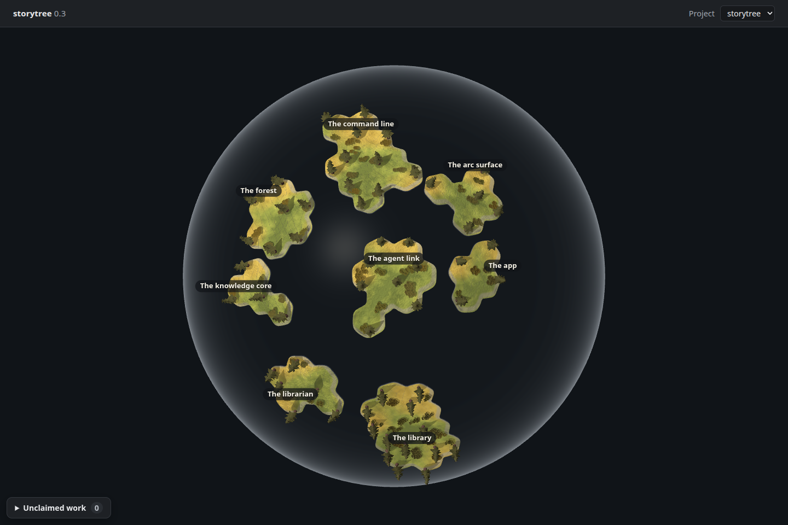
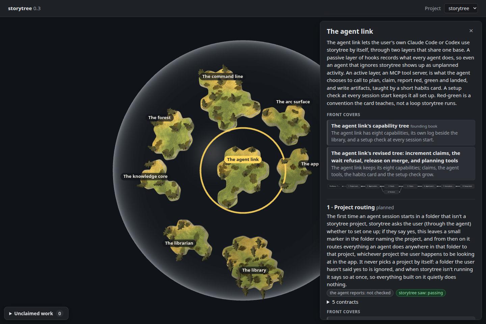

# Seeded cross-story dependencies

Increment `0-3-seed-records-cross-story-links`, 2026-09-27.

The actual `pnpm seed:library` run in an isolated home wrote **28 cross-story
capability links**, alongside the existing **75 local links**, across eight
stories and 58 capabilities. Readback through the desktop's `pageReads` confirmed
those counts. The current files contain more numbered references than the
increment's earlier count of 22:

| Source story | Cross-story links |
| --- | ---: |
| Session management | 1 |
| App | 1 |
| Arc surface | 4 |
| Command line | 20 |
| Knowledge core | 2 |
| Forest, librarian, library | 0 |

The parser reads explicit numbered references in the whole Depends-on paragraph:
possessive story names, `its` references, capability numbers in parentheses,
continuation lines, and story-file references. A contract range such as
`5.12–5.14` names capability 5 once. A name and file that identify the same target
produce one link. Names without explicit capability numbers do not invent links.
Unknown or ambiguous numbered story references and missing capabilities stop the
seed with their source file and capability, before it writes any stories.

The seed creates all capabilities before writing dependencies, so file ordering
cannot drop a target. The regression tests confirm both unchanged history on a
second run and removal of a dependency deleted from its source.

Renderer: **headless Chromium 148.0.7778.96, ANGLE / Vulkan SwiftShader Device
(Subzero)**. These are untouched 1440 × 960 screenshots of the actual desktop
renderer, HTML and CSS, with Electron's read bridge supplied by a snapshot of the
isolated seed through `pageReads`. No reported health or activity was invented.
The capture confirmed all eight islands and 58 trees, then clicked the front
island and checked that its existing diagram names the library's capability 7.
[Capture data](capture.json) records the target and zero page/asset/shader errors.

This changes stored links and the existing drill-down, not globe drawing. A
comparison of `forestScene` with and without the cross-story links produces the
same scene. Drawing pathways between islands remains separate work.

The temporary export/build/capture scripts are in this worktree's ignored
`apps/desktop/dist/seed-cross-story-links/`, adapted from `spike/globe-land` and
the preceding globe-only capture. The build adds observation hooks only.
`STORYTREE_HOME=/tmp/planet-lane-q-seeded` selects the isolated database. The seed,
capture and verification commands all held `/tmp/storytree-heavy.lock`.
