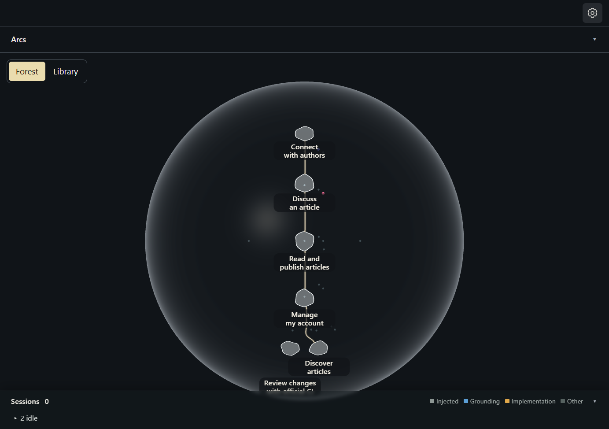
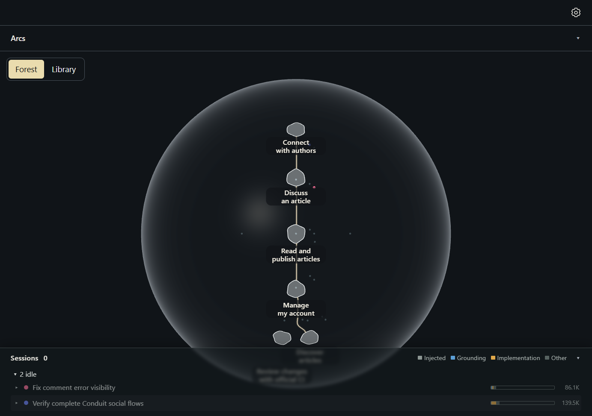
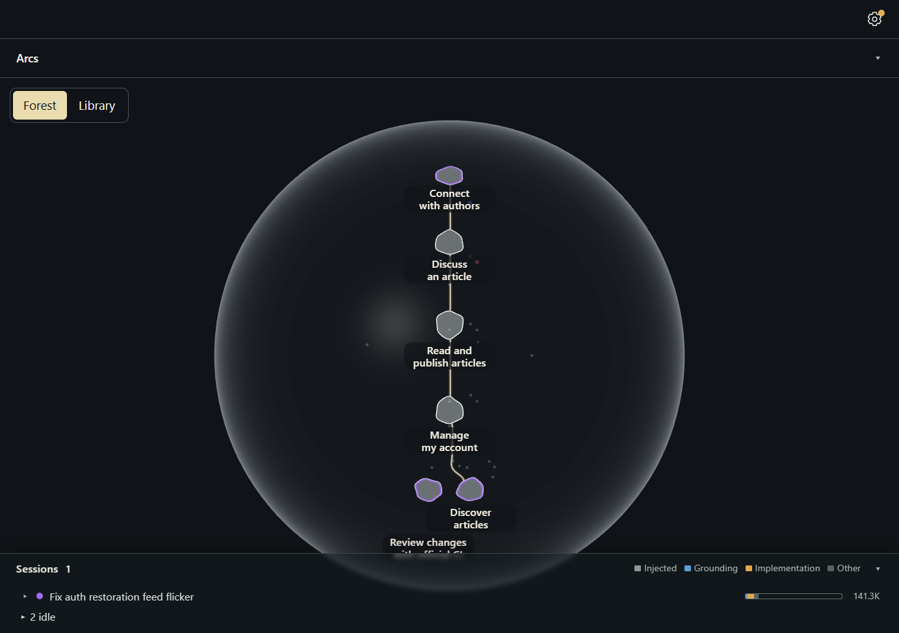
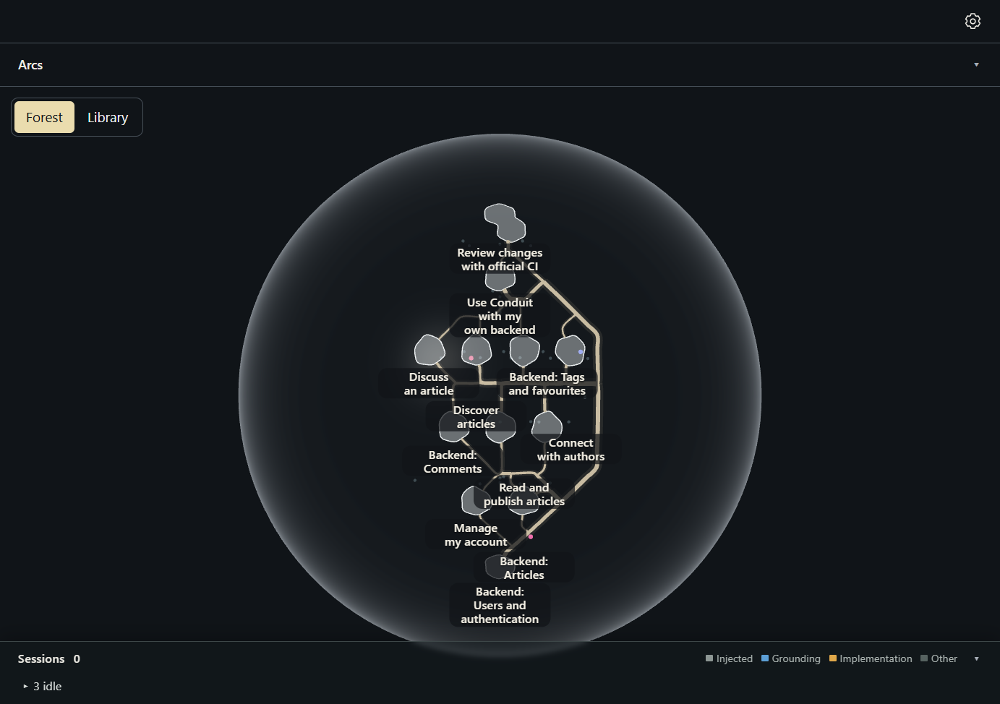
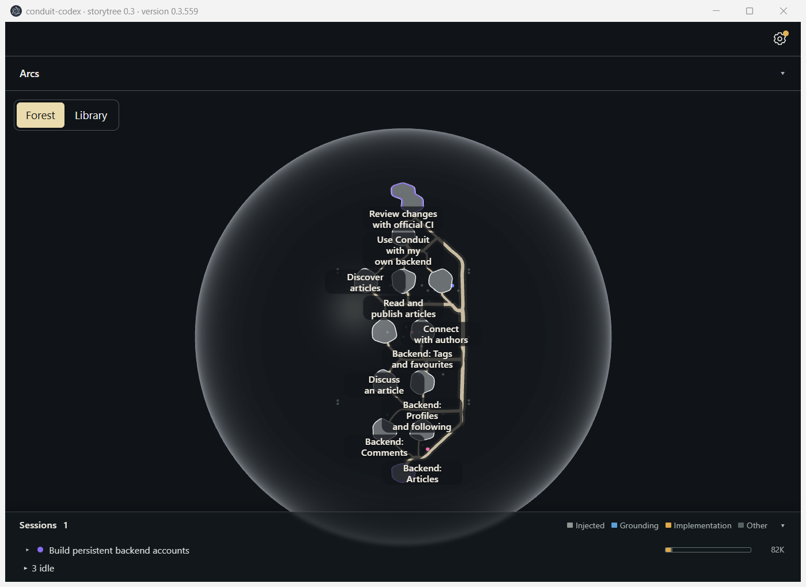
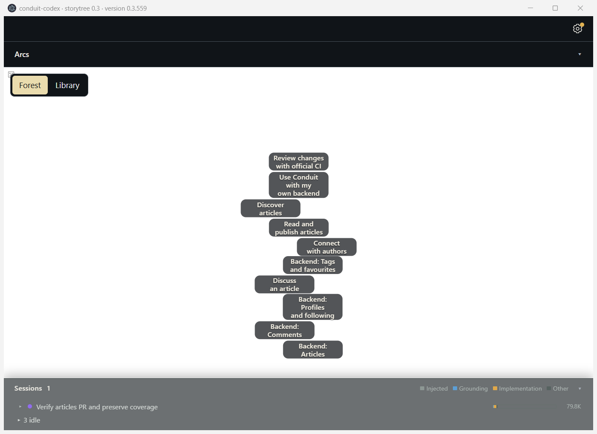
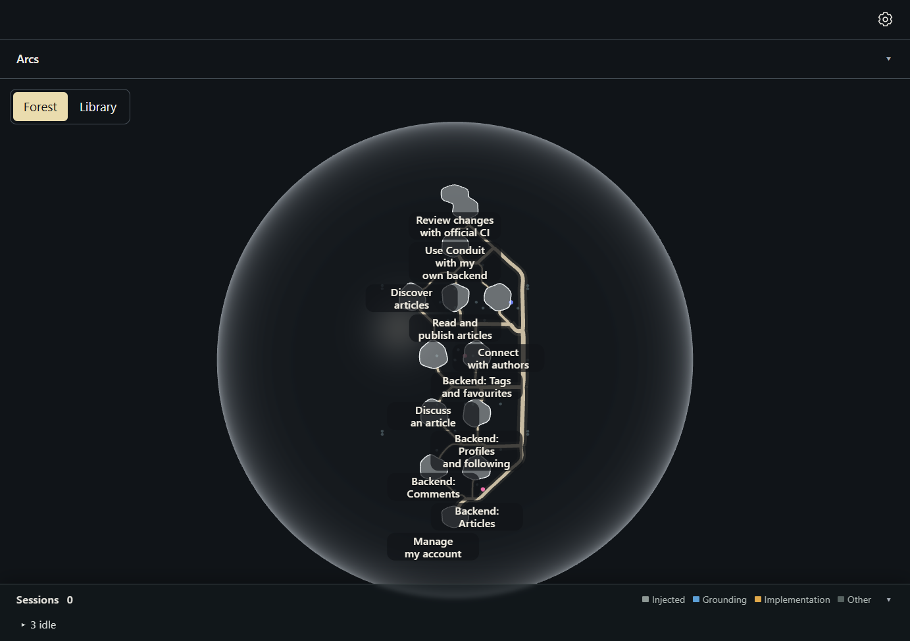
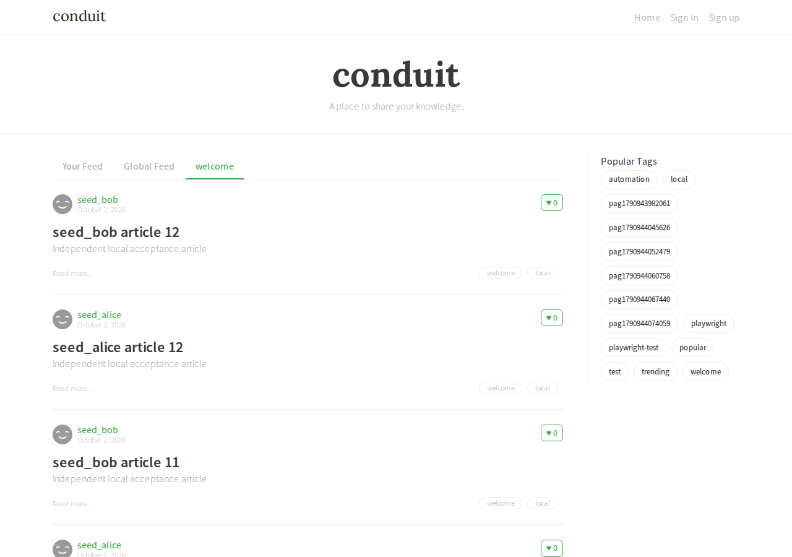
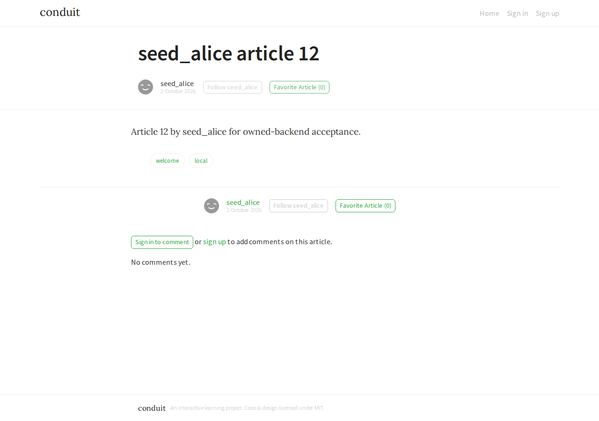
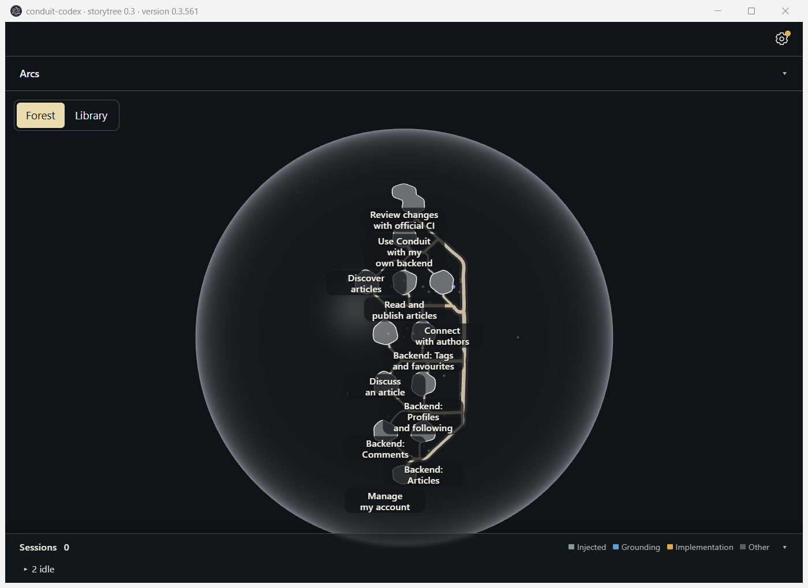

# Conduit adopts GitHub and grows a backend

**Conduit now has a private repository, a pipeline and its own persistent
backend.** Laptop Codex lands build PRs #1–#7. The final copied build passes all
154 official API requests and all 139 official SPA cases on Mint; fullstack
mode passes 74 cases and intentionally skips 65. Neither final frontend run
needs a retry. Earlier failures and the test adapter's limits remain below.

| Backend part | Private PR | Independent API requests | Supplemental scenarios |
| --- | ---: | ---: | ---: |
| Users and authentication | #3 | 40 | 1 |
| Articles | #4 | 64 | 3 |
| Comments | #5 | 96 | 5 |
| Profiles, following and feed | #6 | 121 | 7 |
| Tags, favourites and frontend integration | #7 | 154 | 10 + browser restart |

All five parts land; no unfinished backend part needs parking.

This continues the [folder-only Conduit build](conduit.md) in Codex's existing
`conduit-codex` project on the old Windows laptop. Codex builds from user prompts;
the supervisor on Mint observes, reads the library, captures the app, and grades
copies of the build. The supervisor never edits the build. The laptop runs
Codex CLI 0.158.0 with `gpt-6-astra`; the supervising Mint lane also uses
`gpt-6-astra`.

## Starting point

- The frontend previously passed the official RealWorld suite, **139/139**.
- The project has five frontend stories, five capabilities and five contracts;
  its original frontend arc is closed. All five contracts say agent-reported
  passing, with storytree verification explicitly not checked.
- No `.git` exists, and Git, GitHub CLI and Node are absent from the builder's
  fresh PATH. The existing launcher borrows Node from a prior test cache.
- The first turn starts on **storytree 0.3.548**, 2026-10-02 at 17:23:22 AEST.
  [github-turn.ps1](harness/github-turn.ps1) records the app version before and
  after every turn; a changed version invalidates that turn as acceptance proof.
- The harness project list omitted both Conduit folders. It now includes them
  so state snapshots cover the projects actually under test.

## GitHub and pipeline trial

The [first prompt](harness/prompts/github-codex-1.txt) asks for a private repository
and the official frontend suite on every pull request. It explicitly authorizes
creating the repository and installing the necessary tools. Authentication is
GitHub's browser device-code flow; credentials are never supplied by the supervisor.

Codex first calls `check_setup`, completes the requested file-edit probe, then
gets a verified connection. The check preserves the existing library and does
not tell the agent to install optional tools, consistent with ADR-0751. Codex
reads the project's orchestrator and librarian, adds a CI story with one
capability and contract, and parks an increment on the existing arc.

The initial attempt to claim both increment and capability in one call is
refused. Separate calls succeed. This repeats the claim-shape friction seen in
the folder-only trial and is recorded as `friction_3c3b5e97b4bd`.

The Git installer is cancelled at Windows elevation. Codex switches to portable
Git, GitHub CLI and Node under the user's temporary directory and later stops
the stalled installer. It initializes Git in place, stages the original 32-file
frontend baseline, and adds the workflow and test configuration separately.
The original project name and library identity remain unchanged.

| First turn | Observed result |
| --- | --- |
| Wall time | 1,417 seconds, including the device-code wait |
| App version before → after | 0.3.548 → 0.3.548 |
| Existing local checks | 22 passed |
| Official suite on laptop | 138 passed, one passed on retry, zero failed or skipped |
| Upstream test provenance | All 22 vendored files match the pinned upstream source |
| CI configuration | Pull requests, pushes to main and manual runs; Node 22; pinned Playwright 1.63.0; Chromium; retained reports |
| Remote outcome at turn end | No repository or pull request yet; authentication pending |

The first sign-in code expires. Codex then requests a replacement with the
`workflow` scope needed to push Actions files, but ends its turn immediately
after displaying it. The waiting `gh` process disappears: `Get-Process gh`
returns nothing and `gh auth status` still exits 1. The supervisor therefore
starts a fresh device-code flow over SSH and keeps that command alive in the
foreground. This is `friction_481ffed235f4`. Codes and the sign-in question stay
in the private lane report and library, not this evidence.

The third code is approved and `gh auth status` succeeds at 17:58:26 AEST.
The question is settled and the [second user turn](harness/prompts/github-codex-2.txt)
asks Codex to finish publishing, verify the hosted pipeline, and make its tools
work in fresh sessions. GitHub CLI itself reports that its credentials were
saved in plain text after the SSH sign-in. The supervisor never opens or copies
the credential file. A separate operational follow-up,
`increment_3b652cfc74e1`, is parked to check the supported Windows credential-store
path; repository and pipeline work continues under the existing authorization.

Git and Node now resolve from durable per-user `Programs/ConduitTools`
locations, and GitHub CLI resolves from its installed `Program Files` location.
Codex sets the user PATH and verifies the tools from a fresh PowerShell;
the supervisor repeats that check after the trial. A project `Use-Tools.ps1`
also supports terminals that still have the old PATH. It creates the approved
**private** repository, pushes the original frontend as the baseline, and uses
a normal Git branch, `ci/official-realworld-frontend`, for the CI changes. It
does not call `make_workspace` for this increment.

**Private build PR #1 merged at 18:10:48 AEST.** Codex runs the merge itself
with GitHub CLI after the first hosted run succeeds: **139 passed, no retries,
failures or skips**, in 4.4 minutes of test execution. The supervisor checks
the repository's private visibility, the hosted log and the merged PR state
independently from Mint. Private repository links are deliberately omitted.
Codex then reports the contract green, marks and lands the CI capability,
closes its increment with PR #1, and updates the decision with the result.

The automatic post-merge run then fails **one of 139** tests after both
retries: `Navigation and Filtering › should paginate articles` counts zero
articles on the first tagged page. The saved page snapshot shows
“Loading articles…” after the test had already seen an article. Codex traces
this to sign-in restoration clearing an already loaded feed, corrects its
initial page-2 diagnosis, parks a fix increment and branches again. Its new
deterministic regression fails before it edits the app. This is a build defect
found by the pipeline; the successful PR run does not erase it.

Private build PR #2 preserves the loaded feed across auth restoration and
refreshes its favourite buttons once auth is ready. **23 local checks pass.**
It also adds those deterministic browser checks to the pipeline. Their first
Linux run fails while starting Chromium, before app assertions or the official
suite run. Codex adjusts the Linux launcher and adds startup diagnostics,
then pushes the correction to the same PR.

That run passes **23 local checks and all 139 official tests without retries**.
Automatic approval review then refuses the combined verification, merge and
branch-deletion command: it regards follow-up PR #2 as outside the first-PR
authorization. The supervisor explicitly authorizes the necessary fix through
the [third user turn](harness/prompts/github-codex-3.txt); it does not merge the
build itself.

This refusal also exposes a **supervisor harness defect**. The version wrapper
sets PowerShell's error action to `Stop`, which makes Codex's native stderr
terminate the turn before Codex can respond to the refusal. The task exits 1;
the turn metadata has no exit line, while the wrapper's `finally` records
18:33:37 and the unchanged version **0.3.548**. This turn lasted about **2,094
seconds**. The wrapper now invokes the turn in a child scope with `Continue`
so Codex can handle its own stderr. The stopped task is deleted.

The third turn exposes another harness problem: `resume --last` selects the
automatic approval-review child, not the builder. Codex warns that a session
recorded with `codex-auto-review` is being resumed with `gpt-6-astra`; approval
checks then fail because that child has no Guardian extension. The turn lasts
115 seconds on **0.3.548 → 0.3.548**, records the grading limitation in the
project library, and ends without merging. The stderr correction is proven
here: the refusal no longer kills the turn.

The harness now accepts an explicit Codex session ID, and this trial's wrapper
requires it for every resume. The fourth launch fails before Codex starts:
PowerShell unrolls a one-item array expression into a scalar and splats the
ID incorrectly. A typed string array fixes that; a native-process argument
probe confirms the intact ID and stdin marker. The [same prompt is relaunched
as turn five](harness/prompts/github-codex-5.txt), targeting the original builder
ID with automatic approval review still enabled.

The exact builder thread restores the storytree tools and approval review.
Codex merges **private PR #2 at 19:03:50 AEST**. The final post-merge pipeline
passes **139 official tests and 23 fixture checks**, with zero retries,
failures or skips. Codex closes the fix increment, lands and releases all
three capability claims, parks the Mint fixture-runner investigation, and
closes its session safe. Local `main` is clean and matches the remote; both
merged feature branches are deleted. No supervisor merge or build edit is used.

The fifth turn takes **739 seconds**, ending at 19:13:53 AEST; the app stays
**0.3.548 → 0.3.548**. All trial task entries are deleted after their runs.

## Independent grading method

Grading runs on Mint, on a copied build, using the unchanged official
`realworld-apps/realworld` suite at
`ebbcdeb8d55b42a3a613c787560498b8ef10003f` and Playwright 1.60.0. Hurl 8.0.1 is
downloaded into the supervisor's user-space trial directory and checked against
the release SHA-256. No sudo or system installation is used.

The frontend-only baseline uses `TEST_MODE=spa`. For the agent's own backend,
the official `TEST_MODE=fullstack` mode drives setup and cross-user scenarios
through the UI; its deliberate browser-mock skips are reported as skipped,
never passed. `API_BASE` includes `/api`; the Hurl runner's `HOST` does not,
because the request files append it themselves.

The independent frontend grade ran from 07:46:38 UTC for 448.5 seconds:
**138 passed, one passed on retry, zero failed, zero skipped**. The retry was
`pagination should work with /tag/:tag`: its first attempt timed out waiting
two seconds for `.article-preview`; the second passed. This is reported as
flaky, without attributing an unproven cause. The laptop's flaky comment test
passed on Mint's first attempt.

A fresh copy of PR #2's tested commit, `6c5e027`, preserves all 22 official
test files byte-for-byte. Its independent full run takes 472.1 seconds and
ends **136 passed, two passed on retry, one failed, zero skipped**. The failure
expects two articles on the newly registered user's profile and sees none.
The retry trace proves that the demo API returns different identities for the
same registration token and creates both articles under other users. The app
requests the original profile and author filter correctly; the API returns
404 and an empty article list. The trace does not identify which outside
activity causes the identity changes. The exact official case then passes
**three isolated repetitions**, in 21.8 seconds. The failed full run remains
a failed run; it is not relabelled green.

An additional check of the build's own fixture runner on Mint fails at its
first social-flow `Page.navigate` and can cascade into `Script not found`.
This occurs with Node 24.19.0 and with Node 22.16.0 plus Chromium 153 matching
CI. The fixture runner installs its fetch mock before navigation and never
forwards unmatched fetches; `CONDUIT_LIVE_TEST` is unset. No demo-API traffic
window is identified in that local check. The timeout's cause is unresolved;
it is reported separately from the official suite and from the 23 passing
hosted checks. Node 22's official archive is also SHA-256 checked and installed
only in the supervisor's user-space trial directory.

## What the app and library show

After the first turn, the library retains all five frontend stories and adds
**Review changes with official CI**. Its increment remains active. No workspace
or pull-request result has been proven at this capture because authentication
is still pending. The second turn subsequently closes that increment with
the merged PR, as recorded above.

The default sessions list shows two old sessions. The new GitHub session is
absent; `session list --all` reports it as **ended, hidden**, with no close-out,
although its increment is active and the folder has staged and uncommitted
work. This observation is recorded as `friction_e3958b554bd4`. The lower forest
labels also meet the sessions panel, continuing the known label-layout issue
from the folder-only trial.

After the refused merge command terminates the second turn, the session stays
listed with its fix name and a 141.3K context reading. PR #2 is still open at
this capture; the view is not evidence of a completed close-out.

The final independent library read confirms both implementation increments
closed with PRs #1 and #2, no remaining claims, and the builder session
**ended, hidden, safe, verified**. This is the close-out result the earlier
folder-only build could not establish without Git. The six stories still say
agent-reported passing and explicitly state that storytree does not check
this project's tests yet. The Mint runner investigation is a proposal in
Conduit's library (`increment_8626d58a4e7d`), with no owner question or claim.

The app updates to **0.3.555 after the fifth turn ends**, at the quiet moment.
That change is outside the recorded 0.3.548 trial runs.

Screenshots contain only the app. The debug-port capture was taken between
builder turns; the app was then restarted normally and port 9222 was confirmed
closed. All capture tasks were deleted.

## Landing notes

The librarian pass corrects the trial arc's stale request for repository
approval and the increment's stale empty-folder objective. The owner's
existing-project and private-repository instructions are preserved as the
authority. The sign-in question is settled with the observed approval. No
accepted decision needs a new decision or a correction.

The Windows-driving process note (`process_81a7122f6849`) is amended in place:
resume the captured builder ID, preserve a typed argument array in PowerShell,
and allow Codex to handle native stderr within the version wrapper. Its
read-back and history verify the change. These observations improve the
supervision harness; they are not Conduit implementation changes.

The friction drain is empty. The health drain briefly offers the website's
publish-on-merge capability; its named test has already landed in PR #519,
and fresh reads return an empty worklist. No duplicate fix is opened. The
three trial frictions above remain for another landing to adjudicate.

This first evidence landing proves GitHub and the frontend pipeline. The
backend API and frontend-against-own-backend grades have **not run yet**.
The [backend requirements](harness/conduit-backend-requirements.md) are the
user file prepared for the next, fresh Codex session.

The folder-only Codex build took 5,281 seconds over eight turns. This trial's
GitHub work additionally includes installation, browser approval and hosted-CI
waits, so elapsed times are not a like-for-like measure of building speed.
Its three builder turns take 4,250 seconds; the mistakenly resumed review
thread adds 115 seconds, for 4,365 seconds total. The argument-binding failure
does not start a Codex turn.
Codex billing cost is not reported by the ChatGPT-plan CLI, as in that trial.

## Backend trial

The GitHub evidence lands in storytree PR #526 at 19:36:49 AEST. Its increment
is closed immediately after the merge, and backend supervision moves to a fresh
worktree. The library now keeps backend delivery on its own arc, titled
*Conduit grows its own backend, one green pull request at a time*.

A [fresh planning prompt](harness/prompts/github-codex-6.txt) runs in the same
laptop project, with the [backend requirements](harness/conduit-backend-requirements.md)
provided as a user file. The turn lasts 688 seconds (19:39:13–19:50:40 AEST),
with app **0.3.558 → 0.3.558**. It chooses Node.js 22.16+ and SQLite, parks five
parts, and records cumulative official API acceptance, restart checks, Windows
instructions and the standing private-repository PR approval. No backend code
or tests run in this planning turn.

The first plan adds backend capabilities to the old frontend stories, and puts
the eventual app connection under the CI story. The supervisor asks for
[one planning correction](harness/prompts/github-codex-7.txt): backend stories
alongside the existing frontend, real dependencies between them, and app
behavior owned by the app stories. The supervisor does not edit the build or
its plan directly.

The correction lasts 557 seconds (19:51:46–20:01:04 AEST). The app updates
**0.3.558 → 0.3.559** during the turn: four established tool calls return
`Transport closed`. Codex discovers the CLI, completes the correction through
it, and reads the saved graph back. This turn is void as stable-version app
acceptance evidence. A separate read-back on 0.3.559 confirms twelve stories:
the original six, five backend stories, and *Use Conduit with my own backend*.
The same capabilities, contracts, five increments and waits are retained.

The interruption repeats existing `friction_486899763769`; PR #499 already
shipped a finite foreground update hold, which this harness had not adopted.
Later turns use [held-github-turn.ps1](harness/held-github-turn.ps1), with the
existing `packages/app/src/updates/hold-run.mjs` copied beside it. The hold wraps
the full foreground Codex process inside the desktop task, expires after 180
minutes at most for this invocation, and is removed when the turn exits.
It does not merely wrap the detached task launcher.

The forest shows frontend and backend stories and their links, with labels
still crowded (the existing nameplate issue, `friction_92d59bf69b1e`). The sessions strip reads zero active, three idle. Independent
CLI inspection confirms the planning session is listed as not safe because
only the supplied, untracked requirements file remains; it claims no code,
app tests or outstanding pull request from this planning turn.

### Part 1: users and authentication

The [fresh build prompt](harness/prompts/github-codex-8.txt) starts at 20:05:11
AEST on app 0.3.559. Codex chooses an ordinary branch, `backend/users-auth`, in
the existing folder. A combined increment/capability claim is refused again;
separate claims succeed, repeating `friction_3c3b5e97b4bd`.

An authored account test first fails to connect; after a server-start adjustment
it reaches the missing registration behavior and fails **405 versus 201**.
Codex records that red result, then implements accounts in SQLite, salted scrypt
passwords and HS256 tokens whose signing key survives restart. The resulting
scenario passes and covers restart, two-user identity separation, settings and
password updates, expired/forged tokens, and blocked static access to data.
The frontend remains pointed at the demo API until the final integration part.

Local official Hurl passes **2/13 files, 40 requests, zero failures**; the other
11 files are explicitly deferred. The existing browser fixture runner first
times out at `Page.enable`, before an app assertion, then passes **23/23** on
rerun. All 17 vendored API files and all 22 frontend suite files match the pinned
upstream bytes in the supervisor's comparison.

Private build PR #3 first fails its new hosted backend job before tests: Hurl's
published checksum file contains only the digest, so `sha256sum -c` rejects its
format. Codex fixes checksum verification and the next backend run passes both
the authored scenario and 40 official requests. The full frontend job remains
required before merging.

The supervisor copies an immutable Git archive of commit `405b2ea` from the
laptop. Archive SHA-256 is
`f259b972e16eda2f7d02fad9f3e86081a206ae34d8b669403a33858a0d55f018`.
On Mint, Node 22.16.0 runs the copied server with `CONDUIT_BACKEND=1` and a fresh,
disposable `CONDUIT_DB`; the independent upstream Hurl 8.0.1 runner passes both
authentication files (**40 requests, zero failures**). The copied authored
persistence/token scenario also passes (**1/1**). Its server is stopped and
its test database removed afterwards. A separate read-only source review finds
no material blocker. This grade establishes account-API behavior; a frontend
against the owned backend is not yet implemented or claimed passing.

This window-only capture uses PrintWindow while Codex is running. Storytree
shows one active session, *Build persistent backend accounts*, and three idle
sessions. The installed app's release log explicitly names **Conduit Codex turn
8** as its automatic-update hold at 20:25:01, 20:28:01 and 20:31:01 AEST.
The hold is therefore observed by the real updater, beyond merely finding its
lease file. Release after the turn is checked separately.

PR #3 is squash-merged by laptop Codex at **20:32:17 AEST**, using GitHub CLI
with the private-repository approval in the user prompt. This is the build's
own merge; storytree evidence PRs retain their separate CI merge-queue ceremony.
Final-head backend run `36995202153` and frontend run `36995202267` pass; the
frontend log records **23 fixtures and 139 official tests, zero failures**.
The feature branch is deleted, the account increment is closed with PR #3,
articles is made ready, and the session close-out is independently read back as
**verified safe** on clean `main`.

The turn lasts **1,716 seconds**, ending 20:33:46 AEST, with **0.3.559 →
0.3.559**. Its scheduled task is deleted and its update-hold file disappears.
At 20:34:01 the release log returns to the normal quiet-moment wait without the
turn's hold. Merged commit `61b41c5` is copied again: its only difference from
the independently graded snapshot is `.github/workflows/backend.yml`.
The application and tests are byte-identical. Its archive SHA-256 is
`3f26310e3bf28bf849a0ad85098e3c096c47061bd2254344ace7cee60d4600d6`.

Post-merge main runs `36996021063` (backend) and `36996021045` (frontend) also
finish successfully before the next fresh session starts.

### Part 2: articles

The [next fresh session](harness/prompts/github-codex-9.txt) begins at 20:39:50
AEST on 0.3.559, on ordinary branch `backend/articles`. It claims its increment,
article capability and pipeline capability separately, without the combined
claim error. The real updater logs the new turn's hold at 20:40:01.

Before implementation, the cumulative official run passes the 40 account
requests and fails both new files at article creation (**404 versus 201**).
Codex records the red result. After adding article routes and a migration, the
four official files pass **64 requests**. Three supplemental scenarios cover
accounts, article ownership/filtering/restart/deletion, and upgrading the
original account schema without losing its account or signing key. All 23
frontend fixtures pass on Windows after a browser-start permission rerun.

Private PR #4 opens at commit `8667e0a`; its first hosted backend job passes
64 requests and all three supplemental tests. The supervisor copies that
committed tree (archive SHA-256
`9d1cfc2b19ec91e37913ec1e494ec6498b7974f9388a3313cd1bc77abb0686af`).
Independent Mint grading with Node 22.16.0 and Hurl 8.0.1 passes **4/13 official
files, 64 requests, zero failures**, plus **3/3** copied supplemental scenarios.
Nine API files remain deferred. All 17 vendored API and 22 frontend suite files
still match upstream bytes. A read-only review confirms real restart/migration
coverage, immutable author ownership, body-free list summaries and distinct
omitted/empty/null tag behavior, with no material blocker found.

PR #4 merges at **20:57:56 AEST** after its final-head backend and frontend
checks pass; the latter again records **23 fixtures and 139 official tests**.
The turn ends at 21:00:16 after **1,226 seconds**, with **0.3.559 → 0.3.559**.
Independent library inspection confirms the article increment closed, comments
ready, the session verified safe and hidden, and clean main at `d472192`.
The desktop task is deleted and its finite update hold is gone. The merged
archive is byte-identical to the graded committed tree (SHA-256
`61d1e0122028282e35cd170472a6b3e6662b080f8014ab62b97ca549040b9c60`).

During the article turn, PrintWindow captures a white canvas while story labels
and the session strip remain visible. A separate actual-screen capture after
the turn reproduces it, so this is not solely PrintWindow omitting rendered
pixels. Reopening the app between turns restores the forest, still on 0.3.559:

The cause is unconfirmed; this observation does not establish WebGL context
loss. It is recorded as residue for the existing canvas browser-proof work,
not fixed in this evidence lane. Debug capture is closed before Codex resumes.

Post-merge article runs `36998388162` (backend) and `36998388249` (frontend)
also finish green before comments begins.

### Part 3: comments

The [fresh comments prompt](harness/prompts/github-codex-10.txt) starts at
21:06:57 AEST on 0.3.559. It includes the independent article grade and asks
Codex to correct the eventual fullstack seed recipe: two authors must appear
on the first displayed page, which author-by-author batches do not ensure.
Codex encounters the same two-target claim validation, then successfully
claims the increment and comment capability separately before implementation.

The new authored tests first fail on public listing (**404 instead of 200**)
and posting (**404 instead of 201**). After implementation, both new scenarios
pass; the cumulative run catches an older schema-version assertion, which
Codex updates for version 3. The complete supplemental run then passes **5/5**.
Local official Hurl passes **7/13 files, 96 requests, zero failures**, with the
remaining six files explicitly deferred. The revised seed recipe alternates
authors and checks the 24-article total and both authors on page one.

The normal forest remains visible during comments after the earlier restart.
The session strip shows one active session and three idle; the screenshot is
cropped to the app window. The local fixture runner passes **23/23**.

Private PR #5 opens at `7f06a5e`; its first hosted backend run `37000387077`
passes. The supervisor's immutable archive SHA-256 is
`984955288678db2bbc93dc9713e8ef9a01a907fe73510fe0688cde3237e92a9e`.
Mint independently passes **7/13 official files, 96 requests, zero failures**
and **5/5** copied supplemental scenarios. The 17 API and 22 frontend upstream
files remain byte-identical. The read-only review finds no material blocker;
it checks author-only deletion scoped to the article, the post-body-read
article recheck, real restart/migration assertions and the corrected seed recipe.
The disposable server and data are removed after grading.

PR #5 merges at **21:28:09 AEST**, at `940fed5`. Final-head frontend run
`37000387064` reports **138 passes, one retry-pass, zero final failures**.
The retry is the script-tag-in-article-body case: its first attempt times out
waiting for `.article-content`, before the XSS assertion. Its cause is not
established here. The fixture runner reports 23 TAP tests (22 subtests).
The turn ends at 21:30:06 after **1,389 seconds**, with **0.3.559 → 0.3.559**.
Independent library inspection confirms comments closed, profiles/following
ready, and this session verified safe and hidden on clean main. Its desktop
task is deleted and its update hold disappears. The merged tree is byte-identical to the independently graded snapshot; its
archive SHA-256 is
`98e45a13e704c612d6404688349c758cc7269b92cdee1a7234b37c0f814e6c1c`.

The comment merge's backend run `37001170431` and frontend run `37001170380`
also finish successfully. The fresh next session begins while the latter runs;
its public-demo frontend checks are finished before the new part reaches CI.

### Part 4: profiles and following

The [fresh profiles/following prompt](harness/prompts/github-codex-11.txt)
starts at **21:31:46 AEST** on 0.3.559 and carries the independent comment grade.

Codex again recovers from the two-target claim validation by claiming each
item separately. The new supplemental profile and migration cases first fail
**404 instead of 200**. The compound PowerShell command nevertheless exits 0 after later
PowerShell cmdlets succeed; the supervisor grades the actual TAP totals. A cumulative
official red run keeps the previous seven files green and fails the three new
ones. After implementation, Windows passes
**10/13 official files, 121 requests, zero failures**, and **7/7** supplemental
scenarios. The local browser runner hits `Page.enable` before app assertions;
Codex reruns with browser permissions, preserving the failed first attempt.

Private PR #6 opens at `149029d`; its first hosted backend job `37002596143`
passes. The supervisor's archive SHA-256 is
`1705542114b8af53aaec9a17d4ecff3890e4d231f3b56a49df4597d518905711`.
Independent Mint grading passes **10/13 files, 121 requests, zero failures**
and **7/7** supplemental scenarios, with its temporary server and data cleaned
up. Three official API files remain deferred. All 17 vendored API and 22
frontend files still match upstream bytes.

The Windows browser rerun passes **23 reported tests**. A read-only source
review finds no material blocker in per-viewer follow state, idempotent
follow/unfollow, authenticated feed filtering and ordering, or preservation of
existing content and tokens through the migration.

PR #6 merges at **21:50:53 AEST**, at `7891ae3`. Final-head frontend run
`37002596047` passes **139/139**, without retries, plus the 23 reported fixture
tests. The turn ends at 21:52:54 after **1,268 seconds**, with **0.3.559 →
0.3.559**. Independent library inspection confirms the increment closed and
session verified safe and hidden, with clean main and the merged branch gone.
Its desktop task is deleted and its hold disappears. The merged archive is
byte-identical to the graded snapshot (SHA-256
`3a81429738815fcae19389a7dc984e3d5ed0cc1775495c64aaa13f7f72d04a10`).

### Part 5: tags, favourites and the owned full stack

The [last-part prompt](harness/prompts/github-codex-12.txt) carries the independent
profiles grade and asks Codex to finish the backend and connect the existing
frontend. It asks for both official frontend modes against the owned API:
`fullstack`, reporting its intentional skips, and `spa`, retaining the full
139-case browser-specific coverage. This frontend still issues REST calls and
holds its JWT in the browser, so the SPA mode's capabilities remain applicable;
its known test-user fixtures must be supplied in disposable test data only.
The official specs and helpers must remain unchanged in both runs.

The final build turn starts at **21:54:04 AEST** on 0.3.559.

The previous merge's backend `37003269558` and frontend `37003269556` checks
also finish successfully. This final turn claims the increment and all three
capabilities separately on its first attempt. It confirms that the existing
test configuration still forces the public demo API before changing it.

The tags/favourites regression first fails **404 instead of 200** on tag
listing, then passes after implementation. The separate ordinary-startup test
fails **404 instead of 401** for `/api/user` without the old opt-in flag.
Codex changes startup and the frontend API target, and the complete official
Hurl runner passes **13/13 files, 154 requests, zero failures; none deferred**.
It also adds a real browser restart scenario, which initially fails to find an
article preview. This is not yet a passing frontend integration result.

Three upstream SPA literals bypass `API_BASE`: route mocks in
`error-handling.spec.ts` and `user-fetch-errors.spec.ts`, and the health probe's
GET. The first owned SPA attempt reaches missed-mock failures. Codex adds a
transport adapter outside the vendored files; the supervisor independently
checks those three literals in the pinned upstream copy and supplies the
[grading adapter](harness/grade-owned.spec.cjs). It remaps only that exact demo
API prefix for SPA `page.route` patterns and `request.get` URLs, preserving
methods, handlers, options and assertions. Fullstack mode performs no remap.
The adapter also blocks browser calls to the demo API. It loads every original
upstream spec; enumeration still finds **139 tests**. No official file,
assertion, timeout, retry limit or mode skip is edited.

The independent grader seeds a fresh temporary database through its API with
24 interleaved Alice/Bob articles and two earlier `johndoe` articles, satisfying
the SPA suite's fixed social-test fixture. It checks both interleaved authors
on page one before testing. These are disposable grading records, never
ordinary-startup data. The adapter is copied beside the grader configuration
with the pinned upstream tree under `suite/specs/e2e` and Playwright installed;
`API_BASE` must name that run's local disposable server.

The restart scenario reveals a real integration bug: clearing an obsolete demo
token leaves the public home feed in its previous error state. Codex fixes that
recovery path and removes an ambiguous second sign-in link in the anonymous
comment prompt. The real browser scenario then passes, verifying UI-created
content, comments, follows, favourites and the signed-in session across a server
restart. Its fixture runner again has a pre-assertion `Page.enable` timeout and
passes the later browser-permission run.

The corrected local SPA run against the owned API passes **139/139**, without
retries. GitHub confirms the repository is private but returns 403 for branch
protection, saying this account needs a paid plan for that feature. No upgrade
or visibility change is made; check execution and the agent's wait-before-merge
remain distinct from server-enforced branch protection.

The first fullstack adapter run exposes a harness scope mistake: requiring all
specs in one suite lets one file's top-level skip hook affect other files.
Codex isolates each original file in its own `describe` block, preserving
file-local hooks. The supervisor applies the same scope isolation to its
independent adapter before running either mode. The corrected Windows run
reports **74 passes, 65 intentional skips, zero retries or failures**. Its
complete backend supplemental run passes **10/10**.

The final part is committed at `47c7ae6`. Its copied archive SHA-256 is
`4d811f4d25f873ef3d028a1e384fd08d4ad7369c6cddc1e6ddecb1c52fd4789c`.
All 17 vendored API and 22 frontend files still match the pinned upstream bytes.
Independent Mint grading passes **13/13 official API files, 154 requests,
zero failures**, and **10/10** copied supplemental backend scenarios. The
API grade uses the complete upstream runner with no file allowlist.

Independent Mint frontend grading of the same committed build finishes green:

| Owned-backend check | First-pass | Retry-pass | Failed | Skipped |
| --- | ---: | ---: | ---: | ---: |
| Official SPA mode | 139 | 0 | 0 | 0 |
| Official fullstack mode | 74 | 0 | 0 | 65 |
| Copied real-browser restart scenario | 1 | 0 | 0 | 0 |

The SPA run takes 206 seconds and fullstack 154 seconds, each on its own
disposable server/database. Both use the independently pinned Playwright 1.60.0
and Chromium 148, while the builder uses Playwright 1.63.0. Both preserve the
upstream mode guards; the 65 fullstack skips are not counted as passes. Unlike
the earlier demo-backed trial, all API traffic under test is local to the
copied app. Both grading servers stop and temporary databases are removed.

Read-only review finds no material blocker in favourite isolation/counts,
schema migration preservation, same-origin integration, obsolete-token recovery
or ordinary unseeded startup. This is a review and acceptance result, not a
production security audit.

These app-only browser viewports show the copied final build using its own API
and disposable acceptance records after the fullstack suite:

The final hosted API job `37006628523` independently passes the same 154
requests and 10 supplemental scenarios. The supervisor's final local storytree
gate runs against main `6b038251`: affected scope includes app-setup and its
dependents, with explicit guidance checking because the Windows process note
changed in the library. The librarian's final friction and health drains are
empty; the process corrections persist, and no decision-log changes are needed.

Private PR #7 merges at **22:34:55 AEST**, at `b4be1ce`. Its final-head
frontend run `37006628450` passes **139 SPA cases** and **74 fullstack cases
with 65 intentional skips**, no retries or failures, plus the 23 reported
browser fixture tests and one UI-restart scenario. The supervisor separately
reads the hosted log. All **101 merged files** exactly match the independently
graded archive; merged archive SHA-256 is
`719929bb26f8080663b9ae15056a956039746045d4bf73de829f125e0822bc0f`.

Every backend part uses an ordinary branch in the existing project, rather
than a new worktree. Laptop Codex performs all private-repository merges after
hosted checks: PRs #3 and #4 use squash merges; #5, #6 and #7 use merge commits.
All commands constrain the expected head and delete the merged branch. This
is the authorized build trial; the storytree evidence PR uses CI's merge
queue and is never merged by the supervisor.

| Part | Laptop branch |
| --- | --- |
| Users/authentication | `backend/users-auth` |
| Articles | `backend/articles` |
| Comments | `backend-comments` |
| Profiles/following | `backend/profiles-following` |
| Tags/favourites/integration | `backend/tags-favourites-fullstack` |

The final storytree gate passes **typecheck, affected tests, guidance and plan
edges**; its disposable test Postgres stops after the run. No NOT RUN result
is counted as a pass.

The final build turn ends at **22:38:41 AEST**, after **2,677 seconds**, with
**0.3.559 → 0.3.559**. Independent library inspection confirms all five backend
increments closed, all 12 stories reported passing, and the final builder
session ended, hidden and verified safe on clean main. Storytree still labels
these project checks agent-reported; the supervisor's separate grades supply
the independent evidence. The desktop task is deleted and its hold is gone.
The five implementation turns total **8,276 seconds** (about 138 minutes),
including CI waits; planning/correction adds 1,245 seconds. This is a larger
scope than the 5,281-second folder-only frontend trial, not a speed benchmark.
CLI billing cost remains unavailable.

After the last build hold ends, the app updates from 0.3.559 to 0.3.561.
At 22:40:01 the supervisor's CLI read briefly fails to start the bundled Node
during installation; the repeated read at 22:40:41 succeeds. This transition
is after the stable-version build acceptance run. A final read-only turn
resumes the exact earlier planning session to verify its formerly untracked
requirements are now committed and clear that stale close-out condition.

The actual updater log records `Install: isSilent: true, isForceRunAfter: true`
at **22:38:54.511 AEST**, 13 seconds after the last build turn ends. No
supervisor install command occurs between these observations. Unlike the
earlier Part 1 observation alone, this verifies automatic installation after
the hold is released. The Windows procedure retains both proof boundaries and
now says to wait for the new version and CLI to stabilize before the next turn.
The resumed planning turn starts on 0.3.561; when 0.3.565 downloads, its own
finite hold is recognized in the updater log.

The read-only planning close-out ends at **22:43:18 AEST**, after **193 seconds**,
with **0.3.561 → 0.3.561**. Its library row is independently read back as
**ended, hidden, safe, verified**. It changes no build files and starts no tests.
The backend arc has **zero open increments and zero owner questions**. The
requirements file is tracked, and clean main equals the private remote.

Post-merge main jobs `37007542608` (backend) and `37007542629` (frontend) both
finish successfully. The final app-only window capture shows no active trial
session; its two older idle sessions belong to the preceding folder-only trial
and are left untouched. The forest remains visible, with the already recorded
crowded-nameplate limitation.

Before the backend evidence PR, main is refreshed to `5328be25` and the complete
required `pnpm run gate --guidance` passes again: typecheck, the affected package
scope, guidance and plan edges. The final friction and health drains are empty.
The repeated laptop cleanup check finds no lane scheduled task, update hold,
Codex/gh process, Conduit test process or debug/test listener. All supervisor
graders have exited and cleaned up their temporary servers and data. No backend
part remains; the credential-store, fixture-runner and canvas observations
remain in the existing follow-up records named above.
