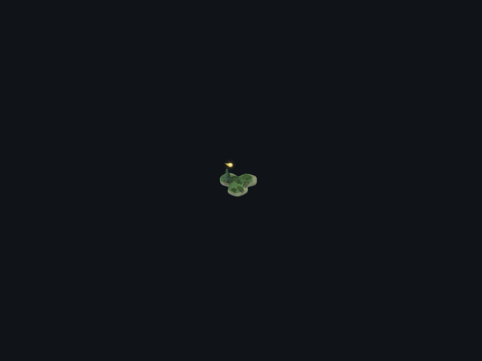
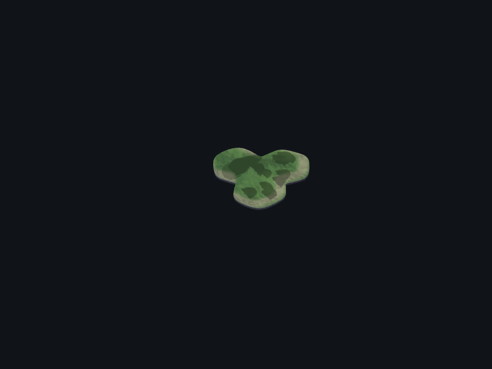

# World canvas browser proof

This capture mounts `ForestWorldCanvas` with a World-owned scene and the shipped
kit and wisp assets. It uses no Forest or Website source or contract. Production
source and appearance are unchanged.

The real Chromium/WebGL run checks existing World contracts:

- **5.1:** readiness follows canvas creation and committed native plants.
- **5.2:** a presentable registered camera renders before its React commit
  returns; a parked camera accepts its new pose without rendering.
- **5.5:** the standalone canvas has controls and a backdrop; the registered
  canvas leaves pointer input and its host's marks to the host. Unmount removes
  the canvas and withdraws its native plant targets.
- **5.8:** the rendered wisp has a three-dimensional core inside its shell,
  a glow, and 216 body triangles (within the existing 300-triangle budget).

`page.tsx` observes the real R3F root through the existing children seam. Its
renderer observer forwards every call to the actual WebGL renderer. It does not
replace the canvas, camera, assets, scene, or renderer with fakes.

Run from the repository root after `pnpm install`, with Playwright Chromium
installed. The wrapper takes the same machine-wide heavy-run lock as the gate:

```sh
node --input-type=module -e 'import { acquireHeavyLock } from "./packages/dev-loop/src/heavy-lock.mjs"; const release = await acquireHeavyLock({ root: process.cwd(), what: "World browser proof" }); try { await import("./packages/forest-world/evidence/canvas/capture.mjs"); } finally { release(); }'
pnpm survey:coverage forest-world
```

Append `-- --mutate-camera` to the first command for the red check. It changes
only the capture bundle, disabling the actual canvas's synchronous paint. The
observed failure is `5.2 a presentable registered camera paints before its commit
returns`. A mutated run cannot publish allocation evidence. The unmodified run
passed on Chromium 148.0.7778.96 on Mint with SwiftShader. The active camera's
render counter advanced from 4 to 5; the parked camera stayed at 6 while taking
zoom 8 and the new target. Thirteen plant targets were withdrawn on teardown.

`browser-trace.json.gz` keeps precise V8 function ranges, generated bundle source,
and its matching source map. The public
`@storytree/dev-loop/browser-coverage` recorder measured **73 canvas functions**
and **four wisp-asset functions** under the World proof identity. It excludes
module-only loading. `survey-browser-coverage.json` preserves that input, and
`survey-coverage.json` combines it with passing Node coverage. The capture's
`out` directory is temporary and removed on success or failure. A failed normal
capture invalidates its measured browser input; regenerate Node coverage after
recapturing before committing allocation metadata.

The same-base live-plan `readCodeSurvey` before and after measurements are:

| Scope | Counted lines | Unclaimed before | Unclaimed after |
| --- | ---: | ---: | ---: |
| Project | 67,810 | 5,218 | 3,431 |
| World | 27,130 | 1,787 | 0 |

The reduction is exactly `ForestWorldCanvas.tsx` (1,760 nonblank source lines)
and `wisp-asset.ts` (27). This allocates source files by executed functions; it
does not claim every branch or source line ran. No other source inventory or
production file changed. The project's other 3,431 unclaimed lines remain the
coordinator's work.




