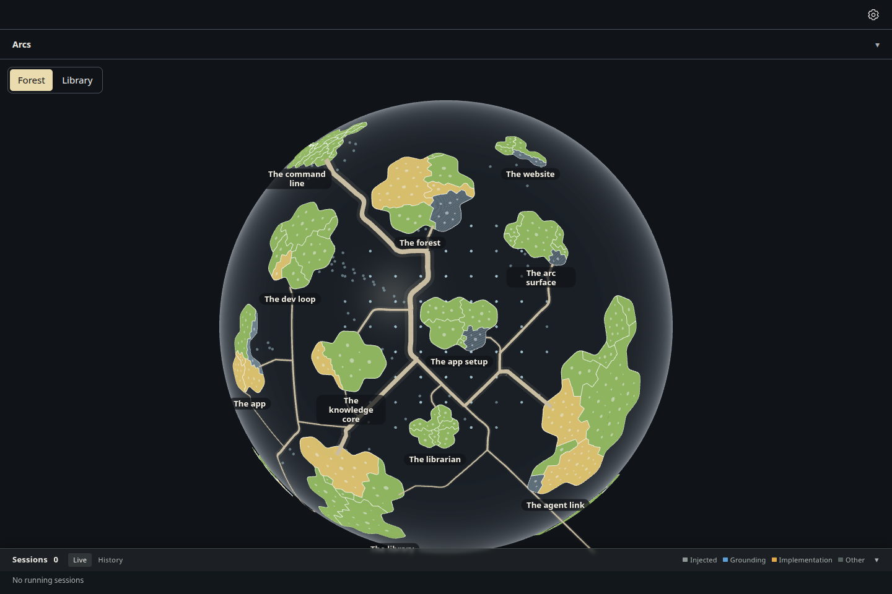
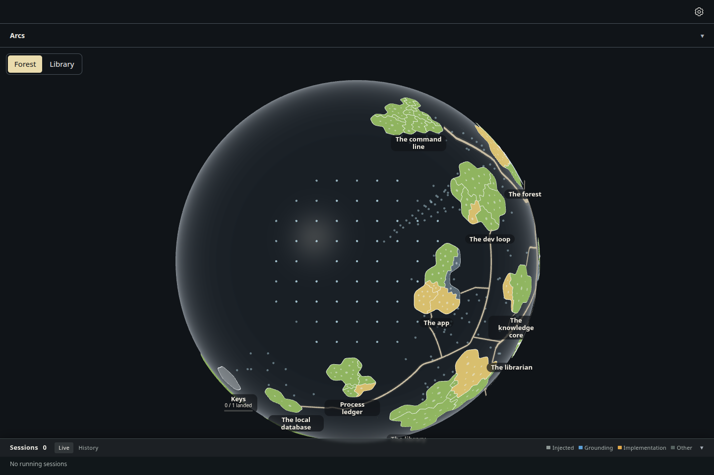
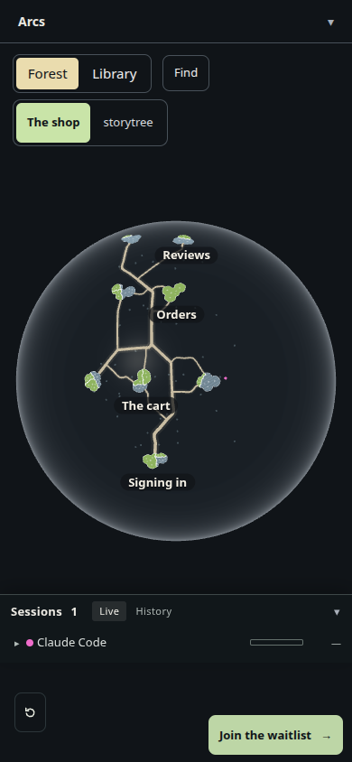

# The flat pine canvas is deleted; the globe looks exactly as before (ADR-0920)

2026-10-05, Mint box, increment_10997908c179. The owner, answering question_a9696c6a1d58: "yes delete the flat
canvas. We may bring back trees and other gamification asthetics in the future but for now this is the look we will
iterate on." The flat canvas (`ForestWorldCanvas`), its evidence page (`evidence/canvas`), the pine and prop kit
(`dressing-kit.glb`, `wisp.glb`), the banded ground and every file only they reached are deleted, and so is the
tree work the globe computed and threw away: 0.2's 2D scene (`core/scene.ts`), its 3D mapper (`world-to-3d.ts`) and
the flat camera's framing. The globe now builds its ground cells directly (`forest-ground.ts`'s `forestDescriptors`).
Git holds everything deleted at `bef6dd7b`.

## The globe is unchanged

Before is this branch's base (origin/main `bef6dd7b`); after is the branch. Storytree's own globe (the
`code-rows` seed and survey) on the real desktop page, 1440 x 960, at its front and after a programmatic quarter turn
(`build.mjs`, `capture.mjs`), and the website's free play at 390 x 844 (`capture-website.mjs`), compared pixel for
pixel (`compare.mjs`).

| View | Before | After | Pixels that differ |
|---|---|---|---|
| Desktop, front |  |  | 0 of 1,382,400 |
| Desktop, quarter turn |  |  | 0 in 3 of 5 takes (see below) |
| Website, 390 px |  |  | 0 of 329,160, in both takes |

The desktop capture is not repeatable take to take, on either build: the front settles in one of two states
(274,059 pixels apart) in both, the known residue of increment_cd3f4ba29cb2 ("Globe captures open at the same
rotation every load"). Across six before takes and five after takes every state seen on one build was seen on the
other, except one: in two after takes the quarter turn's "The library" name sat 3 px lower (1,409 pixels, all inside
that label's box, x 772–865, y 877–901). The land, coasts, territories, roads and file circles are identical in
every take.

Before this change, the engine also built the island cells through 0.2's scene and mapper. Over 60 random forests (1 to 12
islands, 0 to 19 capabilities, some with set land) the direct build gave the same 48,024 cells, deep-equal and
JSON-identical, before the old path was deleted.

## What went

| | Before | After |
|---|---|---|
| forest-world source files (non-test) | 84 | 34 |
| forest-world source lines (non-test) | 29,384 | 7,817 |
| Desktop renderer bundle (`apps/desktop` build) | 4,985,164 bytes | 4,892,835 bytes |
| Website assets | 8,277,116 bytes | 8,235,983 bytes |

The desktop app stopped loading the 1.78 MB kit in #639, so the bundles shrink only by the code.
