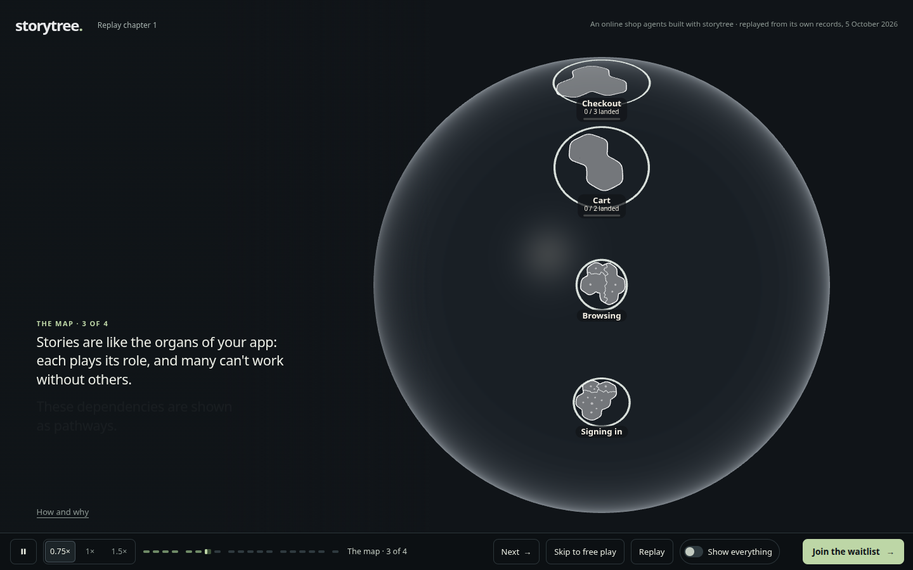
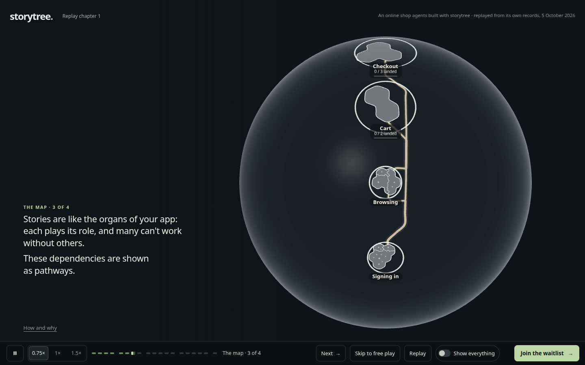

# Pathways draw into view

Increment `increment_8be62aa1abe9`, world contract 6.17, ADR-0891's map chapter step 3.

When a host shows a hidden roads surface, each pathway draws from its dependency end by physical distance over one rendered second. Roads and halos share the advancing front. An already-visible mount is unchanged; ordinary host updates retain the reveal; hiding and showing again restarts it. Recorded growth and live arrivals still withhold anything that has not arrived. Reduced motion shows the permitted roads immediately. Slow frames retain visible motion, so wall time can exceed one second.

The website already turns its roads surface on at step 3's second line. It now receives the reveal without a website edit. All implementation, capture scripts, generated website build and evidence stay inside `packages/forest-world`, the assigned track G write fence. The website build is deleted after the capture; no website source or evidence file is written.

## What the visitor sees

The four `1440-step3-*.png` pictures show the actual unchanged website with the engine change: no pathways as the second line arrives, advancing fronts, then the complete dependencies between Signing in, Browsing, Cart and Checkout. The sequence is intended to connect the spoken dependency to the road being drawn. Geometry, colour and framing retain the existing map's appearance.





`website-measurements.json` records the rendered fronts (0%, about 28%, about 50%, 100%). The capture holds demand frames for each picture; it is not a wall-time performance measurement. These are local Chromium/SwiftShader pictures, visually reviewed at 1440×900.

## Proof

`reveal.mjs` reuses the existing mounted globe capture. Its first-frame assertion was observed failing on the unchanged renderer, and the proof was committed before implementation. It now checks physical quarter/half/full lengths, matching halos, no restart on a host update, repeated reveal through the whole-exterior switch, long idle and slow frames, recorded arrival precedence and reduced motion. `measurements.json` contains those readings; `1440-start/quarter/half/complete.png` show its simple two-island scene. The underlying ribbon and road-window tests protect direction and shared segments.

The numbered `src/planet/road-reveal.test.ts` runs the same behavior assertions in Chromium on CI, at a smaller viewport with no pictures or coverage writes. The website capture verifies the real consumer separately.

From the checkout:

```sh
node --import tsx --test packages/forest-world/src/planet/road-reveal.test.ts
node packages/dev-loop/src/heavy-lock.mjs -- node --import tsx packages/forest-world/evidence/globe-exterior/reveal.mjs --retake
node packages/dev-loop/src/heavy-lock.mjs -- node --import tsx packages/forest-world/evidence/globe-exterior/website-reveal.mjs --retake
```

Omit `--retake` for pictures in the capture kit's scratch folder. The full renderer capture updates its measured source coverage; the CI `--smoke` path does not.
