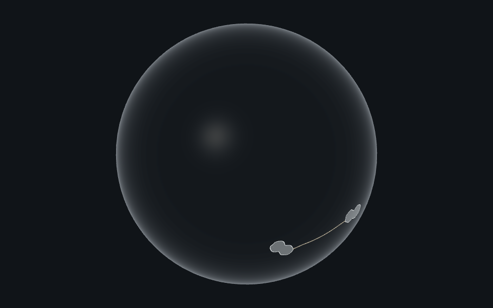
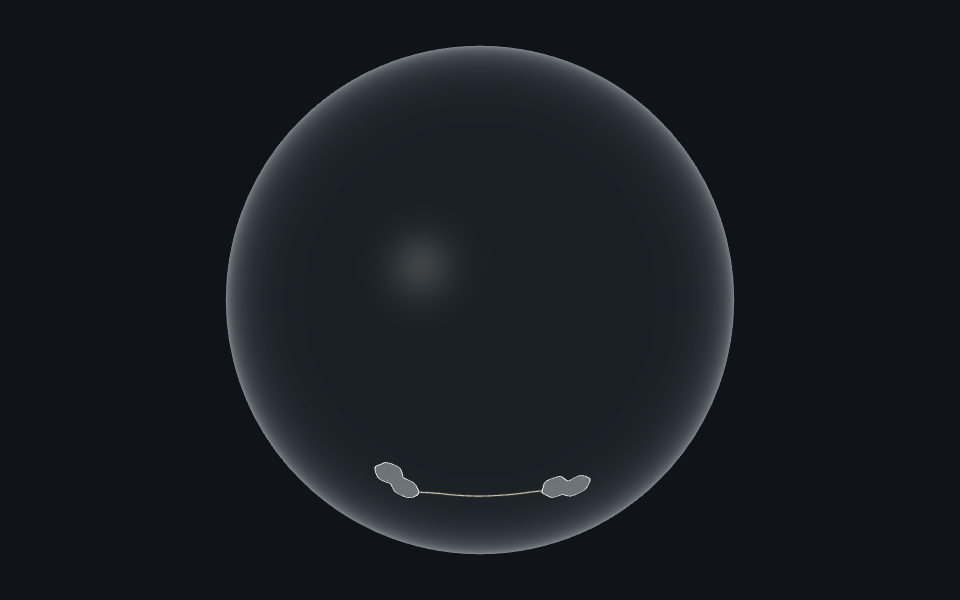

# The globe draws nothing off screen (World 6.10)

2026-10-03, increment_535071ecae92.

`capture.mjs` mounts the shipped `PlanetWorldCanvas` with a World-owned two-island globe between two
spacers taller than the viewport, so it starts below the fold. A child asks for a frame on every frame
(as the site's knowledge core and camera flights do), and the page counts the actual renderer's
`gl.render` calls through the canvas's children seam. Nothing is faked: the canvas, camera, scene and
renderer are the product's.

It measures frames drawn while mounted below the fold, scrolled away for two seconds, and with the
canvas's top edge exactly on the fold (touching, none of it visible); then that it draws again on
return with its camera, scene and clock kept; and that with `IntersectionObserver` deleted it draws
as before.

| Chromium 148, SwiftShader, 960×720 | Before (red) | After |
| --- | ---: | ---: |
| Frames drawn mounted below the fold | 90 | 0 |
| Frames drawn scrolled away | 15 in 2.5 s | 0 in 2.0 s |
| Frames drawn touching the fold | 55 in 2.5 s | 0 in 1.5 s |
| Draws again back on screen | yes | yes |
| Clock across the pause (clock s / page s) | 3.387 / 3.387 | 2.236 / 2.237 |
| Frames below the fold without IntersectionObserver | 157 | 113 |

Before is the unchanged engine with this capture (`red-measurements.json`); after is
`measurements.json`. The clock row matters because R3F's `setFrameloop` sets its clock back to zero:
without the kept clock a lane drawing on would restart when the globe returns. The node half of the
contract is `src/planet/paint-while-seen.test.ts`.



Run from the repository root after `pnpm install`, with Playwright Chromium installed, under the
machine's heavy-run lock:

```sh
node --input-type=module -e 'import { acquireHeavyLock } from "./packages/dev-loop/src/heavy-lock.mjs"; const release = await acquireHeavyLock({ root: process.cwd(), what: "World planet browser proof" }); try { await import("./packages/forest-world/evidence/planet/capture.mjs"); } finally { release(); }'
```

# The globe draws itself again when its drawing context comes back (World 6.15)

2026-10-06, increment_d0c8f5088868. On the old Windows laptop under heavy load the app's globe went
white and stayed so until a restart; whether that canvas lost its WebGL context there is not yet
diagnosed. This proves the contract-level half: what the globe does when a browser takes its context
away and hands it back.

`context-loss.mjs` mounts the same shipped globe still (`?idle`: nothing asks for frames), loses and
restores its context through `WEBGL_lose_context`, as a GPU reset does, and measures the share of the
globe's pixels that are not the page background, from Playwright screenshots. Then it does the same
with the globe scrolled away, and scrolls back.

| Chromium 148, SwiftShader, 960×720 | Before (red) | After |
| --- | ---: | ---: |
| Painted share, drawn | 0.353 | 0.353 |
| Painted share, context lost | 1.000 (white) | 1.000 (white) |
| Frames after restore, on screen | 0 | 1 |
| Painted share after restore, on screen | 0 (blank) | 0.353 |
| Frames after restore, off screen | 0 | 0 |
| Painted share back in view after an off-screen restore | 0.353 | 0.353 |

Before is the unchanged engine (`context-loss-red-measurements.json`); after is
`context-loss-measurements.json`. Three's renderer rebuilds its programs on restoration, but nothing
asked R3F for a frame, so a still globe stayed blank; the fix (`src/planet/redraw-on-restore.ts`) asks
for one. Off screen the ask is dropped and the 6.10 return draws it. Its node half is
`src/planet/redraw-on-restore.test.ts`.



Run as above, importing `context-loss.mjs` instead of `capture.mjs` (pass `--red` to write the
before file).
