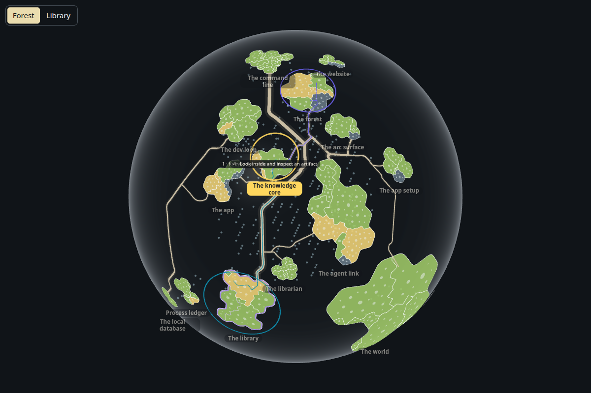
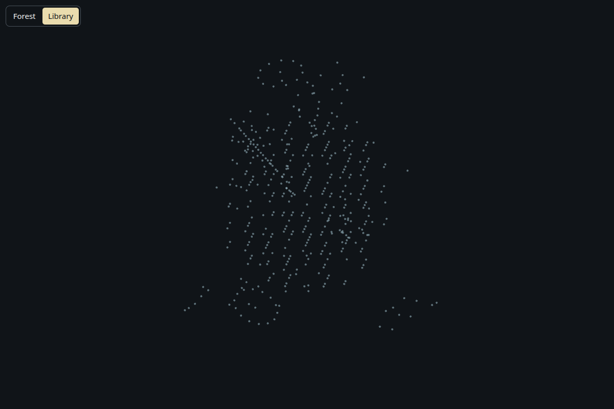
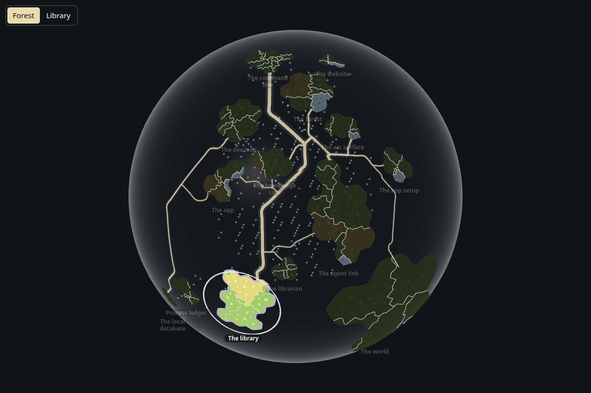
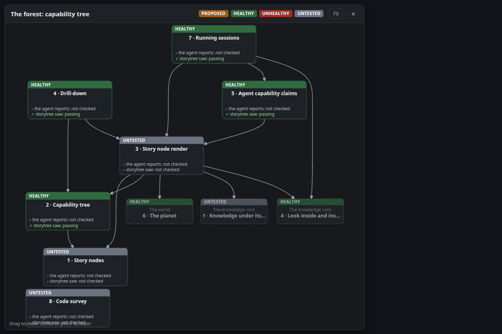

# Mounted Forest views, measured in the browser

`page.tsx` enters the Forest views through their public module (`src/view/index.ts`), as the desktop
renderer and the website mount them, and draws the saved code-rows reading
(`src/view/evidence/code-rows`). One labelled fixture session holds one capability; nothing is a
recording of live activity. Production source and appearance are unchanged.

`capture.mjs` runs three proofs in real Chromium (SwiftShader), each in its own page so its precise V8
coverage holds only what it executed:

- **forest 3.3, 3.4, 3.9, 3.10, 3.13 (globe):** the public module exports its surfaces; the globe
  opens in Forest with one nameplate per story; a click just above a facing nameplate selects that
  story and names its capabilities; Library hides every nameplate, clears the selection and keeps the
  canvas; Forest brings them back on the same canvas; Escape closes a selection; the card slot mounts
  and unmounts; disposing removes the canvas and empties its host.
- **forest 7.4 (sessions):** highlighting a session's held story lights that island's meshes
  (brightness above 1) and rings it, dims every other island, and leaving restores them all.
- **forest 4.11 (tree):** the capability tree's own space opens with the whole tree inside its frame,
  a drag moves it, Fit returns to the opening view, a clicked card is chosen, Escape and the close
  button close it, and stopping removes it.

Run from the checkout after `pnpm install`, with Playwright's Chromium installed:

```sh
node --import tsx packages/forest/evidence/mounted-views/capture.mjs
pnpm survey:coverage forest
```

Red checks change only the capture bundle: `--mutate=mode` (choosing a mode no longer renders it),
`--mutate=emphasis` (a held island is not brightened) and `--mutate=fit` (Fit does nothing). Each
fails its proof: the Library mode wait times out; `7.4 the held island is lit`; `4.11 Fit returns to
the whole tree`. A mutated run never records coverage, and a failed normal run withdraws these proofs'
previous inputs.

The public `@storytree/dev-loop/browser-coverage` recorder maps executed functions through the
bundle's source map and keeps only Forest's own `src` files (no World, Knowledge core or App source).
`survey-browser-coverage.json` keeps the three inputs; `browser-trace.json.gz` keeps the V8 functions,
generated source and source map. `measurements.json` holds each proof's results and measured files.

Paired live-plan `readCodeSurvey` with one saved plan, before and after:

| Scope | Counted lines | Unclaimed before | Unclaimed after |
| --- | ---: | ---: | ---: |
| Project | 70,047 | 982 | 168 |
| Forest | 4,284 | 814 | 0 |

Only six files change owner: `forest-view.tsx`, `index.ts`, `island-overlays.tsx` and
`planet-view.tsx` to Story node render (3); `session-emphasis.tsx` to Running sessions (7);
`tree-space.ts` to Drill-down (4). This allocates files by executed functions; it does not claim
every branch ran. `index.ts` is executed through its export getters, read by the page.








