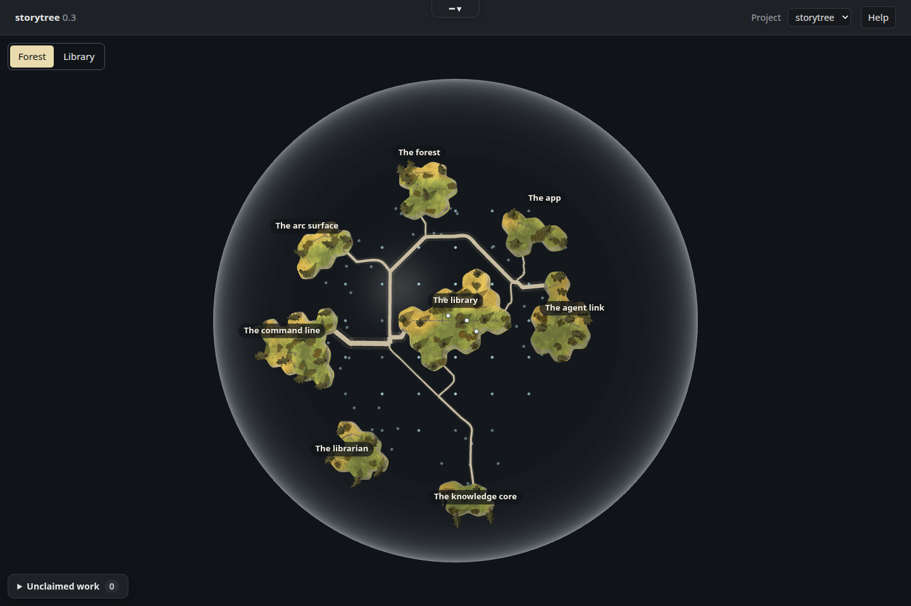

# Quiet claims

**Retired look (2026-10-02).** The quiet claim dots were replaced by session wisps (ADR-0736), and the wisps in turn by coast tints (see `../../src/view/evidence/session-tints`). Its capture script was deleted with this note, since there is nothing left on the page for it to check; the pictures and measurements below are the record of what landed then.

Forest capability 5 now draws an 8-pixel neutral dot at each claimed capability's tree.
The map carries no agent name, reason text or hooks warning. A hookless holder stays
unfaded past the quiet time; a holder with hook evidence still fades when idle.
Landing, release and session-end readings retain their existing behavior.



The dot is styled inside the forest package and does not intercept pointer input.
Its React key uses capability and session identity. Claim reasons stay in the agent log.
The existing agent-link setup check already reports every missing hook and its fix
(`verifyHooks`, `check_setup`, contract 8.5), so it needed no implementation change.

## Evidence

- Red commit: `f7c517400e7d7ae3ee361dd5cd644565b6aaa9ab`, committed and pushed before implementation.
- [Observed red](red.txt): the amended 5.1/5.3 readings failed on the label/warning
  fields; Chromium failed on the visible `Claude Code: … · hooks not running` text.
- [Green checks](green.txt): all four claims tests, `pnpm gate` (typecheck and all
  affected packages), and the existing setup contract 8.5 passed under the heavy-work lock.
  Guidance was NOT RUN because no generated role or live library note was edited.
- [Chromium measurements](capture.json): four visible, text-free, 8×8 round dots;
  the three hour-old hookless claims have opacity 1 and the hooked idle claim 0.45.
  The same neutral colour is used for all. Real polling removes a released dot.
  No page or console errors. Three.Clock and SwiftShader readback warnings are recorded.

The capture builds the actual desktop renderer, borrowing the earlier forest evidence
instrument's scene/navigation observation hooks. It reads the committed snapshot fixture
from `src/view/evidence/library-dots-clickable/seed.json` (the earlier read-only library
export), and adds four explicitly synthetic claims to its in-memory bridge. No live
library or real session activity was accessed. The first-run help panel is dismissed
using its normal Close help button before the screenshot. Chromium uses SwiftShader;
this is headless evidence, not the owner's Windows Electron smoke or taste acceptance.

Affected scope: desktop, agent-link, app, app-setup, arc-surface, cli, forest,
forest-world, knowledge-core, librarian, own, plus package boundaries. The local gate's
two Windows-only tests are skipped on Linux; CI runs those on Windows.

`pnpm test-ratio` (test lines, implementation lines, ratio):

```text
all                       41,736           33,057    1.26
```

## Reproduce

From the repository root; `PLANET_PLAYWRIGHT` and `PLANET_CHROMIUM` can override the
capture's Mint-local defaults:

```sh
flock /tmp/storytree-heavy.lock node packages/forest/evidence/quiet-claims/build.mjs
flock /tmp/storytree-heavy.lock node --import tsx packages/forest/evidence/quiet-claims/capture.mjs
flock /tmp/storytree-heavy.lock pnpm gate
```

The bundle stays in ignored `dist/`. The capture checks forest contracts 5.1–5.3 and
updates `quiet-claims.png` and `capture.json`.

## Supervisor handoff

[Library field patch and checklist](library-update/README.md) amends 5.1–5.3 and the
capability's story text. [Decision text](decision.md) supplies the owner's display
narrowing and the in-place ADR-0626 annotation. A story-author drafted the contract
changes before implementation; a librarian-curator checked all six old fields against
the supplied snapshot and found no blocking curation issue. Application, decision
numbering and increment closure remain with the laptop supervisor. No friction item
or owner redirection arose during this lane.
