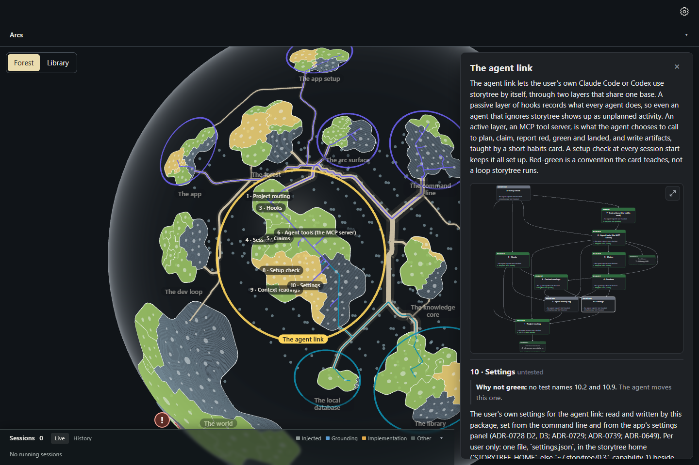
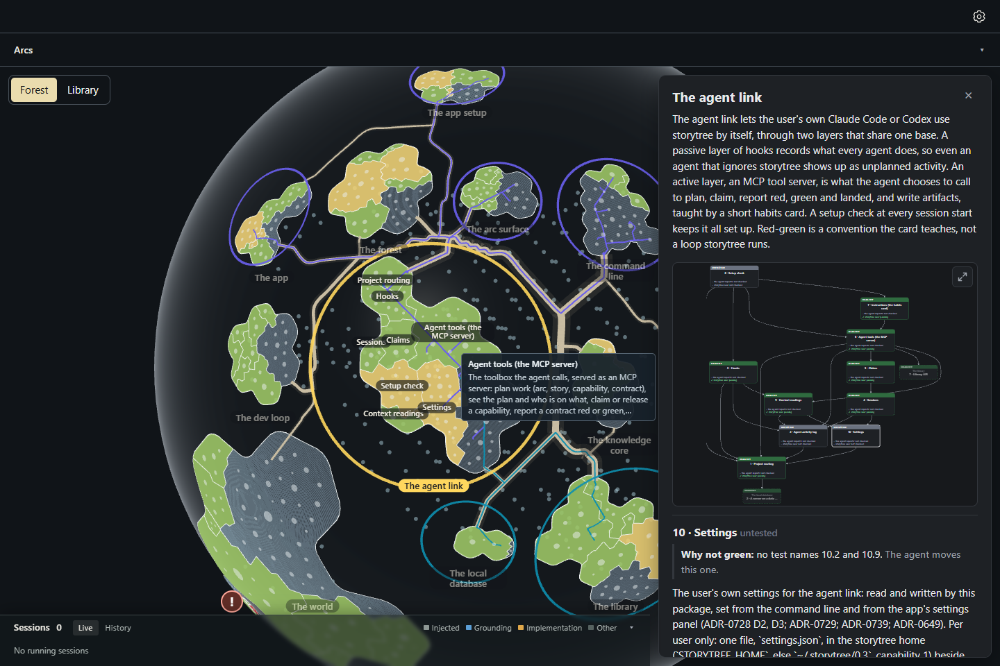

# Capability names on the globe read plainly (3.32)

Selecting a story puts a name on each of its capabilities' territories. Those names now drop the number the
plan gives each capability ("6 · Agent tools (the MCP server)" reads "Agent tools (the MCP server)"), and wrap
by word to two lines at most (120 px wide, an ellipsis past two lines). Pointing at a capability's territory
shows its full name and the first paragraph of its description, cut at four lines; later paragraphs are notes
for the agents who build it, and the story panel reads the whole description. The number stays in the record,
the story panel and the capability tree.

Captured on the actual desktop page with the rows capture's build, seed and survey
(`node ../rows/build.mjs <checkout> before|after`, then `node --import tsx capture.mjs <label> --retake`),
1440 × 960, headless Chromium on SwiftShader. Before is origin/main. The globe is turned to face The agent link
(a little left of the middle), its island is clicked and zoomed in on with six wheel steps, then the pointer
rests on Agent tools' territory, off its file circles.

| | before | after |
|---|---|---|
| capability names on show with a number | 8 of 8 | 0 of 8 |
| names longer than two lines | 0 | 0 ("Agent tools (the MCP server)" takes two) |
| pointing at Agent tools' territory | no tooltip | its name and description |

Two of The agent link's ten capabilities have no code of their own yet, so no territory and no name. Some
capability names still overlap one another on this small island (Sessions and Claims, Context readings and
Settings); the arc's bigger land and its overlap rule for names are the later increments that answer that.
Both builds log one page error from the capture's stand-in bridge (`reading 'choice'`), unchanged by this work.

| | before | after |
|---|---|---|
| The agent link selected |  |  |
| Pointing at Agent tools |  |  |
