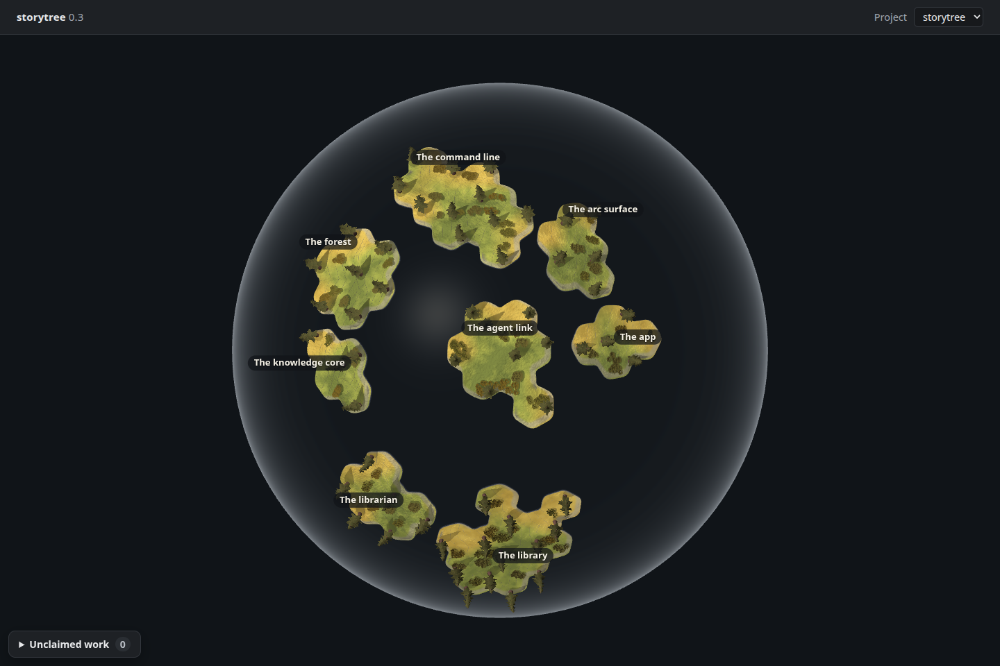

# The globe alone

Increment `0-3-planet-globe-only`, ADR-0655 D1/D2, 2026-09-27. The owner asked for
only the globe. The page mounts it directly, with no Forest or Look inside choice.
The flat canvas and knowledge-core implementation remain in their own packages.
Placement and the glass shell retain the preceding landing's drawing.

The landing's [acceptance capture](capture.mjs), adapted from `spike/globe-land`,
was committed and pushed as `641ecd3` before changing the page. It first confirmed
the seeded globe and smoke readout, then failed on the three offered views:
`["Globe", "Look inside", "Forest"]` ([red output](red.txt)). This is a bounded
browser acceptance for this landing, not a new test runner or a source-text test.
The existing unit tests continue to protect globe placement, failure turns and
near-side picking; the deferred core's own tests are outside this page change.

The same capture then runs against the changed page and checks the globe, shell,
all seeded story and capability counts, and an island click opening its drill-down.
The product's `forestDrawn` readout remains the smoke's input. The Electron smoke
already used it without changing views, so it needs no edit in this landing.

## Result

Renderer: **headless Chromium 148.0.7778.96, ANGLE / Vulkan SwiftShader Device
(Subzero)**. This is an untouched 1440 × 960 PNG, dark theme, device scale 1.
All eight seeded stories and 58 capability trees are present. No view choice is
offered, and clicking the front island opens its drill-down. The measurement frame
submits 50 draws and 542,512 triangles; these are counts, not frame timings.

[Capture data](capture.json) records no page, asset or shader errors. Existing
Three.Clock deprecation, drei nested-root cleanup and SwiftShader readback
warnings are recorded. The owner's laptop session supplies the Electron
`pnpm desktop:smoke` screenshot; this lane supplies the seeded Chromium proof.

## Capture recipe

The scratch `dist/build.mjs` and `dist/export.mjs` are adapted from
`spike/globe-land:apps/desktop/globe-land/`. The build bundles the actual desktop
renderer, HTML and CSS. Its only additions expose R3F state and the navigation
rotation to the capture; there are no placement, shell, light, input or drawing
substitutions. The export reads the isolated `pnpm seed:library` database through
`pageReads`, replacing Electron's read bridge with a snapshot of those same reads.
No reported health or activity is invented. This capture uses eight seeded stories
and 58 capability trees. The prior spike branch is never merged.

The scripts, bundle and snapshot remain in this worktree's ignored `dist/`.
`STORYTREE_HOME=/tmp/planet-lane-p-seed-home` selects the isolated database for
seeding and export. `PLANET_PLAYWRIGHT` names the installed playwright-core
`index.mjs`; `PLANET_CHROMIUM` names its cached Chromium headless-shell executable.
Run `node --import tsx capture.mjs` from this directory with those variables set. Seed, export,
Chromium and verification commands hold `/tmp/storytree-heavy.lock` with `flock`.
