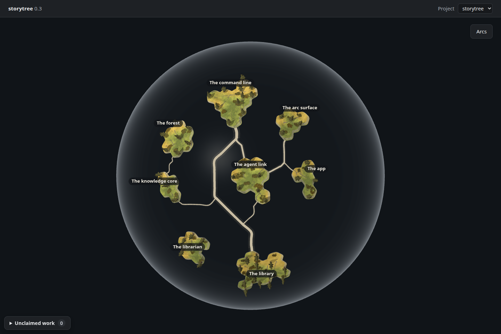
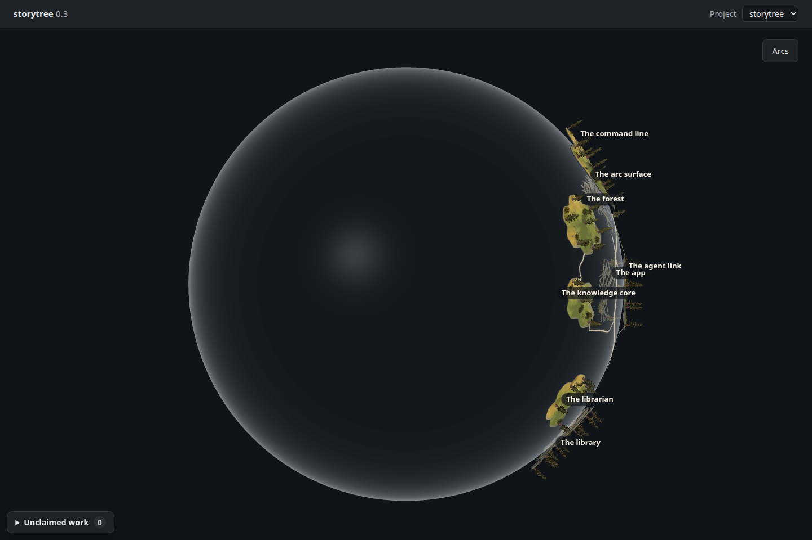

# The seeded planet's pathways

Increment `0-3-planet-pathways`, forest capability 3, ADR-0655 D3 / ADR-0169.
These are untouched 1440 × 960 captures of **0.3's own eight seeded stories and
58 capabilities**, using the real desktop page, current forest view and product
pathway renderer. The committed [seed](seed.json) records **75 within-story and
28 cross-story dependencies**. No supplementary links, health or activity were
added. The owner selected V2: a slightly raised, faintly lit ribbon over the glass,
docking at the actual shores, with the existing worn paths continuing inland.

| Opening view | Exact quarter turn |
| --- | --- |
|  |  |

Renderer: **headless Chromium 148.0.7778.96, ANGLE / Vulkan 1.3.0 SwiftShader
Device (Subzero)**; dark theme, device scale 1. These are browser captures;
the owner's laptop session supplies Electron smoke evidence.

[Front data](front.json) and [quarter-turn data](quarter-turn.json) record eight
plates, 58 trees and all 28 native cross-story links carried by 11 cross-island
ribbon meshes in both views. The measured turn is 89.99999999999997 degrees.
Both frames submit 83 draws and 541,682 triangles; these are counts, not timings.
There are no page, asset or shader errors. Existing Three.Clock deprecation,
drei nested-root cleanup and SwiftShader readback warnings are retained in the
JSON. The shell is present; neither a sea nor a placeholder core is drawn.

All eight story names remain visible in both views, checked through the opacity
of their enclosing HTML elements and inspected in the PNGs. At the quarter turn,
rim plates and trees still overlap the ribbons in the 3D view. Names stay over
that geometry; the agent-link and app name backgrounds touch at this angle, while
their text remains readable. The native seed has no claim or failure markers,
so these screenshots do not claim to exercise the failure-marker journey.
Appearance acceptance remains the owner's.

## Geometry measured from the same seed

The [measurement script](measure.mjs) calls the product `buildPlanetPathways`
with this seed and its actual historical places. It compares the resulting chain
IDs to every dependency in the seed, checks unique shared segments and continuous
junctions, and measures the full clipped coast edges on the sphere using the
spike's point-to-great-circle-arc distance. Coast overlaps are also checked.
[Full measurements](measurements.json).

| Measurement | Result |
| --- | ---: |
| Radius | 218 ground units |
| Capacity | 36 historical places; place 37 refused |
| Recorded links / continuous trail chains | 103 / 103 |
| Dropped links / duplicate chains | 0 / 0 |
| Within-island segments (including shore approaches) | 348 |
| Local segment width metadata, min / max | 1.50 / 5.10 |
| Cross-island shared segments | 11 |
| Cross-island ribbon widths, min / max | 1.50 / 4.624922 |
| Approved gap: four widths of a 22-link trunk | 19.285497 |
| Nearest coast gap, min / median / max | 27.424941 / 38.210121 / 49.182161 |

Segment width metadata follows the engine's `(1.2 + 1.8√usage) × 0.5`, where
usage counts the original capability links carried by a shared segment. Cross-island
ribbons render that physical width. Within islands, the look retains the existing
worn-path atlas material and fixed wear falloff; the local width metadata does not
change the atlas's visible stroke width. The fixed 19.285497-unit
placement envelope comes from the approved look's 22-link trunk; it does not
repack permanent places when today's graph changes. The current seed's widest
local segment carries 25 links, and its widest cross-island trunk carries 20.
The capacity sample and frozen directions are verified by product tests, not by
inventing more stories in these pictures. Clearance remains a bounded proof of
the measured island shapes, not a guarantee for unlimited future island growth.

## Reproduce

The instrument is adapted from `origin/spike/globe-pathways`; the spike branch
was never merged. [build.mjs](build.mjs) bundles the actual desktop renderer,
HTML and both stylesheets. Its only source additions expose R3F state and the
real page's rotation setter for observation. It substitutes no routes, radius,
materials, lighting or drawing. [capture.mjs](capture.mjs) replaces Electron's
read bridge with the committed snapshot. The capture does not open shelves;
those unused reads return empty lists. The snapshot retains the annotated tree,
actual story history needed for persistent places, and the actual activity log.
Bundles and the isolated Postgres cluster stay in ignored `dist/`.

From the repository root:

```sh
node packages/forest/src/view/evidence/planet-pathways/build.mjs
node packages/dev-loop/src/heavy-lock.mjs -- node --import tsx packages/forest/src/view/evidence/planet-pathways/measure.mjs
node packages/dev-loop/src/heavy-lock.mjs -- node --import tsx packages/forest/src/view/evidence/planet-pathways/capture.mjs
```

`PLANET_PLAYWRIGHT` and `PLANET_CHROMIUM` can override the installed Mint-box
paths recorded in the capture script. Append `front` or `quarter-turn` to capture
one view. Browser and HTTP server close in `finally`; export stops Postgres too.

To deliberately replace the snapshot, use a fresh isolated seed; its generated
IDs can produce different coast shapes. Keep the wrapper on gate/test's normal
`STORYTREE_HOME`; `env` applies the isolated home only to its child so the lock
stays shared:

```sh
CAPTURE_STORYTREE_HOME="$PWD/packages/forest/src/view/evidence/planet-pathways/dist/home"
node packages/dev-loop/src/heavy-lock.mjs -- env STORYTREE_HOME="$CAPTURE_STORYTREE_HOME" pnpm seed:library
node packages/dev-loop/src/heavy-lock.mjs -- env STORYTREE_HOME="$CAPTURE_STORYTREE_HOME" node --import tsx packages/forest/src/view/evidence/planet-pathways/export.mjs
```

[export.mjs](export.mjs) requires `STORYTREE_HOME`, reads through the same
`pageReads` API as Electron, and never edits the owner's live library.
