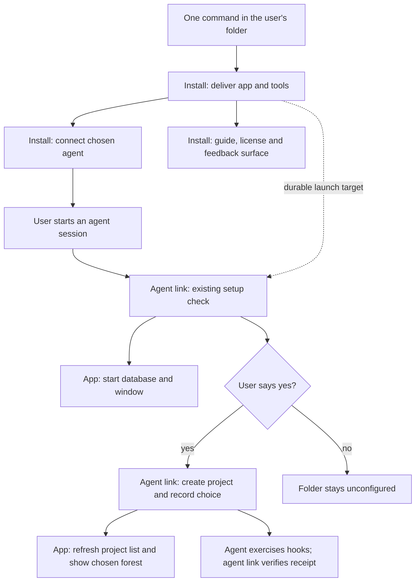

# Install and first run — capability-tree draft

Recommend a small installation story with five capabilities in `packages/install`: get a runnable release, connect the chosen agent, show the short guide, make the license available, and send feedback. The database, project consent, hooks, project switcher and updates already belong to other stories; the missing work is joining a fresh installation to them.

**DRAFT for the owner, not an approved tree or authority to build.** Prepared 2026-09-28 for the first-users arc (`arc_cfc7db517fae`), install increment (`increment_02c57ba72540`). All recommendations below are non-binding. This path is provisional under choice B; it creates neither a package nor a library record.

## What is settled, and what was found

The signed spec requires one command, Windows x64 and arm64, a separate 0.3 app, a 60-second guide, PolyForm Shield, an in-app feedback button, and the same route into a second project. Installing connects the tool server; the first agent session runs the existing setup check, which installs hooks, asks before creating a project, and has the agent exercise the hooks. Receipt of those events, not registration alone, verifies the connection. Storytree does not run the user's agent or pay for model calls. These are ADR-0625 D1–D3, D7–D9 and ADR-0626 D5, read in full.

Two parts of the brief have already moved. ADR-0657 ended the parking of users' projects and release updates; the snapshot and this checkout contain that work. The app remembers the last explicit project choice, including a successful setup yes, and refreshes its project list every three seconds even while empty. The old “opened before yes, list read once” defect is covered; it is not a new installation capability.

| What the user needs | Status | Evidence and remaining work |
|---|---|---|
| Session-start setup, project consent and hook checks | **Exists**, live acceptance incomplete | Agent-link capability 8 (`capability_199d7af33d32`); [setup](../agent-link/src/setup/setup.ts):63, [setup tools](../agent-link/src/tools/setup-tools.ts):47. Snapshot contracts 8.1–8.5 pass; the real two-harness walkthrough, 8.6, is still not checked. |
| `storytree setup install` | **Exists**, but is not the promised installer | [setup executable](../agent-link/src/bins/storytree-setup.ts):24 and [CLI delegation](../cli/src/families/doctor.ts):123 install hooks and the command; they neither download the app nor register its MCP server. Keep their meaning. |
| Deliver runnable agent tools | **Partly** | [buildBins](../agent-link/src/bins/build.ts):17 already bundles MCP, hooks, setup and CLI, with shared chunks, targeting Node 24. The [desktop build](../../apps/desktop/build.mjs) does not deliver this tool bundle or its Node runtime. This needs delivery, not a second server implementation. |
| Register MCP with Claude Code and/or Codex | **New** | No production MCP registration path found in agent-link setup or the installer; preserving an unrelated `mcp_servers` test fixture is not registration. |
| First-ever launch and visible window | **Partly** | [openStorytree](../agent-link/src/setup/open-storytree.ts):44 requires a previous launch record; otherwise it tells the user to open the app once. [recordLaunch](../../apps/desktop/src/main/main.ts):255 writes that record when the app runs. Delivery must establish a durable launch target or perform the initial app launch itself. The already-running path returns at :34–41 without showing a hidden window; first-run visibility needs an app/agent-link integration proof too. |
| First and second projects, app selection, separate forests | **Exists** | App capability 2 (`capability_3c5ed8b3ca70`); [refresh](../app/src/projects/follow.ts):21, [selection](../app/src/projects/selection.ts):20, [renderer](../../apps/desktop/src/renderer/renderer.ts):41. Setup's successful yes records the choice; a session in an existing project does not change it. |
| Windows desktop installer and release updates | **Exists**, acceptance partial | App Updates (`capability_6a0c1b26f586`); [package configuration](../../apps/desktop/package.json):29–75, [release workflow](../../.github/workflows/release.yml). Combined per-user NSIS installer for x64/arm64, plus an arm64 portable, separate 0.3 identity and GitHub release feed. Bundled Postgres is x64 on both. [Acceptance limits](../../apps/desktop/README.md):25–31: x64 install smoke exists; arm64 installation and a real installed-release-to-next-release update still need Windows proof. Artifacts are currently unsigned. |
| Owner's app follows merged main | **Exists** | [app:follow-main](../../scripts/follow-main.mjs), [follow-main implementation](../app/src/updates/follow-main.ts). This is a development installation, not the first-user distribution route. |
| Short first-run guide | **Partly** | [Empty-app instruction](../../apps/desktop/src/view/view.ts):125 already tells users to start an agent and say yes; no complete 60-second guide was found. |
| License | **Exists in source; delivery partly established** | [LICENSE](../../LICENSE), [README](../../README.md) and root metadata carry PolyForm Shield 1.0.0. The desktop file/resource list does not explicitly include this file; no packaged artifact was inspected, so absence from a delivered installer is not asserted. |
| Send feedback | **New** | No general feedback action found in desktop/app/agent-link code; [app chrome](../../apps/desktop/src/renderer/index.html) has no such button. |
| macOS CI | **Exists** | [CI matrix](../../.github/workflows/ci.yml):43 already includes Linux, macOS and Windows. Mac distribution remains deferred by the signed spec. |

“Exists” here means source and/or snapshot contract evidence, not a fresh acceptance run. This lane ran no app, installer or paid agent session and did not verify live release publication.

## Story boundary

**Story one-liner:** A new Windows user gets from one command in a project folder to a working Storytree connection they can understand and ask for help with.

**B1 — Own installation story and package.** Put installation orchestration, agent registration, guide/license views and the feedback action in `packages/install`; mount its view through the desktop frame and call its API through the CLI. This follows the signed spec's installation story and keeps user-facing installation behaviour together, at the cost of one new package and explicit handoffs.

**B2 — Extend the existing stories.** Put distribution/startup work with the app and connection work with agent-link, with the guide and feedback exposed by agent-link's own surface. This avoids another story but broadens “agent link” into human support and spreads the single first-run journey across owners; it cannot mean placing those screens and their logic directly in the thin desktop frame.

**Non-binding recommendation: B1.** ADR-0649 requires either shape to keep story logic in its owning package. The app retains lifecycle, project choice and updates; agent-link retains setup, hook registration, consent and verification. Any defect in those behaviours amends their existing capabilities. Installation calls public seams, not neighbouring source files. The app mounts install's surface; install must not import the app back and create a dependency cycle.

Think of installation as the office reception desk: it gets the visitor a working pass and directs them to their room; the existing facilities team opens the building, and the existing room directory keeps the room list. The analogy breaks at consent: starting the software does not let reception silently create a project or choose one for its owner.

## Draft capability tree

The descriptions below are each two sentences. Contract numbers are draft-local, not new library IDs; each line names an observable behaviour rather than testing prose or repository structure. Status compares the entire proposed capability with today's implementation.

### 1 · Get Storytree — partly

One command gets the Windows app and the tools its agent needs onto the computer, ready to run without a Storytree checkout. Running it again reuses a working installation or explains what failed and how to retry.

**Owns:** acquisition and durable placement of the existing app/tool builds, plus the first-launch handoff. **Depends on:** app Lifecycle and Updates; agent-link's existing command bundle. **Choices:** P, R, W, S, N.

- **1.1** On a clean Windows x64 machine and an arm64 machine with the chosen prerequisites, the command delivers the matching app and a runnable MCP/hook/setup/CLI bundle, including its imported chunks.
- **1.2** The first-run journey displays the app and reaches its database both without a previous `app.json` and when the app is already running with its window hidden, without a separate manual “open once” step.
- **1.3** Repeating the command in the same or a second folder reuses the installation without creating a project, replacing user settings or modifying 0.2's installation/data.
- **1.4** An interrupted or refused installation reports the failed step and a retry action without announcing a working connection or replacing the last usable installation.
- **1.5** After the app takes an ordinary release update, the next agent session still starts compatible tools from a durable location, without rebuilding a checkout or relying on an npm cache directory.
- **1.6** The installed command is invocable from a fresh Windows terminal; an existing unrelated `storytree` command is preserved and the conflict is named.

**Proof:** clean installed-artifact runs on both architectures, including a path with spaces, repeat/retry, no prior launch record, and one real release update. Use existing lifecycle/update tests for their behaviours; add only missing delivery proofs. A bootstrap may launch the app to let it write its own record, as ADR-0626 D5 allows, but must not implement a second database starter or create a project.

### 2 · Connect an agent — new

The user chooses Claude Code, Codex or both, and Storytree connects its installed tools to those agents. The next session uses the existing setup check to ask about the project and show whether the connection actually works.

**Owns:** selecting and registering the installed MCP launch command, and undoing that registration. **Depends on:** 1, agent-link Agent tools and Setup check. **Choice:** W affects prerequisites; this is not a new hook installer.

- **2.1** Choosing either harness or both registers the installed tool server per user for the chosen harnesses, preserving other servers, settings and any existing 0.2 entry.
- **2.2** A new agent session in the invoking folder, and later in another folder, reaches that folder's existing setup check rather than a fixed installer directory or a hard-coded project.
- **2.3** Repeating registration leaves one effective Storytree entry per chosen harness; an incompatible existing entry is explained instead of silently overwritten.
- **2.4** A missing harness or invalid settings file gets a specific recovery action and no success claim for that harness; a successful registration for the other harness is reported separately.
- **2.5** Disconnecting one harness preserves the other's working connection and shared command; removing all connections cleans up only Storytree-owned registrations/hooks/command while preserving project libraries and unrelated settings.
- **2.6** The installation result distinguishes “tools connected” from “hooks verified”; a missing hook remains named by the existing setup check until its event is received.

**Proof:** registration/repeat/removal against real settings shapes in temporary homes, followed by the already-owned agent-link 8.6 real Claude Code and Codex walkthrough. The setup check currently registers hooks for detected harness homes; selecting MCP connections does not silently change that accepted behaviour. Its current `setup remove` removes both harnesses' hooks and the shared command, so disconnecting one must not blindly invoke it; any scoped hook-removal API belongs to agent-link. Confirm exact supported harness commands/configuration during implementation.

### 3 · First-run guide — partly

A short guide tells the user what to do next, what Storytree will ask, and what a working first project looks like. They can reopen it when adding another project or recovering from a connection problem.

**Owns:** human guidance and its entry point, not agent onboarding logic. **Depends on:** 1 and 2 for executable actions, with app project and agent-link diagnostic readings supplied through their existing owners. **Choice:** G.

- **3.1** Completing installation offers the guide without requiring a project to exist, and its chosen entry point opens it again later.
- **3.2** From the guide, the user can reach the existing setup diagnostics and its recovery action when the connection is incomplete.
- **3.3** Following the guide in two empty folders produces two separate projects only after two explicit yes answers, with the second appearing in the running app on its normal refresh and both forests selectable.

**Proof:** a first-user walkthrough and the guide's actual navigation/actions. “60 seconds” is the size of the explanation, not a promise that downloads, database creation or human approval finish in a minute; review readability directly, without a prose/word-count test. Content must cover starting the selected agent in the folder, project consent, real hook verification and any harness approval, first visible work, second project, and where to ask for help. Existing connection/project contracts supply those behaviours; do not duplicate their tests under the guide.

### 4 · Read the license — partly

The license travels with the installed product and is available without visiting the source repository. The user can open it from the same help surface they use after installation.

**Owns:** accessible delivery of the already chosen license. **Depends on:** 1 and the help surface; no new license choice.

- **4.1** An installed user can open the shipped PolyForm Shield 1.0.0 license while offline, without a source checkout.
- **4.2** Every offered distribution path carries that same license and the help action continues to open it after an update.

**Proof:** installed-artifact access and navigation, not a test of legal wording. ADR-0617 already settles the license and the “source-available” description; this tree changes neither and adds no license-acceptance ceremony.

### 5 · Send feedback — new

A button in the app lets the user describe a problem or suggestion and reach the chosen feedback destination. They see what they are sending and choose to submit it themselves.

**Owns:** the action and any composer, mounted by the app's frame. **Depends on:** the app's surface host; it must work before any project is created. **Choice:** F; the contracts below take the selected destination as a parameter.

- **5.1** Send feedback is available both with no project and while viewing either project's forest, and opens the owner-selected destination.
- **5.2** Before submission the user can review and edit their message; the action sends no project contents, paths, transcripts or logs automatically.
- **5.3** Failure to open an external draft offers a retry or copy of the prepared draft; if F2 supplies an in-app composer, cancellation sends nothing and a submission failure preserves its text for retry.
- **5.4** For a browser/email handoff the app says it opened a draft, not that feedback was received; for an in-app form it says sent only after the destination acknowledges receipt.

**Proof:** button-to-destination behaviour and observable cancellation/failure using a fake external opener/transport; a real destination check waits for the owner's chosen repository/inbox/service. After a browser/email handoff, the destination owns editing, cancellation and submission recovery; Storytree cannot observe those outcomes or preserve text typed there. No background telemetry or silent upload is part of this capability.

## Choices for the owner

B above decides the boundary. These choices select the implementation and explicitly name proposed omissions; approving the tree in general must not silently approve them (ADR-0633). An option that changes existing scope says so.

| Choice | Options, with both sides | Non-binding recommendation |
|---|---|---|
| **P — How the one command reaches the installer** | **P1:** npm bootstrap, e.g. `npx <approved-name> init`, downloads/uses the existing NSIS installation: familiar to Node users, but requires Node/npm before that command can run and introduces an npm release. **P2:** a published PowerShell bootstrap invokes the same NSIS installation: Windows users need no npm bootstrap prerequisite, but receive a longer command and another versioned delivery artifact to maintain, with signing governed by S. **P3:** both wrappers around one installation API: widest choice, twice the entry-path acceptance work. A download-and-double-click NSIS alone would omit the signed one-command requirement; a separate npm-only app distribution would duplicate the working update route. | **P2**, paired with R1, for the Windows-first audience without assuming a developer toolchain. Keep NSIS/update ownership where it is. P1 is reasonable if the first cohort already has Node/npm. |
| **R — Runtime for installed agent tools** | **R1:** deliver a managed Node runtime alongside the existing Node-24-targeted tool bundle: self-contained agent startup, but larger downloads and another runtime to update. **R2:** require a supported user-installed Node: less distribution work, but installation/upgrade/removal of that Node can break hooks and MCP, so the prerequisite and recovery must be explicit. Electron being installed does not by itself establish a usable tool-server runtime. | **R1**; verify the chosen runtime on both architectures. Under P1, bundling the tool runtime does not remove the separate Node/npm prerequisite for executing `npx`. |
| **G — Where the 60-second guide lives** | **G1:** an in-app help view, linked from the install result, with a short README pointer: available beside the user's empty forest and offline, but needs a mounted view. **G2:** a README guide opened from the app/install result: cheaper and usable before installation, but sends users out of the app and needs an offline delivered copy if offline help is promised. | **G1**, one guide with pointers rather than two independently maintained guides. |
| **F — Where feedback goes** | **F1:** open a draft GitHub issue from the in-app button: uses the existing repository workflow, but needs a GitHub account to submit and the user must understand that a public issue is public. **F2:** an in-app form to an owner-selected receiver: stays in the app and can avoid GitHub accounts, but requires a receiver, failure handling and a separate decision about operating that service. **F3:** open an email draft to an owner-approved inbox: familiar and private to that inbox, but depends on a configured mail handler and gives no receipt inside Storytree. | **F1** for the trusted circle if account/publicness are acceptable; otherwise **F3** with an inbox supplied by the owner. F2 is not authorization to add hosted accounts or services. |
| **N — Reserve the npm name now** | **N1:** authorize reservation/publication under an owner-controlled npm account after checking availability: protects the intended spelling, but is an outward-facing action with account/maintenance obligations. **N2:** defer it: no registry commitment, but the name may become unavailable and P1/P3 cannot ship until an approved name exists. | **N2** with P2; **N1** if P1/P3 is chosen. “Free on 2026-09-26” is historical evidence, not a present availability claim. This lane reserves nothing. |
| **S — Windows signing before the first circle** | **S1:** retain the currently unsigned distribution for the trusted-circle release: no new certificate/spend gate, but users may encounter Windows trust prompts, which the guide must represent honestly. **S2:** sign before users receive it: improves publisher identification, but needs the owner's identity/certificate arrangement and release integration; it does not guarantee no warning. | **S1** for the first circle if the owner accepts that experience; S2 is a separate owner-authorized release task. |
| **W — 0.2's bare-machine provisioner** | **W1:** install Storytree and its chosen managed runtime only; require an already installed/signed-in supported agent, keep doctor checks and precise prerequisite instructions, and leave out 0.2's automatic Git/Node/pnpm/gh/agent installation, GitHub sign-in and source-clone steps. This matches a packaged product beside the user's own agent, but gives up 0.2's bare-machine convenience. **W2:** bring those provisioner behaviours, rewritten for 0.3 where still applicable: preserves that convenience, but broadens first run into machine/account setup and adds substantial installation/recovery testing. | **W1**, explicitly an owner choice because adoption is unmeasurable. Node under R1 is product runtime delivery, not a general developer-machine installer. The existing warning that `gh` is missing/signed out stays; this does not silently remove merge-claim release behaviour. |
| **Q — 0.2's automatic repair guide** | **Q1:** retain the already built setup/doctor diagnostics and safe rerun; do not bring the separate automatic `guide --fix` repair loop. Smaller recovery surface, but complex machine repairs remain guided actions. **Q2:** bring the repair-loop behaviour: more automatic recovery, but broader machine mutations and a new independently provable scope. | **Q1**; the doctor lasted, the repair loop's use is unmeasurable. This is a named proposed omission, not a measured retirement. |
| **D — Developer onboarding documents** | **D1:** keep developer-machine/Codex onboarding as a separate 0.3 developer-documentation follow-up, retaining 0.2's read-only guide as evidence meanwhile; do not treat the short user guide as its replacement. Keeps this product journey small, but leaves the 0.3 developer port for another scoped task. **D2:** port those developer guides in this increment too: a fuller first contributor experience, but mixes building Storytree with using it and adds another walkthrough. | **D1**; the supervisor must record the named deferral if accepted. The machine guide had real use, so it cannot silently disappear. |

The npm option deliberately installs durable tools rather than registering an executable inside the temporary npm cache: [npm's npx documentation](https://docs.npmjs.com/cli/v11/commands/npx/) describes fetching absent packages into that cache. This is an implementation inference from the documented execution model, not a promise about any current published Storytree package.

**One release question for the first-users handoff (V):** the carried arc still says “0.1.0-series”, while [desktop metadata](../../apps/desktop/package.json):4 and [release policy](../../apps/desktop/README.md):16–23 currently produce `0.3.<main-count>`. **V1** keep the existing feed numbering and have the supervisor reconcile the old invitation text: no version rollback, but changes that old expectation; **V2** require the old 0.1.0 label: preserves the wording but needs an app-owned release-policy decision because the updater refuses older releases. **Non-binding recommendation: V1.** No version is changed here.

## What lasted in 0.2

Measured before recommending carryovers, under ADR-0639. Window: 2026-08-15 through 2026-09-26 inclusive. Store reads used the 0.2 bookkeeping CLI; code/git reads used `/home/mickh/code/Storytree`. Transcript survey included both `~/.claude/projects/**/*.jsonl` (including every `subagents/` subtree) and `~/.codex/sessions/**/*.jsonl`.

**Coverage:** 637 local transcript files overall; 551 contain events in the window, including 135 subagent files, 235,055 events and 18,916 extracted shell calls. Available events begin August 23: August 15–22 and laptop transcripts are missing. Command invocations are separated from mentions, reads and source edits. Git maintenance counts use `git log --no-merges --since=2026-08-15T00:00:00 --until=2026-09-26T23:59:59 -- <paths>`; they are not adoption counts.

| Machinery | Counts and evidence | Treatment in this draft |
|---|---|---|
| Windows provisioner (`infra/install.ps1`) | 4 path commits; 19 transcript shell-command mentions inspected, 0 actual installer executions locally. Store `explorer-onboarding-arc` has 18 closed entries before the window; 04/15 record installer delivery/publication, not subsequent use. | **Unmeasurable.** W names every proposed reduction. The old installer runs nine steps through Git, Node, pnpm, gh/auth, cloning, dependency install, Claude Code and optional Codex, then doctor and a source-run desktop; it does not register MCP. |
| Doctor | 4 path commits; **at least 19 actual invocations in 11 files on 6 dates**: Aug 23/24/28, Sep 7/8/23; one is a subagent call. | **Lasted.** Preserve the behaviour already in 0.3; do not copy its old implementation. |
| Automatic repair (`guide.ts`, `guide-loop.ts`) | 1 path commit; 2 shell mentions, 1 actual `guide help` invocation on Aug 24, 0 `guide --fix` invocations found. Store runtime-use count not established. | **Unmeasurable.** Q is the explicit choice; a help call proves no repair outcome. |
| Machine onboarding / Codex onboarding docs | Machine guide: 11 commits and an explicitly scored real Linux provision on Aug 24. Codex guide: 2 commits, Aug 28/Sep 8. Repeated adoption is unmeasurable. | **Real machine-guide use; longevity unmeasurable.** D preserves this as a named port/deferral, distinct from the product's short guide. |
| Linux installer | 2 path-touching commits; ADR-0432 records 522 lines, a two-day lifetime, **0 executions and 0 publications**, and retirement. | **Not brought: did not last.** Independently, Linux is outside this Windows distribution scope. |
| Studio inline comments as feedback | ADR-0425 measured **0 mounted create/resolve/delete callers** on Aug 23 and recorded non-adoption; the visible surface was retired, with retained substrate reserved for multiplayer. `apps/studio/src/components/ReviewEditor.tsx`:23–33 confirms the current retirement. | **Not brought as feedback: did not last.** Retained components do not establish a working general send-feedback path. |
| Packaged desktop updates / short product guide / general feedback button | 0.2 documentation defers packaged binaries and an auto-update feed; no builder-config path commits found. No shipped general feedback button or 60-second product guide found in the surveyed desktop/studio source. | No shipped legacy machinery established to port. Use 0.3's existing update implementation; the short guide and general feedback are new requirements from the signed spec. This does not assert universal zero use from incomplete transcripts. |

Store coverage is historical/offline projection evidence, not runtime telemetry. No valid aggregate runtime-use count was obtained from it; absence here is not proof of non-use. One attempted increment count used an unvalidated field and was discarded rather than presented as zero.

Recheckable measurement anchors (local to the Mint box):

- Installer scope, repeatable steps and end actions: `/home/mickh/code/Storytree/infra/install.ps1`:3, 146, 188, 222; manual distribution rather than automatic publication: `infra/dist-bucket.md`:55.
- Doctor, August 23: `/home/mickh/.claude/projects/-home-mickh-code/11625edd-f07d-49e5-b05e-acd3d1366a78.jsonl`:234.
- Doctor inside a subagent, September 7: `/home/mickh/.claude/projects/-home-mickh-code-Storytree--claude-worktrees-bloom/186f9eac-fba6-454a-9cfe-f8abf49954ce/subagents/agent-a7526b6ad12019946.jsonl`:368.
- Doctor, September 23: `/home/mickh/.claude/projects/-home-mickh-code-Storytree--claude-worktrees-laneF/0d9e7949-b0b1-400a-964a-5be1f1aa34c2.jsonl`:1000.
- Guide help only, August 24: `/home/mickh/.claude/projects/-home-mickh-code-Storytree--claude-worktrees-amazing-hugle-7e1550/89e85bb6-147e-42c5-8fdc-69c0f1da553b.jsonl`:232.

## Build size and proof before first users

**Rough size: four build lanes plus one integration/acceptance lane**, assuming B1, a single bootstrap, a link/email feedback destination and no legacy provisioner/repair port. Agree the installed tool/launch interface and app mount first; lanes 1–4 can then develop against those seams in parallel with distinct file ownership.

| Lane | Owns | Dependency and finish |
|---|---|---|
| 1 · Delivery | Install package's acquisition/runtime/launch modules; app-owned packaging adapter changes by agreement | Capability 1 and its distribution of 4's license; depends on chosen P/R/S/N. Keeps Updates in the app, with no second updater. |
| 2 · Agent connection | Install package's harness-registration modules | Capability 2; can work against the agreed installed-command interface while lane 1 builds artifacts. Any change to setup/hook logic is a separately claimed agent-link correction. |
| 3 · Help | Install package's guide and license surface/content | Capabilities 3–4; can start after choices and the mount interface; validates final install commands after lanes 1–2. |
| 4 · Feedback | Install package's feedback action/view | Capability 5; independent once F and its destination are chosen. F2 needs an additional receiver/service scope and may add a lane. |
| Integration · Clean Windows journey | Thin CLI/app wiring, installed-artifact proof and fixes in their proper owners | Joins all four; no parallel ownership of the same app mount/packaging files. Runs on x64 and arm64, with both harnesses exercised, and the existing real update acceptance. |

The final walkthrough starts with no Storytree installation, no launch record and no project; runs the chosen command; starts each supported harness; declines setup once and confirms no project; accepts; sees the existing hook verification complete; watches the agent plan/claim/report red, green and landed; then repeats in a second folder while the app stays open. Repeat the first-run handoff with the app already running in its tray and require a visible project window; any missing show-window behaviour is an app/agent-link correction. It also opens the guide/license and exercises feedback without actually sending an unsolicited report. A fresh terminal and an app update must leave the command, hooks and server usable. Check a pre-existing 0.2 installation/settings survive. The existing agent-link 8.6 paid live proof and Windows arm64/update acceptance remain named obligations, not evidence this drafting lane supplied.

Use focused red-to-green tests only for missing product behaviour, then the repository's required typecheck and scoped test run in the build lanes. There is no reason to add tests of this draft, license prose or the tree's shape. Choosing both bootstrap routes adds acceptance work; choosing W2 or Q2 needs another scoped lane before estimating it as part of this unit.

## Evidence and supervisor handoff

Surveyed checkout: `a756a059bfa0b10da2ecede24c47c3d27e63d35b` on `spike/install-tree`. Snapshot: `/home/mickh/storytree-lanes/snapshots/2026-09-27T14-03-38-576Z.json`, taken `2026-09-27T14:03:38.710Z`, SHA-256 `68680e42e0e15c43c7210f653297093cf8d0820273664e21334ced4a145835af`. Restored only to a temporary home (1,400 records, 7,149 history entries) and read with 0.3's CLI. Health statements are snapshot statements, not the laptop's current state.

Read precedents: ADR-0625/0626 in full; ADR-0634 (app jobs, two-sentence descriptions and first-run boundary), ADR-0638 (arc-surface tree/contracts/dependencies), ADR-0649 (package boundaries), ADR-0633/0639 (named cuts and measurement), ADR-0617 (license), and ADR-0657 (users' projects and updates unparked). These numbers identify 0.2's decision records. Also read the snapshot's app, agent-link and forest trees, including app project contracts 2.2–2.4 and Updates 4.4–4.6. The common brief's `stories/forest.md` and `decisions/minimal-viable-tdd.md` are no longer canonical files; the library now holds those subjects.

The supervisor should turn B/P/R/G/F/N/S/W/Q/D into the capability-tree review and carry V to the first-users release handoff. Recheck the current laptop library before authoring or claiming anything; amend existing app/agent-link contracts only where a real gap remains. Preserve D's developer-documentation residue if deferred, and the outstanding real harness/arm64/update proofs. Existing owner-decided exclusions (Mac packaging, hosted collaboration, old product build machinery) are not reopened here.

This lane writes no question, decision, claim, closure or plan record. It delivers this draft by commit/push only, with no pull request or implementation.
