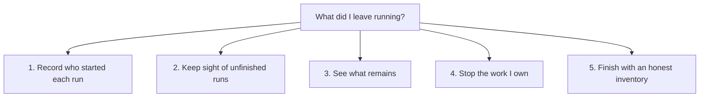

# Draft: What did I leave running?

Approve a new story in `packages/own`: **a session can finish its work without leaving an owned process running unnoticed.** The proposed tree preserves 0.2's inventory, all-session attribution, verified stopping and dead-record clearing, and adds coverage for timed-out requests and background launches.

This is a drafting artifact for the laptop supervisor, not an accepted plan. It covers steps 1 and the draft for step 2 of “What did I leave running?” (`increment_5df7e7b316ab`), on “Bring more of 0.2 into the 0.3 MVP” (`arc_197b9208adfc`). No story, capability, contract, decision or question has been written into either live library. No implementation is authorised by approving this file as a useful draft: the supervisor must put the tree and its named choices to the owner.

Think of an office sign-out board: each job names the person who started it, and leaving means checking that person's remaining jobs. The analogy breaks when a job hires another worker or its telephone connection times out; the computer must check the workers themselves, rather than trusting that the call ended.

## Already decided; still to approve

- The owner selected the story on 2026-09-28 (ADR-0716, as quoted in the lane brief); it needs a new package and an approved capability tree before code.
- Bring the behavior whole, rebuilding it rather than copying code (ADR-0633); measure lasting use before proposing exclusions (ADR-0639); keep the story's logic in its own package (ADR-0649).
- Windows-first delivery and MCP tools for agents already stand (ADR-0633 D4). The choices below concern implementation coverage and retaining the human CLI alongside MCP, not whether to reverse those decisions.
- The older decision that cut `own` because 0.3 launched no jobs (ADR-0636 D2 b7) is overtaken for this story by the supplied ADR-0716 direction. The supervisor should check that the live decision log says so; this lane cannot inspect its current state.
- The tree below assumes the recommendations in choices A–H. Each is **non-binding**. A different answer changes the affected contracts before building; whole-document approval must not silently approve a cut.

## Proposed tree

Status describes today's 0.3 behavior, not 0.2 precedent or future test health: **exists** means an existing prerequisite, **partly** means that a prerequisite exists but the process behavior does not, and **new** means new product behavior. Existing sessions, claims and activity are listed separately below so they are not authored a second time.

### 1 · Record who started each run — partly

Every tracked run names the session that started it and the computer where it runs. Background shells and detached servers keep that owner after the request or launcher that started them has gone away.

Foundation: the whole-behavior port directed by ADR-0716, with ownership choices A and D. Prerequisite: the agent link's existing caller identity; no prerequisite on claims or a live library connection.

- **1.1 — partly:** A registered run keeps its resolved session, machine, project when known, process identity, command, folder and start time.
- **1.2 — new:** Two sessions in the same checkout keep separate process ownership, including when their command text is identical.
- **1.3 — new:** A detached child registered at launch remains attributed after its launcher exits.
- **1.4 — new:** A background command launched through the supported Claude Code, Codex or manual launch path has a durable ownership record before its launch is reported as tracked.
- **1.5 — new:** A launch without a usable owner or successful registration reports that gap instead of assigning an owner by folder, start time or command text.

“Supported launch path” is resolved by A: the proposed common path is an owned command launcher, with a trustworthy automatic bridge where available; existing command activity lines alone do not satisfy 1.4. No free-form PID adoption is implied.

### 2 · Keep sight of unfinished runs — new

A request ending or timing out does not mean its work has stopped. Each run stays visible until the computer confirms it has ended, with anything it cannot establish shown as uncertain.

Foundation: ADR-0716's timeout fix and 0.2's live/unknown/gone distinction. Depends on capability 1.

- **2.1 — new:** A surviving process or owned child remains visible after a request timeout, labelling the request as timed out only when the caller supplied that evidence; otherwise its request outcome is unknown.
- **2.2 — new:** Ending a turn, restarting or ending a session, releasing a claim, or passing twelve hours does not erase a surviving process record.
- **2.3 — new:** A probe reports live, gone or unknown; unknown is never treated as confirmed dead.
- **2.4 — new:** If a recorded PID has been reused, the replacement process is neither attributed to the old run nor signalled under its authority.
- **2.5 — new:** Unreadable records and failed inventory reads remain visible as observation gaps alongside the records that could be read.

The process identity in 2.4 must distinguish one lifetime from a later reuse of its PID, using platform evidence obtained at launch and rechecked before stopping. This is a proposed correction to 0.2's documented PID-only limitation, not an existing guarantee.

### 3 · See what remains — partly

The session can list its remaining work or inspect all recorded sessions' work on this computer with an owner beside each run. The answer identifies what is running, what ended without reporting back, and what the inventory could not observe.

Foundation: the whole-behavior port; surface choice E and local scope H. Depends on capability 2; existing session labels are optional enrichment, not authority to signal a process.

- **3.1 — new:** The self inventory distinguishes live, unknown and gone runs with command, PID/run identity, age, owner and folder, excluding the inspecting command itself.
- **3.2 — new:** The all-session view works without a current session identity and attributes every readable local run without granting cross-session stop authority.
- **3.3 — partly:** Self-scoped operations use the existing harness identity and refuse an unidentified caller rather than returning an apparently empty inventory.
- **3.4 — new:** Inventory works while the app or database is unavailable and states its machine and launch coverage, including unsupported or unregistered paths.
- **3.5 — new:** Live work is a normal inventory result, with a usable stop action for the caller's stoppable rows; shared or uncertain-identity rows explain why no such action is offered.
- **3.6 — new:** The retained CLI forms and the MCP tools return the same ownership and process findings through the owning package's API.

### 4 · Stop the work I own — new

The session can stop the runs it names without stopping another session's work. It checks the run and its covered children after each attempt, and reports failure whenever their disappearance cannot be confirmed.

Foundation: 0.2's explicit-target, verified-stop behavior; stopping choices B, C, D and F. Depends on capability 2; presentation in capability 3 is useful but is not a logical prerequisite.

- **4.1 — new:** A stop outside the caller's explicitly established ownership/delegation scope is refused with its owner, while an unregistered or malformed target is refused without receiving a signal.
- **4.2 — new:** A target whose original process is confirmed gone receives no signal; a reused PID or uncertain target identity cannot authorise a stop.
- **4.3 — new:** Stopping an owned tree/group never includes a process with conflicting or unestablished ownership, and the covered membership is stated.
- **4.4 — new:** A bounded initial stop and, under C1, forced escalation are each followed by checks of the root and covered children; a surviving child prevents a stopped result.
- **4.5 — new:** A live or unconfirmed survivor keeps its record and makes the stop unsuccessful, regardless of whether the operating system accepted the signal.
- **4.6 — new:** Multiple named targets each receive an outcome, and any refusal or survivor makes the overall result unsuccessful.

The word “tree” is not interchangeable with “process group”: a group can contain unrelated work, and a detached child can leave it. Platform-specific implementations must prove the membership they claim and report a partial or unconfirmed outcome when they cannot; disappearance of the original PID alone is insufficient.

### 5 · Finish with an honest inventory — partly

The session can clear records of work confirmed gone without hiding work that may still be running. Its closing check distinguishes an empty observed inventory from an incomplete observation, so a tidy record cannot become a false claim that the computer is idle.

Foundation: 0.2's `own clear` and the existing landing ceremony's “nothing left running” requirement; uncertainty choice G. Depends on capabilities 2 and 3, not on stopping, since work may finish naturally.

- **5.1 — new:** Clear removes only the caller's records whose original processes and covered children are confirmed gone, leaving every other session's records untouched.
- **5.2 — new:** Clear retains live, unknown and unreadable records and reports failed removals rather than claiming they disappeared.
- **5.3 — partly:** The closing reading cannot say that no owned work remains while live or unknown work survives, even if the session has ended or its claims have been released.
- **5.4 — new:** A known registration/read gap makes the closing reading incomplete under G1, with the missing evidence named separately from known live work.
- **5.5 — new:** An empty closing reading says “no tracked session work remains on this machine” with its coverage, and never claims a whole-machine census or remote-machine clearance.

This supplies evidence for the existing closing leg; it does not invent a new approval ceremony, close an increment, release claims or stop shared infrastructure automatically.

### One proof walkthrough

Start two harness sessions in one checkout. In the first, launch a command whose request times out while its child server continues, a harness background shell through the approved launch path, and a manually launched server through that same registration boundary; let the second session start its own command. Observe the first session's inventory and the all-session view, including correct ownership after the first turn ends, then refuse an attempt to stop the second session's process. Stop the first session's named trees, prove that a surviving child or uncertain probe keeps the result unsuccessful, and later clear only confirmed dead records. Repeat an inventory with the app stopped and with a damaged record, showing that neither becomes a false empty result. The journey ends with a scoped, trustworthy closing reading.

Tests pin those product promises with the smallest red-to-green cases (ADR-0623), plus real process/child checks on the supported operating systems. No tests of this prose or tree structure are proposed.

## FOR THE OWNER — the choices

These are individual choices. Recommendations are non-binding; selecting the full tree does not silently select any reduced scope.

**A · How do background shells and hand-launched servers enter the inventory?**

- **A1 — one owned launch path, plus trustworthy bridges where available.** Offer an arbitrary-command launcher (working name `storytree own run -- <command>`) used by both harnesses and people in terminals already bound to a resolved session, and register native background tasks automatically only where their integration supplies reliable process identity. This gives a testable capture boundary without guessing ownership, but callers must use it on paths that cannot be captured automatically; already-running unregistered servers remain explicitly outside coverage. A terminal without session identity can inspect `--all` but cannot silently create session-owned work.
- **A2 — require transparent capture of existing launch habits before calling this complete.** This is easier for the user once built and covers more unmodified shell usage, but needs proven Claude Code, Codex and manual-shell integration, including an explicit human ownership/recovery identity for terminals outside a harness, and may substantially enlarge the story; a machine-wide process scan alone cannot establish an owner.
- **Recommendation: A1**, with both harnesses demonstrated and exact unsupported paths stated. A warning alone is not the requested blind-spot fix: tracked background launching must actually work. If “hand-launched” includes discovering arbitrary pre-existing unregistered servers, select A2 and require an explicit attribution design before code; neither option permits a time-based kill sweep.

**B · How much operating-system support ships in this increment?**

- **B1 — preserve Windows and POSIX process handling now.** Windows remains the first shipping target; Linux and macOS retain the inventory/stopping behavior 0.2 already attempted. This serves the Mint box too, but needs real platform verification.
- **B2 — Windows process control first, with explicit unsupported results elsewhere.** This shortens the first build, but withholds existing POSIX behavior and leaves Mint unable to reclaim its work; it is a named deferral, not a measured failure of 0.2.
- **Recommendation: B1.** Platform-specific usage is unmeasurable from this corpus, so this lane cannot cut POSIX itself. Windows-first product delivery is already decided and is not being re-asked.

**C · How far may a named stop go?**

- **C1 — retain stopping the owned tree/group and bounded forced escalation.** This can reclaim the child holding a port and preserves 0.2's behavior; it can interrupt unfinished work, so every signalled member needs established ownership and the result must verify children too.
- **C2 — retain tree stopping, but force only on a separate explicit request.** This gives another opportunity to preserve unfinished work, but ordinary `own stop` can leave a survivor and requires a second action; it changes 0.2's automatic escalation.
- **C3 — signal only the named PID.** This has a smaller target set, but leaves shim/server children behind and cuts the behavior that made 0.2's stop useful.
- **Recommendation: C1**, refusing unsafe group membership. No option grants permission to kill a sibling's process or reports success from signal delivery alone.

**D · What belongs to a session when it delegates?**

- **D1 — the harness session owns its launched work, with explicit delegation links.** Show the subagent separately but allow the parent to stop children whose launch explicitly placed them in its ownership scope. This makes final cleanup practical, but requires a recorded parent-child authority link rather than shared-folder inference.
- **D2 — independently identified child sessions own their own processes.** This makes their autonomy clearer, but the parent can only report their survivors and request their cleanup; a departed child may require an owner-operated recovery action outside this MVP contract.
- **Recommendation: D1.** Independent sessions sharing a worktree remain separate either way; a resumed harness session keeps its identity. 0.2's worktree-derived key is not proposed as a second identity system. A person outside a harness can read `--all`, but is not silently given another session's stop authority.

**E · Which front doors expose the story?**

- **E1 — MCP for agents and the retained CLI for people and offline recovery.** Keep `own`, `own --all`, `own stop <pid>…` and `own clear`, with the launch path from A, over one package API. This preserves measured usage and permits cleanup while the app is down, at the cost of two thin adapters.
- **E2 — MCP only.** This offers one surface but removes the used CLI and needs an offline-capable MCP seam to avoid losing cleanup when the app stops; it is an explicit cut, not a consequence of MCP being the agent interface.
- **Recommendation: E1.** CLI-only is not a recommendation because MCP for agents already stands. Existing MCP extensions require the app/database; offline routing is a prerequisite seam, not something today's extension automatically provides.

**F · Is the shared storytree app killable by the session that opened it?**

- **F1 — show shared infrastructure, leave its lifecycle with the app.** A session-specific development server remains stoppable, while the shared desktop/database and service processes are labelled separately and do not count as abandoned session work. Other sessions keep recording, but the launcher cannot reclaim the shared app through its ordinary `own stop` action.
- **F2 — retain 0.2's launcher ownership for the desktop process.** Cleanup is uniform and matches detached-launch registration, but a session can stop an app/database other sessions are using.
- **Recommendation: F1**, as an explicit adaptation requiring his decision; do not silently omit detached launchers. The app's public quit/lifecycle operation remains its owner's responsibility. Classify the MCP transport and any ambient service similarly, rather than treating their expected lifetime as leaked work.

**G · What does an observation gap mean at closing?**

- **G1 — say incomplete until a known gap is resolved.** Registration failure does not fail an unrelated command, but the immediate launch result says it is untracked; unreadable records and failed probes cannot support a clean closing reading. This gives stronger evidence but may need repair before the session can report completion. A failed disk cannot be relied upon to persist its own failure: later inventory must state its coverage and cannot promise to rediscover every failed registration.
- **G2 — retain 0.2's permissive treatment of unreadable records.** Known live/unknown rows still prevent closure, but unreadable records are warnings only; this avoids a damaged record blocking work, at the cost of a weaker assurance about what remains.
- **Recommendation: G1.** This deliberately changes 0.2's fail-silent registration and non-blocking unreadable-record predicate; it must not enter disguised as an unchanged port. The closing reading is scoped evidence, not an automatic merge gate.

**H · Which computer does the answer cover?**

- **H1 — this computer, prominently named.** This preserves 0.2's local registry and supports offline inventory; the laptop cannot claim that Mint is clear.
- **H2 — a combined laptop/Mint inventory.** This answers the wider question but adds transport, stale-machine readings and separately authorised remote stopping; copied PIDs or shared logs are insufficient.
- **Recommendation: H1.** The existing one-machine MVP direction is preserved. H2 is an optional expansion for this story, not a cut from 0.2 and not silently included by `--all`.

## What 0.2 actually does

Read as a whole: CLI dispatch/help, registration, identity, live/dead classification, stop target resolution, platform termination and detached launchers. Relevant source locations are in the evidence register below.

| Behavior or limit | 0.2 behavior | Proposed home / explicit choice |
| --- | --- | --- |
| Self inventory | Lists registered live, unknown and leaked rows with age and command; excludes itself; a live inventory is a successful read | Capabilities 2–3 |
| All sessions | Read-only local attribution; works without a caller identity; grants no stop authority | 3; H |
| Explicit stop | Named PIDs only, deduplicated; refuses and attributes siblings/unregistered targets; reports malformed inputs | 4 |
| Stop verification | Probe, initial stop, wait, probe, force, wait, probe; two-second waits; nonzero result for refusal/survival | 4; C; exact waiting values are implementation choices, not a promise of termination |
| Stop reach | Windows `taskkill /T`; POSIX negative-PID group signal with bare-PID fallback | 4; B/C; improve verification to include covered children |
| Clear | Removes only confirmed dead caller records; keeps live/unknown | 5; keep despite thin local clear-use evidence |
| Early registration | Every CLI invocation registers before opening its store; gate runner registers itself; cleanup on exit | 1–2; instrument equivalent 0.3 commands/runners, without recreating the cut 0.2 build engine |
| Detached registration | `studio:up` and `desktop launch` record their child, not just their launcher; later cleanup clears it | 1–2; arbitrary dev-server launch path A; shared desktop rule F |
| Owner resolution | `deriveIdentity()` accepts a validated drive override, then historical Claude worktree name, then git administrative worktree ID; primary checkout has no identity | Reuse 0.3's session identity, D; preserve separation/refusal behavior without porting the worktree algorithm |
| Inherited identity | CLI registry/launcher paths also honour `STORYTREE_SESSION_ID`; gate and launcher registration use related paths | One explicit resolved owner across new launch paths, D; no arbitrary override may borrow another session's authority |
| Unknown vs unreadable | Unknown liveness counts as live; unreadable rows are reported but do not block its inert predicate; registration failure is silent | 2/5; G names the change |
| Data locality | Small files in `~/.storytree/spawns`, per session/PID; operates without the database | New own-owned local registry, isolated under the 0.3 home; never read or alter 0.2's files; H |
| Existing limits | PID reuse is admitted; child verification is only a re-probe of the recorded PID; `--all` can omit an unreadable-only session | 2.4, 4.4 and 2.5/3.2 correct these limits rather than reimplementing their failure modes |

The brief says “two blind spots” but its quoted increment explicitly names only timed-out runs. This draft uses the brief's fuller description for the second: harness background shells and hand-launched servers that register nothing. Per-machine visibility is a separate boundary (H), not a secretly completed third fix.

The timeout claim needs precision: a timed-out request whose registered PID remains alive can already appear in 0.2. Its registry has no independent request-timeout state or durable record of all surviving children, and only selected launch paths register; a caller's completion/timeout or a shim's exit therefore cannot stand in for process death. Contracts 1.3–1.4 and 2.1–2.2 pin the missing behavior explicitly.

## Measurement before the port

The supplied increment reports **2,027 invocations in 564 transcripts, with strays killed 85 times**, linked to the owner's [measurement artifact](https://claude.ai/artifact/2cTfAu6s8ndwgpdpL6YNnB). Those are supplied evidence, **not independently reproduced totals**: the artifact was inaccessible here, and this box has a smaller transcript corpus.

The local recheck recursively read `/home/mickh/.claude/projects/**/*.jsonl`, including **135 files beneath `subagents/`** out of **323 files total**. It selected timestamp dates 2026-08-15 through 2026-09-26 inclusive, parsed tool-use `input.command` rather than searching all narration, deduplicated tool-use IDs, excluded heredoc bodies, and counted separate `storytree own` command occurrences within compound calls. This measures invocation attempts, not successful completion; date selection uses the recorded timestamp's date, not a reconstructed Sydney day.

This is a reproducible command-occurrence estimate, not a complete shell parser: quoted commands can match, invalid JSON is skipped, and discarding everything after the first heredoc opener can miss genuine commands following its terminator. It covers the local Claude transcript format; it must not be presented as an exhaustive census of the laptop or all harness formats.

| Local form | Invocation occurrences | Distinct transcript files | Reading |
| --- | ---: | ---: | --- |
| Self inventory | 155 | 73 | Used repeatedly through the late period |
| `--all` | 97 | 45 | Attribution used repeatedly through the late period |
| `stop` | 4 | 4 | Three observed verified stopped rows; fourth output truncated |
| `clear` | 1 | 1 | Insufficient local evidence to classify its lasting use |
| **Total** | **257** | **81** | **243 distinct tool calls**, August 24–September 24 |
| Subagent subset | **0** | **0 own-bearing** | All **135** subagent files searched, not omitted |

Form-specific transcript counts overlap. A raw substring count gives **278**, including examples written into prose, so it is not an invocation total. The laptop recheck must also join each stop's tool result to its tool-use ID and count verified `STOPPED` rows separately from stop calls, requested PIDs, already-gone rows and narrative claims; “85 times” cannot be assumed to mean 85 invocations. The three local verified stops were all `pnpm gate`, two on September 7 and one on September 8; this does not imply the old gate engine belongs in the port.

A separate Codex scan covered **343 JSONL files** under `/home/mickh/.codex/sessions`. Its recoverable literal-command subset contains **243 occurrences in 241 outer tool calls across 26 transcripts**: self 218, all 18, stop 4, clear 3, on September 8 (31), September 9 (76), September 23 (52) and September 24 (84). It parses `response_item` payloads with type `function_call`/`custom_tool_call` and name `exec`, deduplicates `call_id`, and extracts quoted `cmd` literals from `tools.exec_command({cmd: ...})` before the same heredoc/command filtering. Computed/template strings, objects with a different first property and one undecodable literal are outside this subset; stop-result success was not counted for it. **Do not add these counts to Claude's as unique executions:** no cross-harness deduplication was done, and embedded/delegated records may overlap. A late concrete invocation is `/home/mickh/.codex/sessions/2026/09/24/rollout-2026-09-24T07-56-55-01a0d045-92e4-71d2-b94e-36f682374474.jsonl:573`.

Git independently places the inventory and safe reclaim on August 14 (`faead00e`, `51317b26`) and detached-launch registration on August 15 (`f44f1121`); the latest own-file change in this checkout is the August 22 lint change (`44d52046`). Late transcript use through September 24 shows that lack of later source churn is not abandonment.

Weekly occurrence counts are 0 (August 15–21), 93 (August 22–28), 8 (August 29–September 4), 88 (September 5–11), 11 (September 12–18), 57 (September 19–25), and 0 (September 26). Those zeroes describe available local evidence, not a conclusion of non-use.

The store cannot provide an independent execution total for this verb: its dispatcher says “Offline, no store” (`packages/cli/src/commands.ts:5013`), generic traversal capture deliberately excludes `own` (`packages/context-traversal-capture/src/observe-cli.ts:487`, `:623`), and normal deregistration removes the local run record. Store reads establish decision authority here; present registry contents are not a historical usage ledger.

**Lasted:** inventory and all-session attribution have repeated local use; stopping has observed successful reclamation, reinforced by the supplied wider measurement. **Unmeasurable separately here:** clear's sustained use (one Claude occurrence and three Codex literal occurrences are too thin to establish or reject six-week regularity), individual registrar variants, worktree/override variants, and Windows versus POSIX usage. Partial or sparse evidence is not proof that a feature failed to last (ADR-0639 D2).

**Not brought: did not last — none established by this measurement.** No behavior is removed under that exception. Retain clear and the registration behaviors unless the owner selects an explicitly named change; the adjustments in A–H remain his choices. The obsolete build engine/terminal remain outside the product by existing owner decision, while ordinary test runners and development servers are covered as processes.

For an exact Claude reproduction, iterate every JSONL record, filter `str(record.get("timestamp", ""))[:10]` to the inclusive dates above, then iterate list-valued `record.message.content` for `type == "tool_use"`. Deduplicate by block `id`, take `input.command`, keep lines through the first line matching `<<-?\s*['"]?\w+`, and match `\bstorytree\s+own\b([^\n;&|]*)`; classify the captured suffix by initial `stop`, `clear`, `--all`, otherwise self. Count each match, distinct tool IDs and distinct paths separately, and flag paths containing `/subagents/`. This exact algorithm was independently rerun in the drafting lane and reproduced 257/243/81; a stricter shell parser may change the estimate. The supervisor should apply an agreed method to the original laptop corpus before relabelling 2,027/564/85 as reverified.

## Map onto 0.3 without duplicating stories

| Existing behavior | Status | Public seam / limitation | What own adds |
| --- | --- | --- | --- |
| Harness session identity and labels | exists | `readSessions`, `sessionsFrom`; MCP `ToolCall.caller`; CLI `commandSession()` currently resolves Claude/Codex IDs in the front door | Durable process ownership using that same resolved identity |
| Capability/increment claims | exists | `readClaims`, `readClaim`, `claimsFrom`; current noticeboard renders these | Optional context for a run, never permission to kill or an alternative process registry |
| Activity and command lines | exists | `openActivityLog`, `ActivityLog.since`; `command-started` and `command-run` have call IDs/command text, no PID/birth identity or child tree | New own-owned run records and OS observations |
| Long-command idle fix | exists | `commandRunning()` pairs starts/finishes; turn end, restart, session end or twelve hours closes the inference | Process observation that survives those events |
| Closing leg | exists as ceremony | Merge ceremony requires a clean worktree and nothing left running | A scoped inventory/closing reading, not a second ceremony |
| Tool extension mechanism | exists, insufficient offline | `createAgentTools({ extensions })` supplies caller/project/folder/log; current tool wrapper routes to the running app before extension execution | Own tools plus a small generic offline/local-tool routing seam in the agent link |
| Shared app lifecycle | exists | App owns its database lifetime; agent link exposes `locateStorytree` | Visibility/classification under F, without taking lifecycle ownership |

All registry, launch tracking, reconciliation, process probing, target selection, stop policy and report logic belongs to **`packages/own`**. The CLI parses arguments and calls its public API. MCP and hook integration compose the same API; they do not implement a second stopping policy. There is no proposed process dashboard in the desktop frame.

Use a small owning API for launching/registering, reading, stopping and clearing, supplied with resolved caller context and platform operations. These names and data shapes are provisional, not authored APIs. The registry must remain usable without Postgres; session/claim/log readings enrich it when available. New process records do not fit the activity log's current strict schema and must not be smuggled into command strings.

Avoid a dependency cycle: `own` can accept structural caller/session/read inputs instead of importing agent-link at runtime; the thin composition layer calls agent-link's public readers and supplies them. The tool server can mount own's extension as it already mounts the librarian. The agent link owns any generic extension-routing or hook-input changes, separately claimed and tested under its existing story; all process-specific policy stays in own. Existing `ToolExtension` routing is database-bound, so offline MCP support is a real prerequisite change, not just an extra tool name.

The app/database details needed for F must come from public lifecycle/locator seams or a small public read addition owned by the app. Do not reach into another package's source or infer ownership by reading its private record files. Do not reintroduce worktree-based session identity alongside the harness identity.

## Build size and parallel work after approval

Rough size: **five to seven green increments across four to six focused build sessions**, with process capture and platform verification dominating. This is a planning estimate, not a measured throughput claim; A2 or H2 needs a fresh estimate and possibly another design gate.

| Lane | Scope and proof | Prerequisites / parallelism |
| --- | --- | --- |
| Foundation | Own package's run/owner identities, local registry and launch boundary; prove separate owners and retained detached child (1) | First; settle A/D/F and the public input shape |
| Observation | Reconciliation, timeout, reused PID, uncertainty (2) | Foundation; can overlap with the generic agent-link seam once their interface is agreed |
| Integration seam | Agent-link generic local/offline tool context and any trustworthy hook inputs; CLI/MCP composition | Separate existing-story ownership; no process policy here; not a license for both lanes to edit the same files |
| Inventory and closing | Self/all reports, clear and closing evidence (3/5) | After observation API; can run alongside stopping |
| Stopping | Ownership fence, escalation and Windows/POSIX adapters with real child survival cases (4) | After observation/process-identity API; parallel with inventory |
| Final integration | Supported Claude/Codex/manual launches, detached/shared app classification and the walkthrough through both surfaces | After the above; serial assembly, exact coverage report |

At most two genuinely independent implementation lanes are proposed at a time; registry/identity are shared prerequisites, not three independent starts. Builders run the owning contracts red-to-green, then the required typecheck and change-plus-dependent tests, and verify real platform behavior before describing it as supported. This draft contains no build work and needs no PR.

## Evidence register and limits

Read on 2026-09-28, against 0.3 checkout `d4194661bf37409cfe49bda865d002dbe29285f6` and 0.2 checkout `2845cf81016f52ffc124e0e978e2e855446aa937`. Later main changes were not merged into this drafting branch; builders must reorient against fresh main.

- **0.2 full behavior:** `packages/cli/src/own.ts:1` (coverage), `:108` (forms), `:149` (self), `:207` (all), `:245` (stop), `:346` (clear), `:366` (dispatch); all paths here are relative to `/home/mickh/code/Storytree`.
- **0.2 registration/identity:** `packages/drive/src/noticeboard.ts:182` and `:213`; `packages/drive/src/spawn-registry.ts:31`, `:185`, `:295`; `packages/drive/src/spawn-record.mjs:95` and `:157`; `packages/cli/src/main.ts:325` and `:495`; `packages/cli/src/gate-run.ts:352`; `scripts/studio.mjs:316`; `packages/cli/src/desktop.ts:108`.
- **0.2 stopping:** `packages/drive/src/spawn-stop.ts:200` (root-only probe ladder), `:274` (platform tree/group adapter). The code, not its optimistic comment about reporting fallback shortfalls, determines what was verified.
- **0.3 public inputs:** `packages/agent-link/src/index.ts:3`, `src/activity/lines.ts:8`, `src/sessions/sessions.ts:23` and `:108`, `src/tools/server.ts:51` and `:127`; `packages/cli/src/writer.ts:13`; `packages/cli/src/door.ts:149`; `packages/cli/src/families/noticeboard.ts:1`; `AGENTS.md:11`. The long-command fix is also in git commit `3fdde6a`.
- **Three local verified stops:** `/home/mickh/.claude/projects/-home-mickh-code-Storytree/458a2b09-c810-4d96-b773-1db11093f498.jsonl:1307`; `963ca5d5-1d7b-4a97-98ed-1baa5d932498.jsonl:1236`; `7e3be20e-efc2-4956-adf7-dd47e4b89dfb.jsonl:587` in the same directory. Late use: `/home/mickh/.claude/projects/-home-mickh-code-Storytree--claude-worktrees-laneY-pan/676c5f43-ab19-46f2-a0da-0daa1494e7cb.jsonl:109` and `:441`.
- **Decisions:** ADR-0633, ADR-0636, ADR-0639 and ADR-0649 read through 0.2's read-only `library artifact … --full` surface. ADR-0716 and this increment are available only as quoted in the lane brief; this lane did not attempt to read the 0.3 plan from 0.2.
- **Snapshot and tree precedent:** `/home/mickh/storytree-lanes/snapshots/2026-09-27T14-03-38-576Z.json`, restored into a temporary `STORYTREE_HOME` and queried with 0.3's CLI from a scratch project folder; its server was stopped afterward. The requested arc is absent from this older snapshot. Its app story (`story_a93c6fb1a257`) has **four** capabilities, not the brief's later five-capability app-setup tree; that later tree was unavailable. The numbered capabilities, plain descriptions and one-line contracts were checked against the snapshot; five capabilities and exactly two descriptive sentences here follow the requested presentation, not an assertion that the later approval was independently inspected.

Only this draft is a repository change. The supervisor owns the live question, approval and subsequent plan authoring; this lane neither closes the increment nor starts a successor.
