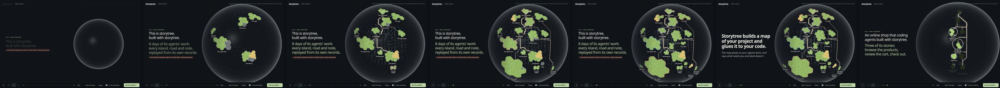
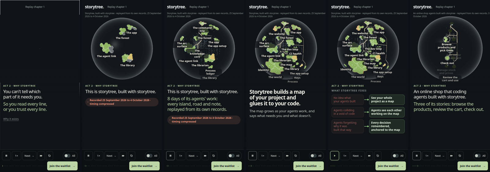
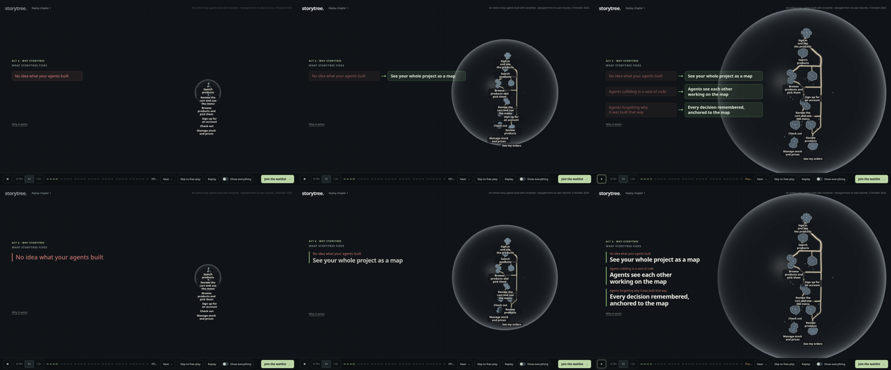

# Act 2 arrives (ADR-0889, contracts 2.11 and 2.12)

## Amended 2026-10-04: the arrival grows storytree's own globe, then cuts to the shop (ADR-0889 2.2b, increment_24f45ba457c7)

The time-lapse now replays **storytree's own project** (`src/own-snapshot.json`, saved by `refresh-own.ts`, PR #603): 24 dated stages from 25 September to 4 October 2026, its 19 islands arriving in the order they were recorded, its knowledge notes gathering in the core, its claims on the coasts, and its land as `main` stood at each stage. The card names it: **"This is storytree, built with storytree."** / "8 days of its agents' work: every island, road and note, replayed from its own records." (the number of days and the dates are filled from the saved growth at build). The value statement and the three fixes sit over storytree's whole globe. Then a new beat, **"Let's start small"**, cuts to the shop's globe, whole, narrowed to its three teaching stories (Browse products and pick them → Review the cart and use the menu → Check out), ringed, with the other six dimmed. The shop is read from its saved snapshot, so the rebuilt shop is a data swap. **The naming and the cut's lines are the agent's DRAFT** (marked in `src/tour-copy.ts`) for the owner to replace.





| Step | The visitor sees | Likely feels / thinks |
|---|---|---|
| Growth | Storytree's own globe swelling from the point: islands rising one by one, roads, the core filling with dots (`1440-2-grow-0` to `-4`, `390-2-grow-1`, `-3`) | "That's a real, big project, and they built it with their own tool" |
| Value, fixes | The owner's words over storytree's full globe (`1440-3-value.png`, `1440-4-fixes-*.png`) | The promise, with a working map behind it |
| The cut | The shop's small globe; three islands ringed and named, the rest dimmed (`1440-6-start-small.png`, `390-6-start-small.png`) | Relief: "fine, something small I already understand" |

**Measured** (SwiftShader on the Mint box, headless Chromium, three 5 s runs over the time-lapse): storytree's own **37.6–38.5 fps at 1440×900** and **57.5–57.8 at 390×844**; the shop's on the same build and machine **41.4–42.2** and **58.2–59.0**. Chapter 2's lazy chunk grows from storytree's growth to 7.2 MB raw / 1.36 MB gzip; it loads behind the pain beat, as before (2.10's journey passes; the setup's longest frames under the pain are 1.4 s and 0.7 s, after the first pain line).

**Seen and parked:** on a phone the cut's middle island's name ("Review the cart and use the menu") is laid out at the globe's lower edge, away from its ring, by the globe's nameplate placement (packages/forest, outside this lane's fence).

## As first built (PR #594): the arrival on the shop's growth

2026-10-04, Mint box, increment_92f9fd9cae02. Act 2 no longer opens on storytree's busy globe with the problem and the four principles over it. It opens in four steps:

1. **The pain, on the dark screen Act 1 leaves.** Three lines, one at a time, before any globe or the product's name: "Your agents write more code than anyone can read." / "You can't tell which part of it needs you." / "So you read every line, or you trust every line." **This wording is the agent's DRAFT** (marked in `src/tour-copy.ts`), standing in until the owner writes his own. Its "Why it exists" holds ADR-0853's full problem statement.
2. **The shop grows, as a time-lapse.** The globe swells from a point of light (Act 1's, or a dark seed for a visitor who skipped) and replays the shop's recorded build, 3 October 2026, 15:45 to 20:26 UTC, in 15 seconds at 1×: its nine islands rise in their two waves, roads draw on, land and file circles fill in landing by landing, the shop's 35 decisions and its other notes appear under the stories they belong to as their dates come round, and the 13 recorded sessions tint the coasts of the islands they held. It plays on the tour's own clock: pause holds it, 1.5× speeds it, and the step lasts as long as the growth. Timing is compressed and smoothed; nothing is drawn that the shop's library and git history do not record (ADR-0798 D3). The card says so: "Recorded 3 October 2026 · timing compressed".
3. **The value statement, alone on its slide**, over the whole shop, the owner's words: "Storytree builds a map of your project and glues it to your code." / "The map grows as your agents work, and says what needs you and what doesn't."
4. **The three fixes**, the owner's words, each pain with its fix beside it. The four principles are this step's depth ("Why it exists"), written as a short explainer with no decision numbers.

Then the tour carries on into Conduit's chapters as before.

## The two looks of the three fixes, for the owner to choose

Both are built; `data-fixes-look` on `#chapter2` picks one (`index.html` ships **beside**). Each row plays as its line arrives: top row of `fixes-looks.png` is **beside**, bottom row is **resolve**, each at about 0.4 s, 1 s and settled.



- **beside**: the pain is said in red in its own box; an arrow draws, and the fix arrives in green beside it, while the pain settles back. It reads as a before and after table: quick to scan, the pain stays legible.
- **resolve**: the pain is said large in red where the fix will stand; it then shrinks to a small red caption, the row's edge turns from red to green, and the fix rises in its place. It reads as the pain being overcome rather than compared, and gives the fix the larger type.

Phone (390 px): `390-4-fixes-beside.png`, `390-4-fixes-resolve.png`.

## See, feel, think

| Step | The visitor sees | Likely feels / thinks |
|---|---|---|
| Pain | Act 1's screen collapses to a point; on the dark, large words, one thought at a time; no globe, no name (`1440-0a-turn.png`, `1440-0b-pain.png`, `1440-1-pain.png`) | "That's exactly my problem": recognition before any pitch; a skipper still meets the pain |
| Growth | A glass globe swells from the point; islands rise, roads draw between them, coasts glow as sessions work, dots gather under each island (`arrival-strip.png`, frames `1440-2-grow-0` to `-4`) | Curiosity, then "it's building itself as they work"; the subhead that follows names what they just watched |
| Value | Two lines alone over the finished shop (`1440-3-value.png`) | The promise in one read, with the proof still on screen |
| Fixes | Three pains, each answered (`fixes-looks.png`) | "Those are my three problems, and each has an answer on the map" |


A clip of it playing at 1×, pain to fixes, on SwiftShader: [arrival.webm](arrival.webm). Phone frames: `phone-strip.png`.

## Paths that still work

- **Reduced motion**: the growth draws whole at once, so under the pain the globe is not shown at all (`1440-reduced-1-pain.png`); the lines arrive without animation.
- **No WebGL**: the still picture is storytree's own globe, not the shop's, so it stays hidden through the arrival; the tour and its controls work (`390-no-webgl-4-fixes.png`).
- **Act 1's exit** lands on the pain (`1440-0b-pain.png`).

## What changed to make it

- `src/tour.ts`: a step can replay a growth (`growth: "seed" | { seconds }`, `map: "shop"`); it lasts as long as the growth, and `globeOf` gives the growth's moment from the step's elapsed time (contract 2.11, `tour.test.ts`).
- `src/conduit-growth.ts`: a saved growth now keeps the project's notes as dated changes with only their public fields, the way storytree's own reading keeps them (contract 3.6), so the shop's core can grow. `src/shop-snapshot.json` was re-exported from the shop's saved library record and its git mirror; every stage is byte-identical to PR #589's, plus the notes.
- `src/forest-scene.tsx`: the shop's globe with its growth plan, its own knowledge core and recorded sessions. A swap between globes now dives in once the new globe is drawn, rather than on a fixed beat: storytree's heavy globe could take longer to lay out than the beat, leaving the camera pulled back (seen on the camera journey). The drawing says when the camera has arrived (`data-arrived`).
- The Run warm start (question_0e4e2c128a20) is untouched.

## Reproduce

```sh
pnpm --filter @storytree/website build && node packages/website/evidence/arrival/capture.mjs
```

It asserts: Act 2 opens on the pain with the shop's globe at its point and no name shown; the growth's moment rises as the step plays, holds while paused, and the shop is whole on the value step; the value statement stands alone; all three fixes show while the tour waits, in each look; the principles are the fixes' depth with no decision list; reduced motion and no WebGL keep the screen dark under the pain; Act 1's exit lands on the pain; and the browser reports no errors.
