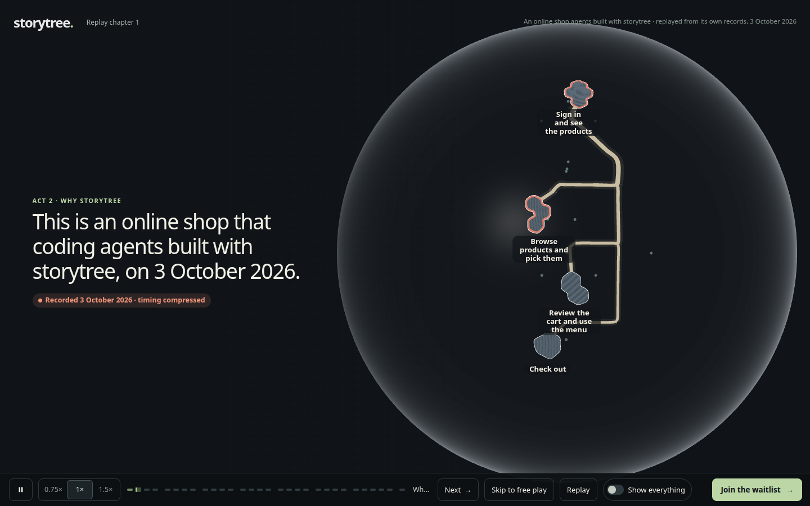

# The globe sets up behind Act 2's pain beat (contract 2.10)

2026-10-04, Mint box, increment_2e3c791dadd6. The owner retired question_0e4e2c128a20 ("yes retire it"): Act 2 now opens on the pain in words on a dark screen (PR #594), so the globe no longer needs to warm up during Act 1.

**What changed.**
- Act 1 loads nothing of the globe. The quiet-moment warm start (PR #570) is gone: `opening.ts` no longer announces the quiet, and `forest.ts` no longer listens for it. The off-screen pause (world 6.10) stays in the engine.
- After the hand-over the globe waits for Act 2's first words. The tour announces when they have painted (`storytree-arrived`, two frames after the 1.5 s dark beat ends), and the globe starts then, so its setup stalls only a screen of still text. A missing or slow tour lets it start after 4 s anyway. A visitor who skips Act 1 takes the same path. A returning visitor's globe starts when chapter 2 is on screen, as before.
- The time-lapse waits for the globe. The pain beat cannot move on, and the growth's clock does not run, while the globe is still loading (`createTour(steps, { ready })`, tour.test.ts 2.10). So the growth always plays from its first frame.
- `warm-globe/measure.mjs` finds Act 1's exit by its element id rather than its draft wording, so the renamed exit no longer breaks it (increment_85ebfc8267dd). It now also splits out the frames of the way out (exit click to hand-over) and Act 2's first three seconds.

## Measured (SwiftShader, 1440×900, page-time frames)

`frames-runs.jsonl` holds two runs of the contract's own journey (`--verify-opening-frames`) on this branch:

| | Run 1 | Run 2 |
|---|---:|---:|
| First pain words after the hand-over | 1,516 ms | 1,507 ms |
| Long frames after the hand-over (start–end, ms) | 1,816–2,282 · 2,366–2,916 | 1,790–2,274 · 2,357–2,907 |
| Globe live after the hand-over | 2,918 ms | 2,916 ms |
| Pain beat (hand-over to the time-lapse) | 13,485 ms | 13,479 ms |
| Time-lapse's first drawn frame after it starts | at once | at once |

The globe's setup costs two frames of about half a second each. Both fall after the first pain words have shown, where nothing but the text's own fade moves, and the globe is live ten seconds before the time-lapse needs it.

`measure.jsonl` holds `measure.mjs` run on main (a722c5ed, with PR #594) and on this branch, back to back, twice:

| Act 1 (fps) | main, pair 1 | branch, pair 1 | main, pair 2 | branch, pair 2 |
|---|---:|---:|---:|---:|
| Run to finale | 57.46 | 60.00 | 49.42 | 51.88 |
| Swarm | 59.97 | 60.00 | 58.35 | 58.71 |
| Quiet before the finale | 45.74 (longest frame 567 ms) | 60.00 (16.8 ms) | 15.65 | 19.67 |
| Globe started during Act 1 | yes | no | yes | no |

Pair 1 ran at a load average near 10 on 12 cores. Pair 2 ran with other lanes' builds at a load average of 21, so its absolute numbers mean little. The comparison holds in both pairs: the warm start's setup lands in Act 1's quiet stretch on main, and this branch keeps that stretch at full rate. PR #567 measured 57.29 fps for Act 1 on a quieter machine; this branch measures 60 fps.

**Seen on every build, and not this branch's: Act 1's turn.** Between the exit click and the hand-over, every build measured has a stretch of about 2.7 s with no frame, on main, on this branch and before PR #594 (8f5fa788: 45 frames in 3.6 s). It belongs to the turn's own collapse, not to the globe, which starts later. It is parked on the arc as its own increment.



## Reproduce

```sh
pnpm --filter @storytree/website build
node packages/website/evidence/capture.mjs <out> --verify-opening-frames
node packages/website/evidence/warm-globe/measure.mjs packages/website/dist branch
```
