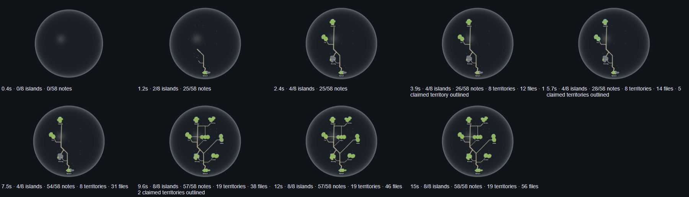
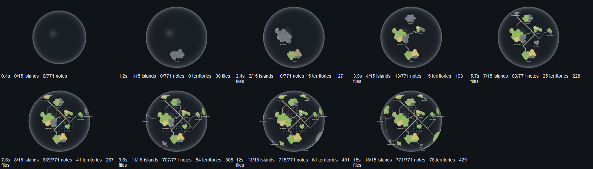

# The globe grows (world 7)

2026-10-04, Mint box, increment_93effc6483e7, contracts 7.1–7.4 of The world; the knowledge core grows with it since increment_2763bf8087ea (world 7.5, knowledge core 1.9), territories and file circles fill in since increment_467e29e26581 (forest 3.30), and recorded sessions pass over the islands since increment_7c07068e0713 (forest 5.7, world 7.6). Re-taken 2026-10-05 on the laptop (increment_607458283155): Conduit's recording left the site (`../retire-conduit`), so the replayed recording is now the shop's, and a session shows by the territories it held, outlined, not by a coast tint (ADR-0923 D3).

The shared engine (`@storytree/forest-world/planet`) replays a recorded sequence of plan states as growth. `growthPlan(stages, { fromPoint, seconds })` turns the stages into windows. `<PlanetWorldCanvas growth={{ plan }}>` then draws them on its own clock, or at a fixed moment with `at`. The globe's glass swells from a point of light. Each stage's new islands rise out of the glass from their middles, with no overshoot. A road leaves the island it builds on once that island has settled. It draws on at the dependency lane's speed, and the island it reaches rises when it arrives (0.2's arrival, ported as behaviour). The whole plan is scaled by one factor to the length asked for. A stage that adds nothing takes no time.

This page grows both recordings over 15 seconds:

- **The shop's recorded growth** (`src/shop-snapshot.json`, the tour's): 27 saved stages, from an empty plan through each pull request's build to complete; 8 islands, 63 links, 34 capabilities, 56 files and 58 notes. Each stage also carries the sessions that held claims when it was recorded. It grows in The forest's globe (`PlanetView`), within its full plan as the tour draws it, and those sessions outline the territories of the capabilities they held, in their own colours, from the stage that recorded the claim until the stage after it landed (forest 5.7). A stage whose sessions changed holds a one-second beat at natural pace, even when it adds nothing to the plan (world 7.6). The recording ends with no claim held, and so does the replay.
- **storytree's own saved reading** (`src/forest-snapshot.json`): 15 islands, 133 links, 93 capabilities and 428 files, with the library history it was read from. The page stages it by that history's own dates: the plan as it stood when each story was created (stories created in the same minute together), with each capability from its creation and each link once both its ends exist, then whole as saved. Nothing is added that the history does not hold. It records no sessions.

Both fill in their land the same way: each capability's territory is hidden until its fill-in window, then fades up to its health colour, and each file circle swells from its middle behind its island (forest 3.30). A capability recorded after its story joins the standing island later, so an island can rise as bare land and colour in as its capabilities arrive.

**The knowledge core grows with it.** Each stage keeps the date it was recorded, and `growthMoment` places any other date in the replay: between the two stages recorded around it, in proportion, and after the last toward the reading's end (world 7.5). Each of the core's drawn notes (58 for the shop, 771 for storytree) appears at its own creation date's moment, where the finished core draws it, under its story or capability or loose in the middle, fading in over 0.4 s (knowledge core 1.9). Timing is compressed (storytree's seven days into 15 seconds, each stage given its rise), and order is the recorded order. storytree's big step between 5.7 s and 7.5 s is real: 474 definitions were written between 27 and 30 September, while no new story was.

## Pictures

The shop, frame by frame (the capture's own `at` moments in seconds, with risen islands, notes, territories and file circles, and the claimed territories outlined):



The claims show at 3.9 s (one territory), 5.7 s (five, on Checkout and Cart: `shop-04.png`) and 9.6 s (two), and none at the end.

storytree's saved reading, grown from one point: notes appearing inside, territories and file circles filling in (counts per frame):



Clips of each playing in real time: [shop-growth.webm](shop-growth.webm), [storytree-growth.webm](storytree-growth.webm). Single frames are `shop-NN.png` and `storytree-NN.png`.

**Reduced motion** shows the end state at once, every island, note, territory and file circle, and draws nothing more. `shop-reduced-motion.png` and `storytree-reduced-motion.png` are byte-identical to each map's final frame (`-08.png`).

## Frame rate

`measurements.json` records each run. Frame rates are page `requestAnimationFrame` intervals at 1440×900 in headless Chromium 148 on SwiftShader (CPU rendering), on a Windows laptop (Snapdragon X Elite, 12 cores) with other sessions running, so the absolute numbers move with its load. Each growth's 15-second play is measured beside a baseline: the same globe with no growth, redrawn every frame for as long, run back to back in the same capture. The clip is recorded on a separate run, since recording video costs frames. The comparison that holds is growth against baseline within one run.

| Re-take (2026-10-05, both in `PlanetView`) | Growth playing | Same globe, no growth |
| --- | ---: | ---: |
| The shop, mean fps | 31.61 | 26.48 |
| The shop, p95 frame | 73.0 ms | 70.9 ms |
| storytree, mean fps | 20.52 | 7.85 |
| storytree, p95 frame | 135.6 ms | 291.0 ms |

The growth draws about as fast as the globe it grows into, or faster, because most of it draws less of that globe. storytree's globe carries its knowledge core (771 notes, each its own mesh as the app draws them), its 76 territories, 429 file circles and nameplates, which is why its whole globe redrawn every frame is the slowest line here. The first run (2026-10-04, Mint box, Conduit and storytree) read storytree at 22.06 fps growing and 13.87 whole.

## Reproduce

```sh
node packages/website/evidence/growth/capture.mjs
```

It asserts the following:
- no island is risen while the globe is still a point;
- islands only ever rise;
- every island has risen by the end, both at a fixed moment and after playing on the canvas's clock;
- no note shows while the globe is a point, notes only ever appear, and every note shows by the end;
- the same for territories and file circles, which both readings have;
- a recorded session outlines a territory it held during the shop's growth, and none is held at its end;
- under reduced motion every island, note, territory and file circle shows at once;
- the browser reports no errors.
