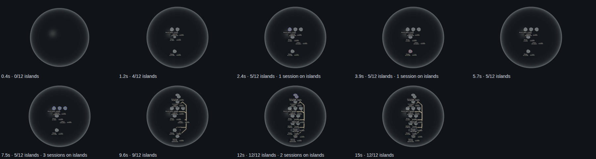

# The globe grows (world 7)

2026-10-04, Mint box, increment_93effc6483e7, contracts 7.1–7.4 of The world; the knowledge core grows with it since increment_2763bf8087ea (world 7.5, knowledge core 1.9), territories and file circles fill in since increment_467e29e26581 (forest 3.30), and recorded sessions pass over the islands since increment_7c07068e0713 (forest 5.7, world 7.6).

The shared engine (`@storytree/forest-world/planet`) replays a recorded sequence of plan states as growth. `growthPlan(stages, { fromPoint, seconds })` turns the stages into windows. `<PlanetWorldCanvas growth={{ plan }}>` then draws them on its own clock, or at a fixed moment with `at`. The globe's glass swells from a point of light. Each stage's new islands rise out of the glass from their middles, with no overshoot. A road leaves the island it builds on once that island has settled. It draws on at the dependency lane's speed, and the island it reaches rises when it arrives (0.2's arrival, ported as behaviour). The whole plan is scaled by one factor to the length asked for. A stage that adds nothing takes no time.

This page grows both recordings over 15 seconds:

- **Conduit's recorded growth.** These are the 21 stages the tour already saves (`src/conduit-snapshot.json`). Five of them add something: the first five stories, their four links, CI's story, the backend's six stories with 36 links, and one more link. Each stage also carries the sessions that held its islands when it was recorded. It grows in The forest's globe (`PlanetView`), within its full plan as the tour draws it, and those sessions pass over the islands they held: each session's colour tints the coast of its island from the stage that recorded its claim until the stage after it landed (forest 5.7). A stage whose sessions changed holds a one-second beat at natural pace, even when it adds nothing to the plan (world 7.6); without that beat, date-proportional timing would squash the whole first night of building, nine session changes, into half a second. The recording ends with nobody on the islands, and so does the replay.
- **storytree's own saved reading** (`src/forest-snapshot.json`): 15 islands, 133 links, 93 capabilities and 428 files, with the library history it was read from. The page stages it by that history's own dates: the plan as it stood when each story was created (stories created in the same minute together), with each capability from its creation and each link once both its ends exist, then whole as saved. Nothing is added that the history does not hold. It grows in The forest's own globe (`PlanetView`, given the growth): each capability's territory is hidden until its fill-in window, then fades up to its health colour, and each file circle swells from its middle behind its island (forest 3.30). A capability recorded after its story joins the standing island later, so an island can rise as bare land and colour in as its capabilities arrive. Conduit's recording has no code.

**The knowledge core grows with it** (storytree only: Conduit's recording holds no notes). Each stage keeps the date it was recorded, and `growthMoment` places any other date in the replay: between the two stages recorded around it, in proportion, and after the last toward the reading's end (world 7.5). Each of the core's 771 drawn notes appears at its own creation date's moment, where the finished core draws it, under its story or capability or loose in the middle, fading in over 0.4 s (knowledge core 1.9). Timing is compressed (seven days into 15 seconds, each stage given its rise), and order is the recorded order. The big step between 5.7 s and 7.5 s is real: 474 definitions were written between 27 and 30 September, while no new story was.

## Pictures

Conduit, frame by frame (the capture's own `at` moments in seconds, with risen islands out of 12 and the sessions on them):



storytree's saved reading, grown from one point: notes appearing inside, territories and file circles filling in (counts per frame):


Clips of each playing in real time: [conduit-growth.webm](conduit-growth.webm), [storytree-growth.webm](storytree-growth.webm). Single frames are `conduit-NN.png` and `storytree-NN.png`.

**Reduced motion** shows the end state at once, every island, note, territory and file circle, and draws nothing more. `conduit-reduced-motion.png` and `storytree-reduced-motion.png` are byte-identical to each map's final frame (`-08.png`).

## Frame rate

`measurements.json` records each run. Frame rates are page `requestAnimationFrame` intervals at 1440×900 in headless Chromium on SwiftShader (CPU rendering), the same harness conditions as `../defer-globe/`. Each growth's 15-second play is measured beside a baseline: the same globe with no growth, redrawn every frame for as long, run back to back in the same capture. The clip is recorded on a separate run: recording video cost about 10 fps in an earlier run, where it was on the timed one. Other lanes share this machine (load average 8 to 14 on 12 cores during the final run), so the absolute numbers move with its load. The comparison that holds is growth against baseline within one run.

| Final run (2026-10-04, both in `PlanetView`) | Growth playing | Same globe, no growth |
| --- | ---: | ---: |
| Conduit, mean fps | 44.89 | 43.12 |
| Conduit, p95 frame | 35.4 ms | 31.8 ms |
| storytree, mean fps | 22.06 | 13.87 |
| storytree, p95 frame | 131.3 ms | 149.3 ms |

The growth draws about as fast as the globe it grows into, or faster, because most of it draws less of that globe. storytree's globe now carries its knowledge core (771 notes, each its own mesh as the app draws them), its 76 territories, 429 file circles and nameplates. On CPU rendering that more than halves its frame rate against the bare globe of PR #575 (48.14 grown, 38.09 whole); the cost is the full drawing's, whole or growing. The deferred-globe work measured 57.29 fps for its page's ready state (PR #567). That was a different page, on a quieter machine. The globe alone here, at 1440×900 under this load, is the ceiling the growth can reach, and the growth meets it.

## Reproduce

```sh
node packages/website/evidence/growth/capture.mjs
```

It asserts the following:
- no island is risen while the globe is still a point;
- islands only ever rise;
- every island has risen by the end, both at a fixed moment and after playing on the canvas's clock;
- no note shows while the globe is a point, notes only ever appear, and every note shows by the end;
- the same for territories and file circles, which only storytree's reading has;
- a recorded session passes over an island during Conduit's growth, and none is left at its end;
- under reduced motion every island, note, territory and file circle shows at once;
- the browser reports no errors.
