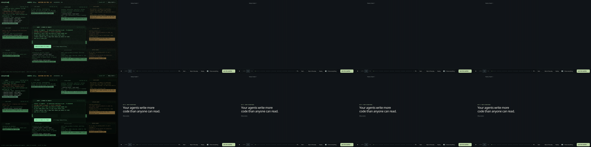

# Act 1's turn keeps its frames (contract 1.9), and nothing flashes under the pain (2.10, 2.11)

2026-10-04, Mint box, increment_1d9d61a1f88f.

**The turn froze.** Act 1's turn is about 1.1 s of animation: the windows power off, then the screen collapses to a line and a point. On every build measured it took about 3.6 to 4.3 s, with a stretch of roughly 2.7 s that drew no frame at all (`../behind-the-pain/`). A Chrome trace of the turn found the cause. The film grain's 2D canvas kept drawing every frame under the turn's full-screen effects, and its `FinalizeFrame` waited about 3 s on GPU backpressure while the (software) GPU flushed 61 MB. Because the turn's steps are web animations, which only advance on frames, the whole turn waited too.

**Fix:** the grain stops as the turn starts (`opening.ts`: `syncGrain` leaves it off while the phase is "turn"). At 5.5% opacity it cannot be seen under a collapsing screen, and a Replay starts it again.

**Measured** (SwiftShader 1440×900; `measure.jsonl` is `../warm-globe/measure.mjs` on main a722c5ed and on this branch, back to back, twice):

| | main | branch | main | branch |
|---|---:|---:|---:|---:|
| Exit click to hand-over | 3,947 ms | 1,162 ms | 3,982 ms | 1,152 ms |
| Frames drawn in the turn | 32 | 57 | 24 | 58 |
| Longest frame in Act 2's first 3 s | 3,150 ms | 1,417 ms | 3,183 ms | 1,367 ms |

The contract's own journey (`--verify-opening-frames`, `frames-runs.jsonl`) measures the turn at 1,129 and 1,144 ms, with no frame longer than 16.8 ms.

This box's GPU has no working driver, so no browser here renders on hardware. On a real GPU the turn may never have frozen this long. Software rendering is still what a visitor gets on a machine without GPU acceleration, and the grain is invisible during the turn anyway.

**Two flashes under the pain, found on the way and fixed** (both from PR #594's arrival):
- When the live globe first mounted, it drew storytree's own globe for a frame before it learned the tour was on the shop's seed. It now waits for the tour's step and starts on that step's globe. The 2.10 journey records every globe the drawing shows before the time-lapse and expects only the shop's.
- While the globe was loading, the saved still of storytree's globe showed under the pain. It is now hidden whenever the shop's drawing is not live (`tour.css`), checked by the arrival proof with the scene held loading.
- A returning visitor landing on the pain saw the name "storytree." fade out over 1.2 s. It is now hidden at once, and fades in only as the globe grows.

The turn, frame by frame: before (top) and after (bottom). The screenshots themselves are slow on SwiftShader, so these show the dark landing and the first pain words, not each step of the collapse. Before the fix, the screen stays dark with no words for seconds.



## Reproduce

```sh
pnpm --filter @storytree/website build
node packages/website/evidence/capture.mjs <out> --verify-opening-frames
node packages/website/evidence/warm-globe/measure.mjs packages/website/dist branch
node packages/website/evidence/turn/capture.mjs packages/website/dist after
```
