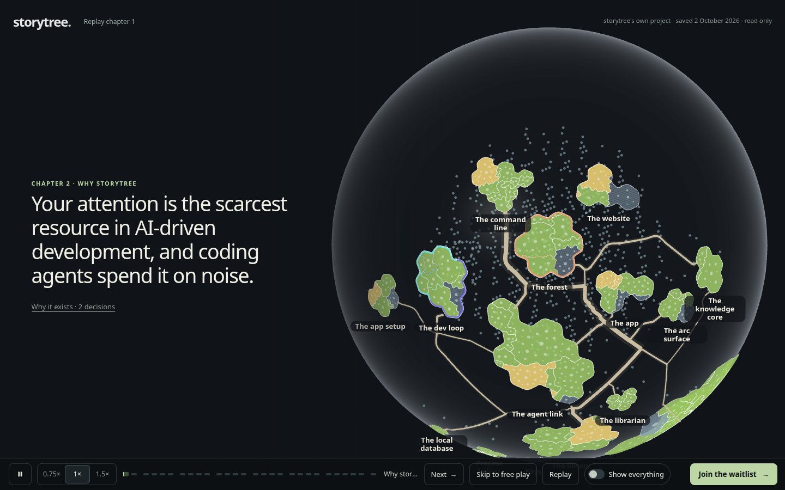
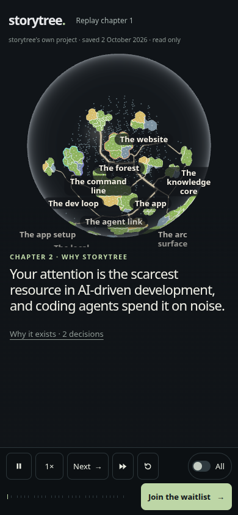

# The turn lands on a live globe again, without stalling the swarm

2026-10-03, increment_535071ecae92, website contract 2.10 and World contract 6.10.

PR #567 stopped the globe loading during chapter 1, and removed PR #565's warm start with it, so the
turn showed the saved still for about 1.3 s before the live globe swapped in. Two changes bring the
warm start back:

- **World 6.10** (`packages/forest-world/evidence/planet/`): the globe draws nothing while none of its
  canvas is on screen, so a globe mounted below the fold costs no frames.
- **Website 2.10**: chapter 1 dispatches `storytree-opening-quiet` when its last helper parks (14.0 s
  after Run: every window waits on the visitor and nothing streams until the finale at 16.75 s), and
  the forest starts the globe then, below the fold. The turn lands on it live.

Starting at Run instead was tried and measured: the globe's setup is not drawing but main-thread work
(a WebGL start-up, trail routing and territories: about 1.4 s under SwiftShader), and at Run it lands
on the lead's first lines and the swarm. At the quiet moment the swarm keeps every frame; only the film
grain and the lead's "awaiting instructions" can wait (the statuses, cursors and counter pulses are
compositor animations and keep moving).

## Chapter 1 and the turn, measured

Mint box (Ryzen 5 5600X), headless Chromium 148, SwiftShader, 1440×900, page-time
`requestAnimationFrame` intervals, the opening-frames journey's instrumentation (`measure.mjs`, which
measures without asserting so it can read every build). Three interleaved rounds per build; medians.
Raw runs: `rounds.jsonl`.

| Build | Chapter 1 fps (Run to finale) | Swarm: fps, longest frame | Quiet stretch: fps, longest frame | Globe draw calls in chapter 1 | Turn to the globe's first frame |
| --- | ---: | ---: | ---: | ---: | ---: |
| A · main, PR #567 (nothing in chapter 1) | 58.2 | 60.0, 16.8 ms | 55.1, 250 ms | 0 | 1,311 ms (cold load, still shown) |
| B · warm start at Run, globe paused off screen | 56.1 | 54.3, 550 ms | 59.0, 83 ms | 0 | 60 ms |
| **B2 · warm start at the quiet moment (this change)** | 53.9 | **60.0, 16.8 ms** | 43.3, 1,083 ms | 0 | **52 ms** |
| C · warm start at Run, globe not paused (PR #565's) | 56.3 | 54.1, 567 ms | 60.0, 16.8 ms | 2,798 | 21 ms |

The swarm is Run until the last helper parks (14.0 s); the quiet stretch runs from there to the finale's
buttons (22.0 s). Ready (before Run) was 57.3 fps in every build. The globe's setup took 1.3 to 1.6 s at the
turn in A and 2.0 to 2.8 s in B2, where it shares the quiet stretch with the lead's park and the finale's
first lines; in A the finale alone produced 250 to 333 ms frames in two of three runs.

What the numbers say: pausing the globe off screen removes its off-screen drawing (C to B: 2,798 draw
calls to 0) but not its setup, which costs chapter 1 about four frames a second on average wherever it
runs. B2 puts that cost where the least moves and keeps the swarm, the part a visitor watches, at a
steady 60 fps; A keeps chapter 1's average highest by making the turn wait on a still. Which of those
the site should prefer is the owner's call, raised on the arc.

## Where the setup goes

A main-thread CPU profile of B at Run (Mint box, source-mapped build): `hasWebGL` in `forest.ts`
(the probe context: 0.36 to 1.2 s across runs, SwiftShader's first context), trail routing in
`forest-world/src/core/routing.ts` (about 0.5 s: `buildGrid`, `runAstar`), and territories in
`forest/src/territories` and `forest/src/view/territory-land.ts` (about 0.6 s). None of it is drawing.

## Journeys

All run on the Mint box against the final build of commit `4afadaf6` (the observations name it); each
exited 0.

- `--verify-opening-frames` (2.3, 2.10; `after/opening-frames.json`): nothing started or requested
  before Run; the globe started 14,014 ms after Run, 12 ms after the last helper parked; live at the
  finale with 0 globe draw calls in chapter 1; its first draw 60 ms after the handover, with no second
  load; Replay releases it, a scroll past chapter 1 remounts one globe, a return visit reaches it live,
  and without IntersectionObserver Run starts nothing and a scene arriving after Replay cannot mount.
  Swarm 60.0 fps; quiet stretch 49.1 fps.
- `--verify-opening` (1.8): playback, joke, keyboard restart, exits, opt-in sound, denied storage, no
  script and reduced motion. Finale 22,339 ms after Run; the turn's line at 447 ms, point at 696 ms,
  handover at 1,149 ms.
- `--verify-tour` (2.4 to 2.8), `--verify-camera` (2.9, and 2.4 and 2.7 holds while exploring),
  `--verify-forest` (2.1, 2.2 still without WebGL and when the scene fails, 2.3), `--verify-controls`.
- `--verify-immersive` (`immersive/immersive-measurements.json`) and `--verify-recording`.

The browser runs exercise local builds; they do not attest hardware-GPU performance.





## Reproduce

```sh
WEBSITE_SHA=$(git rev-parse HEAD) pnpm --filter @storytree/website build
node packages/website/evidence/capture.mjs warm-globe/after --verify-opening-frames
node packages/website/evidence/capture.mjs warm-globe/journeys --verify-opening --verify-tour --verify-camera --verify-forest --verify-controls
node packages/website/evidence/capture.mjs warm-globe/immersive --verify-immersive
node packages/website/evidence/capture.mjs warm-globe/recording --verify-recording
# Any build, measuring only (copy each build's packages/website/dist aside first):
node packages/website/evidence/warm-globe/measure.mjs <dist> <label>
```
