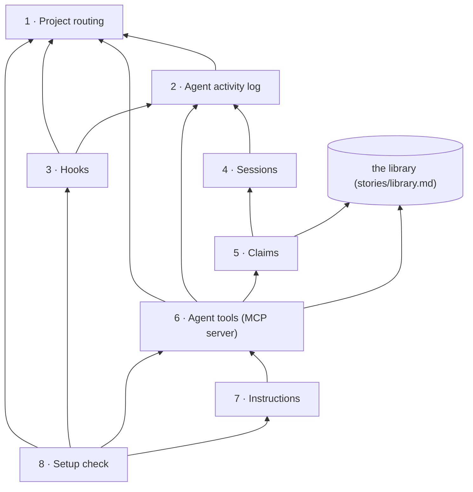

# Story: the agent link

**What it is.** The agent link lets the user's own Claude Code or Codex use storytree by itself,
through two layers that share one base. A passive layer of hooks records what every agent does,
so even an agent that ignores storytree shows up as unplanned activity. An active layer, an MCP
tool server, is what the agent chooses to call to plan, claim, report red, green and landed, and
write artifacts, taught by a short habits card. A setup check at every session start keeps it all set
up. Red-green is a convention the card teaches, not a loop storytree runs.

**Approved** by the owner on 2026-09-26. The tree below is ADR-0626 in storytree 0.2's decision
log (`storytree-ai/storytree02`), approved through the question `oq-0-3-agent-link-capability-tree`
(revision 5), with the corrections ADR-0627 made the same day (the rabbit-hole knowledge rules).
Names and scope come from those records; change them there first.

**Revised** by the owner on 2026-09-27 (ADR-0643, through `oq-0-3-agent-link-revised-tree`), for what
ADR-0633 brought back from 0.2: claims (5) grow to increments, refuse waiting work (W2) and end when
a pull request merges (M); the agent tools (6) grow by the planning, question, wait, friction and
re-steer tools; the habits card (7) and the setup check (8) grow with them. Its front cover is
`decisions/agent-link-revised-tree.md`. The command line is not this story's: it is a story of its
own (H), parked as `0-3-cli-story-tree`.

**Extended by ADR-0645 D2 and D6** (2026-09-27): the command line and the agent tools share
public claims readings, setup diagnostics and friction recurrence capture. Every library write
from an agent tool names its calling session in the library's history.

**Rule for building it: port behaviour, not code.** Storytree 0.2's hooks and harness settings
(`.claude/settings.json`, `.codex/`), its claim board (`packages/notice-board`,
`stories/notice-board`) and the MCP servers it runs for its own build workers are the behavioural
reference. Nothing is copied from them wholesale. It reaches the library only through the library's
public API (`stories/library.md`, capability 7).

**How each capability is proven.** Red→green, as for the library. Each capability's tests are
written and committed first, and seen failing (`red(<capability>): …`). Then the code that makes
them pass is committed (`green(<capability>): …`). The git history is the evidence that the red
came first.

**The owner's choices** (ADR-0626):
- **B1:** the link keeps its own agent activity log beside the library, not inside it. Sessions,
  activity, claims and artifact reads live there, not as library record types.
- **C1:** one holder per capability, and no queue.
- **E1:** Codex gets the same two layers as Claude Code, through user-level hooks and its one-time
  approval.
- **Onboarding is the setup check** (D5): the user installs only the tool server, and every session
  start checks the setup and fixes it on the spot. Every hook is proven to fire before real work
  starts, and the connection shows as verified only then (ADR-0625 D9's rule, which binds here).

```mermaid
flowchart BT
  P["1 · Project routing"]
  L["2 · Agent activity log"]
  H["3 · Hooks"]
  S["4 · Sessions"]
  C["5 · Claims"]
  T["6 · Agent tools (MCP server)"]
  I["7 · Instructions"]
  K["8 · Setup check"]
  LIB[("the library (stories/library.md)")]
  L --> P
  H --> P
  H --> L
  S --> L
  C --> S
  C --> LIB
  T --> P
  T --> L
  T --> C
  T --> LIB
  I --> T
  K --> P
  K --> H
  K --> T
  K --> I
```

Build order: 1 → 2 → 3 → 4 → 5 → 6 → 7 → 8.

---

## 1 · Project routing

The first time an agent session starts in a folder that isn't a storytree project, storytree asks
the user (through the agent) whether to set one up; if they say yes, this leaves a small marker in
the folder naming the project, and from then on it routes everything an agent does anywhere in that
folder to that project, whichever project the user happens to be looking at in the app. It never
picks a project by itself: a folder the user hasn't said yes to is ignored, and when storytree isn't
running it says so at once, so everything built on it quietly does nothing.

- **Depends on:** nothing in this story. It uses the library API's `connect` and `openProject`, and
  the record the running 0.3 app keeps of where its database is listening.
- **Its shelf,** founding book first:
  - **Founding book (ADR-0626 D5):** project routing sends what an agent does in a folder to one
    storytree project. It never picks a project by itself: storytree asks, and the user's yes is
    the choice.
- **Leaves out (vs 0.2):** 0.2's four rules for working out who a session is from its worktree
  folder, the shared "lobby" checkout that could claim nothing, and repairing worktrees or
  installing packages at session start. 0.2 had one shared database and no idea of a project.
  Connecting through the library's Google Cloud option is left for later.
- **As built:** the marker is `.storytree.json` in the project's folder, holding
  `{ "project": "<name>" }`; a folder belongs to the nearest marker at or above it, and a git
  worktree without one is looked up in the folder it is a worktree of. Setting a folder up opens the
  project in the library first, so the library's own name rule judges the name. Where storytree is
  comes from the owner record `@storytree/local-postgres` keeps beside the app's data directory
  (`~/.storytree/0.3/pgdata.owner.json`, or under `STORYTREE_HOME`): a record whose process has
  ended is a crashed app's, and its address is never tried.

**Contracts** (each one a test):
1. Setting a folder up as project "site" leaves a marker in it naming "site", and asking from the
   folder, from a sub-folder of it, and from a git worktree of it all give "site".
2. A folder with no marker, in it or above it, gives "not a storytree project".
3. A project name the library would refuse is refused when setting a folder up, and nothing is
   written.
4. With the app's database stopped, asking where to send activity answers "storytree isn't
   running" in well under a second.
5. A leftover address from a crashed app counts as not running: it answers in well under a second
   and never hangs.

## 2 · Agent activity log

The agent link's own logbook of what agents do, one per project and kept beside the library rather
than inside it, with one line for each thing that happens: a session starts or ends, a file is
edited, a command runs, an artifact is read, work is claimed, released or landed. Lines are only ever
added, never changed, and can be read back in order as "everything since line N", including lines
that other processes wrote.

- **Depends on:** 1.
- **Its shelf,** founding book first:
  - **Founding book (ADR-0626 D2, B1):** the link keeps its own log of what agents do, beside the
    library and not inside it. Sessions, activity, claims and artifact reads live there, not as library
    record types.
- **Leaves out (vs 0.2):** 0.2's claim-event, work-event and trace tables, its retired presence
  rows, and the machine-wide register of running jobs (`storytree own`). Lines can't be edited or
  deleted.
- **As built:** the log is its own database, `storytree-activity`, on the same Postgres server as
  the projects' libraries. The library lists only databases named `storytree_<name>` as projects,
  so the log is never one. One table holds every project's lines, and a project reads only its
  own; a project's writes take turns on a lock, so its lines commit in the order they are numbered.
  The kinds of line: a session started or ended, files edited, a command started or run, a turn
  ended, a storytree tool asked for (naming the agent that asked, as a hook saw it) or called, a
  subagent started, an artifact read, and a capability claimed, released or landed. Every line names
  its session and its harness, and, since ADR-0636 D1 (b1), the machine it was written on: the
  hooks and the tool server open the log with the machine's host name, trimmed, and it goes on
  every line they write. It reads the same on every line until two machines share one log, which
  is later (ADR-0637 D1).

**Contracts:**
1. Two separate processes write lines for two sessions, and reading from the start returns every
   line once, in the order written.
2. Reading "since line N" returns only the lines after N, in order, each carrying the number to
   pass next time.
3. Lines written for project "site" never appear when reading project "app".
4. The log never shows up in the library's list of projects, and writing lines leaves the library's
   own records and change feed untouched.

## 3 · Hooks

Small commands that Claude Code and Codex run by themselves when a session starts, after every file
edit, before and after every shell command, at the end of each turn, and when it ends, each adding
one line about that session to the agent activity log, so an agent that never calls storytree still
shows up. At each prompt, one more adds the project's definitions for the terms the prompt names,
for the agent to read. They run in the background and
always exit cleanly, so they can never slow down or break the agent, and when storytree isn't
running they do nothing.

- **Depends on:** 1 and 2.
- **Its shelf,** founding book first:
  - **Founding book (ADR-0626 D1 row 3 and D4, E1):** hooks are the passive layer, so an agent that
    never calls storytree still shows up. Codex gets the same hooks as Claude Code, registered at
    user level.
- **Leaves out (vs 0.2):** 0.2's six session-start hooks (installing packages, repairing and pruning
  worktrees, remote setup, a claim reminder).
  0.2 never recorded edits or commands at all.
- **As built:** one command, `storytree-hook <harness>` (`claude-code` or `codex`), built into a
  plain Node script (a 5 KB entry; the database code sits in chunks beside it, loaded only when a
  line is written), and run with the hook's input on stdin. Claude
  Code's edits are its Write, Edit, MultiEdit and NotebookEdit tools and its commands are Bash;
  Codex's edits are `apply_patch`, whose patch text names the files (also when the patch runs
  through the shell), and its commands are Bash. It reaches the database only when the folder is a
  project on a running storytree, gives up after 2 s, and never runs past 5 s. Where nothing is to
  be written it exits in about 130 ms here.
- **The two probes, run 2026-09-26 before building:** Claude Code (2.1.212) starts the tool server
  with its session id in `CLAUDE_CODE_SESSION_ID`, the same id its hooks see, and a resumed session
  keeps it. Codex (0.155) sends `_meta.threadId` (and, from 0.155, `_meta.sessionId`) on every tool
  call, equal to its hooks' `session_id` in a top-level session. So the hooks did not need to
  record a pairing for the session. ADR-0629 D2's agent needs one, below.
- **Added by ADR-0629 D2** (storytree 0.2's decision log, decided by the owner after approval):
  each artifact read names the agent that made it (capability 6), and only a hook sees that agent. So a
  hook also runs just before each call to one of storytree's own tools (`mcp__storytree__…`, which
  is why the tool server is registered under the name storytree), and it is the one hook the
  harness waits for: its line is written before the call reaches the tool server. That adds about
  0.2 s to each storytree tool call here (median of ten runs; the first, cold, took 0.4 s). The line
  names the agent asking, the session's orchestrator or a subagent by its id and type, under the
  harness's id for the call. The hook after a tool also fires when a subagent is started (Claude
  Code's Agent or Task tool, Codex's `spawn_agent`), and records the subagent's id, type and task.
- **The probe for it, run 2026-09-26** (Claude Code 2.1.283 and Codex 0.155, each starting two
  subagents): inside a subagent, a tool call's hook input carries `agent_id` and `agent_type`, and
  the orchestrator's carries neither. The hook's `tool_use_id` is the id the call reaches the tool
  server with (Claude Code's `_meta["claudecode/toolUseId"]`, Codex's `_meta.callId`). Claude
  Code's orchestrator and subagents share one tool server, and a call tells it nothing else about
  who made it. Codex starts a tool server for each subagent, and a call names its thread
  (`_meta.threadId`, the subagent's own id, while `sessionId` stays the session's). A subagent's
  task is revealed only when it is started: the Agent tool's `description`, `spawn_agent`'s
  `message`.
- **Fixed by ADR-0636 D2** (b8's rider, a defect in the first build): a shell command was recorded
  only when it finished, so a single command running past the quiet time (capability 4) left its
  session reading idle, and another agent could take its claim mid-run. Now a hook also runs
  before each shell command, in the background, and writes a "command started" line under the
  harness's id for the call (`tool_use_id`), which the finish line carries too; a hook at the end
  of each turn (Stop) writes "turn ended". Codex's two run with `--background`: the hook hands its
  writing to a detached copy of itself and exits. *Corrected 2026-09-27:* this said Codex has no
  background hooks. It has (`async`, seen in Codex 0.155), but it ended a still-running `async` hook
  when it exited, where a detached copy finishes its write.
- **The probe for it, run 2026-09-27** (Claude Code 2.1.283 and Codex 0.155, each asked to run a
  command that exits with an error): Claude Code's before-hook for Bash carries the command and the
  call's id. A command that fails fires `PostToolUseFailure`, not `PostToolUse`, so until this fix a
  failed command wrote no line at all; it is registered for Bash now. Codex's sandbox refused both
  commands, and then only the before-hook fired, never an after-hook: a refused command never
  finishes, which is why the end of the turn closes it. Both harnesses fire Stop at the end of each
  turn; Claude Code's lists the `background_tasks` still running, and a turn that leaves any writes
  no "turn ended" line, since their commands may still run.

- **Added by ADR-0636 D1 (b2), definition lookups at each prompt,** ported from 0.2's
  `definition-injection.mjs` by behaviour: the hook at each prompt (UserPromptSubmit) reads the
  project library's definitions (`definitions()`, the library's capability 6) and adds those whose
  term the prompt names, as JSON `additionalContext`, the form both harnesses take (a probe on
  2026-09-27 had Claude Code 2.1.283 and Codex 0.155 each repeat a codeword only the hook gave).
  A definition answers to its term and each `/`-separated part of it, three letters or more; it is
  found as whole words, ignoring case, `-` and `_`, with its last word plural or not. At most five,
  the longest first, each once a session (kept in the temporary folder), each shown as its term,
  its id and its meaning's first line. A prompt whose first 400 characters carry a harness's notice
  marker (0.2's three) gets none. The harness waits for this hook, so it gives up after 2 s and
  prints nothing; routed, it takes about 0.25 s here. It is the one hook that prints anything.

- **Added by ADR-0636 D1 (b3), the status line,** ported from 0.2's `presence-hook.sh statusline`
  by behaviour: one line in a Claude Code window, `storytree · holds Email form · 2 other agents
  working · ⚠ src/signup.ts is being edited by Codex too`. It is `storytree-hook statusline`, which
  Claude Code runs as a command line through a shell (both paths in double quotes, which bash and
  cmd each read as one word; checked 2026-09-27), with the session's id and folder on stdin. What
  this session holds comes from its claims (5), by capability title; the other agents are the
  project's other live sessions (4). 0.2 warned when two sessions claimed one unit, which cannot
  happen in 0.3, where a capability has one holder; so the warning is a file this session edited in
  the last quiet time that another live session edited in it too. In a project with storytree
  stopped it reads `storytree isn't running`; outside a project it shows nothing, since Claude Code
  shows one status line in every folder. It waits at most 2 s. Claude Code has room for one status
  line, so the setup check installs storytree's only where the user has none (8.7), and removing
  storytree takes out only its own. Asking the user whether to replace theirs is not built. Codex's
  status line shows only Codex's own items, so there is nothing to install there. Its input is not
  recorded: Claude Code runs a status line only in an interactive window, so the test uses the
  documented fields.

**Contracts:**
1. Real, recorded Claude Code hook inputs (a start, a file edit, a shell command, an end) are fed
   in, and four lines appear on that session, carrying the file path, the command and the
   machine's name.
2. The same holds for real, recorded Codex hook inputs, where the edited files are read out of its
   patch text.
3. With storytree stopped, with garbage input, or outside a storytree project, the command exits
   cleanly in under half a second and writes nothing.
4. It runs on Windows without a Unix shell, and it never prints anything the agent would see.
5. Real, recorded hook inputs for starting a subagent, for a storytree tool call made inside it,
   and for one made by the orchestrator make three lines: the subagent's id, type and task; the
   subagent asking, by its id and type, with the call's id; and the orchestrator asking, with its
   call's id. The same holds for Claude Code and for Codex.
6. Real, recorded hook inputs from before a shell command, after one that failed, and at the end of
   a turn make three lines: the command started and the command finished, both under the call's id,
   and the turn ended. For Codex, whose hooks the agent waits for, the hook hands its line to one in
   the background and exits.
7. At each prompt, the project's definitions for the terms it names are added for the agent: whole
   words in any case or plural, at most five, longest first, each once a session. A harness's own
   notice gets none, and with storytree stopped nothing is printed.
8. The status line shows what this session holds, how many other agents are working, and a warning
   when another is editing a file it edited. With storytree stopped it says so, and outside a
   project it shows nothing.

## 4 · Sessions

Reads the agent activity log as a list of agent sessions, one per Claude Code or Codex window, each
showing which of the two it is, which folder it works in, when it started and when it was last seen.
A session is live while its lines keep arriving, idle after a set quiet time (30 minutes to start
with), and ended once its end line arrives, so it never reads as live just because nobody said
otherwise.

- **Depends on:** 2, the agent activity log. Its lines come from the hooks (3) and the agent
  tools (6).
- **Its shelf,** founding book first:
  - **Founding book (ADR-0626 D1 row 4 and D9):** sessions are read from the activity log, one per
    agent window, and never declared by the agent. A session is live only while its lines arrive,
    never by default.
- **Leaves out (vs 0.2):** self-declared presence, which 0.2 retired as "not useful … advisory
  rather than deterministic" (ADR-0200); identity by worktree folder; and 0.2's
  three staleness bands and two-hour reclaim clock.
- **As built:** a session is every line under one harness session id; its state comes from its
  latest line alone (an end line ends it, 30 minutes of quiet makes it idle), and it is flagged
  "hooks not running" until a line from one of its hooks arrives. Claude Code and Codex both keep a
  session's id when it is resumed (the probes, capability 3), which is what keeps a resumed window
  one session. A session whose shell command is still running is live however long the command
  takes: a command is running from its "command started" line until its finish line (by the call's
  id), the end of its turn, a restart or the session's end, and at most 12 hours
  (`LONGEST_COMMAND_MS`), past which it is taken to have died with its window (ADR-0636 D2).
  Claude Code's `/clear` does the opposite: the same window becomes a new session,
  its hooks end the old id and start a new one, and the tool server keeps the old id in its
  environment (seen 2026-09-26 in Claude Code 2.1.283, through its streaming input). So each tool
  call is recorded on the session its hook named (capability 6), and a cleared window reads as the
  new session it is.

**Contracts:**
1. A start line makes a live session labelled "Claude Code", with its folder, when it started and
   when it was last seen.
2. With no line for longer than the quiet time the session reads as idle, and after its end line it
   reads as ended.
3. A resumed window continues the same session instead of starting a second one.
4. A Codex session whose hooks never ran, but which calls a storytree tool, still appears and is
   flagged "hooks not running", so a missing hook never looks like an agent doing nothing.
5. A command that started 40 minutes ago and has not finished keeps its session live. Once it
   finishes, or its turn ends, the quiet time counts again, and one started longer ago than the
   longest a command may run no longer counts.

## 5 · Claims

Before building a capability, the agent claims it with a one-line reason, so the user and the other
agents can see who is on what, and every edit its session makes while holding the claim counts
toward that capability. Only one live session can hold a capability: a second agent is refused with
the holder's name and picks other work instead of queueing, and a claim ends when the agent lands or
releases it, when its session ends, or when another agent takes it over after the holder has gone
idle.

- **Depends on:** 4, sessions, and the library API (to check that the capability exists).
- **Its shelf,** founding book first:
  - **Founding book (ADR-0626 D3, C1; ADR-0643 D1):** claims show who is on which capability or
    increment. One holder each and no queue: a second agent is refused with the holder's name and
    picks other work.
- **Leaves out (vs 0.2):** the three claim grades (exploring, waiting, work), the waiting queue with
  automatic promotion, typed roles, and rules about stories versus capabilities. 0.2's claim board
  is six capabilities and about 3,800 lines of code, reworked across ten decisions. *(Claims on arc
  increments and release when a pull request merges were left out here too, until ADR-0633 brought
  them back; ADR-0643 built them, below.)*
- **Extended by ADR-0643 D1, D2 and D3** (the revised tree):
  - **Increment claims.** An agent claims an increment as well as a capability, and both read the
    same: harness, window, reason, live or idle. One holder each, no queue, and the same takeover
    after idle. Claiming a proposal or a ready increment starts it, through the library's own
    `advanceIncrement(id, "active")` (0.2's ADR-0386); a closed increment cannot be claimed. No
    approval step anywhere: an agent readies and starts its own proposals (ADR-0638 D2). Closing an
    increment with its outcome ends its claim, as landing does a capability's.
  - **The wait refusal (the owner's W2).** Claiming or starting waiting work is refused, naming what
    it waits for, and nothing is written. An increment waits when the library's `waitHolds` names a
    blocker for it or for its arc, or when `heldOnQuestion` names an open question it is held on (it
    is then waiting on the owner). A capability claim is refused when every open increment naming
    that capability (its `touches`) is waiting; a capability no open increment names is never
    refused. The agent link composes this from the library's own readings and keeps no copy of any
    wait rule (ADR-0640 D5).
  - **Release on merge (the owner's M).** Each claim records the git branch its session's folder was
    on. At each tool call and each background hook line, the link asks GitHub, through `gh`, whether
    a pull request from that branch has merged since the claim was taken, and ends each such claim
    with a "merged" line. That catches squash merges, which git alone cannot see. The MVP assumes the
    project is on GitHub with `gh` signed in (the setup check, 8, says so when it is not); a
    git-only option is after the MVP. A merge is noticed at the next agent activity in the project,
    not the moment it happens, since the database is local.
- **As built (increment claims and the wait refusal, 5.7–5.9):** a `claimed`, `released` or
  `merged` line names a `capability` or an `increment`, exactly one; lines from before name a
  capability. `claim` takes either id and finds which it is in the library (an increment by reading
  each arc's `arcView`). A closed increment is refused; so is waiting work, with each blocker and
  its reason from the library's `waitHolds`, which already counts an increment's arc's waits. Only
  the claim that wins starts a proposed or ready increment, under the project's lock. An edit counts
  toward the capability and the increment its session holds; with neither it is unclaimed. The
  forest's markers stand at capabilities only, and increment claims are the arc surface's to show.
  An increment held on an open question (the library's `heldOnQuestion`) is refused as waiting on
  the owner, and counts as waiting when a capability's increments are weighed.
- **As built (release on merge, 5.10):** a `claimed` line carries its `branch` (from `git rev-parse
  --abbrev-ref HEAD` in the session's folder; none on a detached head). The tool server looks at
  every call, and the hooks at every line but the one before a storytree tool call (which the
  harness waits for, and whose call looks anyway); each project is asked about at most once a
  minute, by a stamp in the temporary folder that every hook and tool server on the machine shares.
  It runs `gh pr list --state merged --head <branch>` in the project's folder, giving up after 3 s,
  and a pull request merged after the claim was taken ends it with a `merged` line naming the
  holder and the pull request. That line is written on the session that saw it, so it never makes
  an idle holder read as live. `gh` missing, signed out or slow means no merge seen, never an error.
- **As built:** claims are lines in the agent activity log (claimed, released, landed), and who
  holds what is worked out from them, with each holder's liveness from its session's latest line.
  Claiming, releasing and landing each check and write under the project's lock, so two claims at
  once cannot both win. A session may hold more than one capability; its edits and commands count
  toward the one it claimed most recently of those it still holds. Landing a capability another
  session holds is refused, naming the holder. A holder whose command is still running
  (capability 4) is live, so its claim cannot be taken mid-run (ADR-0636 D2).
- **As built: a workspace already claimed (ADR-0653, the owner's K1, 5.12-5.14).**
  `makeWorkspace` in `packages/agent-link/src/claims/workspace.ts`, also exposed as the
  `make_workspace` agent tool. "Make a workspace for this
  work" is one step: fetch the project's main from `origin`, cut a fresh branch from it into a new git
  worktree, and claim the increment (or capability) for the calling session, the claim naming the new
  branch so its merge ends it. It is refused as a claim is (held, waiting, closed, unknown), and also
  for work the session already holds, naming the branch it holds it on; a refusal makes no folder, no
  branch and no line. It wraps the harness's own worktree feature rather than replacing it: the
  folder is where that harness keeps its worktrees, so the harness can enter it. For Claude Code that
  is `.claude/worktrees/<name>` in the main checkout, on a `claude/<name>` branch, entered with its
  `EnterWorktree` tool; for Codex, `<CODEX_HOME>/worktrees/<name>/<repository>`, on `codex/<name>`.
  The name is the work's id, cut short, and six random hex digits. Installing the new folder's
  packages is left to the project's own session start. If main cannot be fetched, nothing is
  claimed; if git then fails to make the worktree, the claim is released (an increment the claim
  started stays active).
- **Public readings (ADR-0645 D6, 5.11):** `readClaims(log, project, options?)` returns the current
  capability and increment claims, each with its harness, session (the window), label, reason,
  time claimed, branch when known, and live or idle holder. `readClaim(log, project, id, options?)`
  returns the holder of one unit, or `undefined` when nobody holds it. Both are exported from
  `@storytree/agent-link`. The board's browser-safe `@storytree/agent-link/readings` exports the
  same readings over lines, `claimsFrom(lines, options?)` and `claimFrom(lines, id, options?)`.
  Options can name the clock (`now`) and quiet time (`quietMs`); none of these reads writes a line.

**Contracts:**
1. Session A claims "email form", and the claim shows A and the reason.
2. B's claim on it is refused, naming A. Once A has been idle past the quiet time, B's claim
   succeeds.
3. When A reports it landed, the claim ends and a "landed" line is written. A release, or A's
   session ending, also ends it.
4. A claim on a capability the library doesn't have is refused, and when two agents claim at the
   same instant exactly one wins.
5. An edit made while A holds "email form" counts toward it, and an edit from a session holding
   nothing counts as unplanned activity.
6. While a command A started is still running, past the quiet time, B's claim on A's capability is
   refused, naming A.
7. Session A claims a proposed increment, and the claim shows A and the reason while the library
   shows the increment active; B's claim on it is refused, naming A. A ready one starts the same
   way, an active one is not started again, and a closed one is refused.
8. Claiming an increment whose own wait holds, or whose arc's wait holds, is refused, naming each
   blocker and its reason, and one held on an open question is refused as waiting on the owner.
   Nothing is written and the increment is not started. Once the wait releases, the claim succeeds.
9. A claim on a capability is refused when every open increment naming it is waiting, naming what
   they wait for. It succeeds when one of them is not waiting, and a capability no open increment
   names is never refused.
10. A claim taken on branch `feature/signup` ends with a "merged" line once GitHub shows a pull
    request from that branch merged after the claim was taken, found at the next tool call or hook
    line; a pull request merged before the claim, or still open, ends nothing.
11. The public readings list current capability and increment claims and find the holder of one
    unit, with the same live or idle result on the terminal and the board. Released work and a
    unit in another project have no holder.
12. Session A makes a workspace for a proposed increment: a new folder where its harness keeps
    worktrees, on a fresh branch cut from `origin`'s main as just fetched (a commit pushed after the
    clone is in it), and A holds the increment there, the claim naming that branch, and the
    increment is active. Codex's goes where Codex keeps its own, on a `codex/` branch.
13. Making a workspace for work another live session holds, or for waiting work, is refused naming
    the holder or the blocker, and no folder, branch or line is made; for work the session already
    holds it is refused naming the branch it holds it on.
14. When main cannot be fetched fresh, as from a folder with no `origin`, it is refused saying why,
    and nothing is claimed or started.

## 6 · Agent tools (the MCP server)

The toolbox the agent calls, served as an MCP server: plan work (arc, story, capability, contract),
see the plan and who is on what, claim or release a capability, report a contract red or green,
report a capability landed, and search, read and write artifacts (plus list and add a node's front
covers, once the library has them). Each tool is a thin wrapper over the library API and the claims
above that answers in a short plain sentence the agent can act on, and every artifact read is logged in
the agent activity log (ADR-0624); a new artifact with no place named goes onto the claimed
capability's shelf of front covers (ADR-0627 D4, which redirected ADR-0624's default link).

- **Depends on:** 1, 2 and 5; the library API, plus three edit functions it gains for this story
  (edit a story, a contract and an arc: `stories/library.md`, capability 7). The artifact tools also
  need the library's knowledge entrances (ADR-0627 D8), which land first.
- **Its shelf,** founding book first:
  - Every knowledge read is recorded, and a new artifact has a default place (ADR-0624, decisions/adr-0624.md).
- **Leaves out (vs 0.2):** the whole storytree command line (dozens of commands for the library,
  arcs, decisions, questions, the gate and the notice board), the build workers, the prove-it spine,
  signed verdicts and paid `--real` builds.
- **As built:** one command, `storytree-mcp`, a plain Node script a harness starts for each
  session and talks to on stdio. Its founding tools: `plan_arc`, `plan_story`, `plan_capability`,
  `plan_contract`, `edit_plan`, `show_plan`, `claim`, `release`, `report` (red or green), `land`,
  `search_notes`, `open` (a story's or capability's shelf as spines, or an artifact whole) and
  `write_note`. Each call is routed from the session's folder afresh and recorded as a
  `tool-called` line on the calling session: Claude Code's id from `CLAUDE_CODE_SESSION_ID`, Codex's
  from the call's `_meta.sessionId` (or `threadId` before Codex 0.155). An artifact shown as a spine or
  title is a peek, an opened artifact is read whole, and how it was found is where the session last saw
  it shown (search, shelf or link), else by its id. The artifact tools were built after the library's
  knowledge entrances landed (its capability 9), on ADR-0627 D4 from their first version.
- **Increment claims in the tools (6.2, 6.5):** `show_plan` includes each arc's increments with
  their title, id, status and holder, and keeps the full capability or increment claim in its data.
  An artifact's default shelf comes from the latest held capability even when the session claimed an
  increment more recently; an increment alone gives no capability shelf.
- **Changed by ADR-0650:** knowledge records are artifacts, and `write_note` refuses `memory`
  with the reason. Decisions take `title` and `text`, definitions `term` and `meaning`; principles,
  guardrails, patterns, processes, agent roles and tech stack take their required fields in
  `fields`. All keep the same default filing. Friction and re-steers are directed to their
  evidence-checking capture tools. Existing tool names remain compatible.
- **Corrected after approval (ADR-0627).** An artifact no longer links to a capability. A new artifact with
  no place named goes onto the claimed capability's shelf: a decision becomes a front cover; a
  definition or other remaining artifact kind links to the cover the session last opened, else to the shelf's first book;
  with an empty shelf nothing is added and the agent is told; with no claim there is no default.
  Reads can be found "from a shelf". Opening a story or capability returns its shelf as spines
  first (ADR-0627 D7): built, as `open`.
- **Founding decisions (ADR-0627 D5), built after the rest:** `plan_story` and `plan_capability`
  take one short founding decision, the one choice that shapes the new node and what it is for,
  and record it as the first book on its shelf, so no shelf planned through the tools starts
  empty. A node made another way, such as through the library directly, can still have an empty
  shelf, and an artifact written there is handled as D4 says.
- **Added by ADR-0629 D2:** every artifact read also names the agent that made it: the session's
  orchestrator, or a subagent by its id, type and task. It is what the harness revealed before the
  read, and nothing else: the hook's line for the call (capability 3), which is all Claude Code
  shows, or for Codex the call's own thread; a subagent's type and task come from the line its
  start left. When nothing was revealed the read names the agent as "unknown". It is never worked
  out from timing or from transcripts. Reads recorded before this landed name no agent.
  **Live-checked 2026-09-26** with the built tool server and hook against a throwaway storytree:
  in Claude Code 2.1.283 (Haiku) and in Codex 0.155, the orchestrator opened an artifact and then one
  subagent did. Each read named its agent: the orchestrator, and the subagent by its id, type
  (`note-reader`, `explorer`) and task. Each hook's line was written before its call reached the
  tool server. Codex starts a tool server with a trimmed environment, so a storytree home other
  than the default (`STORYTREE_HOME`) has to be passed to it in Codex's own settings.
- **After Claude Code's `/clear`** (the agent link's parked leftover, checked 2026-09-26): the tool
  server still holds the session id it was started with, while the hook before each call names the
  session the window is in now. So a call is recorded on the session its hook's line names, found
  by the call's id; a call no hook saw keeps the id the harness gave the tool server.
- **Extended by ADR-0643 D1 (6) and D6** (the revised tree): the planning, question, wait, friction
  and re-steer tools, every write through the library's own functions, so the tools keep no copy
  of a library rule and a person's command line (`0-3-cli-story-tree`) reaches the same functions.
  - **Increments:** `park_increment` parks a proposal on an arc, naming what it touches, or, given
    its outcome, records a landing that was never parked (born closed); `ready_increment` readies a
    proposal; `close_increment` closes one with its outcome (landed, failed or withdrawn), its pull
    request, or a note when there is none, and ends the claim on it. Starting an increment is
    claiming it (5), so a start is refused exactly as a claim is.
  - **Arcs:** `edit_plan` corrects an arc (its intent and end state too); `park_arc` parks or
    unparks one. There is no hand close or re-open (ADR-0640 R1, 10-b): an arc reads closed when its
    last increment closes, which `close_increment` says, and re-opens when work is parked on it,
    which `park_increment` says.
  - **Waits:** `set_wait` makes an arc wait on an arc, or an increment on an increment, with a
    reason; `clear_wait` takes one away. A loop is the library's to refuse.
  - **Questions:** `raise_question` raises one on an arc (stakes, statement, context, options) and
    can hold increments on it; `settle_question` settles it with the owner's answer, in the owner's
    own words; `retire_question` retires one that was wrong, which the library refuses while an increment is
    held on it.
  - **Friction and re-steers,** with 0.2's evidence rules (the owner's n4, from 0.2's
    `packages/cli/src/friction.ts` and `resteer.ts`), kept as this story's capture functions that
    the tools and a person's command line both call, over the library's `writeKnowledge`:
    `record_friction` takes the statement, the evidence and the impact, and refuses evidence that is
    not concrete (a path, a pull request, a commit, a command and its output, an error, or a quoted
    excerpt; vague prose is refused, 0.2's ADR-0168 D3); capture never classifies, so it takes no
    route. `record_resteer` takes what the agent was doing, the redirect, and the owner's own words
    quoted as its evidence (a paraphrase is refused), whether it was a defect or taste, and who
    judged that (the owner, or the agent: never "owner" for an inference), with the agent's own
    account kept apart; a defect with no failure mode is the library's refusal (6.7).
  - **As built (6.9, 6.10, 6.12):** `claim` and `release` take a `capability` or an `increment`,
    exactly one. `close_increment` writes a `closed` line to the log after the library's close,
    which ends any claim on the increment, whoever holds it. The capture functions are
    `recordFriction` and `recordResteer` (`src/capture`), exported for the command line. 0.2's
    floor for concrete evidence is ported as its list of patterns, with 0.2's own repository folders
    widened to any path, since a user's project has its own. A re-steer's evidence must hold a
    quoted excerpt of three characters or more. The library's own refusals (a lifecycle move
    backwards, a wait loop, retiring a question work is held on) come back as readable answers.
    `raise_question` holds the increments it names by adding the question to each one's `heldOn`,
    through the library's `editIncrement`, and `retire_question` is the library's `retire`.
  - **Correcting an artifact and retiring a capability or contract (ADR-0641 D2 step 3, E1), as built
    (6.13, 6.14):** `correct_note` changes only the wording fields given (a decision's
    text, a decision's title, a definition's term or meaning) through the library's `editNote`,
    which keeps the old wording in history and refuses a field the artifact's kind does not have.
    `retire_from_plan` retires a capability or a contract, with its reason, through the library's
    `retire`; any other id is refused, since a question has its own retire and an arc or increment
    closes instead. The repo wiring ADR-0641 E1 also names (ADR-0636 b5) is not in this landing: the
    tool server registers its hooks in the user's own homes and opens the app, so it stays with
    `0-3-own-development-setup`.
  - **Friction recurrence (ADR-0645 D6, 6.15):** `reinforce` takes a friction id and concrete
    evidence of what happened this time. It calls the public
    `reinforceFriction(library, id, { branch, evidence }, options?)`, which appends a `reinforcedBy`
    entry dated in UTC (`YYYY-MM-DD`) through `library.editNote`. It keeps the original item,
    evidence, route and route reason, including a route of `nothing`; it never creates a twin.
    The tool uses the session folder's git branch, or `(no branch)` when none is known. Missing,
    retired or non-friction ids and vague evidence are refused. `recordFriction`, `recordResteer`
    and `reinforceFriction` are all exported from `@storytree/agent-link` and take optional
    `{ actor }` as their final argument, so the person's command line can name its writer too.
  - **The session as writer (ADR-0645 D2, 6.16):** every library write from a tool passes
    `{ actor: "session:<id>" }`. This includes founding decisions, holds on questions, health,
    retirements and the increment start a claim performs. The id is resolved for each call:
    Claude Code's hook can name its new session after `/clear`, and Codex names its session on
    the call even when a subagent makes it. The health report's `by` stays separate from the
    history's actor. A refused write adds no library history. `raise_question` checks every
    requested increment hold before writing the question or any hold, so a missing increment or
    another kind of record cannot leave a partial question behind.
  - **Other stories' tools and `land`'s "next" line (D6), as built (6.17, 6.18):**
    `createAgentTools({ extensions })` accepts public `ToolExtension` entries. Their
    `registerTools(define)` uses the same routing, resolved session, writer, activity log and
    readable refusals as this story's tools; `instructions` adds the story's short teaching line
    at session start. The public types are `DefineTool`, `ToolCall` and `ToolAnswer`.
    `landNext(capability, call)` supplies a conditional final `Next:` line after a successful
    landing, or returns `undefined` when none is due. Refused landings never ask for a next step;
    a follow-up failure says the next step is unavailable while keeping the successful landing
    explicit. The test serves the librarian's real `worklist` and uses its `roundDue` for the
    next line. The librarian's own tool catalogue and role definition remain that story's work
    (6.3–6.5); its previously missing registration point is now available.

**Contracts:**
1. A test client talks to the server inside the test itself, with no real agent and no network. It
   lists the tools, then plans an arc, a story, a capability and a contract, which then appear in
   the library's tree, the story and the capability each with its founding decision as the first
   book on its shelf, and it can correct each of them.
2. It claims the capability and the increment it drives, sees both named with their holders in
   the plan and its data, reports the contract red and then
   green (the library shows the agent's report going from failing to passing, while the verified
   column stays "not checked"), and reports the capability landed, which ends the claim.
3. Every call is recorded against the session that made it, using the session id the harness
   passes, and the machine it ran on.
4. A bad call, such as an unknown capability, gets a readable refusal rather than a crash, and with
   storytree stopped every tool answers "storytree isn't running, carry on without it".
5. An artifact written with no place named while holding a capability claim goes onto that capability's
   shelf as ADR-0627 D4 says, even with a newer increment claim; one with no capability claim gets
   no default place.
6. Searching and opening an artifact leaves a log line saying which session read it, how it was found (a
   search result, a link from another artifact, by id, or from a shelf) and whether it took a peek or
   the whole artifact.
7. Each read also names the agent that made it: a subagent by its id, type and task, or the
   orchestrator, as the harness revealed them (Claude Code through the hook's line for the call,
   Codex on the call itself), and "unknown" for a call the harness said nothing about.
8. After Claude Code's `/clear`, which gives the window a new session id the tool server never
   sees, each call is recorded on the new session, as the hook before it named it; a call no hook
   saw keeps the id the tool server was started with.
9. The test client parks an increment on an arc, readies it, starts it by claiming it, and closes
   it landed with its pull request, which ends the claim; the library shows each step and the arc
   reads closed. It records a landing that was never parked, parks a new increment on the closed
   arc, which re-opens it, and parks and unparks the arc.
10. It sets a wait with a reason, and a claim on the waiting increment is refused naming it; it
    clears the wait, and the claim succeeds. A wait that would close a loop gets the library's
    refusal as a readable answer.
11. It raises a question on an arc and holds an increment on it, which a claim then finds waiting on
    the owner; it settles the question with his answer, which releases the increment, and retiring
    a question an increment is held on is refused.
12. It records friction with concrete evidence and a re-steer with the owner's quoted words, the
    agent's account kept apart; friction whose evidence is vague prose, a re-steer whose evidence
    quotes nobody, and a defect with no failure mode are each refused as a readable answer, and
    nothing is written.
13. It corrects an artifact's wording in place: the artifact keeps its id and takes the new words, only the
    fields given change, and an artifact that is not there, or a field its kind does not have, gets a
    readable refusal.
14. It retires a contract and then a capability with a reason, and each is gone from the plan, its
    history keeping it. An id that is not a capability or a contract gets a readable refusal, and
    nothing is retired.
15. Reinforcing friction through the tool or public capture function appends dated concrete
    evidence to the same item and preserves its route. Invalid recurrences write nothing.
16. Every library write made by the tools names the calling session in history, including every
    record a compound call writes, increment starts, Claude Code's session after `/clear`, and
   Codex calls made by a subagent. A refused write leaves history unchanged, including a question
   whose requested holds include a missing increment or another record kind.
17. Another story registers tools on this server beside its own, sharing project routing and the
    session log, and its short instruction line reaches the agent with the habits card.
18. Another story supplies `land`'s final next line when needed, with none when it is not. A refused
    landing asks for none, and a failed follow-up keeps the successful landing explicit.
19. It makes a workspace for an increment (`make_workspace`, 5.12): a worktree on a fresh branch
    from `origin`'s main, where Claude Code keeps its own, with the claim held by the calling
    session and the way into it named (`EnterWorktree` with its path); for work another session
    holds it gets a readable refusal naming the holder.

19. The writing tool saves a proper artifact kind with its required fields and default filing.
    A request to save a memory is refused, explains that memories belong to the harness, and
    writes nothing. Friction and re-steers use their capture tools and evidence rules.

## 7 · Instructions (the habits card)

One short text, a screen or less, that teaches the agent storytree's habits: plan the story first,
claim a capability and open the knowledge it needs before touching it, write the failing test and
report red, make it pass and report green, report it landed, and record an artifact for anything worth
remembering. The tool server hands this text to the agent at the start of every session (Claude Code
and Codex both read it from there), and the setup check can also add it as a short section of the
project's CLAUDE.md or AGENTS.md, where people can read it too.

- **Depends on:** 6.
- **Its shelf,** founding book first:
  - **Founding book (ADR-0626 D1 row 7 and D7):** the habits card teaches the agent storytree's
    habits. It is one short text, under 60 lines, that the tool server hands to the agent at every
    session start.
- **Leaves out (vs 0.2):** 0.2's generated instructions (CLAUDE.md alone is 918 lines and 128 KB,
  and it outgrew its own declared size budget within five weeks), the per-harness agent role files,
  the generators that rebuild them, and the gate checks that compare them with the database.
- **Added after approval (ADR-0627 D7):** the card also teaches three reading lines: start at the
  shelf, open what matches your task, stop when you can act. They join the card with the artifact tools.
- **As built:** the base card is 26 lines, handed to every session as the tool server's MCP
  `instructions`. It names each tool in backticks and uses backticks for nothing else, which is how
  its test knows the tools it teaches. An extension can add a short line for its tools; the
  registration proof checks that every served tool is taught and the combined text stays under
  60 lines. Adding it to a project's CLAUDE.md or AGENTS.md is not built.
- **Extended by ADR-0643 D1 (7):** the card also teaches claiming the increment you drive, closing it
  with its outcome, and raising a question on the arc instead of only asking in chat. It stays
  under 60 lines, and contract 1 holds it to the grown toolbox.

**Contracts:**
1. The text names every tool the server has, and no tool the server lacks.
2. The text is no longer than 60 lines.
3. The tool server hands the text to the agent at the start of every session.

Whether real agents actually follow it is proven by capability 8's live check.

## 8 · Setup check

The only thing the user installs is the storytree tool server, once, with the one-line command
Claude Code or Codex already uses for any MCP server, and after that every session start checks
storytree's setup and fixes whatever is missing on the spot. It opens storytree if it is closed,
registers the hooks if they are missing (walking Codex users through Codex's one-time approval),
and in a folder that isn't a storytree project yet it asks the user, through the agent, whether to
set one up.

- **Depends on:** 1, 3, 6 and 7.
- **Its shelf,** founding book first:
  - **Founding book (ADR-0626 D5):** onboarding is the setup check. The user installs only the tool
    server, and every session start checks the setup and fixes it on the spot.
- **Leaves out (vs 0.2):** 0.2 never plugged into anyone's own agent. Its hooks were committed into
  its own repo's settings, nothing could undo them, and nothing checked that they fired: its Codex
  hooks silently never ran.
- **As built:** the tool server runs the check at every start, and again when the agent calls
  `check_setup`, which the habits card has it do first; `set_up_project` is the user's yes. Hooks go
  into each harness's user-level settings, recognised by their script (`storytree-hook.mjs`) so
  nothing else is touched: Claude Code's `settings.json` (a program with arguments, no shell;
  start and edit hooks run in the background, the one before storytree's own tools in the
  foreground), and Codex's `hooks.json` (one command line for the machine's shell). `storytree-setup remove` takes them out. The app records how it was started in
  `app.json` in its home, which is how a session start opens it. Hooks registered during a session
  fire from the next one, so a first session's check says to start a new session, or, for Codex,
  to approve the hooks once in a terminal. The file edit and command the agent fires to verify the
  hooks are `.storytree-check` and `echo storytree-check`; calling `check_setup` fires the hook
  before storytree's own tools (ADR-0629 D2).
- **Live check, run 2026-09-26** (contract 6): in throwaway homes, Claude Code 2.1.212 (Sonnet) and
  Codex 0.155 each took "add a sign-up form, with tests" in an empty folder with only the tool server
  installed, the user's yes given in the prompt. Each ran `check_setup`, set the project up, planned
  a story, claimed, reported red then green, and landed; a next session verified all three hooks;
  a session with no storytree tools that only edited a file showed as unplanned activity. The first
  session start opened the real desktop app from its launch record. The check found two bugs, both
  fixed with regression tests: Claude Code shows the agent a tool's data rather than its text, so
  every answer's data carries its sentence; and opening storytree now waits until its database
  accepts connections. Codex's one-time approval was stood in for by `--dangerously-bypass-hook-trust`,
  since it cannot be clicked in a non-interactive run.
- **Extended by ADR-0643 D1 (8) and D3:**
  - **`gh` signed in.** Release on merge (5) asks GitHub through `gh`, so the check looks for `gh`
    and whether it is signed in, and says plainly what to do when it is missing or signed out:
    install it, or run `gh auth login`. Without it, claims still work and simply do not end on a
    merge.
  - **The `storytree` command on the path.** The check puts a `storytree` command on the user's
    path, beside the hook and tool server scripts, once, and removing storytree takes it out. What
    that command does is the command line's own story (`0-3-cli-story-tree`); this check only puts
    it where the user can run it.
- **As built (8.8, 8.9):** `gh auth status` answers whether `gh` is there and signed in; the check
  says nothing while it is. The command is a launcher, `storytree` (a shell script) or
  `storytree.cmd` on Windows, that runs `storytree.mjs`, built beside the hook and tool server
  scripts, with the same Node. It goes into the first folder on the PATH that is inside the user's
  home and can be written (such as `~/.local/bin`), so no setting of theirs is changed; with none,
  the check says so. A marker line inside it makes it storytree's: a `storytree` of the user's own
  anywhere on the path is kept, never replaced or shadowed. `storytree-setup remove` takes it out.
  The command line's story has filled `storytree.mjs` with its full front door, including
  `storytree setup install | remove` (storytree-ai/storytree#83).
- **Windows removal (regression from storytree-ai/storytree#83):** the `.cmd` launcher ends its
  batch context before launching Node on the same parsed line, using npm's command-shim handoff:
  a jump to a deliberately absent label, with its diagnostic suppressed, followed by the Node
  command. Node can then remove the wrapper without cmd.exe trying to read it again, and its
  exit code reaches the caller. The Windows CI test installs in a throwaway home, runs
  `storytree setup remove` through the real wrapper, and checks exit 0, the wrapper gone and the
  user's own settings kept; an invalid command still exits 2.
- **Outside a session (ADR-0645 D6, 8.10):** the public `runSetupCheck({ folder, ...options })`
  runs the same check for a terminal. Its report adds `lines`, each with `check`, `state`
  (`ok`, `fixed`, `needs-attention` or `skipped`), `message` and an optional `fix`. These cover
  the app, hooks, status line, command, GitHub and project, and the `check_setup` tool uses the
  same diagnostics. One problem does not hide another's fix. Hook registration is reported
  separately from proving a particular session's hooks fire; that proof still needs a session.
  Checking never creates a project: the terminal calls the existing public
  `setUpProject({ folder, project, storytree })` only on the person's explicit request.

**Contracts:**
1. In a throwaway home with only the tool server installed, the first session start registers the
   hooks for Claude Code and for Codex without touching any other setting.
2. A second start changes nothing, and removing storytree takes out exactly what it added.
3. With storytree closed, a session start opens it.
4. In a folder that isn't a project, the agent is told to ask the user, and nothing is created until
   the user says yes.
5. The agent fires a test of each hook (a session start, a call to a storytree tool, a file edit, a
   command), and the connection shows as verified only when storytree has received every one. Until
   then it names the missing hook and the fix, such as Codex's one-time approval.
6. Live check: a real Claude Code session and a real Codex session, each in a new empty folder with
   only the tool server installed and told "add a sign-up form, with tests", set storytree up when
   answered yes, show up live, plan, claim, report red then green and land, and the agent activity
   log and the library show all of it. A second session that ignores storytree and only edits a
   file shows up as unplanned activity. *Subscription-billed: run once, as the final proof.*
7. A status line of the user's own is kept: storytree's is installed only where there is none, and
   removing storytree leaves theirs.
8. With `gh` missing, or signed out, the check says so and names the fix; signed in, it says
   nothing about it.
9. In a throwaway home, the first start puts a `storytree` command on the path, a second changes
   nothing, and removing storytree takes it out. On Windows, `storytree setup remove` through
   that `.cmd` wrapper exits 0 with the wrapper gone and the user's own settings kept (regression:
   storytree-ai/storytree#83; proven on Windows CI, skipped with a named reason on other systems).
10. A terminal runs the shared check without an agent session and gets diagnostic lines and
    fixes, including when the app is stopped. Checking creates no project; an explicit setup
    request creates it, and the next check reports it ready.

---

## Also out of this story

- **The command line** for people over the library, arcs and increments, questions, decisions and
  the notice board is a story of its own, as in 0.2 (the owner's H, ADR-0643 D5), parked as
  `0-3-cli-story-tree`. It sends each verb to the function its owning story already has, as the
  agent tools do, and records a person's writes as the person.
- **Not brought over: did not last in 0.2** (ADR-0643 D4, corrected after remeasurement under
  ADR-0645 D3): increment plans, `increment check` and the planner hand-off (ADR-0639 D4), and
  `branch next`, which was never used.
- **Awaiting the owner's choices, neither ported nor cut** (ADR-0643 D4, corrected 2026-09-27):
  the question lease and `question check` (148 runs), `worktree create --node` (78 runs), and
  `library related --unlinked` (92 runs). The first counts above missed subagent transcripts.
  The questions are `oq-0-3-question-review-date-and-unlinked-search` and
  `oq-0-3-workspace-born-claimed`; their answers decide what returns. Plain search is already the
  library's.

- **Knowledge entrances** (each story's and capability's own shelf of front-cover decisions, none
  shared between nodes) are the library's ninth capability (ADR-0627 D1), with the forest showing
  them. This story only uses them, through its tools.
- **Getting storytree onto the machine** belongs to install and first run: the app download, the
  one-line tool-server install, and a first-run guide.
- **Running the tests at landing** is not in the MVP. The owner dropped verified health on
  2026-09-26 (ADR-0630 in storytree 0.2's decision log): health is what the agent reports through
  `report`, and nothing reacts to the "landed" line by running tests.
- **Showing** sessions, claims and unplanned activity belongs to the arc surface and the forest,
  which read them from capabilities 2, 4 and 5.
- **The view of artifact reads** (the planet idea) stays out of the MVP. This story keeps only the
  record (ADR-0624), which names the agent behind each read (ADR-0629 D2).
