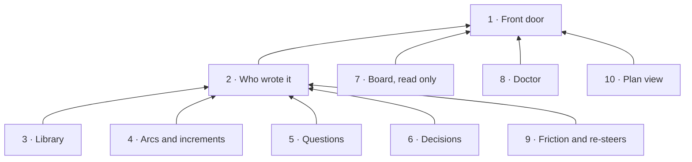

# Story: the command line

**What it is.** `storytree` is the command a person types in a terminal to read and change their
project's records. It is a front door and nothing more: each command is handed to the function its
owning story already has (the library, the agent link), so the command line and the agent's tools
can never disagree.

**Approved** by the owner on 2026-09-27. The tree below is ADR-0645 in storytree 0.2's decision log
(`storytree-ai/storytree02`), approved through the question `oq-0-3-cli-story-tree` (revision 1)
with "T1 as recommended". Names and scope come from that record; change them there first. Its front
cover is `decisions/cli-capability-tree.md`. ADR-0643 D5 made the command line a story of its own.

**The owner's choices** (ADR-0645, "T1 as recommended" records T1 W1 A1 F1 P1 V1 M1):
- **T1:** the ten capabilities below.
- **W1:** the library keeps an optional writer on every write, shown in its history. The command
  line passes the person (their computer user name), and the agent tools pass the session.
- **A1:** when the command runs inside an agent session, found from the harness's session id in its
  environment, a write is recorded as that session, and the command prints which writer it used.
- **F1:** friction and re-steers at the command line (capability 9).
- **P1:** a text view of the plan, `storytree tree` (capability 10).
- **V1:** decision anchors and `adr rebind` are not in the MVP. They can come back through a library
  review that adds anchors first.
- **M1:** ADR-0643's leave-outs n2 (`question check`), n3 (`worktree create`) and n5 (`library
  related --unlinked`) are re-measured by their lanes. The command line adds the matching verb for
  anything the owner brings back.

**Not brought over: did not last in 0.2** (ADR-0639; the drafting session's call, ADR-0645 D5):
`library repoint`, `library --check`, `library artifact retire` (`question retire` stays), `arc
increment ready`, `adr next`, `adr attest`, `adr show` (reading is `adr pull`), `noticeboard history`
and `noticeboard mine`, the `--pg` switch and its offline seed, credential hydration and `doctor
--dev`.

**Cut by the MVP's scope** (ADR-0625 D4, named in ADR-0645 D4): 0.2's command-line capabilities 2,
3, 4, 6, 7, 8, 9 and 10 (corpus tools, the boundary judge, the camp fence, verification decay, the
gate program, the UAT revision gate, forest capture), and the verbs `build`, `node`, `story build`,
`adopt`, `gate`, `coverage`, `drift`, `real`, `orchestrate`, `witness`, `uat`, `members`, `desktop`,
`traversal`, `ownership`, `write-authority`, `lint-panel`, `db` and `factory health`.

**Already another story's, so not in this door:** claiming, releasing and `increment start` (starting
is claiming, ADR-0643 D1), which are the agent tools'; `arc reopen` and `arc close` (an arc's state is
worked out, the library's 10-b and the owner's R1); `increment check` (ADR-0639 D4); `friction
route` and `library graduate`, the librarian's; `init` and install, the app's.

**Rule for building it: port behaviour, not code.** Storytree 0.2's `packages/cli/src` (`main.ts`,
`commands.ts` and each family's help) is the behavioural reference. Nothing is copied from it
wholesale, and the command line keeps no copy of any rule: where a verb needs a function its owning
story does not have yet, the verb waits for it.

**How each capability is proven.** Red→green (ADR-0623). Each contract is one test, committed failing
first (`red(cli-<capability>): …`), then the code that passes it (`green(cli-<capability>): …`).
The tests are `packages/cli/src`'s. They run the real, built `storytree` command as a child process,
in a throwaway storytree home, against the real Postgres `pnpm test` provides, because the promise
is the command as a person runs it.

Build order: 1, 2, 3; then 4, 5 and 6 as the library's 10 to 13 land; then 7 and 8 as the agent
link's revised build lands; then 9 and 10. Where a capability's owning function has not landed, the
parts that need it wait, and the rest is built.

**What it waits on** (ADR-0645 D6, books proposed to the other lanes):
- **The library** (`0-3-library-writer-and-public-reads`): an optional writer on every write, kept in
  history (for 2), and `get(id)`, `list(kind)` and `history({ id })` on its public API (for 3's
  read, edit, list and history, 4's `arc list`, 5's `question list` across arcs, and 6's `adr
  list`).
- **The agent link** (`0-3-agent-link-cli-seams`): its capture functions on its public entry, and a
  `reinforce` beside them (for 9); the session as the writer (for 2); and its setup check's
  `storytree` launcher pointed at this package's built command.

---

## 1 · Front door

`storytree <family> <verb>` works out which project the folder you are in belongs to, opens that
project's library, and hands the command to the owning story's function, keeping no rule of its own.
Every answer is a short plain sentence or listing followed by what you might run next, and a failure
exits non-zero and says what to do.

- **Depends on:** the library's API (its 7), and the agent link's project routing (its 1).
- **As built:** `packages/cli/src/door.ts`. The project is the agent link's `route` from the working
  folder, and storytree's address the owner record it reads in the storytree home (`STORYTREE_HOME`,
  else `~/.storytree/0.3`). A refusal from the library (a schema error, a missing reference, a loop)
  is printed as the library's own message and exits 1; a command the door does not know exits 2 with
  its family's usage. Values given as `@file` are read from that file.

**Contracts** (each one a test):
1. In a project folder, `storytree library search <word>` finds a note written through the library.
2. In a folder that is not a project, it exits non-zero with "not a storytree project".
3. With storytree stopped, it says "storytree isn't running" within a second.
4. A record the library refuses reaches you as the library's own message, and nothing is written.
5. `storytree` alone lists the families.

## 2 · Who wrote it

Every write made through the command line is recorded as the person who ran it (their computer user
name), so the library's history can tell a person's change from an agent's. When an agent runs the
command from its own shell, the write is recorded as that agent's session instead (A1).

- **Depends on:** 1, the library's history with a writer (W1), and the agent link's sessions (its 4).
- **Waits on** `0-3-library-writer-and-public-reads` (the writer on every write) and
  `0-3-agent-link-cli-seams` (the session as writer).

**Contracts:**
1. An edit through the command shows in the record's history as the person.
2. The same edit, run with an agent session's id in the environment, shows as that session.

## 3 · Library

Read any record whole, list a kind (optionally filtered by a field), search the notes, see what links
to a note, and see a record's history of changes, all through the library's own reads. Write a new
record of any kind, or edit named fields of one, with long text taken from a file, and a bad record is
refused with the library's own message.

- **Depends on:** 1, 2, and the library's 2, 3, 6, 7 and 9.
- **Folded in from 0.2:** `library query` became `list --where`; `library inbound` and plain `related`
  became `links`.
- **As built:** `storytree library search <words>`, `links <note>` and `new <kind> --<field> <value>
  …`, each the library's own function (`search`, `relatedNotes`, and the kind's writer). A value is
  text, except `true`, `false`, a whole number, or one starting with `[` or `{` (read as JSON), and
  `@file` reads the file. `read`, `edit`, `list` and `history` wait on the library's `get`, `list`
  and `history` (`0-3-library-writer-and-public-reads`).

**Contracts:**
1. `read` returns the whole body.
2. `edit` changes only the named fields.
3. `new` without a required field is refused, naming it.
4. `history` lists every write with its writer.

## 4 · Arcs and increments

See the arcs, and one arc whole: its intent, end state, increments and their states, the questions
waiting on you, and what each waiting item waits for. Create, edit, park or unpark an arc; park an
increment, record a landing that was never parked, close one with its outcome, and make an arc or
increment wait on another with a reason, or clear the wait.

- **Depends on:** 1, 2, and the library's 10 and 11 (and 12, for the questions shown on an arc).
- **Not here:** `increment start` (starting is claiming, the agent tools'), `increment ready`
  (ADR-0645 D5), and a hand close or re-open of an arc (R1).
- **As built:** `storytree arc show | new | edit | park | unpark | wait | unwait` and `storytree arc
  increment new | add | close | edit | wait | unwait`, each the library's own function. `arc show`
  is `arcView`, with `waitHolds` and `heldOnQuestion` for each open increment. `arc list` waits on the
  library's `list(kind)`.

**Contracts:**
1. An arc with no intent is refused.
2. A close with no pull request needs a note.
3. A wait that would close a loop is refused, naming the loop, and nothing is written.
4. `arc show` names what each waiting increment waits for.

## 5 · Questions

Raise a question for the owner on an arc (stakes, question, context, options, plus the analogy,
diagram and recommendation 0.2 expected), optionally holding increments on it. Settle it with his
answer in his words and the decision that carried it, retire one that was wrong, or list the open
ones.

- **Depends on:** 1, 2 and the library's 12.

**Contracts:**
1. A question with no stakes is refused.
2. Settling needs an answer.
3. A held increment reads as waiting on you until its question is settled.
4. A question an increment is held on cannot be retired.

## 6 · Decisions

List decisions (current, by status, load-bearing) and record a new one with the next number, its
status, who decided it in their own words, and what it supersedes. Pull a decision out as a markdown
file, edit it, push it back, and write its composed statement (the owner's C2).

- **Depends on:** 1, 2 and the library's 13.
- **Folded in from 0.2:** `adr authority` became fields on `adr new` and what `adr pull` shows; `adr
  compose` stays.

**Contracts:**
1. Two `adr new` run at once get different, increasing numbers.
2. Pull then push with no edit changes nothing.
3. A superseded decision drops out of `--current`.
4. A composed statement reads stale after its decision's text changes.

## 7 · Board, read only

Show who is on what right now: each claim on an increment or a capability, with its agent's harness,
window and reason, and whether it is live or idle; or who holds one piece of work. Claiming and
releasing stay with the agents' tools.

- **Depends on:** 1 and the agent link's claims (its 5).

**Contracts:**
1. A claim made through the agent tool appears with its harness and reason.
2. An idle claim reads idle.
3. `noticeboard <id>` names the holder, or "nobody".

## 8 · Doctor

Run storytree's setup check from a terminal, the same one every agent session start runs: is
storytree running, are the hooks registered and last seen firing, is this folder a project, is
`storytree` on the path, is `gh` signed in. It fixes what the check fixes by itself and names the
fix for the rest, and it sets a folder up as a project only when you tell it to.

- **Depends on:** 1 and the agent link's setup check (its 8).

**Contracts:**
1. With storytree closed, it opens it.
2. With `gh` signed out, it names `gh auth login`.
3. In a folder that is not a project, it creates nothing unless told to.
4. A second run changes nothing.

## 9 · Friction and re-steers

File friction with concrete evidence, or a re-steer with your own quoted words, through the agent
link's own capture functions, so vague evidence is refused from a person exactly as from an agent.
Add a recurrence to a friction item when it happens again.

- **Depends on:** 1, 2 and the agent link's capture functions (its 6).
- **Waits on** `0-3-agent-link-cli-seams`: the capture functions on the agent link's public entry,
  and a `reinforce` beside them.

**Contracts:**
1. Friction with vague evidence is refused.
2. A re-steer whose evidence is a paraphrase is refused.
3. `reinforce` adds a dated recurrence.

## 10 · Plan view

`storytree tree` prints the plan as an indented tree: stories, capabilities and contracts, each with
the health its agent reported (labelled as the agent's) and any claim on it. Name a story to see only
that story.

- **Depends on:** 1 and the library's 4, 5 and 7.
- **As built:** one reading of the library's `projectTree`, and of the agent link's claims when
  storytree's activity log has any.

**Contracts:**
1. A story with a capability and a contract prints in order with "agent says passing".
2. An unknown story says so.
