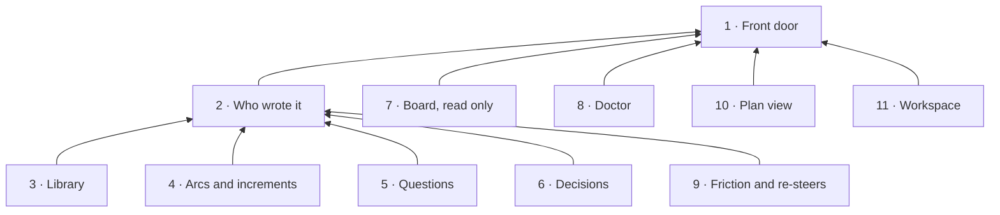

# Story: the command line

**What it is.** `storytree` is the command a person types in a terminal to read and change their
project's records. It is a front door and nothing more: each command is handed to the function its
owning story already has (the library, the agent link), so the command line and the agent's tools
can never disagree.

**Approved** by the owner on 2026-09-27. The tree below is ADR-0645 in storytree 0.2's decision log
(`storytree-ai/storytree02`), approved through the question `oq-0-3-cli-story-tree` (revision 1)
with "T1 as recommended". Names and scope come from that record; change them there first. Its front
cover is `decisions/cli-capability-tree.md`. ADR-0643 D5 made the command line a story of its own.

**The owner's choices** (ADR-0645, "T1 as recommended" records T1 W1 A1 F1 P1 V1 M1):
- **T1:** the ten capabilities below.
- **W1:** the library keeps an optional writer on every write, shown in its history. The command
  line passes the person (their computer user name), and the agent tools pass the session.
- **A1:** when the command runs inside an agent session, found from the harness's session id in its
  environment, a write is recorded as that session, and the command prints which writer it used.
- **F1:** friction and re-steers at the command line (capability 9).
- **P1:** a text view of the plan, `storytree tree` (capability 10).
- **V1:** decision anchors and `adr rebind` are not in the MVP. They can come back through a library
  review that adds anchors first.
- **M1:** ADR-0643's leave-outs n2 (`question check`), n3 (`worktree create`) and n5 (`library
  related --unlinked`) are re-measured by their lanes. The command line adds the matching verb for
  anything the owner brings back.
  The owner brought n3 back as K1 (ADR-0653): capability 11, `storytree workspace`.

**Not brought over: did not last in 0.2** (ADR-0639; the drafting session's call, ADR-0645 D5):
`library repoint`, `library --check`, `library artifact retire` (`question retire` stays), `arc
increment ready`, `adr next`, `adr attest`, `adr show` (reading is `adr pull`), `noticeboard history`
and `noticeboard mine`, the `--pg` switch and its offline seed, credential hydration and `doctor
--dev`.

**Cut by the MVP's scope** (ADR-0625 D4, named in ADR-0645 D4): 0.2's command-line capabilities 2,
3, 4, 6, 7, 8, 9 and 10 (corpus tools, the boundary judge, the camp fence, verification decay, the
gate program, the UAT revision gate, forest capture), and the verbs `build`, `node`, `story build`,
`adopt`, `gate`, `coverage`, `drift`, `real`, `orchestrate`, `witness`, `uat`, `members`, `desktop`,
`traversal`, `ownership`, `write-authority`, `lint-panel`, `db` and `factory health`.

**Already another story's, so not in this door:** claiming, releasing and `increment start` (starting
is claiming, ADR-0643 D1), which are the agent tools'; `arc reopen` and `arc close` (an arc's state is
worked out, the library's 10-b and the owner's R1); `increment check` (ADR-0639 D4); `friction
route` and `library graduate`, the librarian's; `init` and install, the app's.

**Rule for building it: port behaviour, not code.** Storytree 0.2's `packages/cli/src` (`main.ts`,
`commands.ts` and each family's help) is the behavioural reference. Nothing is copied from it
wholesale, and the command line keeps no copy of any rule: where a verb needs a function its owning
story does not have yet, the verb waits for it.

**How each capability is proven.** Red→green (ADR-0623). Each contract is one test, committed failing
first (`red(cli-<capability>): …`), then the code that passes it (`green(cli-<capability>): …`).
The tests are `packages/cli/src`'s. They run the real, built `storytree` command as a child process,
in a throwaway storytree home, against the real Postgres `pnpm test` provides, because the promise
is the command as a person runs it.

Build order: 1, 2, 3; then 4, 5 and 6 as the library's 10 to 13 land; then 7 and 8 as the agent
link's revised build lands; then 9 and 10. Where a capability's owning function has not landed, the
parts that need it wait, and the rest is built.

**Public seams used** (ADR-0645 D6): the library's optional writer and `get`, `list` and
`history` landed in #79; the agent link's capture functions and session writers landed in #82.
The command line calls these public APIs. Question wording still has no public editor in the
library, so `library edit` explains that gap for questions; answering remains `question settle`.

---

## 1 · Front door

`storytree <family> <verb>` works out which project the folder you are in belongs to, opens that
project's library, and hands the command to the owning story's function, keeping no rule of its own.
Every answer is a short plain sentence or listing followed by what you might run next, and a failure
exits non-zero and says what to do.

- **Depends on:** the library's API (its 7), and the agent link's project routing (its 1).
- **Its shelf,** founding book first:
  - **Founding book (ADR-0645 D1):** the command line is a front door and nothing more: it finds
    the project from the folder, and hands each verb to the function its owning story already has,
    keeping no rule of its own.
- **As built:** `packages/cli/src/door.ts`. The project is the agent link's `route` from the working
  folder, and storytree's address the owner record it reads in the storytree home (`STORYTREE_HOME`,
  else `~/.storytree/0.3`). A refusal from the library (a schema error, a missing reference, a loop)
  is printed as the library's own message and exits 1; a command the door does not know exits 2 with
  its family's usage. Values given as `@file` are read from that file.

**Contracts** (each one a test):
1. In a project folder, `storytree library search <word>` finds an artifact written through the library.
2. In a folder that is not a project, it exits non-zero with "not a storytree project".
3. With storytree stopped, it says "storytree isn't running" within a second.
4. A record the library refuses reaches you as the library's own message, and nothing is written.
5. `storytree` alone lists the families.

## 2 · Who wrote it

Every write made through the command line is recorded as the person who ran it (their computer user
name), so the library's history can tell a person's change from an agent's. When an agent runs the
command from its own shell, the write is recorded as that agent's session instead (A1).

- **Depends on:** 1, the library's history with a writer (W1), and the agent link's sessions (its 4).
- **Its shelf,** founding book first:
  - **Founding book (ADR-0645 D2, W1 and A1):** every write names its writer: the person (their
    computer user name), or the agent session when the harness's session id is in the environment,
    and the command prints which writer it used.
- **As built:** every write passes `{ actor }` to its owning public API. The writer is
  `person:<computer user name>`, or `session:<id>` when `CLAUDE_CODE_SESSION_ID` or
  `CODEX_THREAD_ID` is nonempty (Claude Code's id takes precedence if both are present). A write's
  answer prints `Writer: <actor>`. Reads and an unchanged `adr push` name no writer because they
  write nothing.

**Contracts:**
1. An edit through the command shows in the record's history as the person.
2. The same edit, run with an agent session's id in the environment, shows as that session.

## 3 · Library

Read any record whole, list a kind (optionally filtered by a field), search the artifacts, see what links
to an artifact, and see a record's history of changes, all through the library's own reads. Write a new
record of any kind, or edit named fields of one, with long text taken from a file, and a bad record is
refused with the library's own message.

- **Depends on:** 1, 2, and the library's 2, 3, 6, 7 and 9.
- **Its shelf,** founding book first:
  - **Founding book (ADR-0645 D1 item 3):** read, list, search, links, history, new and edit on any
    record, each through the library's own function, so a bad record is refused with the library's
    own message and the door adds no rule.
- **Folded in from 0.2:** `library query` became `list --where`; `library inbound` and plain `related`
  became `links`.
- **As built:** `storytree library search <words>`, `links <artifact>` and `new <kind> --<field> <value>
  …`, each the library's own function (`search`, `relatedNotes`, and the kind's writer). A value is
  text, except `true`, `false`, a whole number, or one starting with `[` or `{` (read as JSON), and
  `@file` reads the file. `read <id>` prints the whole live record through `get`; `edit <id>`
  selects its public editor (`editStory`, `editCapability`, `editContract`, `editArc`,
  `editIncrement`, or `editNote`). Question wording waits on a public library editor.
  `list <kind> [--where <field>=<value>]…` filters the live records from `list(kind)` by exact
  field equality, using the same value parsing; multiple filters all apply. `history <id>` shows
  every write, including retirement, with its date, writer and retirement reason; older writes
  without a writer say "writer not recorded".

**Contracts:**
1. `read` returns the whole body.
2. `edit` changes only the named fields.
3. `new` without a required field is refused, naming it.
4. `history` lists every write with its writer.
5. `list` shows only live records of the kind and filters by a field.
6. `new memory` is refused with the reason that memories belong to the harness, and writes
   nothing (ADR-0650).

## 4 · Arcs and increments

See the arcs, and one arc whole: its intent, end state, increments and their states, the questions
waiting on you, and what each waiting item waits for. Create, edit, park or unpark an arc; park an
increment, record a landing that was never parked, close one with its outcome, and make an arc or
increment wait on another with a reason, or clear the wait.

- **Depends on:** 1, 2, and the library's 10 and 11 (and 12, for the questions shown on an arc).
- **Its shelf,** founding book first:
  - **Founding book (ADR-0645 D1 item 4):** the command line records arcs and increments but never
    sets their state by hand: there is no start (starting is claiming, ADR-0643 D1), no ready (D5),
    and no hand close or re-open of an arc (ADR-0640 R1).
- **Not here:** `increment start` (starting is claiming, the agent tools'), `increment ready`
  (ADR-0645 D5), and a hand close or re-open of an arc (R1).
- **As built:** `storytree arc show | list | new | edit | park | unpark | wait | unwait` and `storytree arc
  increment new | add | close | edit | wait | unwait`, each the library's own function. `arc show`
  is `arcView`, with `waitHolds` and `heldOnQuestion` for each open increment. `arc list` lists
  every live arc from `list("arc")` with its title and the state from `arcView`.

**Contracts:**
1. An arc with no intent is refused.
2. A close with no pull request needs a note.
3. A wait that would close a loop is refused, naming the loop, and nothing is written.
4. `arc show` names what each waiting increment waits for.
5. `arc list` names each live arc with the library's state.

## 5 · Questions

Raise a question for the owner on an arc (stakes, question, context, options, plus the analogy,
diagram and recommendation 0.2 expected), optionally holding increments on it. Settle it with his
answer in his words and the decision that carried it, retire one that was wrong, or list the open
ones.

- **Depends on:** 1, 2 and the library's 12.
- **Its shelf,** founding book first:
  - **Founding book (ADR-0645 D1 item 5 and D5):** a question has four verbs, new, settle, retire
    and list, each the library's own function. `question retire` stays although the general
    `library artifact retire` did not last in 0.2.
- **As built:** `storytree question new | settle | retire | list`, each the library's own function.
  `--hold <increment>` on `new` holds increments on the question's arc (the library's
  `editIncrement` of their `heldOn`); another arc's is held with `arc increment edit --held-on`.
  `list` shows open questions across arcs through `list("question")`, or one arc's through
  `questions(arc)` with `--arc <arc>`. Settled and retired questions are left out.

**Contracts:**
1. A question with no stakes is refused.
2. Settling needs an answer.
3. A held increment reads as waiting on you until its question is settled.
4. A question an increment is held on cannot be retired.
5. `question list` lists open questions across arcs, or on one arc.

## 6 · Decisions

List decisions (current, by status, load-bearing) and record a new one with the next number, its
status, who decided it in their own words, and what it supersedes. Pull a decision out as a markdown
file, edit it, push it back, and write its composed statement (the owner's C2).

- **Depends on:** 1, 2 and the library's 13.
- **Its shelf,** founding book first:
  - **Founding book (ADR-0645 D1 item 6 and D4, V1):** a decision is edited whole, pulled out as a
    markdown file and pushed back, and it carries no anchors: anchors and `adr rebind` are not in
    the MVP.
- **Folded in from 0.2:** `adr authority` became fields on `adr new` and what `adr pull` shows; `adr
  compose` stays.
- **As built:** `storytree adr new | pull | push | compose | list`, each the library's own function.
  `pull` writes a front matter of `key: <JSON>` lines, then `# <title>` and the text; the lines
  under `# read only` (id, number, how it reads, authority, the composed statement and whether it
  is stale) are never pushed. `push` hands `editNote` only what differs, so a push with no edit
  writes nothing. A decision is named by its id, its number, or `ADR-<number>`, resolved through
  `list("decision")`. `adr list [--current] [--status <s>] [--load-bearing]` reads each decision's
  status through `decision(id)`, including supersession; `--current` keeps accepted decisions.
  Filters combine, and the listing shows number, id, status, load-bearing mark and title.

**Contracts:**
1. Two `adr new` run at once get different, increasing numbers.
2. Pull then push with no edit changes nothing.
3. A superseded decision drops out of `--current`.
4. A composed statement reads stale after its decision's text changes.
5. `adr pull` names a decision by id, number, or ADR number.

## 7 · Board, read only

Show who is on what right now: each claim on an increment or a capability, with its agent's harness,
window and reason, and whether it is live or idle; or who holds one piece of work. Claiming and
releasing stay with the agents' tools.

- **Depends on:** 1 and the agent link's claims (its 5).
- **Its shelf,** founding book first:
  - **Founding book (ADR-0645 D1 item 7):** the board is read only: it shows live claims and who
    holds a piece of work, and claiming and releasing stay with the agents' tools (ADR-0643 D1).
- **As built:** `storytree noticeboard [<id>]`, one reading of the agent link's public `readClaims`
  over its activity log, which judges live and idle. The window is the holding session's name.

**Contracts:**
1. A claim made through the agent tool appears with its harness and reason.
2. An idle claim reads idle.
3. `noticeboard <id>` names the holder, or "nobody".

## 8 · Doctor

Run storytree's setup check from a terminal, the same one every agent session start runs: is
storytree running, are the hooks registered and last seen firing, is this folder a project, is
`storytree` on the path, is `gh` signed in. It fixes what the check fixes by itself and names the
fix for the rest, and it sets a folder up as a project only when you tell it to.

- **Depends on:** 1 and the agent link's setup check (its 8).
- **Its shelf,** founding book first:
  - **Founding book (ADR-0645 D1 item 8):** the doctor runs the agent link's own setup check from a
    terminal, not a second one, and sets a folder up as a project only when told to.
- **As built:** `storytree doctor [--set-up <project>]` runs the agent link's public
  `runSetupCheck`, and `setUpProject` only for `--set-up`. Registering hooks and putting the command
  on the path need storytree's hook script, which an installed storytree keeps beside this command;
  run from elsewhere, the doctor says it cannot. The hooks last seen firing is the latest hook line in
  the project's activity log. `storytree setup install | remove` stays the agent link's command,
  run from beside this one. The agent link's `buildBins` bundles this package's command as
  `storytree.mjs` beside its hook and setup scripts, so setup installs a launcher for the full
  command line.
- **Known agent-link launcher limit:** on Windows, `storytree setup remove` removes the running
  `.cmd` wrapper but `cmd.exe` then exits 1 because the batch file is gone. Removal through
  `node <installed storytree.mjs> setup remove` succeeds; fixing wrapper self-removal belongs to
  the agent link's launcher generator.

**Contracts:**
1. With storytree closed, it opens it.
2. With `gh` signed out, it names `gh auth login`.
3. In a folder that is not a project, it creates nothing unless told to.
4. A second run changes nothing.
5. Setup installs the full command beside its hooks; the launcher reads the library and runs
   `doctor`; `setup remove` through the bundled command removes it again.

## 9 · Friction and re-steers

File friction with concrete evidence, or a re-steer with your own quoted words, through the agent
link's own capture functions, so vague evidence is refused from a person exactly as from an agent.
Add a recurrence to a friction item when it happens again.

- **Depends on:** 1, 2 and the agent link's capture functions (its 6).
- **Its shelf,** founding book first:
  - **Founding book (ADR-0645 D1 item 9, F1):** friction and re-steers are filed at the command line
    through the agent link's capture functions, under the same evidence rules, so a person is held
    to what an agent is.
- **As built:** `storytree friction new`, `friction reinforce <id> --evidence <text|@file>`,
  and `resteer new` call the agent link's public `recordFriction`, `reinforceFriction` and
  `recordResteer`, passing the writer. Their evidence refusals reach the terminal unchanged.
  Reinforcement uses the current Git branch, or `--branch <branch>`, and the capture function
  appends its date. Re-steers take `--judged-by <owner|agent>` and optional `--self-report`, kept
  apart from the owner's quoted evidence. Capture never routes friction.

**Contracts:**
1. Friction with vague evidence is refused.
2. A re-steer whose evidence is a paraphrase is refused.
3. `reinforce` adds a dated recurrence.

## 10 · Plan view

`storytree tree` prints the plan as an indented tree: stories, capabilities and contracts, each with
the health its agent reported (labelled as the agent's) and any claim on it. Name a story to see only
that story.

- **Depends on:** 1 and the library's 4, 5 and 7.
- **Its shelf,** founding book first:
  - **Founding book (ADR-0645 D1 item 10, P1):** `storytree tree` is a text view of the plan, and
    the health it shows is labelled as the agent's report, not storytree's verdict.
- **As built:** one reading of the library's `projectTree`, and of the agent link's claims when
  storytree's activity log has any.

**Contracts:**
1. A story with a capability and a contract prints in order with "agent says passing".
2. An unknown story says so.

## 11 · Workspace

`storytree workspace <increment> --reason <text>` makes a workspace already claimed for that work,
in one step: a fresh branch from `origin`'s main as just fetched, a git worktree for it where the
agent's harness keeps its own, and the claim, held by the agent session the command runs in. It is
refused if the work is held or waiting.

- **Depends on:** 1, and the agent link's `makeWorkspace` (its 5.12-5.14).
- **Its shelf,** founding book first:
  - **Founding book (ADR-0653 D1, the owner's K1):** making a workspace for a piece of work and
    claiming it are one step, refused if the work is held or waiting, so a workspace is never made
    and left unclaimed. It is the agent link's claims tool; this is a front door onto it.
- **As built:** the verb hands the folder, the id and the reason to the agent link's
  `makeWorkspace`, and prints the folder, the branch and how to enter it. The claim is the shell's
  agent session's (CLAUDE_CODE_SESSION_ID, else CODEX_THREAD_ID, as capability 2 reads them): a
  claim belongs to the session that will work in the workspace, so from a shell no agent runs it is
  refused, saying to run it from the agent. This is the only claiming verb here; the board (7) stays
  read only.

**Contracts:**
1. From an agent's shell, `workspace <increment> --reason` makes a worktree on a fresh branch from
   `origin`'s main and claims the increment for that session on that branch, naming the folder to
   work in.
2. Work another live session holds is refused naming its holder, and no worktree is made.
3. From a shell no agent session runs, it is refused saying to run it from the agent, and nothing is
   claimed.
