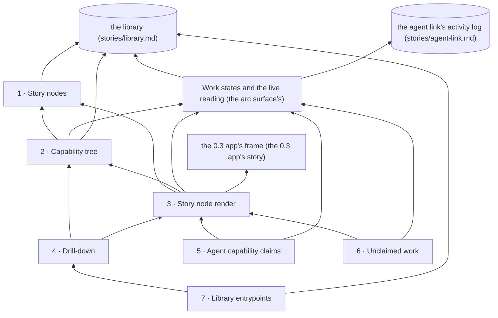

# Story: the forest

**What it is.** Each project is its own 3D forest that grows as its agents' work lands, and any
story opens to explain itself in plain words. Every story is a story node carrying a grove, one tree
per capability: a tree grows as its capability lands, and its leaves show what the agent reports
about its tests. The agents at work show at the capabilities they hold, and work done while holding
no claim is listed beside the forest.

**Approved** by the owner on 2026-09-26. The tree below is ADR-0632 in storytree 0.2's decision log
(`storytree-ai/storytree02`), approved through the question `oq-0-3-forest-capability-tree`
(revision 3). Names and scope come from that record; change them there first.

**Changed by ADR-0633** (the owner's, 2026-09-26): nothing that worked in 0.2 is cut from 0.3
without his explicit decision, and builders work from 0.2's code and corpus. Two things change
here. The arc surface opens as an overlay over the forest, porting 0.2's arc surface, instead of as
a second view behind a Forest | Arcs toggle. And each "left out" line an agent wrote is a proposal
until he decides it by name. The forest's five, items c1 to c5 of
`oq-0-3-cuts-awaiting-owner-decision`, were put to him by name the same day, and he cut all five
(ADR-0635). So every "leaves out" line below now rests on a decision he made himself.

**Rule for building it: port 0.2's code, whole.** Storytree 0.2's forest drawing engine
(`packages/forest-world-r3f`, with the grove look of ADR-0508) is brought over as it stands, as the
package `packages/forest-world`: low-poly islands on a calm sea, the pine kit the owner bought, one
warm light, with no art research (ADR-0625 D4). This follows ADR-0633 D2 (port what worked in 0.2
whole; nothing is cut without the owner's decision) and ADR-0632 D2 ("the land look endorsed for
0.2 is ported as it stands"). It corrects this line's first wording, "port behaviour, not code",
which led capability 3 to redraw the forest by hand as an imitation (storytree-ai/storytree#41);
the owner, on seeing it: "its not as good as 0.2 - i'm confused why we can't get our hard work
from 0.2 and bring it over" (2026-09-27). What 0.3 decides is the input: each story node's place
(P1) and its grove (G1), joined to 0.2's ground in `packages/forest-world/src/forest-ground`.
Only meshes exported from the bought pine kit ship, never the kit itself: its licence allows
derived output and forbids repackaging (ADR-0418's rule, as 0.2 applied it). The forest reads the library only through
its public API (`stories/library.md`, capability 7), and the agent link only through what it already
records (`stories/agent-link.md`, capabilities 2, 4 and 5). It adds nothing to either.

**How each capability is proven.** Red→green, as for the library and the agent link. Each
capability's tests are written and committed first, and seen failing (`red(<capability>): …`).
Then the code that makes them pass is committed (`green(<capability>): …`). The git history is the
evidence that the red came first. The look itself is judged by the owner's eye, not by a test: each
landing that changes it brings him a screenshot.

**The owner's choices** (ADR-0632):
- **A1:** the tree as drawn, seven capabilities.
- **P1:** a story node's place comes from its story alone, and is fixed for good.
- **T1:** a story node is a grove, one tree per capability, the look endorsed for 0.2 (ADR-0508).
  This corrects the signed spec's "one tree per story".
- **G1:** a tree's form follows the work state, and its leaves follow the agent's report, always
  labelled as the agent's own (ADR-0630). On seeing 0.2's engine draw it (2026-09-27, "looks good,
  land this"), the owner kept 0.2's drawing: a seedling is a full-size pine in 0.2's yellow
  building tint on yellow ground, not a smaller tree.
- **U1:** unclaimed work is listed beside the forest, with a count on the forest view.
- **N2:** it is called "unclaimed work", not "unplanned activity". The rule is unchanged: an edit or
  command made by a session that holds no claim at that moment. The owner called the name "a smell
  but we can address this more post mvp".
- **S1:** the 0.3 app gets a story of its own, upstream of the forest and the arc surface. The project
  switcher, hosting the views and which project the app opens on are that story's, not the forest's.

```mermaid
flowchart BT
  N["1 · Story nodes"]
  T["2 · Capability tree"]
  R["3 · Story node render"]
  D["4 · Drill-down"]
  C["5 · Agent capability claims"]
  U["6 · Unclaimed work"]
  E["7 · Library entrypoints"]
  LIB[("the library (stories/library.md)")]
  LOG[("the agent link's activity log (stories/agent-link.md)")]
  WS["Work states and the live reading (the arc surface's)"]
  APP["the 0.3 app's frame (the 0.3 app's story)"]
  N --> LIB
  T --> N
  T --> WS
  T --> LIB
  R --> N
  R --> T
  R --> WS
  R --> APP
  D --> T
  D --> R
  C --> R
  C --> WS
  U --> R
  U --> WS
  E --> D
  E --> LIB
  WS --> LIB
  WS --> LOG
```

Build order: 1 → 2 → 3 → 4 → 5 → 6 → 7.

---

## 1 · Story nodes

The forest keeps one story node for every story in the project: where the story sits in the forest,
with its title and its overall health. Nodes follow the library, so a new story appears as a new
node and a retired story's node goes, with nothing arranged by hand.

- **Depends on:** nothing in this story. It reads the library's `projectTree`, and its change
  history (`changesSince`) for the stories since retired.
- **Its shelf,** founding book first:
  - The planet begins with islands spread around a globe (ADR-0646, decisions/adr-0646.md).
  - The globe packs its islands together on a see-through grey ball, with no sea (ADR-0648, decisions/adr-0648.md).
  - **Founding book (P1):** a node's place comes from its story alone: the next place on a spiral,
    in the order stories were created, fixed for good, and a retired story leaves open sea. So
    nothing ever moves a node, and the planet (ADR-0629) will be a new placement book, not a
    rewrite.
  - **Packed places on a globe (ADR-0648, succeeding W2):** the same permanent place number
    names a fixed spot on a spiral from the front pole. There are 36 frozen places on a sphere
    of radius 160 ground units; retired stories keep their places. A young project's islands
    cluster on part of the ball, with neighbouring coasts a few ground units apart. ADR-0655 D3
    calls for wider spacing measured by pathway width, in the separate pathway look and build;
    this page change retains the current placement table. This book
    replaces ADR-0646's even 128-place spread; it does not inherit its 19-capability size bound.
    The clearance proof uses the look's seed, a fresh seven-story seed and its 36-story sample
    at their real sizes (4–13 capabilities). Arbitrary growth can crowd neighbours. Places past 36 are
    refused until a later book decides them. See [the packed-globe decision](../decisions/planet-packed-see-through.md).
- **Leaves out (vs 0.2), by the owner's pick P1** over P2, a layout that packs stories by how they
  relate: 0.2's layout engine, which ranked stories by their dependencies, packed them onto a hex
  grid and nudged neighbours apart as islands grew, so one story's change could move another's island.
- **As built:** `storyNodes(tree, history)` in `packages/forest`, a pure function of the library's
  `projectTree()` and `changesSince(0)`. A node carries the story's id and title, its health as the
  agent reports it (the library's reported column, rolled up from its contracts), its place number,
  and where that place is, in place-widths from the centre. The spiral's turns are one place-width
  apart and its places one width apart along it, so no two places are closer than 0.97 of a width,
  and a hundred stories sit within 5.7 widths of the centre.
- **Globe book, as built:** `placeOnPackedGlobe(node.place)` in `packages/forest/src/planet-places`
  returns `{ x, y, z }` in ground units, on `PLANET_RADIUS = 160`. Dividing by the radius gives
  the island's outward normal. The 36 directions use the look's spiral, corrected before landing
  for a fresh seed and frozen, never fitted to the live stories or their sizes. The page uses this successor directly. The old W2 algorithm
  is retired; `placeOnGlobe` remains a compatibility alias to the packed rule for existing barrel
  readers. Invalid and exhausted places raise `RangeError`; a retired place is never reused.
  The actual clipped coasts, including beaches, are checked in
  [the placement measurements](../packages/forest/src/planet-places/measurements.md).

**Contracts** (each one a test):
1. Three stories give three story nodes, each with its title and its overall health as the agent
   reports it.
2. Adding a story to the library adds a node, and retiring a story removes its node.
3. The same stories always get the same places: the first story sits at the centre and each later
   one takes the next place on a spiral. Adding or retiring a story never moves another node, and a
   retired story's place is never given to another.
4. On the globe, the same stories always get the same packed spots, on a fixed sphere starting
   at its front pole; a place past the 36-place capacity is refused.
5. Adding or retiring a story never moves another globe island, and a retired spot is never reused.
6. The packed globe's original and fresh seven-story shores and all 36 measured sample shores,
   at their real sizes including beaches, never overlap. This is a bounded proof, not a promise for arbitrary growth.

## 2 · Capability tree

Each story node carries its capability tree: the story's capabilities, which ones build on which,
and where each one stands, from planned through built to landed, and it grows as they land. Where a
capability stands comes from two records kept side by side: the arc surface's rule for planned, in
progress or landed, and the health the agent reports for its tests, always labelled as the agent's
own.

- **Depends on:** 1. It also reads the arc surface's Work states (the one rule for planned, in
  progress or landed, shared so the two views never disagree about "landed"), and the library's
  reported health column, which the agent link's report tool writes.
- **Its shelf,** founding book first:
  - **Founding book (T1):** a story node is a grove, one tree per capability, the look the owner
    endorsed for 0.2 (ADR-0508). This corrects ADR-0625's "one tree per story".
  - **G1:** a tree's size follows the work state, and its leaves follow the agent's report: a
    seedling while planned or being built; a pale tree once landed with nothing reported; a full
    green tree once landed and reported passing; a dead tree once landed with a failing report.
  - One rule for "landed" is shared with the arc surface.
  - Health is the agent's report, labelled as the agent's (ADR-0630 D2).
- **Leaves out (vs 0.2), by the owner's decisions:** health from 0.2's signed build verdicts, with
  its six states and five colours, drift badges and crown sizes (verified health was dropped,
  ADR-0630, and 0.2's build machinery is out of the MVP, ADR-0625 D4).
- **As built:** `grove(story, states)` in `packages/forest`, a pure function of one story from the
  library's `projectTree()` and the arc surface's `workStates(lines)` (`@storytree/arc-surface`,
  built there under the arc surface's names, ADR-0632 D3). A tree carries its capability's id and
  title, the capabilities it builds on, its work state, the agent's reported health and its form.
  Trees come in build order: each after those it builds on within the story, otherwise in the order
  the capabilities were created.

**Contracts:**
1. A story with four capabilities, planned, being built, landed and reported passing, and landed
   with a failing report, gives a seedling, a seedling, a full green tree and a dead tree, in build
   order, each with the capabilities it builds on.
2. A capability the agent reports red while it is being built stays a seedling.
3. A landed capability with nothing reported is a pale tree.
4. A story with no capabilities yet shows one seedling, so a new story is never invisible.

## 3 · Story node render

Draws every story node and its capability trees on the globe. You can turn and zoom the globe,
and clicking a story node selects it. The globe is the only view on the page (ADR-0655); the
flat forest canvas remains in the engine, where its island drawing is reused.

- **Depends on:** 1 and 2. It is kept current by the arc surface's live reading, and sits in the 0.3
  app's frame (the 0.3 app's story, ADR-0632 D4); until that story is built it uses today's project
  dropdown as it is.
- **Its shelf,** founding book first:
  - **Founding book:** the land look endorsed for 0.2 is ported as it stands, with no art research
    (ADR-0625 D4, ADR-0508).
  - The forest keeps 0.2's fixed view and full-size seedlings (ADR-0642, decisions/adr-0642.md).
  - **Planet book: a failing island is never hidden** (ADR-0646, H1). The globe opens facing a
    failing island: any dead tree makes its island failing, as in the ground's worst-form rule.
    If several fail it faces the first in story order; if none fail it faces the first story.
    A failing island on or behind the horizon gets an edge marker, whose turn brings it to the
    front. `openingTurn`, `edgeMarkers` and `turnToIsland` in `packages/forest/src/never-hidden`
    calculate this without drawing: absolute north-up turns and unit-circle marker positions.
    Pure tests prove opening toward failure, a hidden island's marker bringing it to the front,
    and no marker for a failure already in front. The globe page draws those markers.
  - **Packed land on a see-through grey ball (ADR-0648):** the globe has a light grey transparent
    shell with a clear middle, a bright rim and one soft highlight under L1 (the owner’s
    glass-ball tuning after #93), with no sea, bridges or filled continent. The far side shows
    through empty areas;
    names, claims and clicks keep their near-side rule. The islands and kit pines keep their
    existing drawing, and L1 keeps the light over the viewer's shoulder. The knowledge core
    is not mounted on the globe; ADR-0655 D2 defers its page entry.
    See [the decision](../decisions/planet-packed-see-through.md).
  - **The globe alone (ADR-0655 D1/D2):** the page opens on the globe, without a Forest or
    “Look inside” choice. The flat canvas remains in the engine, and knowledge-core calculations
    remain available in their own package. Pathway spacing is a separate look and build.
    See [the globe-only decision](../decisions/globe-only-and-room-for-pathways.md).
  - Only meshes exported from the bought pine kit ship, never the kit itself. Its licence allows
    derived output and forbids repackaging, as 0.2 applied it (ADR-0418).
  - The look is judged by the owner's eye, with a screenshot at each landing that changes it.
- **Leaves out (vs 0.2), by the owner's decision** (ADR-0635, c1 to c3): the 2D map that took the
  clicks while the 3D picture sat underneath; the rig for measuring looks, 72,875 of 0.2's 142,439
  forest lines, with its texture and palette ladders, crowd scenes and true-ground projection; and
  the website mount.
- **As built:** the plan is `forestScene(tree, history, states)` in `packages/forest`: every story
  node an island at its place (one place-width is 16 world units), its grove set out from the
  middle like a sunflower's seeds in build order, and its name. `forestDrawn` says what was drawn as
  the smoke check reads it (`surface: "forest"`, with each tree's form and the names added),
  `changedIslands` names the islands a change touched, and `storyAt` is the island under a point on
  the flat ground. The engine retains 0.2's forest canvas and `forestDescriptors`: one hex tile
  per capability relaxed into its ground mesh, a smoothed coast, and one parcel per capability
  wearing its tree's form, with ground cover grown from contract count. The globe reuses that
  island drawing and 0.2's kit pines (only `dressing-kit.glb` ships, never the kit).
  The page (`apps/desktop/src/forest/forest-view.tsx`) mounts the globe alone. Its story names,
  island clicks, selection rings and claim markers live in the same scene. The arc surface's
  live reading keeps it current: the tree is read again only when the library changed, and
  unchanged islands retain their objects so only changed islands are recomputed.

- **Packed globe, as built:** the page's `planetLayout` selects the frozen packed spots, and
  `PlanetWorldCanvas` mounts each unchanged island as a tangent plate above a radius-160 shell.
  A small shader on the same double-sided shell makes it read as glass: a nearly clear middle,
  a brighter Fresnel rim, and one soft highlight from L1's lamp over the viewer's shoulder.
  The centre's base opacity is 0.012; the highlight stays faint enough to retain at least 80%
  of the far-side contribution through the middle. Depth writing stays off. Its ray hits still
  hide back-side labels and claims and stop clicks selecting a hidden island. Opening turns,
  edge markers and story selection keep working. The page has no view switch; `forestDrawn`
  continues to report its seeded stories and capability trees to the smoke check.
  [Headless Chromium comparisons](../apps/desktop/src/forest/evidence/glass/README.md) show the
  seeded page before (#93) and after this tuning, with the renderer named. The
  [globe-only page capture](../apps/desktop/src/forest/evidence/globe-only/README.md) records
  the later removal of the page choices and the surviving selection and smoke journey.

**Contracts:**
1. The app opens a seeded project on the globe alone; its smoke check finds one story node per
   story, each drawn with its capability tree.
2. A capability landing redraws just its story node, without a reload.
3. Clicking a story node selects it.
4. Each near-side story node shows its story's name, readable as the globe turns and zooms (ADR-0636
   D4: in 0.2 the names lived on the 2D map the owner cut, so the 3D forest carries them).
5. The globe’s glass shell has a nearly clear middle, admitting at least 80% of the far-side
   contribution through both faces, with a bright rim and one soft highlight; there is no opaque sea.

## 4 · Drill-down

Clicking a story node opens a panel that explains the story in plain words: its two sentences, then
each capability's two sentences with its health as the agent reports it, and its contracts on
request. A small diagram shows how the capabilities connect, each pointing at the ones it builds on,
including any in other stories, named with their story and marked if not yet landed.

- **Depends on:** 2 and 3. It reads the library's `projectTree`.
- **Its shelf,** founding book first:
  - **Founding book:** the user's agent writes every description as it plans, and storytree writes
    none (ADR-0625 D1).
  - A missing description says so, instead of leaving a blank.
  - Each contract shows whether the agent reported it red before green, from the history the
    library keeps (ADR-0630 D2).
  - The "storytree saw" column appears only where something wrote it (0.3's own project, from its
    seed). Elsewhere the agent's report stands alone, labelled as the agent's.
  - Cross-story capability links are shown, the same ones the arc surface shows.
- **Leaves out (vs 0.2), by the owner's decisions:** the pannable sub-map of 0.2's story panel
  (part of a 5,624-line studio component), with its ancestor and descendant highlighting, and its
  session dock (ADR-0635, c5). The panel's library drawer is the artifact browser he cut from the MVP
  (ADR-0625 D4).
- **As built:** `drillDown(tree, story, states, history)` in `packages/forest`, a pure function of
  what the page already holds: the story's sentences, its capabilities in the grove's build order
  with their sentences (or "no description yet"), work state and the agent's reported health, and
  their contracts with the agent's trail in words ("red, then green", "green only"), read from the
  health saves in the library's change history. Storytree's own column is carried only where an
  entry was written. The diagram's arrows point from each capability to those it builds on; one in
  another story is named with that story and marked until it lands. The page
  (`apps/desktop/src/forest/story-panel.ts`) draws it as a panel over the forest's right side, with
  the contracts folded until asked for and the diagram as boxes in columns by build depth, a box
  dashed until it lands. Clicking a story node opens it, the × or empty space closes it, and the
  live reading keeps it current.

**Contracts:**
1. A story whose third capability builds on the first two opens to its sentences and its
   capabilities in build order, each with its sentences and its health as the agent reports it, and
   a diagram with exactly two arrows.
2. A capability that builds on a capability in another story shows an arrow to it, named with that
   story, and marked if it has not landed yet.
3. A capability with no description says "no description yet" instead of leaving a blank.
4. A contract the agent reported red, then green, shows "red, then green"; one reported only green
   says so.
5. Storytree's own column shows beside the agent's report only where something wrote it.

## 5 · Agent capability claims

Shows which agent holds which capability right now, with the agent's one-line reason, at that
capability in its story node. It follows the agent link's claims and sessions, so the marker of an
agent that has gone quiet fades, and a session whose hooks never reported in is flagged rather than
shown as idle.

- **Depends on:** 3. It reads the agent link's claims and sessions through the arc surface's live
  reading, which re-checks the clock once a minute, so a marker fades even when no new line arrives.
- **Its shelf,** founding book first:
  - **Founding book:** a claim is never a sign of health (carried from 0.2).
  - A missing hook never reads as an agent doing nothing (ADR-0626 D4).
- **Leaves out (vs 0.2), by the owner's one-holder rule** (ADR-0626 C1): claim grades, so a claim
  has no grade colour and there is no queue.
- **Leaves out (vs 0.2), by the owner's decision** (ADR-0635, c4): build wisps coloured by gate
  phase, and subagent tints.

- **As built:** `claimMarkers(lines, now)` in `packages/forest`: one marker per claim standing, read
  through the agent link's own `claimsFrom` and `sessionsFrom`, from its browser-safe entry
  `@storytree/agent-link/readings` (added for the page, which cannot bundle the root entry's
  Postgres code). A marker says "<agent>: <reason>", fades when its holder is quiet past the quiet
  time, is flagged "hooks not running" when its session wrote no hook line (never faded), and
  carries no health or state. The page draws each over its tree, and the live reading's minute
  clock re-judges them with no new line.

**Contracts:**
1. Session A claims "email form", and a marker reading "Claude Code: building the email form"
   appears at that capability.
2. After the quiet time with no new line the marker fades, and when A reports the capability landed
   it goes.
3. A session seen only through its tool calls is flagged "hooks not running".
4. None of this changes how a capability's state is drawn.

## 6 · Unclaimed work

Shows the edits and commands made by agents holding no claim: who made them, which files, and when,
with a count always in view. It is how work outside the plan stays visible, even from an agent that
never calls storytree.

- **Depends on:** 3. It reads the agent link's attribution of each edit and command through the arc
  surface's live reading.
- **Its shelf,** founding book first:
  - **Founding book:** unclaimed work is never guessed onto a story. Storytree cannot know which
    story it belongs to, so it says so plainly.
  - **U1:** it is listed beside the forest, with a count on the forest view.
  - **N2:** it is named "unclaimed work", not "unplanned activity" (ADR-0632 D5). It comes from
    setup before a plan, fixes between claims, agents that skip claiming, agents that ignore
    storytree, and seam or glue work done while holding no claim. Glue done under a claim counts
    toward that claim. Reducing it is a post-MVP concern: the MVP shows it honestly.
- **Leaves out (vs 0.2):** nothing to leave. 0.2 had no picture of unclaimed work: every mark on its
  map was tied to a claimed unit, and its hooks never recorded edits.

- **As built:** `unclaimedWork(lines)` in `packages/forest`: every edit and command the agent
  link's own `attributeFrom` counts toward no capability, newest first, with the agent as people
  call it, the files or the command, and the time, and their count. It touches no story node. The
  page shows a box at the forest's lower left, "Unclaimed work" with its count always in view,
  opening to the list; the live reading keeps it current.

**Contracts:**
1. Session B edits two files while holding no claim: the list shows B, both files and the time, the
   count reads 2, and no story node changes.
2. B then claims a capability, and its next edit counts toward that capability instead.
3. An agent that never calls storytree still appears, through its hooks.

## 7 · Library entrypoints

Inside the drill-down, shows the story's and each capability's shelf of front-cover decisions as
spines (each cover's title and first line), with the founding book first. Opening a book shows its
text and the titles of the artifacts it links to and from.

- **Depends on:** 4. It reads the library's shelf read (`frontCovers`) and `relatedNotes`, and the
  titles of the artifacts a book links out to from the change history the app already follows, since the
  library has no "read one artifact" function. It is not a priority (ADR-0627 D8), so it lands last.
- **Its shelf,** founding book first:
  - **Founding book:** one step in, and no artifact browser (ADR-0625 D4). Opening a book lists its
    links' titles, and stops there.
  - The founding book first, then oldest first (ADR-0627 D2).
- **Leaves out (vs 0.2), by the owner's decisions:** the library drawer, which is the artifact browser
  he cut from the MVP (ADR-0625 D4), and its lists of citations, which his rabbit-hole model replaces
  (ADR-0627): 0.2 offered agents 3,351 pointers to decisions and 156 were opened, 4.7% (ADR-0464).
- **As built:** `shelved(panel, covers)` and `openBook(cover, linkingIn, history)` in
  `packages/forest`. `shelved` puts each front cover on the shelf its mark names, the story's or one
  of its capabilities', founding book first and then oldest first, and an empty shelf says so.
  `openBook` gives the book's full text, the titles of the artifacts that link to it, and the titles of
  the artifacts it links to, found in the change history. The page reads the shelves when a story opens,
  through two new reads the app answers (`frontCovers` and `relatedNotes`, the app story's Surfaces).
  It reads them again when an artifact changes. The panel shows each shelf as spines under "Front covers",
  and a spine opens its book in place.
- **Founding books on the shelves:** `pnpm seed:library` now files each capability's founding book,
  the first item of its shelf in its story file, as that capability's first front cover. It is found
  again on later runs by its last line, `Founding book of stories/<name>.md, capability N.` A
  capability that a decision file already covers keeps that decision as its founding book (the app's
  Updates, ADR-0637). Every capability of every story now has a founding book or a decision cover:
  the library, agent-link and command-line stories gained theirs for the move of the story text into
  the library (`0-3-library-move-story-text`).

**Contracts:**
1. A capability with three front covers shows three spines, founding book first, each with its
   title and first line.
2. Opening a book shows its full text, and the titles of the artifacts that link to it and of those it
   links to.
3. An empty shelf says "no decisions on this shelf yet".
4. A decision on another capability's shelf never appears here.

---

## Also out of this story

- **The 0.3 app's frame** belongs to the 0.3 app's own story (ADR-0632 D4, on
  `storytree-0-3-app-arc`): its database, the project switcher, hosting the views, and which project
  it opens on. Until that story is built, the forest uses today's project dropdown as it is.
- **The arc surface** opens as an overlay over the forest, porting 0.2's arc surface (ADR-0633 D3,
  item 14). It is the arc surface's story to build, not the forest's. Whichever of the two surfaces
  lands second adds the button that opens it, under the 0.3 app story's name, as ADR-0632 D3 had it
  for the toggle this replaces.
- **Work states and the live reading** belong to the arc surface's tree (ADR-0632 D3): the one rule
  for planned, in progress or landed, and the reading that keeps both views current. The forest uses
  them. Whichever surface reaches a shared piece first builds it under the other tree's name, and
  whichever lands first retires today's plain list.
- **The planet** (ADR-0629): islands on a sphere, with the project's knowledge inside as a core. It
  arrived as books on Story nodes and Story node render (ADR-0646). The knowledge core remains
  a separate story; ADR-0655 defers its page entry.
- **Storytree's own check of the tests** is out of the MVP (ADR-0630): the forest shows what the
  agent reports, labelled as the agent's.
- **Left out by the owner's own decisions** (ADR-0632 D6, as ADR-0633 annotated it): health from
  signed verdicts (ADR-0630), citation lists (ADR-0627), art research and a second style, and 0.2's
  forest in the 0.3 app (ADR-0625 D4). 0.2's layout engine gives way to his pick P1 (capability 1).
  The rest of D6's list was written by an agent; he decided it by name and cut all five (ADR-0635):
  the 2D map, the look-measuring rig, the website mount, build wisps and subagent tints, and the
  story panel's sub-map and session dock.
