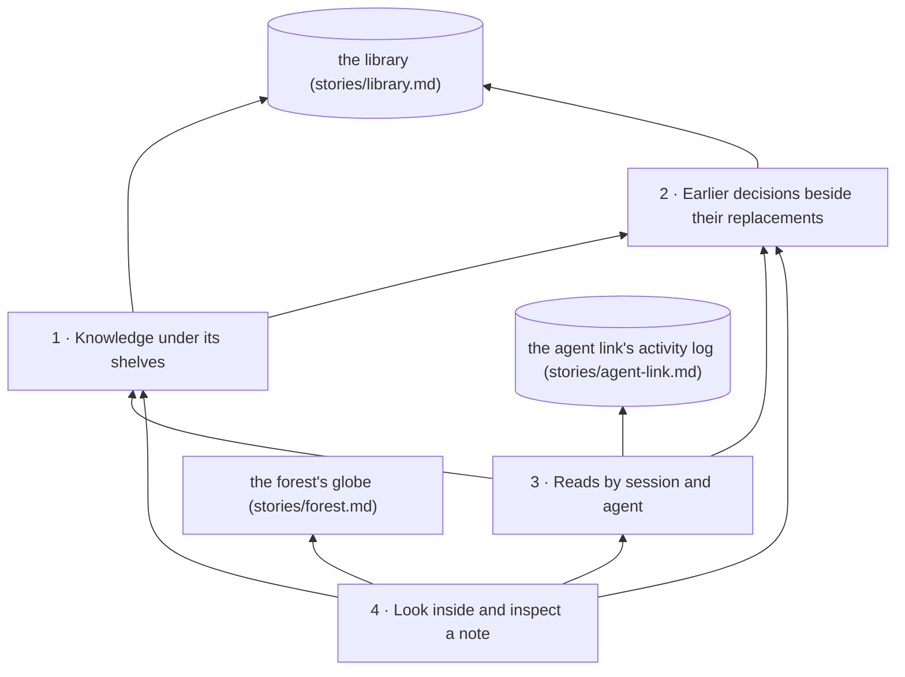

# Story: the knowledge core

**What it is.** The knowledge inside the planet. The project's notes hang below the front covers
on the stories' and capabilities' shelves, deeper the longer the chain of references that reaches
them; replaced decisions sit as see-through ghosts beside the decisions that replaced them; and the
notes one recorded session reached light up in each of its agents' colours. The owner looks inside
the globe on purpose, pins a note to read it, and replays a session.

**Approved** by the owner on 2026-09-27. The tree below is ADR-0647 in storytree 0.2's decision
log (`storytree-ai/storytree02`), approved through the question `oq-0-3-knowledge-core-tree`
with "L3 ... else I think we just get this moving". Names, proof lines and scope come from that
record; change them there first. Its front cover is `decisions/knowledge-core-capability-tree.md`.

**The owner's choices** (ADR-0647 D1, the question's recommendations except L):
- **A1:** these four capabilities are the first slice. It will start sparse: the measured seed has
  40 front covers at depth 1, five notes outside, no note-to-note links and no captured reads.
- **D1:** a chain follows stored references in their direction. The shelf-to-cover step counts 1,
  and a note's depth is its greatest over every entrance. A memory that points only back at its
  cover has no route down from that shelf, so it orbits outside.
- **L3 (ADR-0647 D2):** the knowledge graph refuses loops. The library refuses a note-to-note link
  that would close one, naming the chain it would close; that is the library's own increment
  (`0-3-library-refuses-loops`, landed as storytree-ai/storytree#87), not this story's. Capability 1
  still draws a loop it meets, one written before the refusal, as a visible, labelled error, never
  a supported shape, so the layout never breaks.
- **G2:** a ghost comes from the decision log's explicit supersession, plus the older write-history
  recipe, labelled "earlier cover". Proposed decisions are not ghosts in this slice.
- **R1:** reads come from the agent link's existing activity log, read from the start and then its
  new lines. The core owns no read store.
- **T1:** replay now. A peek only lights its note; a known agent's full reads advance as jumps,
  never a line along a link, because today's record names no source note.
- **V1:** visits (distinct captured sessions), a Visits / Links in size toggle, grey for a note the
  selected session did not reach, and links shown only for the pinned note.
- **S1:** no whole-core stale-links colouring. A pinned note's card says when it links to a ghost.
- **E1:** a deliberate "Look inside" view: sea and island surfaces hide, named entrances stay, the
  failure attention stays, and the flat forest is one click away.
- **Built now (ADR-0647 D3):** in parallel with the MVP, and iterated on later. This retires
  ADR-0629 D3's "ranks below every MVP increment" for the core.

**What it reads.** The library only through its public API (`stories/library.md`, capability 7):
`projectTree` and the change history `changesSince`, the two reads the page already makes. The agent link only through
its activity log (`stories/agent-link.md`, capability 2): `note-read` lines and the agent on each
(ADR-0629 D2). The forest's globe places (`stories/forest.md`, capabilities 1 and 3). It adds
nothing to any of them.

**How each capability is proven.** Red→green, as for every 0.3 story (ADR-0625): each capability's
tests are written and committed first and seen failing (`red(<capability>): …`), then the code
that makes them pass (`green(<capability>): …`). The tests are `packages/knowledge-core/src`'s.
Behaviour gets the minimum red-then-green proofs; the owner judges the drawing from the real seed
and clearly labelled examples of links, loops, ghosts and reads, with a screenshot at each landing
that changes the look.

Build order: 2 → 1 → 3 → 4.

---

## 1 · Knowledge under its shelves

The project's notes hang below the stories' and capabilities' front covers, with depth counting the
longest chain of references from any shelf. A shared note appears once, a loop is drawn as a
labelled error, and a note no shelf reaches orbits outside with "no depth".

- **Depends on:** 2, for which notes are ghosts. It reads the library's `projectTree` and its
  change history (`changesSince`), and places entrances at the forest's island places.
- **Its shelf,** founding book first:
  - **Founding book (D1, approved with ADR-0647):** a chain follows stored references in their
    direction. The shelf-to-cover step counts as 1, and each later link adds 1. A note's depth is
    the longest chain from any shelf, never the shortest route or its popularity (ADR-0476 D2).
    Visits and incoming-link counts never change it (ADR-0476 D4). A note reached by two shelves
    appears once, at its greatest depth, and names both entrances. A front cover keeps its own
    shelf as its home; another shared note hangs under the oldest reachable shelf, ties broken by
    id. Ghosts and proposed decisions are left out of depth.
  - **Loops (L3, ADR-0647 D2):** the graph is a DAG, and the library refuses a loop-closing link
    (storytree-ai/storytree#87). For a loop stored before that, a group of notes that all lead back to one another is drawn as one knot,
    labelled as a refused shape, at one group depth; notes beyond it still get their longest-chain
    depth. An unreachable loop, like any unreachable note, stays outside with no depth.
  - **Outside means only "no recorded route from a shelf"**, never "unimportant": several
    whole-project decisions sit on no shelf (ADR-0631).
- **As built:** `underShelves(changes, knowledge)` in `packages/knowledge-core`, a pure function of
  the library's `changesSince(0)` and capability 2's `knowledge`. Each live story and capability is
  a shelf on its story's island, oldest first, holding its active front covers, oldest first; an
  empty one says "no knowledge on this shelf yet". Links are followed between active notes only.
  Notes that all lead back to one another (Tarjan's strongly connected groups), or a note linking
  to itself, form one loop with one depth and the label "loop: a refused shape"; depth is the
  longest chain over the groups. Each placed note carries its depth, home, entrances (oldest
  first) and loop; the rest are outside, by id.
- **On the real seed** (this repo's stories and decisions synced into a scratch project on
  2026-09-27, with this story added): 74 notes and 65 shelves, all with a cover; 69 notes at depth
  1; the five outside are the planet, licence, testing-rule, MVP-spec and verified-health
  decisions, as the review measured; no loops and no ghosts.

**Contracts:**
1. With a cover A, links A → B → C and a shortcut A → C, C stays at depth 3: the shelf-to-cover
   step counts as 1. Visits and incoming-link counts never change that depth.
2. A note reached by two shelves appears once, at its greatest depth, and names both entrances. A
   front cover keeps its own shelf as its home, and another shared note hangs under the oldest
   reachable shelf, with a stable tie-break.
3. With A → B → C → B and C → D, B and C share a loop marked as an error at group depth 2, and D is
   at 3. An unreachable loop, like any unreachable note, stays outside with no depth.
4. Forty covers on their shelves and five notes on none, with no links, give forty notes at depth 1
   and five outside, with no invented links. An empty shelf says it is empty.

## 2 · Earlier decisions beside their replacements

A replaced decision appears as a see-through ghost beside the decision that replaced it, and lights
when its recorded reader reaches it. Its card tells an explicit supersession from an earlier cover
found in write history. Proposed decisions stay out of this first slice.

- **Depends on:** nothing in this story. It reads the library's change history
  (`changesSince`): each decision's status and `supersedes` (capability 13), and its writes.
- **Its shelf,** founding book first:
  - **Founding book (G2, approved with ADR-0647):** the decision log's explicit supersession is
    authoritative: an accepted decision naming an old one in `supersedes` makes it a ghost, even
    when the old front-cover mark was never cleared. A proposal naming it does not. For older
    records, history can add an "earlier cover" ghost: a new cover on the same shelf links to the
    old one, and then the old cover's mark is cleared, with a unique such replacement. A cleared
    mark alone, an edited wording, or a plain link to an old decision prove no replacement.
  - **Replacement is not support.** Ghosts and proposed decisions take no part in depth or
    incoming-link sizes, and drawing or lighting a ghost never moves the layout.
- **As built:** `knowledge(changes)` in `packages/knowledge-core`, a pure function of the library's
  `changesSince(0)`. It replays the history to the live notes and returns them with the ghosts,
  the proposed decisions, the active notes (neither) and each active note's count of distinct
  active notes linking to it. Supersession is the library's own reading, repeated over the
  history: an accepted decision naming another in `supersedes` (capability 13). An "earlier cover"
  needs its mark cleared (not moved) while a newer cover on the same shelf links to it, and no mark
  since. Each ghost names the decision that replaced it directly and the current one it sits
  beside; a chain that branches, or ends at a note no longer live or proposed, is "replacement not
  placed".

**Contracts:**
1. An accepted decision that explicitly supersedes an old one makes a ghost, even when the old
   front-cover mark was never cleared. A proposal naming an old decision does not supersede it.
2. For older records, a new cover on the same shelf linking to the old one, followed by clearing
   the old cover's mark, makes an "earlier cover" ghost when the replacement is unique. Clearing a
   mark alone, editing the wording, or merely linking to an old decision does not.
3. A unique chain of replacements ends beside its current successor. A missing or ambiguous
   successor gets an outer ghost labelled "replacement not placed", rather than a guessed home.
4. Depth and incoming-link sizes use only notes that are neither ghosts nor proposed; replacement
   relations are not support links. A ghost never changes that layout, and its own visit count
   stays inspectable.

## 3 · Reads by session and agent

Choose one recorded session and see which notes its orchestrator and named agents reached, each in
its own colour, with visits counted across the project's captured sessions. A peek only lights its
note, full reads advance as jumps, and an unknown agent stays pale with no path.

- **Depends on:** 1 and 2, to find the notes and the ghosts. It reads the agent link's activity log
  (`note-read` lines, with their optional agent, ADR-0629 D2) and owns no read store.
- **Its shelf,** founding book first:
  - **Founding book (R1 and T1, approved with ADR-0647):** read the project's log from the start,
    then its new lines, keeping counts in memory, de-duplicated by line number. A visit is a
    distinct session that peeked at or read the note. Within one session each agent replays in
    recorded order. A peek lights its note and draws nothing; each full read of a known agent is a
    stop reached by a jump, never a line along a link, since the record names no source note. A
    read with no agent, or "unknown", lights its note pale and has no path.
  - **Reach, never usefulness** (ADR-0624 D3, ADR-0548): a read proves the note was reached through
    storytree's tools, not that it helped, and nothing read outside those tools is seen. With no
    captured reads the view says "no recorded reads", never that the knowledge went unused.
- **As built:** `ReadRecord` in `packages/knowledge-core`, fed with the lines the page already
  reads from the log (`linesSince`, from 0 and then its new lines). It keeps one project's
  `note-read` lines in memory, each taken once by its line number, and `switchTo(project)` starts
  again. `visits(note)` counts distinct sessions and `totals(note)` its peeks and whole reads.
  `replay(session, present)` gives each agent of the session in line order: every read of a
  present note lit, and for a known agent its whole reads as jumps from its previous whole read.
  "unknown" and a read with no agent are one pale agent with no path. A subagent is labelled only
  by what the harness recorded, on the read or on its `subagent-started` line: its type, else its
  id. Reads of notes no longer present are counted as missing. Opening cost grows with the whole
  log; a real log's size was not measured.

**Contracts:**
1. Repeated peeks and whole reads of one note by several agents in one session count as one visit;
   a second session makes two. The card gives peek and whole-read totals separately.
2. Interleaved agents replay separately in recorded order, including equal timestamps resolved by
   log line number; no step crosses agents or sessions. A missing agent field behaves exactly like
   "unknown".
3. A peek neither draws a step nor replaces the agent's previous full-read stop. A whole read found
   "through a link" stays a jump, because today's record names no source note.
4. Receiving the same log lines twice does not count visits twice. Switching projects clears the
   old project's picture, and a read of a note no longer present is counted as a missing note, not
   dropped or reconstructed.
5. With no captured reads the picture says "no recorded reads"; it never says the knowledge was
   unused.

## 4 · Look inside and inspect a note

"Look inside" reveals the core at the globe's existing positions, keeping the named shelf entrances
while hiding the sea and island surfaces until you return. You can pin a note to read it and see its
links, replay the selected session, and size notes by visits or incoming links without moving them.

- **Depends on:** 1, 2 and 3, inside the app's existing forest view and the forest's globe
  (`stories/forest.md`, capability 3), whose failure attention it keeps.
- **Its shelf,** founding book first:
  - **Founding book (E1 and V1, approved with ADR-0647):** a deliberate "Look inside" view. Sea
    and island surfaces hide; entrance positions stay, named. Links show only for the pinned note,
    in their stored direction, both in and out, and never look like replay cues. A note the selected
    session did not reach is faded grey, whatever other sessions did, and every note keeps a visible
    minimum size. Visits / Links in changes size, never place, and says what it counts.
  - **Stale links (S1):** no whole-core colouring; a pinned note's card says when it links to a
    ghost.
- **Leaves out, for a later review** (ADR-0647, deferred proposals, not cuts): a permanently
  see-through sea, a flying dive and a cutaway; proposed-decision ghosts; the full stale-links
  colouring; recording exact source notes for future walks; changes to default note filing; a
  dedicated indexed read query; side-by-side sessions, a general note browser and graph editing.

**Contracts:**
1. From the globe, the owner can open the core, find a shelf's entrance and pin a note; its card
   shows its text, home, depth or "no depth", replacement evidence where present, and recorded
   counts.
2. Knowledge links show only for the pinned note, in their stored direction, both in and out. They
   look different from replay cues and never claim an agent followed them.
3. A note the selected session did not reach is faded grey, even with visits from other sessions,
   and every zero-visit note keeps a visible minimum size. Switching Visits / Links in changes size,
   not placement, and labels what is counted.
4. Play, pause and restart replay one session; each named agent can be hidden on its own, and the
   legend names the orchestrator and subagents without inventing missing names or tasks.
5. The failure attention stays visible while looking inside, and the flat forest stays one click
   away; opening the core cannot hide a failing story. Returning to the globe restores its islands,
   sea and selection.

---

## Also out of this story

- **Refusing loops** is the library's write path (ADR-0647 D2): `0-3-library-refuses-loops` on
  `storytree-0-3-library-arc`. This story only draws a loop it meets as an error.
- **The globe itself**, its places and its never-hidden rule are the forest's (ADR-0646), built as
  `0-3-planet`.
- **The read record** and the agent on each read are the agent link's (ADR-0624, ADR-0629 D2).
