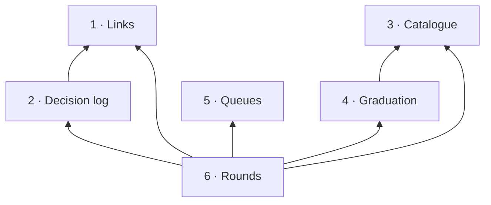

# Story: the librarian

**What it is.** The librarian keeps a project's library honest as a library: new notes are
genuinely new, a note links to what it really rests on, every accepted decision stays true, durable
lessons move to where agents read them, and the question and friction queues are drained. It is
0.2's `librarian-curator`, ported whole. In 0.3 storytree runs no agents of its own, so the
librarian is a hat the user's own agent puts on for a few minutes at a landing, using storytree's
tools.

**Approved** by the owner on 2026-09-27. The tree below is ADR-0644 in storytree 0.2's decision
log (`storytree-ai/storytree02`), approved through the question `oq-0-3-librarian-capability-tree`
(revision 1) with "approve, H1 U1 G1". Names and scope come from that record; change them there
first. Its front cover is `decisions/librarian-capability-tree.md`.

**The owner's choices.**
- **H1:** a story of its own. It reaches the library only through the library's public API
  (`stories/library.md`, capability 7) and runs through the agent link's one tool server
  (`stories/agent-link.md`, capability 6).
- **U1:** built to work on any project, switched on for 0.3's own library first, and for users'
  projects with `0-3-app-users-own-projects`, before first users. This is ordering, not a cut.
- **G1:** the decision health check (0.2's `check:adr-health`) is a report in the librarian's
  worklist, not a CI check: a user's library is local, and a copy for CI would undo the one copy.

**Settled under ADR-0639 by the recording session (ADR-0644 D3), not put to the owner.**
- **S:** 0.2's separate `graduation-synthesist` role is not brought over: it did not last in 0.2
  (zero spawns in about 145 recorded sessions, August to September 2026). Friction routing did last,
  done in librarian passes, so that judgement is Queues' (5).
- **R:** ranked `library related --unlinked` is not brought over: 12 uses, all on 2026-08-23 and 29
  while it was being built, none in September (ADR-0643 D4). Links uses plain search, which lasted.
- **The 7-day question lease** is not brought over: it did not last (ADR-0643 D4; ADR-0640 book 12-a
  withdrawn). Queues looks at every open question on each pass instead.

**Boundaries** (ADR-0644 D4). The library stores and refuses: status, supersedes and rests-on edges,
the load-bearing mark, numbers, kinds, questions settled with their answers, history; it refuses a
dangling link, a supersession loop and an answerless settle, and it owns the one reading of which
decisions are current. The librarian holds no data of its own. The agent link owns the tool server,
the activity log and the habits card; the librarian registers its tools there. Raising, settling and
retiring a question stay the agent link's tools, since any agent may settle a question it opened.

**Rule for building it: port behaviour, not code.** Storytree 0.2's `librarian-curator` agent role
and the notes it works to (`accepted-adrs-carry-no-stale-prose`, `pre-merge-librarian-pass`,
`edit-first-curation`, `two-consumer-extraction`, `friction-adjudication`) and its graduation engine
(`packages/library/src/graduation`) are the behavioural reference. Most of the librarian's work is
judgement its agent makes; what is code is what the judgement needs to see (the worklist) and the
writes it makes (its tools), each keeping one of the rules below.

**How each capability is proven.** Red→green, as for the library: each capability's tests are
written and committed first and seen failing (`red(<capability>): …`), then the code that makes them
pass (`green(<capability>): …`). The tests are `packages/librarian/src`'s, against the real Postgres
`pnpm test` provides.

Build order: 1 → 2 → 3 → 4 → 5 → 6. Links comes first, because ADR-0631 D2 is waiting on it.

---

## 1 · Links

The librarian links one note to another only where the first really rests on the second, and finds
the notes nobody has linked yet by plain search. This is how the whole-project decisions come to sit
behind the covers that rest on them.

- **Depends on:** nothing.
- **Its shelf,** founding book first:
  - **Founding book (proposed, approved with ADR-0644):** a link means "rests on", and nothing
    weaker. There is no "see also" web: 0.2 deleted its own because it became unusable (ADR-0477).
  - **ADR-0631 D2 (decided):** its first job is to link the MVP spec (ADR-0625), minimal viable TDD
    (ADR-0623) and the license (ADR-0617) to the capability-level covers that rest on them. The seed
    never writes links, so these survive every re-seed.
  - **Proposed, approved:** a definition links to the decision that created the term, and never to
    another definition.
  - **Proposed, approved:** friction and re-steers carry no links, as in 0.2 (open questions are not
    notes in 0.3, so carry none either).
  - **R (settled, ADR-0644 D3):** neighbours nobody linked are found with the library's plain
    `search`.
- **As built:** `link` and `unrestedDecisions` in `packages/librarian/src/links`. The library itself
  lets friction and re-steers carry links, so these rules are the librarian's, kept at its own
  write. A superseded or proposed decision on no shelf is not on the worklist.
- **ADR-0631 D2's links, drawn 2026-09-27** in 0.3's own library, each from the cover's own
  recorded "Depends on" in 0.2's decision log: the agent link's tree (ADR-0626), knowledge entrances
  (ADR-0627), the forest's tree (ADR-0632) and the app's tree (ADR-0634) rest on the MVP spec
  (ADR-0625); the app's tree also rests on minimal viable TDD (ADR-0623). No cover's record depends
  on the license (ADR-0617; ADR-0621 only cites it under References), so it has no link and stays on
  the worklist, as ADR-0631's context expected.

**Contracts:**
1. `link(from, to)` makes note `from` rest on note `to`, keeping its other links. Linking it again
   writes nothing.
2. A definition rests only on a decision, and a friction or re-steer rests on nothing: any other
   link is refused, naming the rule, and nothing is written.
3. The worklist names each accepted decision on no shelf that no note rests on, and drops it once
   one does.

## 2 · Decision log

Every accepted decision stays true in full. When a later landing overtakes something a decision
says, the librarian corrects it in place if the decision did not change, and records a new decision
that supersedes it if it did; finished business is retired or consolidated.

- **Depends on:** 1.
- **Its shelf,** founding book first:
  - **Founding book (proposed, approved):** the dividing question is "did the decision change?".
    No: correct the text in place, and the library's history keeps the old wording. Yes: record a
    new decision that supersedes it, and the old one stays readable as superseded. Finished
    business: retire it if nothing points at it (3), otherwise fold it into a new decision that
    restates what is still true and supersedes it.
  - **Proposed, approved:** "superseded" is read from the replacing decision's edge and never stored
    (0.2's ADR-0609; the library's 13-b).
  - **Proposed, approved:** a decision that narrows a clause of another leaves a note in that other
    decision, in the same landing.
  - **Proposed, approved:** only the owner ever turns an accepted decision back to proposed.
  - **Proposed, approved:** the load-bearing mark is a curated reading list with no cap, and the
    librarian decides removals.
  - **Decided (ADR-0627):** replacing a node's front cover works as the library's capability 9 does
    it: the successor takes the shelf, and the old one leaves it.
  - **G1 (the owner's):** the decision health check is a report in the worklist. The library
    already refuses a bad status, a dangling edge and a supersession loop when each is written, so
    what the report finds is what a write cannot refuse: an edge whose record was retired later.
- **As built:** `supersede`, `correct`, `annotate` and `brokenEdges` in
  `packages/librarian/src/decision-log`. Consolidating is `supersede` with several old decisions.
  Marking load-bearing is a correction in place (`correct(id, { loadBearing })`). An annotation
  names the narrowing decision by its number and title, or its title when it has no number yet. The
  health report reads every note-to-note reference, not only links and supersessions: a process's
  hand-ons and an agent role's reading too.

**Contracts:**
1. `supersede(olds, decision)` records a new accepted decision naming the old ones in `supersedes`.
   Each old one reads superseded and stays readable; the new one takes the shelf the first old one
   covered, and any old one's load-bearing mark.
2. `correct(id, fields)` changes a decision in place (its text, title or load-bearing mark), and
   the old wording stays in its history. A correction that would turn an accepted decision back to
   proposed is refused, since only the owner does that, and nothing is written.
3. `annotate(target, { by, note })` adds a dated note to the target decision's text, naming the
   decision that narrows it. A narrowing decision that is not a live decision is refused, and
   nothing is written.
4. The worklist's health report names each link or supersession that points at a record no longer
   live, with both ends.

## 3 · Catalogue

Every note that lands is either genuinely new or an edit to the note that already covers it, and
never a near-copy. Guidance any capable agent would work out for itself is pruned.

- **Depends on:** nothing.
- **Its shelf,** founding book first:
  - **Founding book (proposed, approved; 0.2's `edit-first-curation`):** look for an existing note
    before a new one is written. If one exists, edit it instead.
  - **Proposed, approved (0.2's `two-consumer-extraction`):** pull a shared piece out into its own
    note only when two or more current notes use it.
  - **Proposed, approved:** prune with the blind test: if a reader without the note would work it
    out anyway, it goes.
  - **Proposed, approved:** a note is retired only if nothing points at it.
  - **Proposed, approved:** a rule that moved into a note stops being cited by decision number in
    the place it left. When in doubt, the citation stays.
- **As built:** `retire` and `newNotes` in `packages/librarian/src/catalogue`. What points at a note:
  any note's reference (links, supersessions, a process's hand-ons, an agent role's reading), an
  increment's `remedies` and a question's `settledBy`. A title's words are those of four letters or
  more, each searched on its own; a memory's text stands for its title, and a definition's term.

**Contracts:**
1. `retire(id, reason)` retires a note nothing points at. A note that another live record points at
   (a link, a supersession, a process's hand-on, an agent role's reading, rules or anti-patterns, an
   increment's remedies, or a question it settled) is refused, naming what points at it, and nothing
   is written.
2. The worklist lists each note written new since a cursor, with the live notes a plain search for
   any word of its title finds, so the agent can see what might already cover it.

## 4 · Graduation

A durable lesson moves out of the agent's private memory and into the kind of note agents actually
read: a principle, a process or a definition. Then the memory is deleted.

- **Depends on:** 3.
- **Its shelf,** founding book first:
  - **Founding book (proposed, approved; 0.2's ADR-0095):** read the agent's memory folders on this
    machine, write each durable lesson into the library as a principle, process or definition, and
    only then delete the memory.
  - **Proposed, approved (0.2's ADR-0202):** a memory reviewed and kept is parked with its reason for
    60 days. An edit, or the end of those 60 days, brings it back with the question "is this still
    alive?".
  - **Proposed, approved (0.2's ADR-0154):** a way of working decided in a load-bearing decision gets
    a current process note.
  - **Proposed, approved:** every process matches a real tool or command, and every tool or command
    has a process behind it, or a stated reason why not.
- **As built:** `memoryWorklist`, `park`, `graduate` and `processGaps` in
  `packages/librarian/src/graduation`. A memory folder is laid out as Claude Code keeps one: a
  Markdown file per memory and an index, `MEMORY.md`, whose line for a graduated memory goes with
  it. The park ledger is 0.2's, `graduation-park.json` beside the folder, with each park's reason,
  date and a fingerprint of the memory's text. Claude Code's folder for a project is
  `claudeCodeMemoryFolder(project, home)`. A process names a tool when its `surfaces` holds the
  tool's name as a word; a tool with a stated reason for having no process is the agent's call on
  the report.
- **Codex's memory, found 2026-09-27:** Codex keeps no memory folder. Its memories are an internal
  database (`~/.codex/memories_1.sqlite`, the table `stage1_outputs`), holding none on the owner's
  machine. Graduation reads any folder of memory files it is given, so nothing here is Claude
  Code's alone, but reading Codex's database is not built: it is left open on the build's
  increment for the owner, not cut.

**Contracts:**
1. The worklist lists each memory in the memory folders that is new, changed since it was parked, or
   parked more than 60 days ago. A memory parked unchanged within its 60 days is not listed.
2. `park(memory, reason)` keeps the reason, the date and what the memory said when it was parked,
   beside the memory folder, never in the library.
3. `graduate(memory, kind, fields)` writes the lesson as a principle, process or definition, and only
   then deletes the memory. A write the library refuses leaves the memory where it was, and any
   other kind is refused.
4. The worklist lists each process that names none of the tools served, and each tool served that
   no process names.

## 5 · Queues

Open questions and friction reports don't pile up. Each is looked at on the librarian's pass, and
nothing is closed without a reason.

- **Depends on:** nothing.
- **Its shelf,** founding book first:
  - **Founding book (proposed, approved; 0.2's ADR-0168 D4):** each pass drains at most the three
    oldest friction reports filed by another session, so the librarian never marks its own homework.
  - **Proposed, approved:** an answered question is settled with its answer and never retired,
    because retiring it would destroy the answer.
  - **S (settled, ADR-0644 D3):** the routing judgement is the librarian's own, on this pass.
  - **The lease (settled, ADR-0644 D3):** no 7-day lease; every open question is looked at on each
    pass.
- **As built:** `openQuestions`, `frictionDrain` and `route` in `packages/librarian/src/queues`. A
  friction report with no provenance counts as another session's, as in 0.2, so the queue cannot
  drain by going anonymous. A report is drained once it carries a route and its reason; what it is
  routed to (a decision, a tool, a note, an edit) is then that route's own work.

**Contracts:**
1. The worklist lists every open question on every arc, oldest first.
2. The worklist's friction drain holds at most the three oldest friction reports not yet routed that
   another session filed, never one filed from the session's own branch.
3. `route(friction, route, reason)` records the routing judgement with its reason. A route with no
   reason is refused, and nothing is written.

## 6 · Rounds

When the librarian runs, and how an agent is told to put on its hat. At a landing where the session
wrote to a curated kind of note, storytree asks for the librarian's pass before the landing is
reported.

- **Depends on:** 1, 2, 3, 4 and 5; the agent link's tool server and `land` (ADR-0643 D6).
- **Its shelf,** founding book first:
  - **Founding book (proposed, approved; 0.2's `pre-merge-librarian-pass`):** the trigger reads the
    library's change feed since the session started. It fires on any write to decisions, questions,
    principles, guardrails, patterns, processes, definitions or agent roles, and it fires when
    unsure.
  - **Proposed, approved:** graduation runs at every landing, because only this session knows what
    it learned. The rest runs only when the trigger fires.
  - **Proposed, approved:** the pass finishes before the landing is reported: in 0.2 that meant
    before the pull request opened, because a green pull request merges in minutes.
  - **Proposed, approved (ADR-0643 D6):** the agent link's `land` returns a "next" line, and the
    librarian fills it with "run the librarian's pass" when the trigger fires. `land` itself never
    decides anything about curation.
  - **Proposed, approved:** the librarian's role text is a subagent definition. For 0.3's own
    development it is generated with the rest of the agent guidance (ADR-0636 b5).
  - **Proposed, approved:** its tools (the worklist, link, supersede, correct in place, annotate,
    mark load-bearing, retire, park, graduate and route) are added to the agent link's one tool
    server through its one registration point, which also gives them a door on the people's command
    line. The habits card gains at most one line.
  - **U1 (the owner's):** on for 0.3's own library first.
- **As built (6.1, 6.2):** `roundDue` and `worklist` in `packages/librarian/src/rounds`. The trigger
  takes the change feed's cursor from when the session started; with none it fires. Matching
  processes against tools is in the worklist when the tools served are given to it.
- **Not built yet (6.3, 6.4, 6.5), waiting on the agent link:** the one registration point where
  another story adds its tools to the tool server, and the "next" line `land`'s answer ends with
  (ADR-0643 D6, the agent link's capability 6, `0-3-agent-link-revised-tree-build`). Neither had
  landed on 2026-09-27. The librarian's tools, `land`'s next line and the subagent definition naming
  those tools are built against that point when it lands, not against a copy of it.

**Contracts:**
1. The trigger fires when the change feed since the session started holds a write to a curated
   kind, and when there is no start to read from; graduation is due at every landing either way.
2. The worklist gathers each capability's list into one report: graduation's always, the rest only
   when the trigger fired.
3. `land`'s answer ends with the "next" line "run the librarian's pass" when the trigger fired, and
   with none when it did not.
4. A test client lists the librarian's tools on the agent link's one server, beside its own, and
   calls them.
5. The librarian's subagent definition names every librarian tool the server serves.
