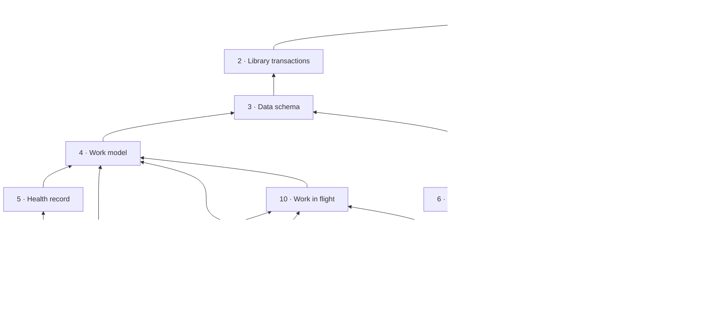

# Story: the library

**What it is.** The library is where one project's records live: the plan of work, how healthy
each piece is, and what the project has learned. Every later storytree 0.3 story reads and writes
the library, and only through its API. People never browse it directly; they see it through the
forest and the arc surface, while agents reach it through the agent link.

**Approved** by the owner on 2026-09-26. The tree below is ADR-0621 in storytree 0.2's decision log
(`storytree-ai/storytree02`). Names and scope come from that record; change them there first.
Capability 9 was added on 2026-09-26 by ADR-0627 in the same log. On 2026-09-27 ADR-0640 grew
capability 6 by eight knowledge kinds and added capabilities 10 to 13, for what ADR-0633 brought
back from 0.2: increments, waits, the owner's questions and the decision log.

**Rule for building it: port behaviour, not code.** Storytree 0.2's `packages/library` and
`packages/storage-protocol` are the behavioural reference. Nothing is copied from them wholesale.

**How each capability is proven.** Red→green. Each capability's tests are written and committed
first, and seen failing (`red(<capability>): …`). Then the code that makes them pass is committed
(`green(<capability>): …`). The git history is the evidence that the red came first.


```mermaid
flowchart BT
  P["1 · Project libraries"]
  R["2 · Library transactions"]
  F["3 · Data schema"]
  W["4 · Work model"]
  H["5 · Health record"]
  K["6 · Knowledge artifacts"]
  D["7 · Library API"]
  C["8 · Cloud connection (GCP)"]
  E["9 · Knowledge entrances"]
  I["10 · Work in flight"]
  WT["11 · Waits"]
  Q["12 · Owner questions"]
  L["13 · Decision log"]
  R --> P
  F --> R
  W --> F
  K --> F
  H --> W
  D --> W
  D --> H
  D --> K
  D --> P
  C --> P
  E --> W
  E --> K
  D --> E
  I --> W
  WT --> I
  Q --> I
  L --> K
  D --> I
  D --> WT
  D --> Q
  D --> L
```

Build order: 1 → 2 → 3 → (4, 6) → 5 → 7, then 8, then 9, then (6's eight kinds, 10), then (11,
12), then 13.

---

## 1 · Project libraries

Each project gets its own library, a separate database on one Postgres server, created the first
time the project is opened, with its tables set up automatically. Storytree can list the projects on
the server, and nothing written in one project can ever show up in another.

- **Depends on:** nothing.
- **Its shelf,** founding book first:
  - **Founding book (ADR-0621 D3):** one database per project, so projects are walled apart by
    construction and a forgotten filter can never leak one into another. The accepted cost: every
    project database gets its own tables, and a schema change reaches each one.
- **Leaves out (vs 0.2):** Cloud SQL and Google sign-in (that is capability 8), credential
  hydration, the remote store door, 0.2's single shared database with no idea of a project.
- **Snapshots** (ADR-0641 D2 step 4, choice B1): once a project's library is the only copy of its
  plan, a snapshot of the whole project, records and history, is its backup. A snapshot restores
  only into an empty project, so it can never overwrite live edits. The app takes them (the app
  story's Lifecycle, contract 8).

**Contracts** (each one a test):
1. `openProject("site")` on a server with no storytree databases creates the project's database and
   its tables.
2. Opening the same project again succeeds and changes nothing (no error, no second database, its
   records are untouched).
3. After opening "site" and "app", `listProjects()` returns exactly `["app", "site"]`. Databases on
   the server that are not storytree projects are never listed.
4. A record saved in "site" cannot be read from "app".
5. A project name that is not lower-case letters, digits and single hyphens (1–40 characters,
   starting with a letter or digit) is refused before anything touches the server, and the error
   names the rule.
6. `snapshot("site")` returns every record of the project and its whole history, as they stood at
   one moment, while writes go on.
7. `restore("copy", snapshot)` into a project with no records and no history gives back the same
   records and the same history, sequence numbers, actors and times included, and the next write
   continues after them.
8. Restoring into a project that holds any record or any history is refused, naming the project, and
   writes nothing.

## 2 · Library transactions

The only data actions the library allows are: save a record, fetch it, list records of one type,
change only named fields, or retire a record with a reason. Every change is all-or-nothing, and is
written first to a permanent, append-only history, so nothing is ever truly erased.

- **Depends on:** 1.
- **Its shelf,** founding book first:
  - **Founding book (ADR-0621 D1):** a small fixed set of data actions, each written first to an
    append-only history, and an edit changes only the fields it names, merged onto what is stored
    now. 0.2 once lost 7,058 characters of guidance to a whole-record save.
- **Leaves out (vs 0.2):** the HTTP transport, the separate drift/change store, and the
  whole-document "replace" edit that caused 0.2's lost-update bug. **Kept on purpose:** an
  in-memory twin that runs the SAME test suite as Postgres, so later stories can test without a
  database.
- **Writer book (ADR-0645 D2):** every save, edit and retire accepts an optional `actor`, kept on
  that change's history entry. The public write methods carry it as their final `WriteOptions`
  argument (`{ actor: "person:<user name>" }`, or an agent session). No writer is inferred when
  omitted. Health retains its reporter, `by`, as the actor unless an explicit `actor` is supplied.
  This uses the existing history column on Postgres and its in-memory twin; no migration is needed.

**Contracts** (one shared behaviour suite, run against BOTH the in-memory twin and Postgres):
1. `save` creates a record. Saving the same id again replaces it, and each save appends one history
   entry.
2. `edit` changes only the fields it names; every other field keeps its stored value.
3. `edit` merges onto what is stored NOW, not onto a copy the caller read earlier. If two edits of
   different fields race, both survive.
4. `edit` of a missing record returns `null` and creates nothing.
5. `get` of a missing record returns `null` and never throws.
6. `list(type)` returns only that type's current records (none retired), and `[]` when there are
   none.
7. `retire(id, reason)` removes the record from `get`/`list`, keeps the reason in the history, and
   retiring an already-retired or missing record is a harmless no-op.
8. `history()` returns every change in the order it happened, with strictly increasing sequence
   numbers. `history({ id })` filters to one record, and `history({ since })` returns only entries
   after that sequence number.
9. A `validate` check passed to `save`/`edit` sees the merged result. If it throws, nothing is
   written (no record change and no history entry).
10. A write naming an `actor` keeps it in history. A write without one is accepted and its history
    entry has no actor; an edit or retirement never inherits an earlier write's actor. Refused
    writes and harmless no-ops add no history entry.

## 3 · Data schema

Every record has a declared type with a fixed set of fields, and a badly filled-in record is refused
with a message naming the problem field. Every record is stamped with the schema version it was
written on, so a later change to a type is handled deliberately rather than silently misread: an
older record is upgraded automatically, step by step, and stored upgraded the next time it is
written, because every user's library is their own database and nobody else can repair it.

- **Depends on:** 2.
- **Its shelf,** founding book first:
  - **Founding book (ADR-0621 D1; ADR-0636 a1):** every record has a declared type and carries the
    schema version it was written on. A record newer than the code is refused; an older one is
    upgraded, because every user holds their own database.
- **Types:** `arc`, `story`, `capability`, `contract`, `health`, `decision` and
  `definition`; capability 6's `principle`, `guardrail`, `pattern`, `process`, `agent`, `friction`,
  `resteer` and `techstack`; capability 10's `increment`; and capability 12's `question`. A
  decision's optional `frontCoverOf` field (capability 9) was added at version 1: every decision
  written before it still fits the type, so it is not a new version. Two types reach version 2
  (ADR-0640 D1): an arc gains a required intent and end state (capability 10), and a decision a
  required status (capability 13). Each has its first upgrade step, so every older record carries
  over untouched.
- **Leaves out (vs 0.2):** generated renderers and templates, and 0.2's `uat-criterion` kind (UAT is
  out of the MVP by the owner's scope decision, ADR-0625 D4).
- **Brought back (ADR-0636 D1, a1, 2026-09-27):** 0.2's upgrade machinery, as automatic upgrading
  of older records (`packages/library/src/schema/upgrades.ts`). 0.3 starts at version 1 and adds
  an upgrade step only when the first real change needs one: making a field required, or renaming
  or removing one. Adding an optional field needs none.

**Contracts:**
1. Saving a `story` with no `title` is refused, the error names `title`, and nothing is written.
2. An unknown field (for example `titel`) is refused and named.
3. An unknown type is refused.
4. Every stored record carries its schema version (1 today).
5. Reading a record stamped with a version NEWER than this code knows is refused with an error
   saying so. It is never guessed at.
6. An `edit` that would leave the record invalid (for example blanking a required field) is
   refused, and nothing is written.
7. A record written on an OLDER version of its type is read (`get`, `list`) upgraded to the current
   version, its upgrade steps applied in order. Reading it writes nothing.
8. An `edit` of such a record merges onto its upgraded fields and stores it on the current version,
   in place, in the same all-or-nothing write. If the upgraded result does not fit, nothing is
   written.
9. An older record that no upgrade step brings to the next version is refused by `get`, `list` and
   `edit`, with an error naming the missing step. It is never guessed at.

## 4 · Work model

The library holds each project's plan of work: arcs (initiatives), stories (what a user can do),
capabilities (the parts that make a story work) and contracts (single testable promises).
Capabilities and contracts point at their parent. Stories belong to the project directly, and an arc
*may* list the stories it grows, though a research arc may list none. The library refuses broken
structure.

- **Depends on:** 3.
- **Its shelf,** founding book first:
  - **Founding book (ADR-0621 D2):** stories belong to the project, and an arc may list the
    stories it grows but need not; a research arc may touch none. An agent's search starts from
    the story, so `arcsFor` answers which arcs touched it.
- **Leaves out (vs 0.2):** story files mirrored from the repo (the library is the only copy), UAT
  walkthroughs, proof modes and code anchors. Arc increments, left out here at first, came back as
  capability 10.

**Contracts:**
1. Add a story, a capability under it and a contract under that, and `projectTree()` returns them
   nested: story › capability › contract.
2. An arc listing that story is returned by `arcsFor(storyId)`. An arc listing no stories is
   accepted.
3. A capability naming a missing (or retired) story is refused, as is a contract naming a missing
   capability and an arc listing a missing story.
4. A capability depending on another capability that does not exist is refused.
5. A dependency loop between capabilities (A → B → A, or longer) is refused, and nothing is
   written.

## 5 · Health record

Every story, capability and contract has a health record with two separate columns: what the agent
**reported**, and what storytree **verified** by seeing it for itself. Each column is one of three
states: `passing`, `failing` or `not-checked`. A missing entry always reads as `not-checked`, never
as `passing`.

- **As built:** health is *recorded* on contracts and *derived* for capabilities and stories (the
  roll-up in contract 4 below), so a story or capability never carries a second, conflicting source of
  health; writing health straight onto one is refused with a message saying it rolls up.
- **Depends on:** 4.
- **Its shelf,** founding book first:
  - **Founding book (ADR-0621 D1 and D5):** two separate columns, what the agent reported and what
    storytree verified, and a missing entry reads "not checked", never "passing". The library
    stores health; running a story's tests belongs elsewhere.
- **Leaves out (vs 0.2):** signed verdicts, the prove-it spine, anchors, drift and attestations.
  Also left out is **running the tests**: the library only *stores* the verified result, and a later
  story decides when to run a story's tests and writes it.

**Contracts:**
1. A node with no health entries reads `reported: not-checked, verified: not-checked`.
2. After an agent reports a contract `passing`, it reads `reported: passing, verified:
   not-checked`.
3. After storytree records the same contract verified `failing`, both columns are kept and shown
   side by side (`reported: passing, verified: failing`).
4. A capability or story's health is rolled up from its contracts, column by column: `failing` if
   any contract is failing; `passing` only if it has at least one contract and every one is
   passing; otherwise `not-checked`. A single never-checked contract keeps its story `not-checked`.
5. Every health entry is kept in history with who wrote it and when. A health entry for a node that
   does not exist is refused.

## 6 · Knowledge artifacts

Alongside the plan, the library keeps what the project has learned: decisions and
definitions of terms, and principles, guardrails, patterns, processes, agent roles, friction,
re-steers and tech stack, each with 0.2's fields. Each can link to the other artifacts it relates to,
and you can find them again by searching their words; an edit keeps the old wording in history. An
artifact never links straight to the work: capability 9 is how the work reaches its knowledge.

- **Changed by ADR-0650 (2026-09-27):** there is no library `memory` type or `writeMemory`
  function. Memories belong to the harness; durable knowledge is written as a proper artifact kind.
  See [the decision](../decisions/library-no-memory-type.md).
- **Upgrade, as built:** opening a project converts a legacy memory only when its text supplies a
  supported kind and all required fields: `Definition: <term>` followed by its meaning, or JSON
  `{ "kind": "<kind>", "fields": { ... } }`. Original links are kept; classification adds no
  references, front cover or decision number. Anything ambiguous, incomplete or from an unknown
  schema version stays intact and is reported on every open, with its id and the history read
  that retrieves it. Converted records keep their ids and creation times; one `upgrade:adr-0650`
  history entry records the conversion, under the project's write lock. Reopening converts none
  twice. Original writes, including those of retired memories, remain in history and snapshots.
- **Story text move/export (ADR-0650):** the move files each block as a definition whose term
  starts `Story text: ` and names its source file and section, with the exact block as its meaning.
  The export prints only those definitions behind the linked front cover; ordinary definitions
  stay out of the story printout. Round trips preserve block order, and a second move writes nothing.
- **Depends on:** 3.
- **Grown** on 2026-09-27 by ADR-0640 with the eight kinds 0.3 had left out (ADR-0633 D3 item 7).
  They are written with `writeKnowledge(kind, fields)`, which joins 7's list of functions, and
  edited with `editNote` like every other artifact.
- **Its shelf,** founding book first:
  - **Founding book (6-a):** the eight kinds keep 0.2's fields, plus a title and one-line
    description; an agent role's rule and required-reading lists are links to those artifacts.
  - **6-b:** friction keeps its adjudication fields, recurrences and discharge; re-steers keep
    defect-or-taste, who judged it, the failure mode, and the owner's words as evidence apart from
    the agent's account. The library stores them; counting rates is not its job.
- **As built (6.6, 6.7):** each kind is a record type of its own at version 1, with 0.2's fields
  (`packages/library/src/schema/types.ts`). An agent role's `context`, `rules`, `antiPatterns` and
  `stepRefs`, and a process's `branchEdges`, must name live artifacts, as links do. `search` reads every
  piece of text in an artifact except the fields that name other artifacts. A re-steer's "a defect needs a
  mode" is a rule across two fields, so its refusal names `mode` in the rule's own words.
- **Leaves out (vs 0.2):** the ~1,200-artifact corpus (0.3 starts nearly empty), the graduation
  lease, and ranked "related" search. Open questions are capability 12, and decision status and
  supersession capability 13.

**Contracts:**
1. An artifact is found by `search` on any word it contains (case-insensitive).
2. `relatedNotes(noteId)` returns every artifact that links to that artifact.
3. Editing a decision keeps its old wording in history.
4. A link to a record that does not exist is refused.
5. `definitions()` returns every live definition, and nothing else, in creation order. Added for
   the agent link's definition lookups at each prompt (ADR-0636 D1, b2), which adds `definitions`
   to 7's list of functions.
6. Each of the eight kinds is saved with its required fields, and refused, naming the field,
   without one.
7. Friction with no evidence is refused, and so is a re-steer marked a defect with no failure mode.
8. Saving a `memory` is refused with the reason that memories belong to the harness, and nothing
   is written.
9. Opening an older project converts an explicitly classified memory once, keeping its id, links
   and history, and reports an unclassified memory while preserving its original record.

## 7 · Library API

One small, fixed list of functions is the only way anything outside the library reads or writes it.
The agent link, arc surface, forest and desktop app all call these, and `changesSince` lets them see
what just changed without re-reading everything.

- **Depends on:** 1, 4, 5 and 6.
- **Its shelf,** founding book first:
  - **Founding book (ADR-0621 D1 and D5):** one small fixed list of functions is the only way in
    or out, so it is the contract every later story is written to, and widening it is a deliberate
    act. The MCP server is a thin wrapper over it.
- **Leaves out (vs 0.2):** the Library CLI, the browse UI, the HTTP door, and raw SQL. The MCP server
  belongs to the agent-link story, as a thin wrapper over this API.
- **Extended** on 2026-09-26 by ADR-0626 with three edit functions, `editStory`, `editContract` and
  `editArc`, so that an agent can correct a plan through the agent link's tools without retiring and
  re-adding it. They edit the way `editCapability` and `editNote` already do.
- **Extended** on 2026-09-27 by ADR-0640 with the functions of 6's eight kinds and of 10 to 13,
  each listed under its capability. The change feed carries all of their records.
- **Writer book (ADR-0645 D2):** every public write takes optional `WriteOptions` as its final
  argument, with `actor` passed through to capability 2's history. `reportHealth` and
  `recordVerified` take it within their existing `HealthOptions`, alongside `by` and `note`.
- **Public reads book (ADR-0645 D6):** `get(id)` returns the whole live `SchemaRecord`, or `null`
  when missing or retired. `list(kind)` returns that kind's live records in id order, with the
  fields typed for the kind; an unknown kind raises `UnknownTypeError`. Both apply capability 3's
  schema upgrades and refuse records they cannot interpret. `history({ id, since })` returns
  `HistoryEntry` data, oldest first, with either filter optional: `since` is exclusive and both
  filters combine. History includes retirement reasons and optional actors, and preserves each
  record on the schema version it was written on. These reads make no writes.

**Contracts:**
1. An end-to-end "agent's day" against a real local Postgres: open a project, create an arc, add a
   story, a capability and a contract, report passing, record verified, record a decision as the
   capability's front cover and write a definition inside it, then read `projectTree()` and
   `changesSince(0)`. Every step is visible where the next step expects it.
2. `changesSince(n)` returns only changes after `n`, in order, each carrying the new cursor to pass
   next time.
3. The package's public entry exports exactly this API and nothing else, and its internals cannot
   be imported through the package. At runtime it exports `connect`, `ConnectionError`,
   `DependencyLoopError`, `LifecycleError`, `LinkLoopError`, `MissingReferenceError`, `MissingUpgradeError`,
   `NewerSchemaError`, `NumberTakenError`, `ProjectNameError`, `RetireRefusedError`, `SchemaError`,
   `SupersessionLoopError`, `UnknownTypeError` and `WaitLoopError`. Everything else exported is a
   data type, including `WriteOptions`, `HistoryEntry` and `HistoryFilter`.
   The connection offers exactly `openProject`, `listProjects` and `close`. A project library
   offers exactly `name`, `get`, `list`, `history`, `addStory`, `editStory`, `createArc`, `editArc`,
   `addCapability`, `editCapability`, `addContract`, `editContract`, `projectTree`, `arcsFor`,
   `addIncrement`, `advanceIncrement`, `closeIncrement`, `editIncrement`, `parkArc`, `unparkArc`,
   `arcView`, `addWait`, `removeWait`, `waitHolds`, `raiseQuestion`, `settleQuestion`, `questions`,
   `heldOnQuestion`, `reportHealth`, `recordVerified`, `health`, `healthHistory`,
   `recordDecision`, `writeKnowledge`, `defineTerm`, `editNote`, `search`, `relatedNotes`,
   `definitions`, `frontCovers`, `decision`, `composeStatement`, `retire`, `changesSince` and `close`.
4. `editStory`, `editContract` and `editArc` change only the fields they name, merged onto what is
   stored now, and check a new reference as adding does (a contract's capability, an arc's
   stories). Each gives `null`, writing nothing, for an id that is not a live record of its type.
5. `get`, `list` and `history` return whole records through the public API, agreeing with the
   in-memory twin. Live reads upgrade old records; history preserves original writes, including
   actors and retirement reasons, and can filter by id and sequence. Reads write nothing.
6. Every public write carries its optional actor to history, as in 2.10. Health can name a writer
   separately from its reporter; omitting the writer preserves its existing `by` attribution.

## 8 · Cloud connection (GCP)

Instead of the local Postgres, a user can point storytree at a Postgres database in Google Cloud
(Cloud SQL) and sign in with their Google account rather than a stored password. Everything above
works the same, and each project still gets its own database, now on the cloud server.

- **Depends on:** 1. It is built after 1–7 work on the local path, and no test of 1–7 depends on it.
- **Its shelf,** founding book first:
  - **Founding book (ADR-0621 D4):** a local Postgres is the default, and a cloud database is a
    user's option, Google Cloud only to start. It is proven by capability 2's suite, unchanged.
- **Leaves out:** every cloud except Google, and sharing one cloud library between several people.
- **Live proof status:** PROVEN LIVE on 2026-09-26. Contract 8.1's suite passed against storytree 0.2's Cloud SQL
  instance (Postgres 16), signed in as the owner's Google account.
- **Setup a Cloud SQL owner does once:** on Cloud SQL (Postgres 16), a Google-account database user can never be given the
  right to create databases, because only Google's internal admin may change such a user. So, once, as the
  instance's `postgres` user: `CREATE ROLE storytree_creator NOLOGIN CREATEDB;` and
  `GRANT storytree_creator TO "<google account>";`. The library borrows that role (SET ROLE) whenever it
  creates a project's database, and its refusal message gives exactly these two lines when the role is
  missing.

**Contracts:**
1. Capability 2's behaviour suite, unchanged, passes against a real Cloud SQL instance reached with
   Google sign-in.
2. A missing or bad Google sign-in is refused with a message saying what to fix, never a hang.

## 9 · Knowledge entrances

Every story and capability has its own shelf of front-cover decisions, and a decision can be a
front cover of one of them at most. Artifacts link only to other artifacts, so the only way from the work
into the knowledge is through a front cover.

- **Added** on 2026-09-26 by ADR-0627, the owner's "rabbit-hole" model. The two sentences above are
  the ones he approved.
- **Grown** on 2026-09-27 by ADR-0647 D2, the owner's "I dont think we allow loops": the knowledge
  is a DAG under its covers, so a link that would close a loop between artifacts is refused (9.4). A
  loop that seems needed is a discussion with the owner before it happens, and no machinery for
  one is built until then.
- **Default filing, narrowed by ADR-0650:** the agent link files all remaining artifact kinds
  behind the cover the session last opened; a new decision can still become a front cover.
- **Depends on:** 4 and 6. It adds `frontCovers` to 7's list of functions.
- **Its shelf,** founding book first:
  - Every story and capability has a shelf of front covers (ADR-0627, decisions/adr-0627.md).
  - Decisions about the whole project sit on no shelf (ADR-0631, decisions/adr-0631.md).
- **As built:** a decision's optional `frontCoverOf` field names the one story or capability it is
  a front cover of. One field names one node, so no decision can be the cover of two, and nothing
  has to check for it. A node's shelf is every live decision naming it, founding (oldest) first.
  Replacing a cover takes ordinary writes: the new decision becomes a cover of the same node and
  links to the old one, then the old one's `frontCoverOf` is removed. It leaves the shelf and is
  still reached from the cover that replaced it. `editNote` refuses a link that would close a loop
  with a `LinkLoopError` naming the loop from the edited artifact back round to it, `A → B → A`, and
  the existing chain it would close. It follows every field that links an artifact to artifacts: `links`,
  an agent role's `context`, `rules`, `antiPatterns` and `stepRefs`, and a process's
  `branchEdges`. A new artifact cannot close a loop, since nothing yet links to it.
- **Leaves out:** where an agent's new artifact goes by default, a founding decision for each new story
  and capability, and reading a shelf title by title. Those are the agent link's tools (ADR-0627
  D4, D5, D7). Showing each part's shelf is the forest's drill-down.

**Contracts:**
1. A decision can be the front cover of a story or a capability, and `frontCovers(nodeId)` returns
   that node's live covers, founding (oldest) first, and nothing else.
2. A front cover that names anything but a live story or capability is refused, and nothing is
   written. Only a decision can be a front cover.
3. An artifact that links to a story, capability, contract, arc or health entry is refused, and nothing
   is written. Artifacts link only to other artifacts.
4. A link that would close a loop between artifacts, an artifact linking to itself included, is refused
   with the chain it would close named, and nothing is written. The knowledge is a DAG under its
   covers (ADR-0647 D2).

## 10 · Work in flight

Each arc is whole: its intent, its end state and its increments. An increment moves from proposal
to ready to active to closed. An arc reads closed when its last increment closes, and reopens when
new work is parked on it, unless the owner has parked the arc. A closed increment stays, as the
arc's log entry: its date, pull request, note, and whether it landed, failed or was withdrawn.

- **Added** on 2026-09-27 by ADR-0640 (ADR-0633 D3 items 1 and 8: increments, and arcs whole).
- **Depends on:** 4.
- **Its shelf,** founding book first:
  - **Founding book (10-b):** an arc's closed or active state is worked out on every read, never
    stored; only "parked" is stored.
  - **10-a:** an increment names the stories and parts it touches and any friction it remedies; a
    name that points at nothing is refused when written.
  - **R1 (the owner's):** no hand re-open of an arc. An arc re-opens when work is parked on it; the
    reason a closure was wrong is written on that increment.
- **Not brought over: did not last in 0.2** (ADR-0639 D4, the owner's P1): the increment's plan
  anchor, `storytree increment check` and the running planner agent. 78 of 1,694 increments ever
  carried an anchor (4.6%), and 18 of 964 (1.9%) in the last 42 days before the freeze; no recorded
  case of the check causing a re-plan (ADR-0334); the body fields it read were deleted by ADR-0305
  D4 (live store, 2026-09-27). Planning stays: the breakdown is written in the increment's body.
- **Boundaries** (ADR-0640 D5): the library stores these records and the arc surface only reads
  them. Claims stay lines in the agent link's own activity log. Proposed to the agent link, not yet
  agreed: claiming an increment calls the library's start on it (0.2's ADR-0386).
- It adds `addIncrement`, `advanceIncrement`, `closeIncrement`, `editIncrement`, `parkArc`,
  `unparkArc` and `arcView` to 7's list of functions, and gives `createArc` and `editArc` an intent
  and an end state.
- **As built:** `WorkInFlight` in `packages/library/src/work/work-in-flight.ts`, over capability
  3's records. An `increment` record names its `arc`, and carries a `title`, `objective`, `body`,
  `status`, `parked` (when it was parked, on a proposal), `touches`, `remedies` and, once closed,
  its `outcome`: the day, a pull request, a note and `landed`, `failed` or `withdrawn`. 0.2's rules
  across those fields are part of the type, so every write checks them: a proposal carries when it
  was parked, a closed increment its outcome, and a parked one closed with no pull request a note
  (one born closed tells its outcome in its body, as 0.2's ADR-0322 settled). The arc is at version
  2; its upgrade step takes an older arc's description, or its title, as its intent, and records
  that its end state was not recorded. `arcView` works the state out on every read; only `parked`
  is stored; 10.3's half about questions waiting on the owner is proved with capability 12. The
  agent link's `plan_arc` asks for the intent and end state, and `edit_plan` can
  correct them.

**Contracts:**
1. An increment belongs to one live arc. It is created as a proposal, stamped with the date it was
   parked, or born closed.
2. An increment moves only forward. Closing records the date, pull request, note and outcome
   (landed, failed or withdrawn), and a close with no pull request needs a note.
3. An arc with increments reads closed exactly when none is open and none of its questions waits on
   the owner, and active otherwise; an arc with no increments yet reads active. A parked arc reads
   parked until it is unparked.
4. An arc's intent and end state are required, and an arc written before they were is upgraded to
   carry them.

## 11 · Waits

An arc waits on an arc, and an increment on an increment on any arc, each with a reason. A loop
across both kinds is refused when it is written. The library alone answers whether a wait holds
(`waitHolds`), naming its blockers and saying when one can never release.

- **Added** on 2026-09-27 by ADR-0640 (ADR-0633 D3 item 3; ADR-0523 and ADR-0628).
- **Depends on:** 10.
- **Its shelf,** founding book first:
  - **Founding book (11-b):** the loop check walks arc and increment waits as one graph.
  - **11-a:** a missing blocker holds for good; a missing question holds nothing.
- **Boundaries** (ADR-0640 D5): the agent link's wait refusal at claim calls `waitHolds`; nobody
  else works the answer out.
- It adds `addWait`, `removeWait` and `waitHolds` to 7's list of functions.
- **As built:** an arc's and an increment's optional `waits` field lists what it waits on, each
  with its reason; waiting again on the same blocker replaces the reason. A blocker must be live
  when the wait is written. `waitHolds` answers in the order the waits were written, each hold
  saying whether it is `forGood`. An open increment is also held by its arc's waits, after its own,
  since its arc's work cannot start; a closed increment is held by nothing. The loop check's one
  graph: an arc waits on the arcs it names and cannot close before its open increments do; an open
  increment waits on the increments it names and on what its arc waits on. A closed increment can
  be in no loop, since it never reopens. The refusal is a `WaitLoopError` naming the loop.

**Contracts:**
1. An increment wait holds until the blocker closes as landed. A failed, withdrawn or missing
   blocker holds for good, and says it will never release.
2. An arc wait holds until that arc closes.
3. A wait that would close a loop across arcs and increments is refused, naming the loop, and
   nothing is written.
4. `waitHolds(id)` returns the blockers still holding, each with its reason.

## 12 · Owner questions

A question is raised on an arc, with its stakes, statement, context and options, and settled with
the owner's answer, which stays on the arc. An increment held on an open question reads as waiting
on him (`heldOnQuestion`), and the library alone answers that.

- **Added** on 2026-09-27 by ADR-0640 (ADR-0633 D3 item 2).
- **Depends on:** 10.
- **Its shelf,** founding book first:
  - **Founding book (12-a):** a question's review-lease fields are stored; the lease drain belongs
    to the librarian's lane.
- It adds `raiseQuestion`, `settleQuestion`, `questions` and `heldOnQuestion` to 7's list of
  functions, and an increment's `heldOn` list.
- **As built:** a `question` record names its `arc` and carries 0.2's fields: `stakes`,
  `statement`, `context`, `options`, and optionally `analogy`, `diagram` and `recommendation`; its
  `lifecycle`, open or settled; once settled, `answer`, `settledAt` and `settledBy` (the decision
  that carried it, when one did); and its lease, `verifiedAt` (stamped when it is raised) and
  `leaseDays`. A settled question needs its answer and date, and an open one has neither. An
  increment's `heldOn` names live questions when it is written; it is a link, never a reading, so it
  stays after settlement as the record of what the work waited on. `heldOnQuestion` answers for an
  open increment only. The library's `retire` refuses a question any increment, open or closed,
  is held on (`RetireRefusedError`), as 0.2's retire wall did. An arc whose work is all closed
  still reads active while one of its questions is open (0.2's ADR-0526), which proves 10.3's
  other half.

**Contracts:**
1. A question is raised with its required fields, and is open.
2. Settling needs an answer and keeps it, with the date and the decision that carried it. A settled
   question stays readable on its arc.
3. An open increment held on an open question reads as waiting on the owner. Settling the question
   releases it, with no write to the increment. A question that does not exist holds nothing.
4. A question an increment is held on cannot be retired.

## 13 · Decision log

Decision numbers are handed out without collisions, even to writers working at the same time. A
decision's status is proposed or accepted, and it can be superseded: the superseded decision is kept,
and reads as superseded. A decision carries the load-bearing mark, who decided it, in their own
words, and one composed statement.

- **Added** on 2026-09-27 by ADR-0640 (ADR-0633 D3 items 5 and 6; the owner's N1 and C2).
- **Depends on:** 6.
- **Its shelf,** founding book first:
  - **Founding book (13-a):** status is its own field, set directly.
  - **13-b:** a superseded decision leaves the shelf it covered, and its successor may take its
    place; its old wording stays readable and linked.
  - **13-c:** a decision's links mean "rests on" (0.2's depends-on); `supersedes` is a separate
    list, never counted as support.
  - **N1 (the owner's):** the `storytree` project's decision numbers continue after 0.2's highest
    number, so an ADR number means one thing across both generations; every other project starts
    at 1. The one-copy lane sets the start when it loads 0.3's decisions.
  - **C2 (the owner's):** composed statements come now, ported from 0.2's (ADR-0428, ADR-0533): one
    maintained paragraph that never replaces the decision's text.
- It adds `composeStatement` and `decision` to 7's list of functions, and gives `recordDecision` a
  status.
- **As built:** the decision is at version 2, with `status` (proposed or accepted), and optionally
  `number`, `supersedes`, `loadBearing`, `decided`, `authority` (0.2's basis, who scribed it, when,
  and the owner's words, which a stamp claiming his authority must quote) and `composed`. Its
  upgrade step reads an older decision as accepted, since it was recorded as decided. The number is
  handed out inside the save's all-or-nothing write, under the project's write lock: one past the
  highest any decision has ever held, from the history, so a retired decision's number is never
  reused. Capability 2's save gained a `sequence` field for it. A decision brought in with its own
  number keeps it unless another has held it (`NumberTakenError`); that is how the one-copy lane
  sets the `storytree` project's start (N1). Decisions already in a library keep no number until
  that lane gives them one; `editNote` never changes a number. `decision(id)` reads a decision as
  superseded exactly when an accepted decision names it, and `frontCovers` leaves it off its shelf
  (13-b). A composed statement remembers a fingerprint of the text it was composed against, and
  reads as stale once the text differs; editing the title does not make it stale. The agent link's
  tools and the seed record their decisions as accepted, as they were in effect before.

**Contracts:**
1. Decisions recorded at once from separate connections get distinct numbers, each higher than any
   before, and a number is never reused.
2. A decision is superseded exactly when an accepted decision names it in `supersedes`. It stays
   readable, and a supersession loop is refused.
3. Status and the load-bearing mark are stored and read back, and a decision written before status
   was is upgraded to carry one.
4. A decision may carry one composed statement. A read returns it marked stale when the decision's
   text changed after it was written, and the full text is always readable.

---

## The API later stories program against

A sketch, not a promise of exact signatures. The shape is fixed by the contracts above.

```ts
const storytree = await connect({ url: "postgres://localhost:5432/postgres" }); // 1 (or a cloud config, 8)
await storytree.listProjects();                        // ["my-website"]
const lib = await storytree.openProject("my-website"); // 1: created the first time
const kept = await storytree.snapshot("my-website");      // 1: records and history, to keep as a file
await storytree.restore("my-website-copy", kept);        // 1: only into an empty project

const story = await lib.addStory({ title: "Visitor can sign up" }, { actor: "person:Sam" }); // 4, 7
const arc   = await lib.createArc({ title: "Launch v1", intent: "Ship sign-up", endState: "Visitors sign up", stories: [story.id] }); // 4, 10
const cap   = await lib.addCapability({ title: "Email form", story: story.id });      // 4
const k     = await lib.addContract({ title: "Rejects a bad email", capability: cap.id });
await lib.editContract(k.id, { title: "Rejects an email with no @" }); // 7: correct the plan in place
await lib.reportHealth(k.id, "passing", { by: "agent" });   // 5: what the agent says
await lib.recordVerified(k.id, "failing", { by: "storytree" }); // 5: what storytree saw
const cover = await lib.recordDecision({ title: "Send through Mailgun", text: "Simplest API", status: "accepted", frontCoverOf: cap.id }); // 9, 13
await lib.defineTerm({ term: "Verified domain", meaning: "A domain Mailgun may send from", links: [cover.id] }); // 6: inside the cover
await lib.frontCovers(cap.id);   // 9: the capability's shelf

const inc = await lib.addIncrement({ arc: arc.id, title: "Email form", objective: "Build it", body: "…", touches: [cap.id] }); // 10
await lib.advanceIncrement(inc.id, "active");                                            // 10
const q = await lib.raiseQuestion({ arc: arc.id, title: "Which mailer?", stakes: "…", statement: "…", context: "…", options: "…" }); // 12
await lib.editIncrement(inc.id, { heldOn: [q.id] });
await lib.heldOnQuestion(inc.id);                              // 12: [q.id] until he answers
await lib.settleQuestion(q.id, { answer: "Mailgun", decision: cover.id });
await lib.closeIncrement(inc.id, { pr: "#12", disposition: "landed" }); // 10
await lib.arcView(arc.id);                                     // 10: closed, with its log
await lib.waitHolds(inc.id);                                   // 11: the blockers still holding
await lib.decision(cover.id);                                  // 13: status, supersession, composed statement
await lib.get(story.id);          // 7: the whole live record, on its current schema
await lib.list("story");         // 7: all live stories, in id order
await lib.history({ id: story.id }); // 7: every original write, including its actor when supplied
await lib.projectTree();          // 4 + 5: what the forest reads
await lib.changesSince(cursor);   // 7: what just changed
await storytree.close();
```
