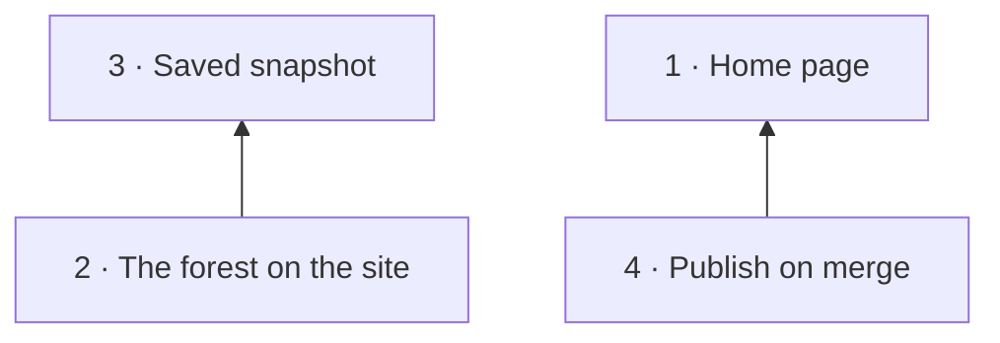

# Story: the website

**What it is.** A visitor can decide whether storytree fits their work from its public website.
The page introduces the shipped product through a plain explanation, its install command and a
project map drawn from storytree's own saved plan.

**Approved boundary.** ADR-0798 (2026-09-30, `decision_67b283aa164b`) founds this story:
`story_769e230c466d`. All website code lives in `packages/website`. The app frame, desktop app
and CLI gain no website behavior. The library carries the live plan records; this file is the
requested repository companion. Amend the existing records when this plan changes.

**One demonstration.** Open the public page on a phone, read what storytree offers, inspect its
project map, and take the Windows install command. The visitor can also read the license or follow
the LinkedIn contact. With scripting disabled the introduction, command and links still work;
with WebGL unavailable the map has a still from the same scene.

**Build choice: esbuild.** Use the builder already present in this workspace. The site needs
static HTML, CSS and a separately bundled browser scene, without server rendering or a router.
Generate HTML at build time, consume `@storytree/forest-world` through its public workspace
entry, and emit the deployable folder `packages/website/dist`. This keeps a single engine and
a small build surface; it does not vendor the engine or copy the desktop forest story's code.
The agent-level choice is permitted by the planning increment under ADR-0798 D4.

**Current representation.** The same-engine commitment follows the app's owner-directed
ADR-0804. Flat story islands landed in PR #333, and the app's file circles on capability
territories followed in PR #337. Public labels say “project map” and promise only what the
website's saved snapshot and shared renderer actually draw. “Software you can watch grow.”
remains the headline.
Until the scene and saved snapshot land, future-tense placeholder text lives inside the mount,
so scene initialization replaces it. Do not imply that a saved snapshot is already displayed.

**Install command source.** The README's Install section, fenced as PowerShell, is the sole
editable source. Extract its command during the build. A missing or ambiguous source fails
the build instead of shipping a stale command. Test extraction with fixture text; review the
real command and product claims against the current repository.

**Claims and copy.** Keep “Software you can watch grow.”, the honesty that this is a one-person
project written by AI agents, and the old site's 404 line. State Windows with Claude Code or
Codex, PolyForm Shield, and health as the agent reported it. Do not promise verified health,
microservices or invite-only access. The copy is reviewed, not pinned by wording tests.

**What is left out.** ADR-0798 D2 records the evidence: 0.2's site ran from 2026-06-14 to
2026-09-24 with 287 commits; its last hand edit to the home page was 2026-09-06, and most later
commits synchronized vendored engine copies. On 2026-09-24, old-site commit `2325978` wired
that renderer into the homepage's second act and `/forest/`; source inspection establishes
executable wiring, not production use. There were no analytics to measure use.
The owner left out the 2,273-line scripted two-act page and narration check, vendored engines
and sync scripts, retired-page redirect stubs and their deploy check, and the contact-form
schema. No accounts, waitlist, analytics or new contact form belong here.

The graph names complete capability prerequisites. The forest needs the scaffold's mount,
which the first increment lands, but does not wait for the finished home-page capability.
Home and snapshot are independent. Publishing can land before the forest and republishes
when the forest changes the website package.

**Lane handoff.** The first PR lands this story plus the minimal static scaffold. It reserves
`#website-forest` and the browser entry `src/forest.ts`. Site-b owns that module, the snapshot,
the forest assets and the scene's own styling; site-a owns the surrounding home page and its
styles. The first scaffold emitted `forest.js` from the public engine entry without loading it
on the page. The home page links that entry; site-b replaces its stub and owns lazy scene
initialization under contract 2.3. Coordinate changes to shared build files or package
dependencies; never copy `packages/forest` implementation into this story. Resume from fresh
main: the flat scene no longer accepts `kitBytes`. Use the shared scene and its matching still;
do not restore pines or independently reimplement the app's marks in the website.

**Proof.** Write the smallest failing behavior test before implementation. Functional proofs
below do not approve the appearance. Capture desktop and 390 px phone views with headless
Chromium, commit them under `packages/website/evidence`, and have the look reviewed separately.

## 1 · Home page

A visitor gets the introduction, install command, license and contact from a static page.

- **Library:** `capability_edbdd439d9b4`.
- **Depends on:** nothing in this story.
- **Founding shelf:** ADR-0798 D1–D3 and D6, through `decision_4f2ff8ae50ed` (ADR-0800).
- **Package:** `packages/website`.

**Contracts:**

1. Building produces a static page with locally resolvable assets and a forest mount; it can be
   served without an application server (`contract_19fd6361f0be`). Serve `dist` and request
   the document and its assets. Lazy scene activation belongs to the forest capability.
2. The displayed install command comes from the README Install PowerShell block; a missing
   or ambiguous block fails the build (`contract_1191205c8b9d`). Build from fixture README text
   and observe its arbitrary command in the rendered install control.
3. Without JavaScript, the visitor can read the page, select the command and follow the
   repository, license and LinkedIn links (`contract_a34d2691f0bd`). Prove this in a browser
   with scripts disabled.
4. The emitted not-found page has a working home link (`contract_97dcc6993f2c`). Follow it
   from the served error document; review the retained line as copy.
5. The optional copy control copies exactly the visible install command; success appears only
   after the clipboard write resolves (`contract_088958bd3a2c`). A denied write reports failure
   and leaves the command manually selectable. Prove pending, resolved and rejected writes
   with a controlled clipboard writer.
6. Keyboard focus remains visible and unclipped, and standalone controls remain easy to tap
   on a narrow page (`contract_4ad22389d89f`). The browser proof checks 320 px and 390 px views,
   at least 44 px target heights and a focus contrast of at least 3:1. Pending copies keep
   focus, prevent duplicate writes, and never take focus back from a visitor who tabs away.
   Captures witness the focus indicator as well as the resting page.
7. With text doubled at 320 px and 390 px, the home and not-found headers remain readable
   without overlap; home headings and the copy control remain visible and usable without
   clipping or horizontal page overflow (`contract_3c3dca34024f`). Prove rendered text bounds
   and keyboard/pointer activation, preserving ordinary 320 px and enlarged-text 1280 px
   behavior. The browser proof injects text sizes; it does not claim native browser-zoom coverage.

## 2 · The forest on the site

The app's engine draws the committed plan as a live 3D project map after the text loads. A still of
that scene remains available if WebGL cannot run.

- **Library:** `capability_18562ff0841c`.
- **Depends on:** 3. The first increment supplies the mount before site-b starts.
- **Founding shelf:** ADR-0798 D4, through `decision_e79353e8bc70` (ADR-0801).
- **Package:** `packages/website`; shared engine work remains in `packages/forest-world`.

**Contracts:**

1. The saved snapshot produces its story islands using the workspace forest-world engine's
   current representation (`contract_fe2f95cea55d`). Render a small known snapshot and observe
   its scene nodes. Attribution of agent-reported health is checked in review.
2. Unavailable WebGL or failed scene initialization shows the still while the page remains
   usable (`contract_645d8d1223b2`). Force both failure paths and observe the image plus usable
   install and contact controls.
3. Home text and the install control are available before the 3D bundle request or scene start
   (`contract_8787c643a24b`). Delay the scene in a browser to prove the lazy path does not
   block the page.

## 3 · Saved snapshot

A session refreshes a committed public drawing snapshot from storytree 0.3's library with one
command. CI and the public page use that file, never a live library connection.

- **Library:** `capability_88dfe8ee2706`.
- **Depends on:** nothing in this story; refresh reads the library's public API.
- **Founding shelf:** ADR-0798 D4, through `decision_69e9153f6847` (ADR-0802).
- **Package:** `packages/website`.

**Contracts:**

1. One refresh command replaces the snapshot with public drawing fields and its capture time
   (`contract_db55999f764f`). Use a known fixture plan to check the exported stories,
   capabilities and health; unknown private fields, sessions, paths and credentials stay out.
2. Build and rendering work with library access unavailable (`contract_e21fd9846ece`). Refuse
   library access while consuming the saved file; a failed refresh preserves the last valid file.

## 4 · Publish on merge

Merged website changes publish the built static folder to `crisp-globe-bf6v.here.now`, with no
custom domain. The repository secret `HERENOW_TOKEN` supplies the credential; absent means a
clear skip, not a failed merge or a claim that the site was published.

- **Library:** `capability_d3ee9737837e`.
- **Depends on:** 1, for deployable static output.
- **Founding shelf:** ADR-0798 D5 and the owner's settled address, through
  `decision_c1e761b0e486` (ADR-0803).
- **Package:** `packages/website`, invoked by the one thin publish workflow.

**Contracts:**

1. Publishing with a token updates the existing site and waits for a successful response
   (`contract_5a6680ff94ac`). A fake endpoint or injected transport proves site identity,
   uploads and failure propagation without spending a real secret.
2. Without the token, no network request is made and the log explains the skipped publication
   (`contract_555ba78a7665`). Run with an empty environment and inspect captured calls.
3. CI builds and publishes a merged website change, but does not publish an unrelated merge
   (`contract_ee93043de567`). Exercise representative event/path selection and inspect the
   actual merged workflow run; do not pin YAML text.

**Delivery.** `.github/workflows/website.yml` follows completed CI because CI's own automatic
merge does not trigger a push workflow. Selection runs from trusted main and accepts only a
successful main push or the matching, merged pull request. Website files, the forest engine,
the README command source and workspace build inputs trigger publication. The publish job
builds the selected merge, checks that main has no newer website inputs, and serializes uploads.
Unrelated CI runs never enter the publish queue. No pull-request artifacts supply executable code.

**Enable publishing.** The owner adds `HERENOW_TOKEN` under the repository's Actions secrets,
using a key for the account that owns the existing site, then runs **Publish website** on main.
That manual run is also the retry path. Without the secret the build still verifies, and the
publish log explicitly says it was skipped. The uploader follows the [here.now API](https://here.now/docs):
declare the complete file manifest, upload changed bytes, and finalize the same version. It
reports publication only after the service confirms that version is live. It creates no site,
changes no domain, and logs no token or signed upload URL.

## Landing order and deferred work

1. Plan and minimal static scaffold: `increment_2b67ca01952c`.
2. Home page: `increment_6818437b20af`. Site-b may work independently on the forest and
   snapshot (`increment_fd8293776dc9`) once the first PR reaches main.
3. Publish on merge: `increment_65420c4c173c`. If the secret is absent, ask the owner to add it
   in the report after landing the working skip behavior.

**Deferred:** archive `storytree-ai/storytree-web` in its own small increment, waiting on the
forest increment and a live 0.3 site, with the owner's confirmation first. The publishing
increment does not archive it. First-user invitations already use the repository README and
do not wait on this story (ADR-0798 D7).
